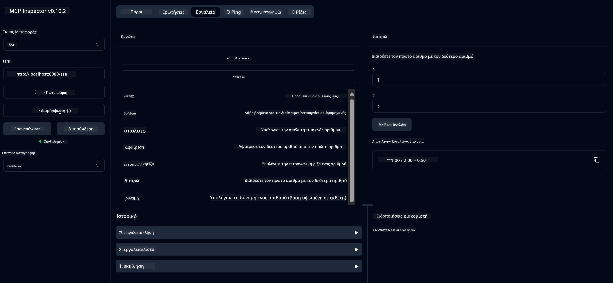

<!--
CO_OP_TRANSLATOR_METADATA:
{
  "original_hash": "ec11ee93f31fdadd94facd3e3d22f9e6",
  "translation_date": "2025-09-09T21:51:39+00:00",
  "source_file": "03-GettingStarted/01-first-server/README.md",
  "language_code": "el"
}
-->
# Ξεκινώντας με MCP

Καλώς ήρθατε στα πρώτα σας βήματα με το Model Context Protocol (MCP)! Είτε είστε νέοι στο MCP είτε θέλετε να εμβαθύνετε την κατανόησή σας, αυτός ο οδηγός θα σας καθοδηγήσει στη βασική διαδικασία εγκατάστασης και ανάπτυξης. Θα ανακαλύψετε πώς το MCP επιτρέπει την απρόσκοπτη ενσωμάτωση μεταξύ μοντέλων AI και εφαρμογών, και θα μάθετε πώς να προετοιμάσετε γρήγορα το περιβάλλον σας για τη δημιουργία και δοκιμή λύσεων που βασίζονται στο MCP.

> TLDR; Αν δημιουργείτε εφαρμογές AI, γνωρίζετε ότι μπορείτε να προσθέσετε εργαλεία και άλλους πόρους στο LLM (μεγάλο γλωσσικό μοντέλο), ώστε να γίνει πιο ενημερωμένο. Ωστόσο, αν τοποθετήσετε αυτά τα εργαλεία και τους πόρους σε έναν server, οι δυνατότητες της εφαρμογής και του server μπορούν να χρησιμοποιηθούν από οποιονδήποτε πελάτη με/χωρίς LLM.

## Επισκόπηση

Αυτό το μάθημα παρέχει πρακτική καθοδήγηση για τη ρύθμιση περιβαλλόντων MCP και τη δημιουργία των πρώτων σας εφαρμογών MCP. Θα μάθετε πώς να ρυθμίζετε τα απαραίτητα εργαλεία και πλαίσια, να δημιουργείτε βασικούς MCP servers, να δημιουργείτε εφαρμογές-κεντρικούς υπολογιστές και να δοκιμάζετε τις υλοποιήσεις σας.

Το Model Context Protocol (MCP) είναι ένα ανοιχτό πρωτόκολλο που τυποποιεί τον τρόπο με τον οποίο οι εφαρμογές παρέχουν περιεχόμενο στα LLMs. Σκεφτείτε το MCP σαν μια θύρα USB-C για εφαρμογές AI - παρέχει έναν τυποποιημένο τρόπο σύνδεσης μοντέλων AI με διαφορετικές πηγές δεδομένων και εργαλεία.

## Στόχοι Μάθησης

Μέχρι το τέλος αυτού του μαθήματος, θα μπορείτε να:

- Ρυθμίσετε περιβάλλοντα ανάπτυξης για MCP σε C#, Java, Python, TypeScript και Rust
- Δημιουργήσετε και αναπτύξετε βασικούς MCP servers με προσαρμοσμένες λειτουργίες (πόρους, προτροπές και εργαλεία)
- Δημιουργήσετε εφαρμογές-κεντρικούς υπολογιστές που συνδέονται με MCP servers
- Δοκιμάσετε και εντοπίσετε σφάλματα στις υλοποιήσεις MCP

## Ρύθμιση του Περιβάλλοντος MCP

Πριν ξεκινήσετε να εργάζεστε με MCP, είναι σημαντικό να προετοιμάσετε το περιβάλλον ανάπτυξης σας και να κατανοήσετε τη βασική ροή εργασίας. Αυτή η ενότητα θα σας καθοδηγήσει στα αρχικά βήματα εγκατάστασης για να εξασφαλίσετε μια ομαλή αρχή με MCP.

### Προαπαιτούμενα

Πριν εμβαθύνετε στην ανάπτυξη MCP, βεβαιωθείτε ότι έχετε:

- **Περιβάλλον Ανάπτυξης**: Για τη γλώσσα της επιλογής σας (C#, Java, Python, TypeScript ή Rust)
- **IDE/Επεξεργαστή Κώδικα**: Visual Studio, Visual Studio Code, IntelliJ, Eclipse, PyCharm ή οποιονδήποτε σύγχρονο επεξεργαστή κώδικα
- **Διαχειριστές Πακέτων**: NuGet, Maven/Gradle, pip, npm/yarn ή Cargo
- **API Keys**: Για οποιεσδήποτε υπηρεσίες AI σκοπεύετε να χρησιμοποιήσετε στις εφαρμογές σας

## Βασική Δομή MCP Server

Ένας MCP server περιλαμβάνει συνήθως:

- **Ρύθμιση Server**: Ρύθμιση θύρας, αυθεντικοποίησης και άλλων παραμέτρων
- **Πόρους**: Δεδομένα και περιεχόμενο διαθέσιμο στα LLMs
- **Εργαλεία**: Λειτουργίες που μπορούν να καλέσουν τα μοντέλα
- **Προτροπές**: Πρότυπα για τη δημιουργία ή τη δομή κειμένου

Ακολουθεί ένα απλοποιημένο παράδειγμα σε TypeScript:

```typescript
import { McpServer, ResourceTemplate } from "@modelcontextprotocol/sdk/server/mcp.js";
import { StdioServerTransport } from "@modelcontextprotocol/sdk/server/stdio.js";
import { z } from "zod";

// Create an MCP server
const server = new McpServer({
  name: "Demo",
  version: "1.0.0"
});

// Add an addition tool
server.tool("add",
  { a: z.number(), b: z.number() },
  async ({ a, b }) => ({
    content: [{ type: "text", text: String(a + b) }]
  })
);

// Add a dynamic greeting resource
server.resource(
  "file",
  // The 'list' parameter controls how the resource lists available files. Setting it to undefined disables listing for this resource.
  new ResourceTemplate("file://{path}", { list: undefined }),
  async (uri, { path }) => ({
    contents: [{
      uri: uri.href,
      text: `File, ${path}!`
    }]
  })
);

// Add a file resource that reads the file contents
server.resource(
  "file",
  new ResourceTemplate("file://{path}", { list: undefined }),
  async (uri, { path }) => {
    let text;
    try {
      text = await fs.readFile(path, "utf8");
    } catch (err) {
      text = `Error reading file: ${err.message}`;
    }
    return {
      contents: [{
        uri: uri.href,
        text
      }]
    };
  }
);

server.prompt(
  "review-code",
  { code: z.string() },
  ({ code }) => ({
    messages: [{
      role: "user",
      content: {
        type: "text",
        text: `Please review this code:\n\n${code}`
      }
    }]
  })
);

// Start receiving messages on stdin and sending messages on stdout
const transport = new StdioServerTransport();
await server.connect(transport);
```

Στον παραπάνω κώδικα:

- Εισάγουμε τις απαραίτητες κλάσεις από το MCP TypeScript SDK.
- Δημιουργούμε και ρυθμίζουμε μια νέα παρουσία MCP server.
- Καταχωρούμε ένα προσαρμοσμένο εργαλείο (`calculator`) με μια συνάρτηση χειρισμού.
- Ξεκινάμε τον server για να ακούει εισερχόμενα αιτήματα MCP.

## Δοκιμή και Εντοπισμός Σφαλμάτων

Πριν ξεκινήσετε τη δοκιμή του MCP server σας, είναι σημαντικό να κατανοήσετε τα διαθέσιμα εργαλεία και τις βέλτιστες πρακτικές για τον εντοπισμό σφαλμάτων. Η αποτελεσματική δοκιμή εξασφαλίζει ότι ο server σας λειτουργεί όπως αναμένεται και σας βοηθά να εντοπίσετε και να επιλύσετε γρήγορα προβλήματα. Η επόμενη ενότητα περιγράφει προτεινόμενες προσεγγίσεις για την επικύρωση της υλοποίησης MCP.

Το MCP παρέχει εργαλεία για να σας βοηθήσει να δοκιμάσετε και να εντοπίσετε σφάλματα στους servers σας:

- **Εργαλείο Επιθεώρησης**, μια γραφική διεπαφή που σας επιτρέπει να συνδεθείτε στον server σας και να δοκιμάσετε τα εργαλεία, τις προτροπές και τους πόρους σας.
- **curl**, μπορείτε επίσης να συνδεθείτε στον server σας χρησιμοποιώντας ένα εργαλείο γραμμής εντολών όπως το curl ή άλλους πελάτες που μπορούν να δημιουργήσουν και να εκτελέσουν εντολές HTTP.

### Χρήση MCP Inspector

Το [MCP Inspector](https://github.com/modelcontextprotocol/inspector) είναι ένα οπτικό εργαλείο δοκιμής που σας βοηθά:

1. **Ανακάλυψη Δυνατοτήτων Server**: Αυτόματη ανίχνευση διαθέσιμων πόρων, εργαλείων και προτροπών
2. **Δοκιμή Εκτέλεσης Εργαλείων**: Δοκιμή διαφορετικών παραμέτρων και προβολή απαντήσεων σε πραγματικό χρόνο
3. **Προβολή Μεταδεδομένων Server**: Εξέταση πληροφοριών server, σχημάτων και ρυθμίσεων

```bash
# ex TypeScript, installing and running MCP Inspector
npx @modelcontextprotocol/inspector node build/index.js
```

Όταν εκτελέσετε τις παραπάνω εντολές, το MCP Inspector θα εκκινήσει μια τοπική διεπαφή ιστού στον περιηγητή σας. Μπορείτε να περιμένετε να δείτε έναν πίνακα ελέγχου που εμφανίζει τους καταχωρημένους MCP servers σας, τα διαθέσιμα εργαλεία, τους πόρους και τις προτροπές τους. Η διεπαφή σας επιτρέπει να δοκιμάσετε διαδραστικά την εκτέλεση εργαλείων, να επιθεωρήσετε μεταδεδομένα server και να δείτε απαντήσεις σε πραγματικό χρόνο, διευκολύνοντας την επικύρωση και τον εντοπισμό σφαλμάτων στις υλοποιήσεις MCP server.

Ακολουθεί ένα στιγμιότυπο οθόνης του πώς μπορεί να φαίνεται:


## Συνηθισμένα Προβλήματα Ρύθμισης και Λύσεις

| Πρόβλημα | Πιθανή Λύση |
|---------|-------------|
| Η σύνδεση απορρίφθηκε | Ελέγξτε αν ο server λειτουργεί και η θύρα είναι σωστή |
| Σφάλματα εκτέλεσης εργαλείων | Ελέγξτε την επικύρωση παραμέτρων και τη διαχείριση σφαλμάτων |
| Αποτυχίες αυθεντικοποίησης | Επαληθεύστε τα API keys και τα δικαιώματα |
| Σφάλματα επικύρωσης σχημάτων | Βεβαιωθείτε ότι οι παράμετροι ταιριάζουν με το καθορισμένο σχήμα |
| Ο server δεν ξεκινά | Ελέγξτε για συγκρούσεις θυρών ή ελλείποντα εξαρτήματα |
| Σφάλματα CORS | Ρυθμίστε σωστά τις κεφαλίδες CORS για αιτήματα διασταυρούμενης προέλευσης |
| Προβλήματα αυθεντικοποίησης | Επαληθεύστε την εγκυρότητα και τα δικαιώματα των tokens |

## Τοπική Ανάπτυξη

Για τοπική ανάπτυξη και δοκιμή, μπορείτε να εκτελέσετε MCP servers απευθείας στον υπολογιστή σας:

1. **Εκκίνηση της διαδικασίας server**: Εκτελέστε την εφαρμογή MCP server σας
2. **Ρύθμιση δικτύου**: Βεβαιωθείτε ότι ο server είναι προσβάσιμος στη αναμενόμενη θύρα
3. **Σύνδεση πελατών**: Χρησιμοποιήστε τοπικές διευθύνσεις σύνδεσης όπως `http://localhost:3000`

```bash
# Example: Running a TypeScript MCP server locally
npm run start
# Server running at http://localhost:3000
```

## Δημιουργία του πρώτου σας MCP Server

Έχουμε καλύψει [Βασικές έννοιες](/01-CoreConcepts/README.md) σε προηγούμενο μάθημα, τώρα είναι ώρα να εφαρμόσουμε αυτή τη γνώση.

### Τι μπορεί να κάνει ένας server

Πριν ξεκινήσουμε να γράφουμε κώδικα, ας υπενθυμίσουμε τι μπορεί να κάνει ένας server:

Ένας MCP server μπορεί, για παράδειγμα:

- Να έχει πρόσβαση σε τοπικά αρχεία και βάσεις δεδομένων
- Να συνδέεται με απομακρυσμένα APIs
- Να εκτελεί υπολογισμούς
- Να ενσωματώνεται με άλλα εργαλεία και υπηρεσίες
- Να παρέχει διεπαφή χρήστη για αλληλεπίδραση

Ωραία, τώρα που ξέρουμε τι μπορούμε να κάνουμε, ας ξεκινήσουμε τον κώδικα.

## Άσκηση: Δημιουργία server

Για να δημιουργήσετε έναν server, πρέπει να ακολουθήσετε αυτά τα βήματα:

- Εγκαταστήστε το MCP SDK.
- Δημιουργήστε ένα project και ρυθμίστε τη δομή του project.
- Γράψτε τον κώδικα του server.
- Δοκιμάστε τον server.

### -1- Δημιουργία project

#### TypeScript

```sh
# Create project directory and initialize npm project
mkdir calculator-server
cd calculator-server
npm init -y
```

#### Python

```sh
# Create project dir
mkdir calculator-server
cd calculator-server
# Open the folder in Visual Studio Code - Skip this if you are using a different IDE
code .
```

#### .NET

```sh
dotnet new console -n McpCalculatorServer
cd McpCalculatorServer
```

#### Java

Για Java, δημιουργήστε ένα project Spring Boot:

```bash
curl https://start.spring.io/starter.zip \
  -d dependencies=web \
  -d javaVersion=21 \
  -d type=maven-project \
  -d groupId=com.example \
  -d artifactId=calculator-server \
  -d name=McpServer \
  -d packageName=com.microsoft.mcp.sample.server \
  -o calculator-server.zip
```

Αποσυμπιέστε το αρχείο zip:

```bash
unzip calculator-server.zip -d calculator-server
cd calculator-server
# optional remove the unused test
rm -rf src/test/java
```

Προσθέστε την ακόλουθη πλήρη ρύθμιση στο αρχείο *pom.xml*:

```xml
<?xml version="1.0" encoding="UTF-8"?>
<project xmlns="http://maven.apache.org/POM/4.0.0"
    xmlns:xsi="http://www.w3.org/2001/XMLSchema-instance"
    xsi:schemaLocation="http://maven.apache.org/POM/4.0.0 http://maven.apache.org/xsd/maven-4.0.0.xsd">
    <modelVersion>4.0.0</modelVersion>
    
    <!-- Spring Boot parent for dependency management -->
    <parent>
        <groupId>org.springframework.boot</groupId>
        <artifactId>spring-boot-starter-parent</artifactId>
        <version>3.5.0</version>
        <relativePath />
    </parent>

    <!-- Project coordinates -->
    <groupId>com.example</groupId>
    <artifactId>calculator-server</artifactId>
    <version>0.0.1-SNAPSHOT</version>
    <name>Calculator Server</name>
    <description>Basic calculator MCP service for beginners</description>

    <!-- Properties -->
    <properties>
        <java.version>21</java.version>
        <maven.compiler.source>21</maven.compiler.source>
        <maven.compiler.target>21</maven.compiler.target>
    </properties>

    <!-- Spring AI BOM for version management -->
    <dependencyManagement>
        <dependencies>
            <dependency>
                <groupId>org.springframework.ai</groupId>
                <artifactId>spring-ai-bom</artifactId>
                <version>1.0.0-SNAPSHOT</version>
                <type>pom</type>
                <scope>import</scope>
            </dependency>
        </dependencies>
    </dependencyManagement>

    <!-- Dependencies -->
    <dependencies>
        <dependency>
            <groupId>org.springframework.ai</groupId>
            <artifactId>spring-ai-starter-mcp-server-webflux</artifactId>
        </dependency>
        <dependency>
            <groupId>org.springframework.boot</groupId>
            <artifactId>spring-boot-starter-actuator</artifactId>
        </dependency>
        <dependency>
         <groupId>org.springframework.boot</groupId>
         <artifactId>spring-boot-starter-test</artifactId>
         <scope>test</scope>
      </dependency>
    </dependencies>

    <!-- Build configuration -->
    <build>
        <plugins>
            <plugin>
                <groupId>org.springframework.boot</groupId>
                <artifactId>spring-boot-maven-plugin</artifactId>
            </plugin>
            <plugin>
                <groupId>org.apache.maven.plugins</groupId>
                <artifactId>maven-compiler-plugin</artifactId>
                <configuration>
                    <release>21</release>
                </configuration>
            </plugin>
        </plugins>
    </build>

    <!-- Repositories for Spring AI snapshots -->
    <repositories>
        <repository>
            <id>spring-milestones</id>
            <name>Spring Milestones</name>
            <url>https://repo.spring.io/milestone</url>
            <snapshots>
                <enabled>false</enabled>
            </snapshots>
        </repository>
        <repository>
            <id>spring-snapshots</id>
            <name>Spring Snapshots</name>
            <url>https://repo.spring.io/snapshot</url>
            <releases>
                <enabled>false</enabled>
            </releases>
        </repository>
    </repositories>
</project>
```

#### Rust

```sh
mkdir calculator-server
cd calculator-server
cargo init
```

### -2- Προσθήκη εξαρτημάτων

Τώρα που έχετε δημιουργήσει το project σας, ας προσθέσουμε εξαρτήματα:

#### TypeScript

```sh
# If not already installed, install TypeScript globally
npm install typescript -g

# Install the MCP SDK and Zod for schema validation
npm install @modelcontextprotocol/sdk zod
npm install -D @types/node typescript
```

#### Python

```sh
# Create a virtual env and install dependencies
python -m venv venv
venv\Scripts\activate
pip install "mcp[cli]"
```

#### Java

```bash
cd calculator-server
./mvnw clean install -DskipTests
```

#### Rust

```sh
cargo add rmcp --features server,transport-io
cargo add serde
cargo add tokio --features rt-multi-thread
```

### -3- Δημιουργία αρχείων project

#### TypeScript

Ανοίξτε το αρχείο *package.json* και αντικαταστήστε το περιεχόμενο με το ακόλουθο για να εξασφαλίσετε ότι μπορείτε να δημιουργήσετε και να εκτελέσετε τον server:

```json
{
  "name": "calculator-server",
  "version": "1.0.0",
  "main": "index.js",
  "type": "module",
  "scripts": {
    "start": "tsc && node ./build/index.js",
    "build": "tsc && node ./build/index.js"
  },
  "keywords": [],
  "author": "",
  "license": "ISC",
  "description": "A simple calculator server using Model Context Protocol",
  "dependencies": {
    "@modelcontextprotocol/sdk": "^1.16.0",
    "zod": "^3.25.76"
  },
  "devDependencies": {
    "@types/node": "^24.0.14",
    "typescript": "^5.8.3"
  }
}
```

Δημιουργήστε ένα *tsconfig.json* με το ακόλουθο περιεχόμενο:

```json
{
  "compilerOptions": {
    "target": "ES2022",
    "module": "Node16",
    "moduleResolution": "Node16",
    "outDir": "./build",
    "rootDir": "./src",
    "strict": true,
    "esModuleInterop": true,
    "skipLibCheck": true,
    "forceConsistentCasingInFileNames": true
  },
  "include": ["src/**/*"],
  "exclude": ["node_modules"]
}
```

Δημιουργήστε έναν κατάλογο για τον πηγαίο κώδικα σας:

```sh
mkdir src
touch src/index.ts
```

#### Python

Δημιουργήστε ένα αρχείο *server.py*

```sh
touch server.py
```

#### .NET

Εγκαταστήστε τα απαραίτητα πακέτα NuGet:

```sh
dotnet add package ModelContextProtocol --prerelease
dotnet add package Microsoft.Extensions.Hosting
```

#### Java

Για projects Java Spring Boot, η δομή του project δημιουργείται αυτόματα.

#### Rust

Για Rust, ένα αρχείο *src/main.rs* δημιουργείται από προεπιλογή όταν εκτελείτε `cargo init`. Ανοίξτε το αρχείο και διαγράψτε τον προεπιλεγμένο κώδικα.

### -4- Δημιουργία κώδικα server

#### TypeScript

Δημιουργήστε ένα αρχείο *index.ts* και προσθέστε τον ακόλουθο κώδικα:

```typescript
import { McpServer, ResourceTemplate } from "@modelcontextprotocol/sdk/server/mcp.js";
import { StdioServerTransport } from "@modelcontextprotocol/sdk/server/stdio.js";
import { z } from "zod";
 
// Create an MCP server
const server = new McpServer({
  name: "Calculator MCP Server",
  version: "1.0.0"
});
```

Τώρα έχετε έναν server, αλλά δεν κάνει πολλά, ας το διορθώσουμε.

#### Python

```python
# server.py
from mcp.server.fastmcp import FastMCP

# Create an MCP server
mcp = FastMCP("Demo")
```

#### .NET

```csharp
using Microsoft.Extensions.DependencyInjection;
using Microsoft.Extensions.Hosting;
using Microsoft.Extensions.Logging;
using ModelContextProtocol.Server;
using System.ComponentModel;

var builder = Host.CreateApplicationBuilder(args);
builder.Logging.AddConsole(consoleLogOptions =>
{
    // Configure all logs to go to stderr
    consoleLogOptions.LogToStandardErrorThreshold = LogLevel.Trace;
});

builder.Services
    .AddMcpServer()
    .WithStdioServerTransport()
    .WithToolsFromAssembly();
await builder.Build().RunAsync();

// add features
```

#### Java

Για Java, δημιουργήστε τα βασικά στοιχεία του server. Πρώτα, τροποποιήστε την κύρια κλάση εφαρμογής:

*src/main/java/com/microsoft/mcp/sample/server/McpServerApplication.java*:

```java
package com.microsoft.mcp.sample.server;

import org.springframework.ai.tool.ToolCallbackProvider;
import org.springframework.ai.tool.method.MethodToolCallbackProvider;
import org.springframework.boot.SpringApplication;
import org.springframework.boot.autoconfigure.SpringBootApplication;
import org.springframework.context.annotation.Bean;
import com.microsoft.mcp.sample.server.service.CalculatorService;

@SpringBootApplication
public class McpServerApplication {

    public static void main(String[] args) {
        SpringApplication.run(McpServerApplication.class, args);
    }
    
    @Bean
    public ToolCallbackProvider calculatorTools(CalculatorService calculator) {
        return MethodToolCallbackProvider.builder().toolObjects(calculator).build();
    }
}
```

Δημιουργήστε την υπηρεσία calculator *src/main/java/com/microsoft/mcp/sample/server/service/CalculatorService.java*:

```java
package com.microsoft.mcp.sample.server.service;

import org.springframework.ai.tool.annotation.Tool;
import org.springframework.stereotype.Service;

/**
 * Service for basic calculator operations.
 * This service provides simple calculator functionality through MCP.
 */
@Service
public class CalculatorService {

    /**
     * Add two numbers
     * @param a The first number
     * @param b The second number
     * @return The sum of the two numbers
     */
    @Tool(description = "Add two numbers together")
    public String add(double a, double b) {
        double result = a + b;
        return formatResult(a, "+", b, result);
    }

    /**
     * Subtract one number from another
     * @param a The number to subtract from
     * @param b The number to subtract
     * @return The result of the subtraction
     */
    @Tool(description = "Subtract the second number from the first number")
    public String subtract(double a, double b) {
        double result = a - b;
        return formatResult(a, "-", b, result);
    }

    /**
     * Multiply two numbers
     * @param a The first number
     * @param b The second number
     * @return The product of the two numbers
     */
    @Tool(description = "Multiply two numbers together")
    public String multiply(double a, double b) {
        double result = a * b;
        return formatResult(a, "*", b, result);
    }

    /**
     * Divide one number by another
     * @param a The numerator
     * @param b The denominator
     * @return The result of the division
     */
    @Tool(description = "Divide the first number by the second number")
    public String divide(double a, double b) {
        if (b == 0) {
            return "Error: Cannot divide by zero";
        }
        double result = a / b;
        return formatResult(a, "/", b, result);
    }

    /**
     * Calculate the power of a number
     * @param base The base number
     * @param exponent The exponent
     * @return The result of raising the base to the exponent
     */
    @Tool(description = "Calculate the power of a number (base raised to an exponent)")
    public String power(double base, double exponent) {
        double result = Math.pow(base, exponent);
        return formatResult(base, "^", exponent, result);
    }

    /**
     * Calculate the square root of a number
     * @param number The number to find the square root of
     * @return The square root of the number
     */
    @Tool(description = "Calculate the square root of a number")
    public String squareRoot(double number) {
        if (number < 0) {
            return "Error: Cannot calculate square root of a negative number";
        }
        double result = Math.sqrt(number);
        return String.format("√%.2f = %.2f", number, result);
    }

    /**
     * Calculate the modulus (remainder) of division
     * @param a The dividend
     * @param b The divisor
     * @return The remainder of the division
     */
    @Tool(description = "Calculate the remainder when one number is divided by another")
    public String modulus(double a, double b) {
        if (b == 0) {
            return "Error: Cannot divide by zero";
        }
        double result = a % b;
        return formatResult(a, "%", b, result);
    }

    /**
     * Calculate the absolute value of a number
     * @param number The number to find the absolute value of
     * @return The absolute value of the number
     */
    @Tool(description = "Calculate the absolute value of a number")
    public String absolute(double number) {
        double result = Math.abs(number);
        return String.format("|%.2f| = %.2f", number, result);
    }

    /**
     * Get help about available calculator operations
     * @return Information about available operations
     */
    @Tool(description = "Get help about available calculator operations")
    public String help() {
        return "Basic Calculator MCP Service\n\n" +
               "Available operations:\n" +
               "1. add(a, b) - Adds two numbers\n" +
               "2. subtract(a, b) - Subtracts the second number from the first\n" +
               "3. multiply(a, b) - Multiplies two numbers\n" +
               "4. divide(a, b) - Divides the first number by the second\n" +
               "5. power(base, exponent) - Raises a number to a power\n" +
               "6. squareRoot(number) - Calculates the square root\n" + 
               "7. modulus(a, b) - Calculates the remainder of division\n" +
               "8. absolute(number) - Calculates the absolute value\n\n" +
               "Example usage: add(5, 3) will return 5 + 3 = 8";
    }

    /**
     * Format the result of a calculation
     */
    private String formatResult(double a, String operator, double b, double result) {
        return String.format("%.2f %s %.2f = %.2f", a, operator, b, result);
    }
}
```

**Προαιρετικά στοιχεία για μια υπηρεσία έτοιμη για παραγωγή:**

Δημιουργήστε μια ρύθμιση εκκίνησης *src/main/java/com/microsoft/mcp/sample/server/config/StartupConfig.java*:

```java
package com.microsoft.mcp.sample.server.config;

import org.springframework.boot.CommandLineRunner;
import org.springframework.context.annotation.Bean;
import org.springframework.context.annotation.Configuration;

@Configuration
public class StartupConfig {
    
    @Bean
    public CommandLineRunner startupInfo() {
        return args -> {
            System.out.println("\n" + "=".repeat(60));
            System.out.println("Calculator MCP Server is starting...");
            System.out.println("SSE endpoint: http://localhost:8080/sse");
            System.out.println("Health check: http://localhost:8080/actuator/health");
            System.out.println("=".repeat(60) + "\n");
        };
    }
}
```

Δημιουργήστε έναν ελεγκτή υγείας *src/main/java/com/microsoft/mcp/sample/server/controller/HealthController.java*:

```java
package com.microsoft.mcp.sample.server.controller;

import org.springframework.http.ResponseEntity;
import org.springframework.web.bind.annotation.GetMapping;
import org.springframework.web.bind.annotation.RestController;
import java.time.LocalDateTime;
import java.util.HashMap;
import java.util.Map;

@RestController
public class HealthController {
    
    @GetMapping("/health")
    public ResponseEntity<Map<String, Object>> healthCheck() {
        Map<String, Object> response = new HashMap<>();
        response.put("status", "UP");
        response.put("timestamp", LocalDateTime.now().toString());
        response.put("service", "Calculator MCP Server");
        return ResponseEntity.ok(response);
    }
}
```

Δημιουργήστε έναν χειριστή εξαιρέσεων *src/main/java/com/microsoft/mcp/sample/server/exception/GlobalExceptionHandler.java*:

```java
package com.microsoft.mcp.sample.server.exception;

import org.springframework.http.HttpStatus;
import org.springframework.http.ResponseEntity;
import org.springframework.web.bind.annotation.ExceptionHandler;
import org.springframework.web.bind.annotation.RestControllerAdvice;

@RestControllerAdvice
public class GlobalExceptionHandler {

    @ExceptionHandler(IllegalArgumentException.class)
    public ResponseEntity<ErrorResponse> handleIllegalArgumentException(IllegalArgumentException ex) {
        ErrorResponse error = new ErrorResponse(
            "Invalid_Input", 
            "Invalid input parameter: " + ex.getMessage());
        return new ResponseEntity<>(error, HttpStatus.BAD_REQUEST);
    }

    public static class ErrorResponse {
        private String code;
        private String message;

        public ErrorResponse(String code, String message) {
            this.code = code;
            this.message = message;
        }

        // Getters
        public String getCode() { return code; }
        public String getMessage() { return message; }
    }
}
```

Δημιουργήστε ένα προσαρμοσμένο banner *src/main/resources/banner.txt*:

```text
_____      _            _       _             
 / ____|    | |          | |     | |            
| |     __ _| | ___ _   _| | __ _| |_ ___  _ __ 
| |    / _` | |/ __| | | | |/ _` | __/ _ \| '__|
| |___| (_| | | (__| |_| | | (_| | || (_) | |   
 \_____\__,_|_|\___|\__,_|_|\__,_|\__\___/|_|   
                                                
Calculator MCP Server v1.0
Spring Boot MCP Application
```

#### Rust

Προσθέστε τον ακόλουθο κώδικα στην κορυφή του αρχείου *src/main.rs*. Αυτό εισάγει τις απαραίτητες βιβλιοθήκες και modules για τον MCP server σας.

```rust
use rmcp::{
    handler::server::{router::tool::ToolRouter, tool::Parameters},
    model::{ServerCapabilities, ServerInfo},
    schemars, tool, tool_handler, tool_router,
    transport::stdio,
    ServerHandler, ServiceExt,
};
use std::error::Error;
```

Ο server calculator θα είναι απλός και θα μπορεί να προσθέτει δύο αριθμούς. Ας δημιουργήσουμε μια δομή για να εκπροσωπήσουμε το αίτημα calculator.

```rust
#[derive(Debug, serde::Deserialize, schemars::JsonSchema)]
pub struct CalculatorRequest {
    pub a: f64,
    pub b: f64,
}
```

Στη συνέχεια, δημιουργήστε μια δομή για να εκπροσωπήσετε τον server calculator. Αυτή η δομή θα περιέχει τον router εργαλείων, ο οποίος χρησιμοποιείται για την καταχώρηση εργαλείων.

```rust
#[derive(Debug, Clone)]
pub struct Calculator {
    tool_router: ToolRouter<Self>,
}
```

Τώρα, μπορούμε να υλοποιήσουμε τη δομή `Calculator` για να δημιουργήσουμε μια νέα παρουσία του server και να υλοποιήσουμε τον χειριστή server για να παρέχουμε πληροφορίες server.

```rust
#[tool_router]
impl Calculator {
    pub fn new() -> Self {
        Self {
            tool_router: Self::tool_router(),
        }
    }
}

#[tool_handler]
impl ServerHandler for Calculator {
    fn get_info(&self) -> ServerInfo {
        ServerInfo {
            instructions: Some("A simple calculator tool".into()),
            capabilities: ServerCapabilities::builder().enable_tools().build(),
            ..Default::default()
        }
    }
}
```

Τέλος, πρέπει να υλοποιήσουμε τη κύρια συνάρτηση για να ξεκινήσουμε τον server. Αυτή η συνάρτηση θα δημιουργήσει μια παρουσία της δομής `Calculator` και θα την εξυπηρετήσει μέσω standard input/output.

```rust
#[tokio::main]
async fn main() -> Result<(), Box<dyn Error>> {
    let service = Calculator::new().serve(stdio()).await?;
    service.waiting().await?;
    Ok(())
}
```

Ο server είναι τώρα ρυθμισμένος για να παρέχει βασικές πληροφορίες για τον εαυτό του. Στη συνέχεια, θα προσθέσουμε ένα εργαλείο για την εκτέλεση πρόσθεσης.

### -5- Προσθήκη εργαλείου και πόρου

Προσθέστε ένα εργαλείο και έναν πόρο προσθέτοντας τον ακόλουθο κώδικα:

#### TypeScript

```typescript
server.tool(
  "add",
  { a: z.number(), b: z.number() },
  async ({ a, b }) => ({
    content: [{ type: "text", text: String(a + b) }]
  })
);

server.resource(
  "greeting",
  new ResourceTemplate("greeting://{name}", { list: undefined }),
  async (uri, { name }) => ({
    contents: [{
      uri: uri.href,
      text: `Hello, ${name}!`
    }]
  })
);
```

Το εργαλείο σας λαμβάνει παραμέτρους `a` και `b` και εκτελεί μια συνάρτηση που παράγει μια απάντηση της μορφής:

```typescript
{
  contents: [{
    type: "text", content: "some content"
  }]
}
```

Ο πόρος σας είναι προσβάσιμος μέσω μιας συμβολοσειράς "greeting" και λαμβάνει μια παράμετρο `name` και παράγει μια παρόμοια απάντηση με το εργαλείο:

```typescript
{
  uri: "<href>",
  text: "a text"
}
```

#### Python

```python
# Add an addition tool
@mcp.tool()
def add(a: int, b: int) -> int:
    """Add two numbers"""
    return a + b


# Add a dynamic greeting resource
@mcp.resource("greeting://{name}")
def get_greeting(name: str) -> str:
    """Get a personalized greeting"""
    return f"Hello, {name}!"
```

Στον παραπάνω κώδικα:

- Ορίσαμε ένα εργαλείο `add` που λαμβάνει παραμέτρους `a` και `p`, και οι δύο ακέραιοι.
- Δημιουργήσαμε έναν πόρο που ονομάζεται `greeting` που λαμβάνει την παράμετρο `name`.

#### .NET

Προσθέστε αυτό στο αρχείο Program.cs:

```csharp
[McpServerToolType]
public static class CalculatorTool
{
    [McpServerTool, Description("Adds two numbers")]
    public static string Add(int a, int b) => $"Sum {a + b}";
}
```

#### Java

Τα εργαλεία έχουν ήδη δημιουργηθεί στο προηγούμενο βήμα.

#### Rust

Προσθέστε ένα νέο εργαλείο μέσα στο μπλοκ `impl Calculator`:

```rust
#[tool(description = "Adds a and b")]
async fn add(
    &self,
    Parameters(CalculatorRequest { a, b }): Parameters<CalculatorRequest>,
) -> String {
    (a + b).to_string()
}
```

### -6- Τελικός κώδικας

Ας προσθέσουμε τον τελευταίο κώδικα που χρειαζόμαστε ώστε ο server να μπορεί να ξεκινήσει:

#### TypeScript

```typescript
// Start receiving messages on stdin and sending messages on stdout
const transport = new StdioServerTransport();
await server.connect(transport);
```

Ακολουθεί ο πλήρης κώδικας:

```typescript
// index.ts
import { McpServer, ResourceTemplate } from "@modelcontextprotocol/sdk/server/mcp.js";
import { StdioServerTransport } from "@modelcontextprotocol/sdk/server/stdio.js";
import { z } from "zod";

// Create an MCP server
const server = new McpServer({
  name: "Calculator MCP Server",
  version: "1.0.0"
});

// Add an addition tool
server.tool(
  "add",
  { a: z.number(), b: z.number() },
  async ({ a, b }) => ({
    content: [{ type: "text", text: String(a + b) }]
  })
);

// Add a dynamic greeting resource
server.resource(
  "greeting",
  new ResourceTemplate("greeting://{name}", { list: undefined }),
  async (uri, { name }) => ({
    contents: [{
      uri: uri.href,
      text: `Hello, ${name}!`
    }]
  })
);

// Start receiving messages on stdin and sending messages on stdout
const transport = new StdioServerTransport();
server.connect(transport);
```

#### Python

```python
# server.py
from mcp.server.fastmcp import FastMCP

# Create an MCP server
mcp = FastMCP("Demo")


# Add an addition tool
@mcp.tool()
def add(a: int, b: int) -> int:
    """Add two numbers"""
    return a + b


# Add a dynamic greeting resource
@mcp.resource("greeting://{name}")
def get_greeting(name: str) -> str:
    """Get a personalized greeting"""
    return f"Hello, {name}!"

# Main execution block - this is required to run the server
if __name__ == "__main__":
    mcp.run()
```

#### .NET

Δημιουργήστε ένα αρχείο Program.cs με το ακόλουθο περιεχόμενο:

```csharp
using Microsoft.Extensions.DependencyInjection;
using Microsoft.Extensions.Hosting;
using Microsoft.Extensions.Logging;
using ModelContextProtocol.Server;
using System.ComponentModel;

var builder = Host.CreateApplicationBuilder(args);
builder.Logging.AddConsole(consoleLogOptions =>
{
    // Configure all logs to go to stderr
    consoleLogOptions.LogToStandardErrorThreshold = LogLevel.Trace;
});

builder.Services
    .AddMcpServer()
    .WithStdioServerTransport()
    .WithToolsFromAssembly();
await builder.Build().RunAsync();

[McpServerToolType]
public static class CalculatorTool
{
    [McpServerTool, Description("Adds two numbers")]
    public static string Add(int a, int b) => $"Sum {a + b}";
}
```

#### Java

Η πλήρης κύρια κλάση εφαρμογής σας θα πρέπει να μοιάζει με αυτή:

```java
// McpServerApplication.java
package com.microsoft.mcp.sample.server;

import org.springframework.ai.tool.ToolCallbackProvider;
import org.springframework.ai.tool.method.MethodToolCallbackProvider;
import org.springframework.boot.SpringApplication;
import org.springframework.boot.autoconfigure.SpringBootApplication;
import org.springframework.context.annotation.Bean;
import com.microsoft.mcp.sample.server.service.CalculatorService;

@SpringBootApplication
public class McpServerApplication {

    public static void main(String[] args) {
        SpringApplication.run(McpServerApplication.class, args);
    }
    
    @Bean
    public ToolCallbackProvider calculatorTools(CalculatorService calculator) {
        return MethodToolCallbackProvider.builder().toolObjects(calculator).build();
    }
}
```

#### Rust

Ο τελικός κώδικας για τον Rust server θα πρέπει να μοιάζει με αυτόν:

```rust
use rmcp::{
    ServerHandler, ServiceExt,
    handler::server::{router::tool::ToolRouter, tool::Parameters},
    model::{ServerCapabilities, ServerInfo},
    schemars, tool, tool_handler, tool_router,
    transport::stdio,
};
use std::error::Error;

#[derive(Debug, serde::Deserialize, schemars::JsonSchema)]
pub struct CalculatorRequest {
    pub a: f64,
    pub b: f64,
}

#[derive(Debug, Clone)]
pub struct Calculator {
    tool_router: ToolRouter<Self>,
}

#[tool_router]
impl Calculator {
    pub fn new() -> Self {
        Self {
            tool_router: Self::tool_router(),
        }
    }
    
    #[tool(description = "Adds a and b")]
    async fn add(
        &self,
        Parameters(CalculatorRequest { a, b }): Parameters<CalculatorRequest>,
    ) -> String {
        (a + b).to_string()
    }
}

#[tool_handler]
impl ServerHandler for Calculator {
    fn get_info(&self) -> ServerInfo {
        ServerInfo {
            instructions: Some("A simple calculator tool".into()),
            capabilities: ServerCapabilities::builder().enable_tools().build(),
            ..Default::default()
        }
    }
}

#[tokio::main]
async fn main() -> Result<(), Box<dyn Error>> {
    let service = Calculator::new().serve(stdio()).await?;
    service.waiting().await?;
    Ok(())
}
```

### -7- Δοκι


**Έχετε συνδεθεί στον server**
**Η ενότητα δοκιμής του Java server ολοκληρώθηκε**

Η επόμενη ενότητα αφορά την αλληλεπίδραση με τον server.

Θα πρέπει να δείτε την παρακάτω διεπαφή χρήστη:


1. Συνδεθείτε στον server επιλέγοντας το κουμπί "Σύνδεση".
   Μόλις συνδεθείτε στον server, θα πρέπει να δείτε το εξής:

   

1. Επιλέξτε "Εργαλεία" και "listTools", θα πρέπει να δείτε το "Προσθήκη" να εμφανίζεται. Επιλέξτε "Προσθήκη" και συμπληρώστε τις τιμές των παραμέτρων.

   Θα πρέπει να δείτε την παρακάτω απάντηση, δηλαδή ένα αποτέλεσμα από το εργαλείο "Προσθήκη":

   

Συγχαρητήρια, καταφέρατε να δημιουργήσετε και να εκτελέσετε τον πρώτο σας server!

#### Rust

Για να εκτελέσετε τον Rust server με το MCP Inspector CLI, χρησιμοποιήστε την παρακάτω εντολή:

```sh
npx @modelcontextprotocol/inspector cargo run --cli --method tools/call --tool-name add --tool-arg a=1 b=2
```

### Επίσημα SDKs

Το MCP παρέχει επίσημα SDKs για πολλές γλώσσες:

- [C# SDK](https://github.com/modelcontextprotocol/csharp-sdk) - Διατηρείται σε συνεργασία με τη Microsoft
- [Java SDK](https://github.com/modelcontextprotocol/java-sdk) - Διατηρείται σε συνεργασία με το Spring AI
- [TypeScript SDK](https://github.com/modelcontextprotocol/typescript-sdk) - Η επίσημη υλοποίηση TypeScript
- [Python SDK](https://github.com/modelcontextprotocol/python-sdk) - Η επίσημη υλοποίηση Python
- [Kotlin SDK](https://github.com/modelcontextprotocol/kotlin-sdk) - Η επίσημη υλοποίηση Kotlin
- [Swift SDK](https://github.com/modelcontextprotocol/swift-sdk) - Διατηρείται σε συνεργασία με το Loopwork AI
- [Rust SDK](https://github.com/modelcontextprotocol/rust-sdk) - Η επίσημη υλοποίηση Rust

## Σημαντικά Σημεία

- Η ρύθμιση ενός περιβάλλοντος ανάπτυξης MCP είναι απλή με SDKs για συγκεκριμένες γλώσσες.
- Η δημιουργία MCP servers περιλαμβάνει τη δημιουργία και την καταχώρηση εργαλείων με σαφή σχήματα.
- Η δοκιμή και η αποσφαλμάτωση είναι απαραίτητες για αξιόπιστες υλοποιήσεις MCP.

## Παραδείγματα

- [Java Calculator](../samples/java/calculator/README.md)
- [.Net Calculator](../../../../03-GettingStarted/samples/csharp)
- [JavaScript Calculator](../samples/javascript/README.md)
- [TypeScript Calculator](../samples/typescript/README.md)
- [Python Calculator](../../../../03-GettingStarted/samples/python)
- [Rust Calculator](../../../../03-GettingStarted/samples/rust)

## Εργασία

Δημιουργήστε έναν απλό MCP server με ένα εργαλείο της επιλογής σας:

1. Υλοποιήστε το εργαλείο στη γλώσσα που προτιμάτε (.NET, Java, Python, TypeScript ή Rust).
2. Ορίστε τις παραμέτρους εισόδου και τις τιμές επιστροφής.
3. Εκτελέστε το εργαλείο επιθεώρησης για να βεβαιωθείτε ότι ο server λειτουργεί όπως αναμένεται.
4. Δοκιμάστε την υλοποίηση με διάφορες εισόδους.

## Λύση

[Λύση](./solution/README.md)

## Πρόσθετοι Πόροι

- [Δημιουργία Agents χρησιμοποιώντας το Model Context Protocol στο Azure](https://learn.microsoft.com/azure/developer/ai/intro-agents-mcp)
- [Απομακρυσμένο MCP με Azure Container Apps (Node.js/TypeScript/JavaScript)](https://learn.microsoft.com/samples/azure-samples/mcp-container-ts/mcp-container-ts/)
- [.NET OpenAI MCP Agent](https://learn.microsoft.com/samples/azure-samples/openai-mcp-agent-dotnet/openai-mcp-agent-dotnet/)

## Τι ακολουθεί

Επόμενο: [Ξεκινώντας με MCP Clients](../02-client/README.md)

---

**Αποποίηση ευθύνης**:  
Αυτό το έγγραφο έχει μεταφραστεί χρησιμοποιώντας την υπηρεσία αυτόματης μετάφρασης [Co-op Translator](https://github.com/Azure/co-op-translator). Παρόλο που καταβάλλουμε προσπάθειες για ακρίβεια, παρακαλούμε να έχετε υπόψη ότι οι αυτοματοποιημένες μεταφράσεις ενδέχεται να περιέχουν λάθη ή ανακρίβειες. Το πρωτότυπο έγγραφο στη μητρική του γλώσσα θα πρέπει να θεωρείται η αυθεντική πηγή. Για κρίσιμες πληροφορίες, συνιστάται επαγγελματική ανθρώπινη μετάφραση. Δεν φέρουμε ευθύνη για τυχόν παρεξηγήσεις ή εσφαλμένες ερμηνείες που προκύπτουν από τη χρήση αυτής της μετάφρασης.