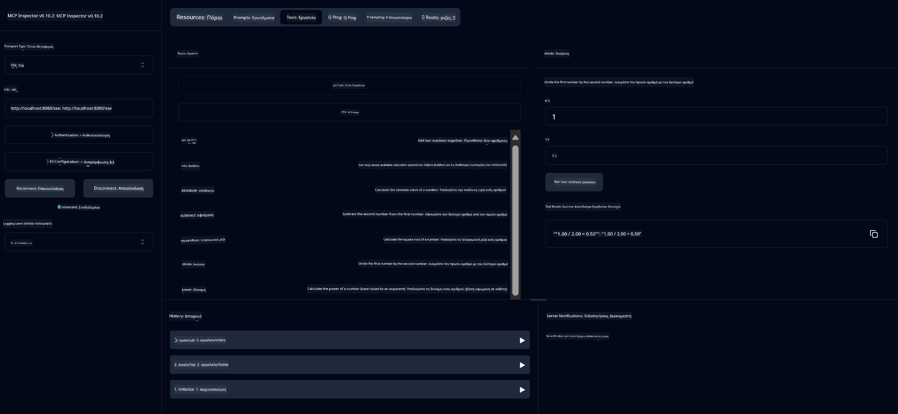

<!--
CO_OP_TRANSLATOR_METADATA:
{
  "original_hash": "ed9cab32cc67c12d8969b407aa47100a",
  "translation_date": "2025-07-13T17:54:30+00:00",
  "source_file": "03-GettingStarted/01-first-server/solution/java/README.md",
  "language_code": "el"
}
-->
# Basic Calculator MCP Service

Αυτή η υπηρεσία παρέχει βασικές λειτουργίες αριθμομηχανής μέσω του Model Context Protocol (MCP) χρησιμοποιώντας Spring Boot με WebFlux μεταφορά. Έχει σχεδιαστεί ως ένα απλό παράδειγμα για αρχάριους που μαθαίνουν για υλοποιήσεις MCP.

Για περισσότερες πληροφορίες, δείτε την τεκμηρίωση αναφοράς [MCP Server Boot Starter](https://docs.spring.io/spring-ai/reference/api/mcp/mcp-server-boot-starter-docs.html).


## Χρήση της Υπηρεσίας

Η υπηρεσία εκθέτει τα παρακάτω API endpoints μέσω του πρωτοκόλλου MCP:

- `add(a, b)`: Προσθέτει δύο αριθμούς
- `subtract(a, b)`: Αφαιρεί τον δεύτερο αριθμό από τον πρώτο
- `multiply(a, b)`: Πολλαπλασιάζει δύο αριθμούς
- `divide(a, b)`: Διαιρεί τον πρώτο αριθμό με τον δεύτερο (με έλεγχο για μηδέν)
- `power(base, exponent)`: Υπολογίζει τη δύναμη ενός αριθμού
- `squareRoot(number)`: Υπολογίζει την τετραγωνική ρίζα (με έλεγχο για αρνητικό αριθμό)
- `modulus(a, b)`: Υπολογίζει το υπόλοιπο της διαίρεσης
- `absolute(number)`: Υπολογίζει την απόλυτη τιμή

## Εξαρτήσεις

Το έργο απαιτεί τις παρακάτω βασικές εξαρτήσεις:

```xml
<dependency>
    <groupId>org.springframework.ai</groupId>
    <artifactId>spring-ai-starter-mcp-server-webflux</artifactId>
</dependency>
```

## Δημιουργία του Έργου

Δημιουργήστε το έργο χρησιμοποιώντας Maven:
```bash
./mvnw clean install -DskipTests
```

## Εκτέλεση του Διακομιστή

### Χρήση Java

```bash
java -jar target/calculator-server-0.0.1-SNAPSHOT.jar
```

### Χρήση MCP Inspector

Ο MCP Inspector είναι ένα χρήσιμο εργαλείο για την αλληλεπίδραση με υπηρεσίες MCP. Για να το χρησιμοποιήσετε με αυτή την υπηρεσία αριθμομηχανής:

1. **Εγκαταστήστε και εκτελέστε τον MCP Inspector** σε νέο παράθυρο τερματικού:
   ```bash
   npx @modelcontextprotocol/inspector
   ```

2. **Πρόσβαση στο web UI** κάνοντας κλικ στο URL που εμφανίζει η εφαρμογή (συνήθως http://localhost:6274)

3. **Διαμόρφωση της σύνδεσης**:
   - Ορίστε τον τύπο μεταφοράς σε "SSE"
   - Ορίστε το URL στο SSE endpoint του διακομιστή σας: `http://localhost:8080/sse`
   - Κάντε κλικ στο "Connect"

4. **Χρήση των εργαλείων**:
   - Κάντε κλικ στο "List Tools" για να δείτε τις διαθέσιμες λειτουργίες αριθμομηχανής
   - Επιλέξτε ένα εργαλείο και κάντε κλικ στο "Run Tool" για να εκτελέσετε μια λειτουργία



**Αποποίηση ευθυνών**:  
Αυτό το έγγραφο έχει μεταφραστεί χρησιμοποιώντας την υπηρεσία αυτόματης μετάφρασης AI [Co-op Translator](https://github.com/Azure/co-op-translator). Παρόλο που επιδιώκουμε την ακρίβεια, παρακαλούμε να γνωρίζετε ότι οι αυτόματες μεταφράσεις ενδέχεται να περιέχουν λάθη ή ανακρίβειες. Το πρωτότυπο έγγραφο στη γλώσσα του θεωρείται η αυθεντική πηγή. Για κρίσιμες πληροφορίες, συνιστάται επαγγελματική ανθρώπινη μετάφραση. Δεν φέρουμε ευθύνη για τυχόν παρεξηγήσεις ή λανθασμένες ερμηνείες που προκύπτουν από τη χρήση αυτής της μετάφρασης.