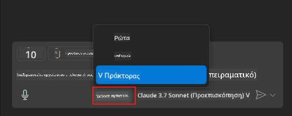
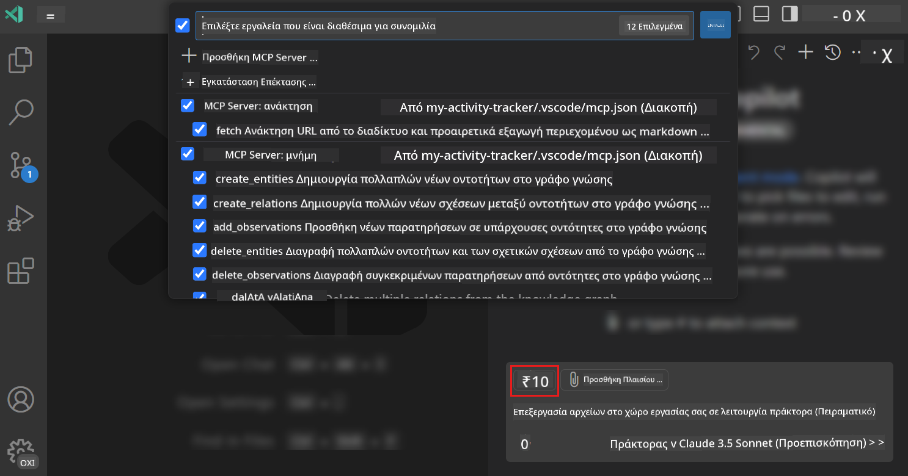
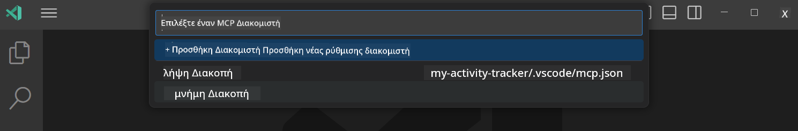
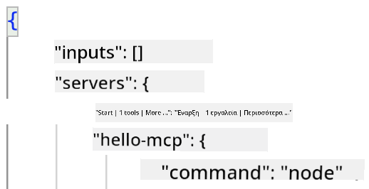
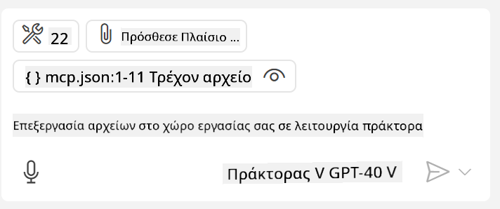
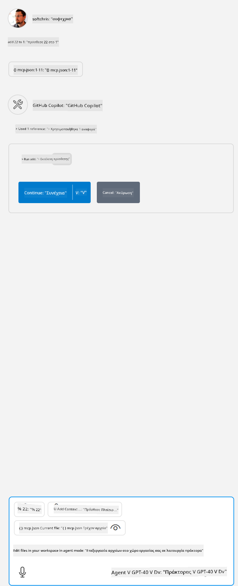

<!--
CO_OP_TRANSLATOR_METADATA:
{
  "original_hash": "d940b5e0af75e3a3a4d1c3179120d1d9",
  "translation_date": "2025-08-26T17:46:27+00:00",
  "source_file": "03-GettingStarted/04-vscode/README.md",
  "language_code": "el"
}
-->
# Κατανάλωση ενός διακομιστή από τη λειτουργία Agent του GitHub Copilot

Το Visual Studio Code και το GitHub Copilot μπορούν να λειτουργήσουν ως πελάτες και να καταναλώσουν έναν MCP Server. Γιατί να θέλουμε να το κάνουμε αυτό, μπορεί να ρωτήσετε; Λοιπόν, αυτό σημαίνει ότι οποιαδήποτε δυνατότητα έχει ο MCP Server μπορεί τώρα να χρησιμοποιηθεί μέσα από το IDE σας. Φανταστείτε, για παράδειγμα, να προσθέσετε τον MCP Server του GitHub, κάτι που θα σας επιτρέψει να ελέγχετε το GitHub μέσω προτροπών αντί να πληκτρολογείτε συγκεκριμένες εντολές στο τερματικό. Ή φανταστείτε οτιδήποτε γενικά που θα μπορούσε να βελτιώσει την εμπειρία του προγραμματιστή σας, όλα ελεγχόμενα μέσω φυσικής γλώσσας. Τώρα αρχίζετε να βλέπετε το όφελος, σωστά;

## Επισκόπηση

Αυτό το μάθημα καλύπτει πώς να χρησιμοποιήσετε το Visual Studio Code και τη λειτουργία Agent του GitHub Copilot ως πελάτη για τον MCP Server σας.

## Στόχοι Μάθησης

Μέχρι το τέλος αυτού του μαθήματος, θα μπορείτε να:

- Καταναλώνετε έναν MCP Server μέσω του Visual Studio Code.
- Εκτελείτε δυνατότητες όπως εργαλεία μέσω του GitHub Copilot.
- Διαμορφώνετε το Visual Studio Code για να βρίσκει και να διαχειρίζεται τον MCP Server σας.

## Χρήση

Μπορείτε να ελέγξετε τον MCP Server σας με δύο διαφορετικούς τρόπους:

- Μέσω του γραφικού περιβάλλοντος χρήστη, θα δείτε πώς γίνεται αυτό αργότερα σε αυτό το κεφάλαιο.
- Μέσω του τερματικού, είναι δυνατό να ελέγξετε πράγματα από το τερματικό χρησιμοποιώντας το εκτελέσιμο `code`:

  Για να προσθέσετε έναν MCP Server στο προφίλ χρήστη σας, χρησιμοποιήστε την επιλογή γραμμής εντολών --add-mcp και παρέχετε τη διαμόρφωση του διακομιστή JSON στη μορφή {\"name\":\"server-name\",\"command\":...}.

  ```
  code --add-mcp "{\"name\":\"my-server\",\"command\": \"uvx\",\"args\": [\"mcp-server-fetch\"]}"
  ```

### Στιγμιότυπα οθόνης

  
  
  

Ας μιλήσουμε περισσότερο για το πώς χρησιμοποιούμε τη γραφική διεπαφή στις επόμενες ενότητες.

## Προσέγγιση

Ακολουθεί πώς πρέπει να προσεγγίσουμε αυτό σε υψηλό επίπεδο:

- Διαμορφώστε ένα αρχείο για να βρείτε τον MCP Server μας.
- Ξεκινήστε/Συνδεθείτε στον διακομιστή για να εμφανίσει τις δυνατότητές του.
- Χρησιμοποιήστε αυτές τις δυνατότητες μέσω της διεπαφής συνομιλίας του GitHub Copilot.

Ωραία, τώρα που κατανοούμε τη ροή, ας προσπαθήσουμε να χρησιμοποιήσουμε έναν MCP Server μέσω του Visual Studio Code μέσω μιας άσκησης.

## Άσκηση: Κατανάλωση ενός διακομιστή

Σε αυτή την άσκηση, θα διαμορφώσουμε το Visual Studio Code για να βρει τον MCP Server σας ώστε να μπορεί να χρησιμοποιηθεί μέσω της διεπαφής συνομιλίας του GitHub Copilot.

### -0- Προπαρασκευή, ενεργοποίηση ανακάλυψης MCP Server

Ίσως χρειαστεί να ενεργοποιήσετε την ανακάλυψη MCP Servers.

1. Μεταβείτε στο `File -> Preferences -> Settings` στο Visual Studio Code.

1. Αναζητήστε "MCP" και ενεργοποιήστε το `chat.mcp.discovery.enabled` στο αρχείο settings.json.

### -1- Δημιουργία αρχείου διαμόρφωσης

Ξεκινήστε δημιουργώντας ένα αρχείο διαμόρφωσης στον ριζικό φάκελο του έργου σας. Θα χρειαστείτε ένα αρχείο που ονομάζεται MCP.json και να το τοποθετήσετε σε έναν φάκελο που ονομάζεται .vscode. Θα πρέπει να μοιάζει κάπως έτσι:

```text
.vscode
|-- mcp.json
```

Στη συνέχεια, ας δούμε πώς μπορούμε να προσθέσουμε μια καταχώρηση διακομιστή.

### -2- Διαμόρφωση διακομιστή

Προσθέστε το παρακάτω περιεχόμενο στο *mcp.json*:

```json
{
    "inputs": [],
    "servers": {
       "hello-mcp": {
           "command": "node",
           "args": [
               "build/index.js"
           ]
       }
    }
}
```

Ακολουθεί ένα απλό παράδειγμα για το πώς να ξεκινήσετε έναν διακομιστή γραμμένο σε Node.js. Για άλλες πλατφόρμες, υποδείξτε την κατάλληλη εντολή για την εκκίνηση του διακομιστή χρησιμοποιώντας `command` και `args`.

### -3- Εκκίνηση του διακομιστή

Τώρα που έχετε προσθέσει μια καταχώρηση, ας ξεκινήσουμε τον διακομιστή:

1. Εντοπίστε την καταχώρησή σας στο *mcp.json* και βεβαιωθείτε ότι βρίσκετε το εικονίδιο "play":

    

1. Κάντε κλικ στο εικονίδιο "play". Θα πρέπει να δείτε το εικονίδιο εργαλείων στη συνομιλία του GitHub Copilot να αυξάνει τον αριθμό των διαθέσιμων εργαλείων. Αν κάνετε κλικ στο εικονίδιο εργαλείων, θα δείτε μια λίστα με τα καταχωρημένα εργαλεία. Μπορείτε να επιλέξετε/αποεπιλέξετε κάθε εργαλείο ανάλογα με το αν θέλετε το GitHub Copilot να τα χρησιμοποιεί ως πλαίσιο:

  

1. Για να εκτελέσετε ένα εργαλείο, πληκτρολογήστε μια προτροπή που γνωρίζετε ότι θα ταιριάζει με την περιγραφή ενός από τα εργαλεία σας, για παράδειγμα μια προτροπή όπως "πρόσθεσε 22 στο 1":

  

  Θα πρέπει να δείτε μια απάντηση που λέει 23.

## Εργασία

Προσπαθήστε να προσθέσετε μια καταχώρηση διακομιστή στο αρχείο *mcp.json* και βεβαιωθείτε ότι μπορείτε να ξεκινήσετε/σταματήσετε τον διακομιστή. Βεβαιωθείτε επίσης ότι μπορείτε να επικοινωνήσετε με τα εργαλεία στον διακομιστή σας μέσω της διεπαφής συνομιλίας του GitHub Copilot.

## Λύση

[Λύση](./solution/README.md)

## Βασικά Σημεία

Τα βασικά σημεία από αυτό το κεφάλαιο είναι τα εξής:

- Το Visual Studio Code είναι ένας εξαιρετικός πελάτης που σας επιτρέπει να καταναλώνετε πολλούς MCP Servers και τα εργαλεία τους.
- Η διεπαφή συνομιλίας του GitHub Copilot είναι ο τρόπος με τον οποίο αλληλεπιδράτε με τους διακομιστές.
- Μπορείτε να ζητήσετε από τον χρήστη εισόδους όπως κλειδιά API που μπορούν να περαστούν στον MCP Server κατά τη διαμόρφωση της καταχώρησης διακομιστή στο αρχείο *mcp.json*.

## Παραδείγματα

- [Java Calculator](../samples/java/calculator/README.md)  
- [.Net Calculator](../../../../03-GettingStarted/samples/csharp)  
- [JavaScript Calculator](../samples/javascript/README.md)  
- [TypeScript Calculator](../samples/typescript/README.md)  
- [Python Calculator](../../../../03-GettingStarted/samples/python)  

## Πρόσθετοι Πόροι

- [Έγγραφα Visual Studio](https://code.visualstudio.com/docs/copilot/chat/mcp-servers)

## Τι Ακολουθεί

- Επόμενο: [Δημιουργία διακομιστή stdio](../05-stdio-server/README.md)

---

**Αποποίηση ευθύνης**:  
Αυτό το έγγραφο έχει μεταφραστεί χρησιμοποιώντας την υπηρεσία αυτόματης μετάφρασης [Co-op Translator](https://github.com/Azure/co-op-translator). Παρόλο που καταβάλλουμε προσπάθειες για ακρίβεια, παρακαλούμε να έχετε υπόψη ότι οι αυτοματοποιημένες μεταφράσεις ενδέχεται να περιέχουν σφάλματα ή ανακρίβειες. Το πρωτότυπο έγγραφο στη μητρική του γλώσσα θα πρέπει να θεωρείται η αυθεντική πηγή. Για κρίσιμες πληροφορίες, συνιστάται επαγγελματική ανθρώπινη μετάφραση. Δεν φέρουμε ευθύνη για τυχόν παρεξηγήσεις ή εσφαλμένες ερμηνείες που προκύπτουν από τη χρήση αυτής της μετάφρασης.