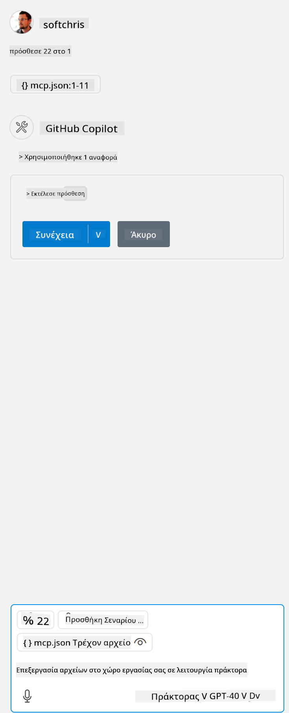

<!--
CO_OP_TRANSLATOR_METADATA:
{
  "original_hash": "96e08a8c1049dab757deb64cce4ea1e8",
  "translation_date": "2025-05-17T11:21:04+00:00",
  "source_file": "03-GettingStarted/04-vscode/solution/README.md",
  "language_code": "el"
}
-->
# Εκτέλεση του δείγματος

Εδώ υποθέτουμε ότι έχετε ήδη έναν λειτουργικό κώδικα διακομιστή. Βρείτε έναν διακομιστή από ένα από τα προηγούμενα κεφάλαια.

## Ρύθμιση του mcp.json

Ακολουθεί ένα αρχείο που χρησιμοποιείτε ως αναφορά, [mcp.json](../../../../../03-GettingStarted/04-vscode/solution/mcp.json).

Αλλάξτε την καταχώριση του διακομιστή όπως χρειάζεται ώστε να υποδεικνύει την απόλυτη διαδρομή προς τον διακομιστή σας, συμπεριλαμβανομένης της πλήρους εντολής που απαιτείται για την εκτέλεση.

Στο παράδειγμα αρχείου που αναφέρεται παραπάνω, η καταχώριση του διακομιστή μοιάζει ως εξής:

```json
"hello-mcp": {
    "command": "cmd",
    "args": [
        "/c", "node", "<absolute path>\\build\\index.js"
    ]
}
```

Αυτό αντιστοιχεί στην εκτέλεση μιας εντολής όπως η εξής: `cmd /c node <absolute path>\\build\index.js`. 

- Change this server entry to fit where your server file is located or to what's needed to startup your server depending on your chosen runtime and server location.

## Consume the features in the server

- Click the `play` icon, once you've added *mcp.json* to *./vscode* folder, 

    Observe the tooling icon change to increase the number of available tools. Tooling icon is located right above the chat field in GitHub Copilot.

## Run a tool

- Type a prompt in your chat window that matches the description of your tool. For example to trigger the tool `add` πληκτρολογήστε κάτι όπως "πρόσθεσε 3 στο 20".

Θα πρέπει να δείτε ένα εργαλείο να εμφανίζεται πάνω από το πλαίσιο κειμένου συνομιλίας, υποδεικνύοντας να επιλέξετε την εκτέλεση του εργαλείου όπως φαίνεται σε αυτή την εικόνα:



Η επιλογή του εργαλείου θα πρέπει να παράγει ένα αριθμητικό αποτέλεσμα που λέει "23" εάν η προτροπή σας ήταν όπως αναφέραμε προηγουμένως.

**Αποποίηση ευθυνών**:  
Αυτό το έγγραφο έχει μεταφραστεί χρησιμοποιώντας την υπηρεσία αυτόματης μετάφρασης [Co-op Translator](https://github.com/Azure/co-op-translator). Παρόλο που επιδιώκουμε την ακρίβεια, παρακαλούμε να γνωρίζετε ότι οι αυτόματες μεταφράσεις ενδέχεται να περιέχουν σφάλματα ή ανακρίβειες. Το πρωτότυπο έγγραφο στη μητρική του γλώσσα θα πρέπει να θεωρείται η αυθεντική πηγή. Για κρίσιμες πληροφορίες, συνιστάται επαγγελματική μετάφραση από άνθρωπο. Δεν φέρουμε ευθύνη για οποιεσδήποτε παρεξηγήσεις ή παρερμηνείες που προκύπτουν από τη χρήση αυτής της μετάφρασης.