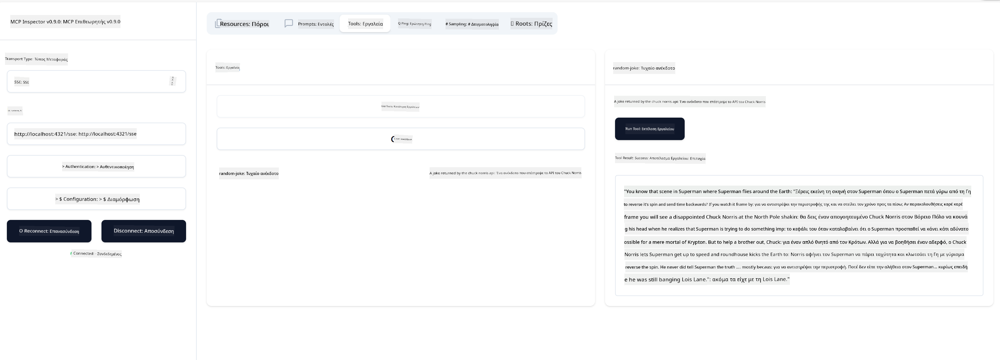

<!--
CO_OP_TRANSLATOR_METADATA:
{
  "original_hash": "6b1152afb5d4cb9a4175044694fd02ca",
  "translation_date": "2025-07-17T05:49:40+00:00",
  "source_file": "03-GettingStarted/05-sse-server/README.md",
  "language_code": "el"
}
-->
# SSE Server

Το SSE (Server Sent Events) είναι ένα πρότυπο για streaming από τον διακομιστή προς τον πελάτη, που επιτρέπει στους διακομιστές να στέλνουν ενημερώσεις σε πραγματικό χρόνο στους πελάτες μέσω HTTP. Αυτό είναι ιδιαίτερα χρήσιμο για εφαρμογές που απαιτούν ζωντανές ενημερώσεις, όπως εφαρμογές συνομιλίας, ειδοποιήσεις ή ροές δεδομένων σε πραγματικό χρόνο. Επιπλέον, ο διακομιστής σας μπορεί να χρησιμοποιηθεί από πολλούς πελάτες ταυτόχρονα, καθώς φιλοξενείται σε έναν διακομιστή που μπορεί να τρέχει, για παράδειγμα, στο cloud.

## Επισκόπηση

Αυτό το μάθημα καλύπτει πώς να δημιουργήσετε και να χρησιμοποιήσετε SSE Servers.

## Στόχοι Μάθησης

Στο τέλος αυτού του μαθήματος, θα μπορείτε να:

- Δημιουργήσετε έναν SSE Server.
- Εντοπίσετε σφάλματα σε έναν SSE Server χρησιμοποιώντας το Inspector.
- Χρησιμοποιήσετε έναν SSE Server με το Visual Studio Code.

## SSE, πώς λειτουργεί

Το SSE είναι ένας από τους δύο υποστηριζόμενους τύπους μεταφοράς. Έχετε ήδη δει τον πρώτο, stdio, να χρησιμοποιείται σε προηγούμενα μαθήματα. Η διαφορά είναι η εξής:

- Το SSE απαιτεί να διαχειριστείτε δύο πράγματα: τη σύνδεση και τα μηνύματα.
- Επειδή πρόκειται για έναν διακομιστή που μπορεί να φιλοξενηθεί οπουδήποτε, πρέπει αυτό να αντικατοπτρίζεται στον τρόπο που δουλεύετε με εργαλεία όπως το Inspector και το Visual Studio Code. Αυτό σημαίνει ότι αντί να δείχνετε πώς να ξεκινήσετε τον διακομιστή, δείχνετε το endpoint όπου μπορεί να δημιουργηθεί η σύνδεση. Δείτε το παρακάτω παράδειγμα κώδικα:

### TypeScript

```typescript
app.get("/sse", async (_: Request, res: Response) => {
    const transport = new SSEServerTransport('/messages', res);
    transports[transport.sessionId] = transport;
    res.on("close", () => {
        delete transports[transport.sessionId];
    });
    await server.connect(transport);
});

app.post("/messages", async (req: Request, res: Response) => {
    const sessionId = req.query.sessionId as string;
    const transport = transports[sessionId];
    if (transport) {
        await transport.handlePostMessage(req, res);
    } else {
        res.status(400).send('No transport found for sessionId');
    }
});
```

Στον παραπάνω κώδικα:

- Η διαδρομή `/sse` έχει οριστεί ως route. Όταν γίνεται αίτημα σε αυτή τη διαδρομή, δημιουργείται μια νέα μεταφορά (transport) και ο διακομιστής *συνδέεται* χρησιμοποιώντας αυτή τη μεταφορά.
- Η διαδρομή `/messages` χειρίζεται τα εισερχόμενα μηνύματα.

### Python

```python
mcp = FastMCP("My App")

@mcp.tool()
def add(a: int, b: int) -> int:
    """Add two numbers"""
    return a + b

# Mount the SSE server to the existing ASGI server
app = Starlette(
    routes=[
        Mount('/', app=mcp.sse_app()),
    ]
)

```

Στον παραπάνω κώδικα:

- Δημιουργούμε ένα instance ενός ASGI server (συγκεκριμένα με Starlette) και τοποθετούμε τη βασική διαδρομή `/`.

  Αυτό που συμβαίνει στο παρασκήνιο είναι ότι οι διαδρομές `/sse` και `/messages` ρυθμίζονται για να χειρίζονται τις συνδέσεις και τα μηνύματα αντίστοιχα. Το υπόλοιπο της εφαρμογής, όπως η προσθήκη λειτουργιών και εργαλείων, γίνεται όπως στους stdio servers.

### .NET    

```csharp
    var builder = WebApplication.CreateBuilder(args);
    builder.Services
        .AddMcpServer()
        .WithTools<Tools>();


    builder.Services.AddHttpClient();

    var app = builder.Build();

    app.MapMcp();
    ```

Υπάρχουν δύο μέθοδοι που μας βοηθούν να μετατρέψουμε έναν web server σε έναν web server που υποστηρίζει SSE και αυτές είναι:

- `AddMcpServer`, αυτή η μέθοδος προσθέτει τις δυνατότητες.
- `MapMcp`, αυτή προσθέτει διαδρομές όπως `/SSE` και `/messages`.

Τώρα που γνωρίζουμε λίγο περισσότερα για το SSE, ας δημιουργήσουμε έναν SSE server.

## Άσκηση: Δημιουργία SSE Server

Για να δημιουργήσουμε τον διακομιστή μας, πρέπει να έχουμε στο μυαλό μας δύο πράγματα:

- Πρέπει να χρησιμοποιήσουμε έναν web server για να εκθέσουμε endpoints για σύνδεση και μηνύματα.
- Να χτίσουμε τον διακομιστή μας όπως συνήθως, με εργαλεία, πόρους και prompts, όπως κάναμε με stdio.

### -1- Δημιουργία instance διακομιστή

Για να δημιουργήσουμε τον διακομιστή, χρησιμοποιούμε τους ίδιους τύπους όπως με stdio. Ωστόσο, για τη μεταφορά, πρέπει να επιλέξουμε SSE.

### TypeScript

```typescript
import { Request, Response } from "express";
import express from "express";
import { McpServer } from "@modelcontextprotocol/sdk/server/mcp.js";
import { SSEServerTransport } from "@modelcontextprotocol/sdk/server/sse.js";

const server = new McpServer({
  name: "example-server",
  version: "1.0.0"
});

const app = express();

const transports: {[sessionId: string]: SSEServerTransport} = {};
```

Στον παραπάνω κώδικα έχουμε:

- Δημιουργήσει ένα instance διακομιστή.
- Ορίσει μια εφαρμογή χρησιμοποιώντας το web framework express.
- Δημιουργήσει μια μεταβλητή transports που θα χρησιμοποιήσουμε για να αποθηκεύουμε τις εισερχόμενες συνδέσεις.

### Python

```python
from starlette.applications import Starlette
from starlette.routing import Mount, Host
from mcp.server.fastmcp import FastMCP


mcp = FastMCP("My App")
```

Στον παραπάνω κώδικα έχουμε:

- Εισάγει τις βιβλιοθήκες που θα χρειαστούμε, με το Starlette (ένα ASGI framework) να συμπεριλαμβάνεται.
- Δημιουργήσει ένα instance MCP server `mcp`.

### .NET

```csharp
var builder = WebApplication.CreateBuilder(args);
builder.Services
    .AddMcpServer();


builder.Services.AddHttpClient();

var app = builder.Build();

// TODO: add routes 
```

Σε αυτό το σημείο έχουμε:

- Δημιουργήσει μια web εφαρμογή.
- Προσθέσει υποστήριξη για δυνατότητες MCP μέσω της μεθόδου `AddMcpServer`.

Ας προσθέσουμε τις απαραίτητες διαδρομές στη συνέχεια.

### -2- Προσθήκη διαδρομών

Ας προσθέσουμε διαδρομές που χειρίζονται τη σύνδεση και τα εισερχόμενα μηνύματα:

### TypeScript

```typescript
app.get("/sse", async (_: Request, res: Response) => {
  const transport = new SSEServerTransport('/messages', res);
  transports[transport.sessionId] = transport;
  res.on("close", () => {
    delete transports[transport.sessionId];
  });
  await server.connect(transport);
});

app.post("/messages", async (req: Request, res: Response) => {
  const sessionId = req.query.sessionId as string;
  const transport = transports[sessionId];
  if (transport) {
    await transport.handlePostMessage(req, res);
  } else {
    res.status(400).send('No transport found for sessionId');
  }
});

app.listen(3001);
```

Στον παραπάνω κώδικα έχουμε ορίσει:

- Μια διαδρομή `/sse` που δημιουργεί μια μεταφορά τύπου SSE και καλεί τη μέθοδο `connect` στον MCP server.
- Μια διαδρομή `/messages` που διαχειρίζεται τα εισερχόμενα μηνύματα.

### Python

```python
app = Starlette(
    routes=[
        Mount('/', app=mcp.sse_app()),
    ]
)
```

Στον παραπάνω κώδικα έχουμε:

- Δημιουργήσει ένα instance ASGI app χρησιμοποιώντας το framework Starlette. Ως μέρος αυτού, περνάμε το `mcp.sse_app()` στη λίστα των routes. Αυτό τοποθετεί τις διαδρομές `/sse` και `/messages` στην εφαρμογή.

### .NET

```csharp
var builder = WebApplication.CreateBuilder(args);
builder.Services
    .AddMcpServer();

builder.Services.AddHttpClient();

var app = builder.Build();

app.MapMcp();
```

Προσθέσαμε μια γραμμή κώδικα στο τέλος `add.MapMcp()`, που σημαίνει ότι τώρα έχουμε τις διαδρομές `/SSE` και `/messages`.

Ας προσθέσουμε τώρα δυνατότητες στον διακομιστή.

### -3- Προσθήκη δυνατοτήτων στον διακομιστή

Τώρα που έχουμε ορίσει όλα τα ειδικά για το SSE, ας προσθέσουμε δυνατότητες στον διακομιστή όπως εργαλεία, prompts και πόρους.

### TypeScript

```typescript
server.tool("random-joke", "A joke returned by the chuck norris api", {},
  async () => {
    const response = await fetch("https://api.chucknorris.io/jokes/random");
    const data = await response.json();

    return {
      content: [
        {
          type: "text",
          text: data.value
        }
      ]
    };
  }
);
```

Δείτε πώς μπορείτε να προσθέσετε ένα εργαλείο, για παράδειγμα. Αυτό το συγκεκριμένο εργαλείο δημιουργεί ένα εργαλείο με όνομα "random-joke" που καλεί ένα API του Chuck Norris και επιστρέφει μια απάντηση σε μορφή JSON.

### Python

```python
@mcp.tool()
def add(a: int, b: int) -> int:
    """Add two numbers"""
    return a + b
```

Τώρα ο διακομιστής σας έχει ένα εργαλείο.

### TypeScript

```typescript
// server-sse.ts
import { Request, Response } from "express";
import express from "express";
import { McpServer } from "@modelcontextprotocol/sdk/server/mcp.js";
import { SSEServerTransport } from "@modelcontextprotocol/sdk/server/sse.js";

// Create an MCP server
const server = new McpServer({
  name: "example-server",
  version: "1.0.0",
});

const app = express();

const transports: { [sessionId: string]: SSEServerTransport } = {};

app.get("/sse", async (_: Request, res: Response) => {
  const transport = new SSEServerTransport("/messages", res);
  transports[transport.sessionId] = transport;
  res.on("close", () => {
    delete transports[transport.sessionId];
  });
  await server.connect(transport);
});

app.post("/messages", async (req: Request, res: Response) => {
  const sessionId = req.query.sessionId as string;
  const transport = transports[sessionId];
  if (transport) {
    await transport.handlePostMessage(req, res);
  } else {
    res.status(400).send("No transport found for sessionId");
  }
});

server.tool("random-joke", "A joke returned by the chuck norris api", {}, async () => {
  const response = await fetch("https://api.chucknorris.io/jokes/random");
  const data = await response.json();

  return {
    content: [
      {
        type: "text",
        text: data.value,
      },
    ],
  };
});

app.listen(3001);
```

### Python

```python
from starlette.applications import Starlette
from starlette.routing import Mount, Host
from mcp.server.fastmcp import FastMCP


mcp = FastMCP("My App")

@mcp.tool()
def add(a: int, b: int) -> int:
    """Add two numbers"""
    return a + b

# Mount the SSE server to the existing ASGI server
app = Starlette(
    routes=[
        Mount('/', app=mcp.sse_app()),
    ]
)
```

### .NET

1. Ας δημιουργήσουμε πρώτα κάποια εργαλεία, για αυτό θα δημιουργήσουμε ένα αρχείο *Tools.cs* με το παρακάτω περιεχόμενο:

  ```csharp
  using System.ComponentModel;
  using System.Text.Json;
  using ModelContextProtocol.Server;

  namespace server;

  [McpServerToolType]
  public sealed class Tools
  {

      public Tools()
      {
      
      }

      [McpServerTool, Description("Add two numbers together.")]
      public async Task<string> AddNumbers(
          [Description("The first number")] int a,
          [Description("The second number")] int b)
      {
          return (a + b).ToString();
      }

  }
  ```

  Εδώ έχουμε προσθέσει τα εξής:

  - Δημιουργήσαμε μια κλάση `Tools` με το διακοσμητή `McpServerToolType`.
  - Ορίσαμε ένα εργαλείο `AddNumbers` διακοσμώντας τη μέθοδο με `McpServerTool`. Παρείχαμε επίσης παραμέτρους και υλοποίηση.

1. Ας χρησιμοποιήσουμε την κλάση `Tools` που μόλις δημιουργήσαμε:

  ```csharp
  var builder = WebApplication.CreateBuilder(args);
  builder.Services
      .AddMcpServer()
      .WithTools<Tools>();


  builder.Services.AddHttpClient();

  var app = builder.Build();

  app.MapMcp();
  ```

  Προσθέσαμε μια κλήση στο `WithTools` που καθορίζει την κλάση `Tools` ως αυτή που περιέχει τα εργαλεία. Αυτό ήταν, είμαστε έτοιμοι.

Τέλεια, έχουμε έναν διακομιστή που χρησιμοποιεί SSE, ας τον δοκιμάσουμε τώρα.

## Άσκηση: Εντοπισμός σφαλμάτων σε SSE Server με Inspector

Το Inspector είναι ένα εξαιρετικό εργαλείο που είδαμε σε προηγούμενο μάθημα [Creating your first server](/03-GettingStarted/01-first-server/README.md). Ας δούμε αν μπορούμε να το χρησιμοποιήσουμε και εδώ:

### -1- Εκτέλεση του inspector

Για να τρέξετε τον inspector, πρέπει πρώτα να έχετε έναν SSE server σε λειτουργία, οπότε ας το κάνουμε:

1. Τρέξτε τον διακομιστή

    ### TypeScript

    ```sh
    tsx && node ./build/server-sse.ts
    ```

    ### Python

    ```sh
    uvicorn server:app
    ```

    Σημειώστε πώς χρησιμοποιούμε το εκτελέσιμο `uvicorn` που εγκαθίσταται όταν πληκτρολογήσαμε `pip install "mcp[cli]"`. Το `server:app` σημαίνει ότι προσπαθούμε να τρέξουμε το αρχείο `server.py` και να έχει ένα instance Starlette με όνομα `app`.

    ### .NET

    ```sh
    dotnet run
    ```

    Αυτό θα ξεκινήσει τον διακομιστή. Για να αλληλεπιδράσετε μαζί του, χρειάζεστε ένα νέο τερματικό.

1. Τρέξτε τον inspector

    > ![NOTE]
    > Τρέξτε αυτό σε ξεχωριστό παράθυρο τερματικού από αυτό που τρέχει ο διακομιστής. Επίσης, σημειώστε ότι πρέπει να προσαρμόσετε την παρακάτω εντολή ώστε να ταιριάζει με το URL όπου τρέχει ο διακομιστής σας.

    ```sh
    npx @modelcontextprotocol/inspector --cli http://localhost:8000/sse --method tools/list
    ```

    Η εκτέλεση του inspector είναι ίδια σε όλα τα περιβάλλοντα. Σημειώστε πώς αντί να δίνουμε μια διαδρομή προς τον διακομιστή και μια εντολή για να τον ξεκινήσουμε, δίνουμε το URL όπου τρέχει ο διακομιστής και επίσης καθορίζουμε τη διαδρομή `/sse`.

### -2- Δοκιμή του εργαλείου

Συνδεθείτε με τον διακομιστή επιλέγοντας SSE από το dropdown και συμπληρώστε το πεδίο URL όπου τρέχει ο διακομιστής σας, για παράδειγμα http:localhost:4321/sse. Τώρα πατήστε το κουμπί "Connect". Όπως πριν, επιλέξτε να δείτε τα εργαλεία, επιλέξτε ένα εργαλείο και δώστε τιμές εισόδου. Θα δείτε ένα αποτέλεσμα όπως παρακάτω:



Τέλεια, μπορείτε να δουλέψετε με τον inspector, ας δούμε τώρα πώς μπορούμε να δουλέψουμε με το Visual Studio Code.

## Ανάθεση

Προσπαθήστε να επεκτείνετε τον διακομιστή σας με περισσότερες δυνατότητες. Δείτε [αυτή τη σελίδα](https://api.chucknorris.io/) για να προσθέσετε, για παράδειγμα, ένα εργαλείο που καλεί ένα API. Εσείς αποφασίζετε πώς θα είναι ο διακομιστής. Καλή διασκέδαση :)

## Λύση

[Λύση](./solution/README.md) Εδώ είναι μια πιθανή λύση με λειτουργικό κώδικα.

## Βασικά Σημεία

Τα βασικά σημεία από αυτό το κεφάλαιο είναι τα εξής:

- Το SSE είναι ο δεύτερος υποστηριζόμενος τύπος μεταφοράς μετά το stdio.
- Για να υποστηρίξετε SSE, πρέπει να διαχειρίζεστε τις εισερχόμενες συνδέσεις και τα μηνύματα χρησιμοποιώντας ένα web framework.
- Μπορείτε να χρησιμοποιήσετε τόσο το Inspector όσο και το Visual Studio Code για να καταναλώσετε έναν SSE server, όπως και με τους stdio servers. Σημειώστε ότι υπάρχει μια μικρή διαφορά μεταξύ stdio και SSE. Για το SSE, πρέπει να ξεκινήσετε τον διακομιστή ξεχωριστά και μετά να τρέξετε το εργαλείο inspector. Επίσης, για το εργαλείο inspector, πρέπει να καθορίσετε το URL.

## Παραδείγματα

- [Java Calculator](../samples/java/calculator/README.md)
- [.Net Calculator](../../../../03-GettingStarted/samples/csharp)
- [JavaScript Calculator](../samples/javascript/README.md)
- [TypeScript Calculator](../samples/typescript/README.md)
- [Python Calculator](../../../../03-GettingStarted/samples/python)

## Πρόσθετοι Πόροι

- [SSE](https://developer.mozilla.org/en-US/docs/Web/API/Server-sent_events)

## Τι Ακολουθεί

- Επόμενο: [HTTP Streaming with MCP (Streamable HTTP)](../06-http-streaming/README.md)

**Αποποίηση ευθυνών**:  
Αυτό το έγγραφο έχει μεταφραστεί χρησιμοποιώντας την υπηρεσία αυτόματης μετάφρασης AI [Co-op Translator](https://github.com/Azure/co-op-translator). Παρόλο που επιδιώκουμε την ακρίβεια, παρακαλούμε να γνωρίζετε ότι οι αυτόματες μεταφράσεις ενδέχεται να περιέχουν λάθη ή ανακρίβειες. Το πρωτότυπο έγγραφο στη γλώσσα του θεωρείται η αυθεντική πηγή. Για κρίσιμες πληροφορίες, συνιστάται επαγγελματική ανθρώπινη μετάφραση. Δεν φέρουμε ευθύνη για τυχόν παρεξηγήσεις ή λανθασμένες ερμηνείες που προκύπτουν από τη χρήση αυτής της μετάφρασης.