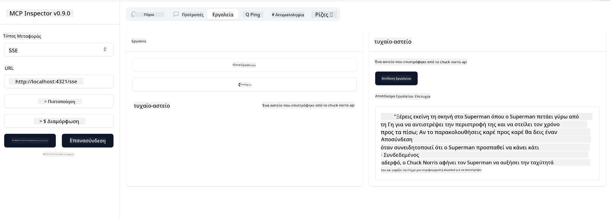

<!--
CO_OP_TRANSLATOR_METADATA:
{
  "original_hash": "0a8086dc4bf89448f83e7936db972c42",
  "translation_date": "2025-05-17T11:35:13+00:00",
  "source_file": "03-GettingStarted/05-sse-server/README.md",
  "language_code": "el"
}
-->
# SSE Server

Το SSE (Server Sent Events) είναι ένα πρότυπο για streaming από τον server στον client, επιτρέποντας στους servers να στέλνουν ενημερώσεις σε πραγματικό χρόνο στους clients μέσω HTTP. Αυτό είναι ιδιαίτερα χρήσιμο για εφαρμογές που απαιτούν ζωντανές ενημερώσεις, όπως εφαρμογές συνομιλίας, ειδοποιήσεις ή feeds δεδομένων σε πραγματικό χρόνο. Επίσης, ο server σας μπορεί να χρησιμοποιηθεί από πολλούς clients ταυτόχρονα, καθώς βρίσκεται σε έναν server που μπορεί να εκτελείται κάπου στο cloud, για παράδειγμα.

## Επισκόπηση

Αυτό το μάθημα καλύπτει πώς να κατασκευάσετε και να καταναλώσετε SSE Servers.

## Στόχοι Μάθησης

Μέχρι το τέλος αυτού του μαθήματος, θα είστε σε θέση να:

- Κατασκευάσετε έναν SSE Server.
- Εντοπίσετε σφάλματα σε έναν SSE Server χρησιμοποιώντας το Inspector.
- Καταναλώσετε έναν SSE Server χρησιμοποιώντας το Visual Studio Code.

## SSE, πώς λειτουργεί

Το SSE είναι ένας από τους δύο υποστηριζόμενους τύπους μεταφοράς. Έχετε ήδη δει τον πρώτο τύπο, το stdio, να χρησιμοποιείται σε προηγούμενα μαθήματα. Η διαφορά είναι η εξής:

- Το SSE απαιτεί να διαχειριστείτε δύο πράγματα: τη σύνδεση και τα μηνύματα.
- Καθώς πρόκειται για έναν server που μπορεί να ζει οπουδήποτε, χρειάζεται να το αντανακλάτε στον τρόπο που εργάζεστε με εργαλεία όπως το Inspector και το Visual Studio. Αυτό σημαίνει ότι αντί να υποδεικνύετε πώς να ξεκινήσετε τον server, υποδεικνύετε το endpoint όπου μπορεί να δημιουργήσει σύνδεση. Δείτε παρακάτω παράδειγμα κώδικα:

Τώρα που γνωρίζουμε λίγο περισσότερα για το SSE, ας κατασκευάσουμε έναν SSE server στη συνέχεια.

## Άσκηση: Δημιουργία ενός SSE Server

Για να δημιουργήσουμε τον server μας, πρέπει να έχουμε δύο πράγματα υπόψη μας:

- Χρειάζεται να χρησιμοποιήσουμε έναν web server για να εκθέσουμε endpoints για σύνδεση και μηνύματα.
- Κατασκευάζουμε τον server μας όπως συνήθως κάνουμε με εργαλεία, πόρους και προτροπές όταν χρησιμοποιούσαμε το stdio.

### -1- Δημιουργία μιας παρουσίας server

Για να δημιουργήσουμε τον server μας, χρησιμοποιούμε τους ίδιους τύπους όπως με το stdio. Ωστόσο, για τη μεταφορά, πρέπει να επιλέξουμε SSE.

Ας προσθέσουμε τις απαραίτητες διαδρομές στη συνέχεια.

### -2- Προσθήκη διαδρομών

Ας προσθέσουμε διαδρομές στη συνέχεια που διαχειρίζονται τη σύνδεση και τα εισερχόμενα μηνύματα:

Ας προσθέσουμε δυνατότητες στον server στη συνέχεια.

### -3- Προσθήκη δυνατοτήτων server

Τώρα που έχουμε ορίσει όλα τα συγκεκριμένα για το SSE, ας προσθέσουμε δυνατότητες server όπως εργαλεία, προτροπές και πόρους.

Ο πλήρης κώδικάς σας θα πρέπει να μοιάζει κάπως έτσι:

Ωραία, έχουμε έναν server που χρησιμοποιεί SSE, ας τον δοκιμάσουμε στη συνέχεια.

## Άσκηση: Εντοπισμός σφαλμάτων σε έναν SSE Server με το Inspector

Το Inspector είναι ένα εξαιρετικό εργαλείο που είδαμε σε προηγούμενο μάθημα [Δημιουργία του πρώτου σας server](/03-GettingStarted/01-first-server/README.md). Ας δούμε αν μπορούμε να χρησιμοποιήσουμε το Inspector ακόμα και εδώ:

### -1- Εκτέλεση του inspector

Για να εκτελέσετε το inspector, πρέπει πρώτα να έχετε έναν SSE server να τρέχει, οπότε ας το κάνουμε αυτό στη συνέχεια:

1. Εκτελέστε τον server

1. Εκτελέστε το inspector

    > ![NOTE]
    > Εκτελέστε αυτό σε ένα ξεχωριστό παράθυρο τερματικού από εκείνο που τρέχει ο server. Επίσης σημειώστε, πρέπει να προσαρμόσετε την παρακάτω εντολή ώστε να ταιριάζει με το URL όπου τρέχει ο server σας.

    ```sh
    npx @modelcontextprotocol/inspector --cli http://localhost:8000/sse --method tools/list
    ```

    Η εκτέλεση του inspector φαίνεται ίδια σε όλους τους χρόνους εκτέλεσης. Σημειώστε πώς αντί να δίνουμε ένα μονοπάτι στον server μας και μια εντολή για την εκκίνηση του server, δίνουμε το URL όπου τρέχει ο server και επίσης καθορίζουμε τη διαδρομή `/sse`.

### -2- Δοκιμή του εργαλείου

Συνδέστε τον server επιλέγοντας SSE από το drop-down και συμπληρώστε το πεδίο URL όπου τρέχει ο server σας, για παράδειγμα http:localhost:4321/sse. Τώρα κάντε κλικ στο κουμπί "Connect". Όπως πριν, επιλέξτε να καταγράψετε εργαλεία, επιλέξτε ένα εργαλείο και δώστε τιμές εισόδου. Θα πρέπει να δείτε ένα αποτέλεσμα όπως παρακάτω:



Ωραία, μπορείτε να εργαστείτε με το inspector, ας δούμε πώς μπορούμε να εργαστούμε με το Visual Studio Code στη συνέχεια.

## Ανάθεση

Προσπαθήστε να δημιουργήσετε τον server σας με περισσότερες δυνατότητες. Δείτε [αυτή τη σελίδα](https://api.chucknorris.io/) για να προσθέσετε, για παράδειγμα, ένα εργαλείο που καλεί ένα API, εσείς αποφασίζετε πώς θα πρέπει να φαίνεται ο server. Καλή διασκέδαση :)

## Λύση

[Λύση](./solution/README.md) Εδώ είναι μια πιθανή λύση με λειτουργικό κώδικα.

## Κύρια Σημεία

Τα κύρια σημεία από αυτό το κεφάλαιο είναι τα εξής:

- Το SSE είναι η δεύτερη υποστηριζόμενη μεταφορά δίπλα στο stdio.
- Για να υποστηρίξετε το SSE, πρέπει να διαχειριστείτε τις εισερχόμενες συνδέσεις και μηνύματα χρησιμοποιώντας ένα web framework.
- Μπορείτε να χρησιμοποιήσετε τόσο το Inspector όσο και το Visual Studio Code για να καταναλώσετε SSE server, όπως και τους servers stdio. Σημειώστε πώς διαφέρει λίγο μεταξύ stdio και SSE. Για το SSE, πρέπει να εκκινήσετε τον server ξεχωριστά και στη συνέχεια να εκτελέσετε το εργαλείο inspector. Για το εργαλείο inspector, υπάρχουν επίσης κάποιες διαφορές στο ότι πρέπει να καθορίσετε το URL.

## Δείγματα

- [Java Calculator](../samples/java/calculator/README.md)
- [.Net Calculator](../../../../03-GettingStarted/samples/csharp)
- [JavaScript Calculator](../samples/javascript/README.md)
- [TypeScript Calculator](../samples/typescript/README.md)
- [Python Calculator](../../../../03-GettingStarted/samples/python)

## Πρόσθετοι Πόροι

- [SSE](https://developer.mozilla.org/en-US/docs/Web/API/Server-sent_events)

## Τι Ακολουθεί

- Επόμενο: [Ξεκινώντας με το AI Toolkit για το VSCode](/03-GettingStarted/06-aitk/README.md)

**Αποποίηση ευθύνης**:  
Αυτό το έγγραφο έχει μεταφραστεί χρησιμοποιώντας την υπηρεσία αυτόματης μετάφρασης [Co-op Translator](https://github.com/Azure/co-op-translator). Παρόλο που προσπαθούμε για την ακρίβεια, παρακαλούμε να γνωρίζετε ότι οι αυτόματες μεταφράσεις μπορεί να περιέχουν λάθη ή ανακρίβειες. Το αρχικό έγγραφο στη μητρική του γλώσσα θα πρέπει να θεωρείται η αυθεντική πηγή. Για κρίσιμες πληροφορίες, συνιστάται επαγγελματική ανθρώπινη μετάφραση. Δεν φέρουμε ευθύνη για τυχόν παρανοήσεις ή παρερμηνείες που προκύπτουν από τη χρήση αυτής της μετάφρασης.