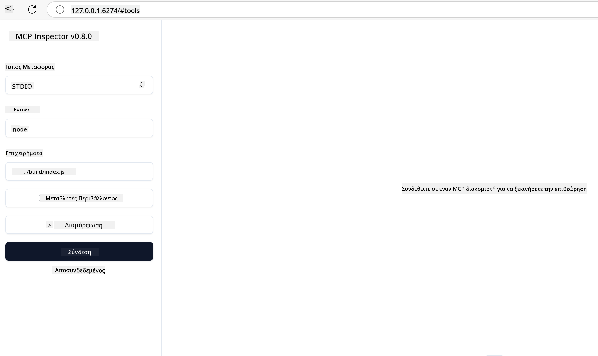

<!--
CO_OP_TRANSLATOR_METADATA:
{
  "original_hash": "717f34718a773f6cf52d8445e40a96bf",
  "translation_date": "2025-05-17T12:43:24+00:00",
  "source_file": "03-GettingStarted/07-testing/README.md",
  "language_code": "el"
}
-->
## Δοκιμή και Εντοπισμός Σφαλμάτων

Πριν ξεκινήσετε να δοκιμάζετε τον διακομιστή MCP σας, είναι σημαντικό να κατανοήσετε τα διαθέσιμα εργαλεία και τις βέλτιστες πρακτικές για τον εντοπισμό σφαλμάτων. Η αποτελεσματική δοκιμή διασφαλίζει ότι ο διακομιστής σας λειτουργεί όπως αναμένεται και σας βοηθά να εντοπίζετε και να επιλύετε προβλήματα γρήγορα. Η ακόλουθη ενότητα περιγράφει τις προτεινόμενες προσεγγίσεις για την επαλήθευση της υλοποίησης του MCP σας.

## Επισκόπηση

Αυτό το μάθημα καλύπτει πώς να επιλέξετε τη σωστή προσέγγιση δοκιμής και το πιο αποτελεσματικό εργαλείο δοκιμής.

## Στόχοι Μάθησης

Μέχρι το τέλος αυτού του μαθήματος, θα μπορείτε να:

- Περιγράψετε διάφορες προσεγγίσεις για δοκιμή.
- Χρησιμοποιείτε διαφορετικά εργαλεία για να δοκιμάσετε αποτελεσματικά τον κώδικά σας.

## Δοκιμή Διακομιστών MCP

Το MCP παρέχει εργαλεία που σας βοηθούν να δοκιμάσετε και να εντοπίσετε σφάλματα στους διακομιστές σας:

- **MCP Inspector**: Ένα εργαλείο γραμμής εντολών που μπορεί να εκτελεστεί τόσο ως εργαλείο CLI όσο και ως οπτικό εργαλείο.
- **Χειροκίνητη δοκιμή**: Μπορείτε να χρησιμοποιήσετε ένα εργαλείο όπως το curl για να εκτελέσετε αιτήματα ιστού, αλλά οποιοδήποτε εργαλείο ικανό να εκτελεί HTTP θα κάνει τη δουλειά.
- **Μονάδα δοκιμής**: Είναι δυνατό να χρησιμοποιήσετε το αγαπημένο σας πλαίσιο δοκιμής για να δοκιμάσετε τις λειτουργίες τόσο του διακομιστή όσο και του πελάτη.

### Χρήση MCP Inspector

Έχουμε περιγράψει τη χρήση αυτού του εργαλείου σε προηγούμενα μαθήματα, αλλά ας μιλήσουμε λίγο για αυτό σε υψηλό επίπεδο. Είναι ένα εργαλείο κατασκευασμένο σε Node.js και μπορείτε να το χρησιμοποιήσετε καλώντας το `npx` εκτελέσιμο, το οποίο θα κατεβάσει και θα εγκαταστήσει το εργαλείο προσωρινά και θα καθαριστεί μόλις ολοκληρώσει την εκτέλεση του αιτήματός σας.

Το [MCP Inspector](https://github.com/modelcontextprotocol/inspector) σας βοηθά:

- **Ανακάλυψη Δυνατοτήτων Διακομιστή**: Ανίχνευση διαθέσιμων πόρων, εργαλείων και προτροπών αυτόματα
- **Δοκιμή Εκτέλεσης Εργαλείων**: Δοκιμάστε διαφορετικές παραμέτρους και δείτε τις απαντήσεις σε πραγματικό χρόνο
- **Προβολή Μεταδεδομένων Διακομιστή**: Εξετάστε πληροφορίες διακομιστή, σχήματα και διαμορφώσεις

Μια τυπική εκτέλεση του εργαλείου μοιάζει έτσι:

```bash
npx @modelcontextprotocol/inspector node build/index.js
```

Η παραπάνω εντολή ξεκινά ένα MCP και τη οπτική του διεπαφή και εκκινεί μια τοπική διεπαφή ιστού στο πρόγραμμα περιήγησής σας. Μπορείτε να περιμένετε να δείτε έναν πίνακα που εμφανίζει τους εγγεγραμμένους διακομιστές MCP σας, τα διαθέσιμα εργαλεία, πόρους και προτροπές. Η διεπαφή σας επιτρέπει να δοκιμάσετε διαδραστικά την εκτέλεση εργαλείων, να εξετάσετε μεταδεδομένα διακομιστή και να δείτε απαντήσεις σε πραγματικό χρόνο, κάνοντας ευκολότερη την επαλήθευση και τον εντοπισμό σφαλμάτων στις υλοποιήσεις διακομιστή MCP σας.

Δείτε πώς μπορεί να μοιάζει: 

Μπορείτε επίσης να εκτελέσετε αυτό το εργαλείο σε λειτουργία CLI, προσθέτοντας το χαρακτηριστικό `--cli`. Δείτε ένα παράδειγμα εκτέλεσης του εργαλείου σε "CLI" λειτουργία που καταγράφει όλα τα εργαλεία στον διακομιστή:

```sh
npx @modelcontextprotocol/inspector --cli node build/index.js --method tools/list
```

### Χειροκίνητη Δοκιμή

Εκτός από την εκτέλεση του εργαλείου επιθεώρησης για τη δοκιμή των δυνατοτήτων του διακομιστή, μια άλλη παρόμοια προσέγγιση είναι να εκτελέσετε έναν πελάτη που μπορεί να χρησιμοποιήσει HTTP όπως για παράδειγμα το curl.

Με το curl, μπορείτε να δοκιμάσετε διακομιστές MCP απευθείας χρησιμοποιώντας αιτήματα HTTP:

```bash
# Example: Test server metadata
curl http://localhost:3000/v1/metadata

# Example: Execute a tool
curl -X POST http://localhost:3000/v1/tools/execute \
  -H "Content-Type: application/json" \
  -d '{"name": "calculator", "parameters": {"expression": "2+2"}}'
```

Όπως μπορείτε να δείτε από την παραπάνω χρήση του curl, χρησιμοποιείτε ένα αίτημα POST για να καλέσετε ένα εργαλείο χρησιμοποιώντας ένα φορτίο που αποτελείται από το όνομα του εργαλείου και τις παραμέτρους του. Χρησιμοποιήστε την προσέγγιση που σας ταιριάζει καλύτερα. Τα εργαλεία CLI γενικά τείνουν να είναι πιο γρήγορα στη χρήση και προσφέρονται για να γίνουν script, κάτι που μπορεί να είναι χρήσιμο σε περιβάλλον CI/CD.

### Μονάδα Δοκιμής

Δημιουργήστε δοκιμές μονάδας για τα εργαλεία και τους πόρους σας για να διασφαλίσετε ότι λειτουργούν όπως αναμένεται. Δείτε κάποιο παράδειγμα κώδικα δοκιμής.

```python
import pytest

from mcp.server.fastmcp import FastMCP
from mcp.shared.memory import (
    create_connected_server_and_client_session as create_session,
)

# Mark the whole module for async tests
pytestmark = pytest.mark.anyio


async def test_list_tools_cursor_parameter():
    """Test that the cursor parameter is accepted for list_tools.

    Note: FastMCP doesn't currently implement pagination, so this test
    only verifies that the cursor parameter is accepted by the client.
    """

 server = FastMCP("test")

    # Create a couple of test tools
    @server.tool(name="test_tool_1")
    async def test_tool_1() -> str:
        """First test tool"""
        return "Result 1"

    @server.tool(name="test_tool_2")
    async def test_tool_2() -> str:
        """Second test tool"""
        return "Result 2"

    async with create_session(server._mcp_server) as client_session:
        # Test without cursor parameter (omitted)
        result1 = await client_session.list_tools()
        assert len(result1.tools) == 2

        # Test with cursor=None
        result2 = await client_session.list_tools(cursor=None)
        assert len(result2.tools) == 2

        # Test with cursor as string
        result3 = await client_session.list_tools(cursor="some_cursor_value")
        assert len(result3.tools) == 2

        # Test with empty string cursor
        result4 = await client_session.list_tools(cursor="")
        assert len(result4.tools) == 2
    
```

Ο παραπάνω κώδικας κάνει τα εξής:

- Αξιοποιεί το πλαίσιο pytest που σας επιτρέπει να δημιουργείτε δοκιμές ως συναρτήσεις και να χρησιμοποιείτε δηλώσεις assert.
- Δημιουργεί έναν διακομιστή MCP με δύο διαφορετικά εργαλεία.
- Χρησιμοποιεί τη δήλωση `assert` για να ελέγξει ότι πληρούνται ορισμένες συνθήκες.

Δείτε το [πλήρες αρχείο εδώ](https://github.com/modelcontextprotocol/python-sdk/blob/main/tests/client/test_list_methods_cursor.py)

Δεδομένου του παραπάνω αρχείου, μπορείτε να δοκιμάσετε τον δικό σας διακομιστή για να διασφαλίσετε ότι οι δυνατότητες δημιουργούνται όπως πρέπει.

Όλα τα κύρια SDK έχουν παρόμοια τμήματα δοκιμής, ώστε να μπορείτε να προσαρμοστείτε στο επιλεγμένο περιβάλλον εκτέλεσης.

## Δείγματα

- [Java Calculator](../samples/java/calculator/README.md)
- [.Net Calculator](../../../../03-GettingStarted/samples/csharp)
- [JavaScript Calculator](../samples/javascript/README.md)
- [TypeScript Calculator](../samples/typescript/README.md)
- [Python Calculator](../../../../03-GettingStarted/samples/python)

## Πρόσθετοι Πόροι

- [Python SDK](https://github.com/modelcontextprotocol/python-sdk)

## Τι Ακολουθεί

- Επόμενο: [Ανάπτυξη](/03-GettingStarted/08-deployment/README.md)

**Αποποίηση ευθύνης**: 
Αυτό το έγγραφο έχει μεταφραστεί χρησιμοποιώντας την υπηρεσία μετάφρασης AI [Co-op Translator](https://github.com/Azure/co-op-translator). Ενώ επιδιώκουμε την ακρίβεια, παρακαλώ σημειώστε ότι οι αυτοματοποιημένες μεταφράσεις μπορεί να περιέχουν λάθη ή ανακρίβειες. Το πρωτότυπο έγγραφο στη μητρική του γλώσσα θα πρέπει να θεωρείται η αυθεντική πηγή. Για κρίσιμες πληροφορίες, συνιστάται επαγγελματική ανθρώπινη μετάφραση. Δεν φέρουμε ευθύνη για τυχόν παρεξηγήσεις ή παρερμηνείες που προκύπτουν από τη χρήση αυτής της μετάφρασης.