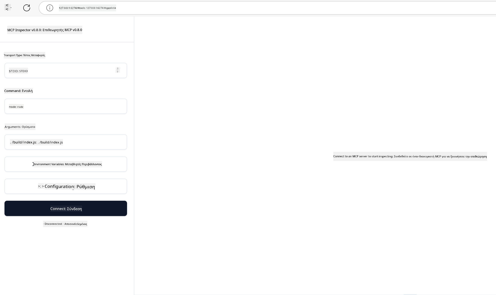

<!--
CO_OP_TRANSLATOR_METADATA:
{
  "original_hash": "4e34e34e84f013e73c7eaa6d09884756",
  "translation_date": "2025-07-13T22:00:36+00:00",
  "source_file": "03-GettingStarted/08-testing/README.md",
  "language_code": "el"
}
-->
## Testing and Debugging

Πριν ξεκινήσετε να δοκιμάζετε τον MCP server σας, είναι σημαντικό να κατανοήσετε τα διαθέσιμα εργαλεία και τις βέλτιστες πρακτικές για τον εντοπισμό σφαλμάτων. Η αποτελεσματική δοκιμή διασφαλίζει ότι ο server σας λειτουργεί όπως αναμένεται και σας βοηθά να εντοπίσετε και να επιλύσετε γρήγορα τυχόν προβλήματα. Η παρακάτω ενότητα περιγράφει τις προτεινόμενες μεθόδους για την επικύρωση της υλοποίησης του MCP σας.

## Overview

Αυτό το μάθημα καλύπτει πώς να επιλέξετε τη σωστή προσέγγιση δοκιμών και το πιο αποτελεσματικό εργαλείο δοκιμών.

## Learning Objectives

Στο τέλος αυτού του μαθήματος, θα μπορείτε να:

- Περιγράψετε διάφορες προσεγγίσεις για τη δοκιμή.
- Χρησιμοποιήσετε διαφορετικά εργαλεία για να δοκιμάσετε αποτελεσματικά τον κώδικά σας.

## Testing MCP Servers

Το MCP παρέχει εργαλεία που σας βοηθούν να δοκιμάσετε και να εντοπίσετε σφάλματα στους servers σας:

- **MCP Inspector**: Ένα εργαλείο γραμμής εντολών που μπορεί να τρέξει τόσο ως CLI εργαλείο όσο και ως οπτικό εργαλείο.
- **Manual testing**: Μπορείτε να χρησιμοποιήσετε ένα εργαλείο όπως το curl για να εκτελέσετε web αιτήματα, αλλά οποιοδήποτε εργαλείο μπορεί να εκτελέσει HTTP είναι κατάλληλο.
- **Unit testing**: Είναι δυνατό να χρησιμοποιήσετε το προτιμώμενο πλαίσιο δοκιμών σας για να ελέγξετε τις λειτουργίες τόσο του server όσο και του client.

### Using MCP Inspector

Έχουμε περιγράψει τη χρήση αυτού του εργαλείου σε προηγούμενα μαθήματα, αλλά ας το συζητήσουμε συνοπτικά. Είναι ένα εργαλείο κατασκευασμένο σε Node.js και μπορείτε να το χρησιμοποιήσετε καλώντας το εκτελέσιμο `npx`, το οποίο θα κατεβάσει και θα εγκαταστήσει προσωρινά το εργαλείο και θα καθαρίσει τα αρχεία του μόλις ολοκληρωθεί η εκτέλεση του αιτήματός σας.

Το [MCP Inspector](https://github.com/modelcontextprotocol/inspector) σας βοηθά να:

- **Ανακαλύψετε τις δυνατότητες του Server**: Αυτόματη ανίχνευση διαθέσιμων πόρων, εργαλείων και προτροπών
- **Δοκιμάσετε την εκτέλεση εργαλείων**: Δοκιμάστε διαφορετικές παραμέτρους και δείτε τις απαντήσεις σε πραγματικό χρόνο
- **Δείτε τα μεταδεδομένα του Server**: Εξετάστε πληροφορίες server, σχήματα και ρυθμίσεις

Μια τυπική εκτέλεση του εργαλείου μοιάζει ως εξής:

```bash
npx @modelcontextprotocol/inspector node build/index.js
```

Η παραπάνω εντολή ξεκινά έναν MCP και το οπτικό του περιβάλλον και ανοίγει μια τοπική web διεπαφή στον browser σας. Μπορείτε να περιμένετε να δείτε έναν πίνακα ελέγχου που εμφανίζει τους καταχωρημένους MCP servers σας, τα διαθέσιμα εργαλεία, πόρους και προτροπές τους. Η διεπαφή σας επιτρέπει να δοκιμάσετε διαδραστικά την εκτέλεση εργαλείων, να ελέγξετε τα μεταδεδομένα του server και να δείτε απαντήσεις σε πραγματικό χρόνο, καθιστώντας πιο εύκολη την επικύρωση και τον εντοπισμό σφαλμάτων στις υλοποιήσεις MCP server σας.

Έτσι μπορεί να μοιάζει: 

Μπορείτε επίσης να τρέξετε αυτό το εργαλείο σε λειτουργία CLI, προσθέτοντας την παράμετρο `--cli`. Ακολουθεί ένα παράδειγμα εκτέλεσης του εργαλείου σε λειτουργία "CLI" που εμφανίζει όλα τα εργαλεία στον server:

```sh
npx @modelcontextprotocol/inspector --cli node build/index.js --method tools/list
```

### Manual Testing

Εκτός από τη χρήση του εργαλείου inspector για να δοκιμάσετε τις δυνατότητες του server, μια άλλη παρόμοια προσέγγιση είναι να τρέξετε έναν client που μπορεί να χρησιμοποιήσει HTTP, όπως για παράδειγμα το curl.

Με το curl, μπορείτε να δοκιμάσετε απευθείας MCP servers χρησιμοποιώντας HTTP αιτήματα:

```bash
# Example: Test server metadata
curl http://localhost:3000/v1/metadata

# Example: Execute a tool
curl -X POST http://localhost:3000/v1/tools/execute \
  -H "Content-Type: application/json" \
  -d '{"name": "calculator", "parameters": {"expression": "2+2"}}'
```

Όπως φαίνεται από τη χρήση του curl παραπάνω, χρησιμοποιείτε ένα POST αίτημα για να καλέσετε ένα εργαλείο με ένα payload που περιλαμβάνει το όνομα του εργαλείου και τις παραμέτρους του. Χρησιμοποιήστε την προσέγγιση που σας ταιριάζει καλύτερα. Τα εργαλεία CLI γενικά είναι πιο γρήγορα στη χρήση και μπορούν να αυτοματοποιηθούν, κάτι που είναι χρήσιμο σε περιβάλλον CI/CD.

### Unit Testing

Δημιουργήστε unit tests για τα εργαλεία και τους πόρους σας ώστε να διασφαλίσετε ότι λειτουργούν όπως αναμένεται. Ακολουθεί ένα παράδειγμα κώδικα δοκιμών.

```python
import pytest

from mcp.server.fastmcp import FastMCP
from mcp.shared.memory import (
    create_connected_server_and_client_session as create_session,
)

# Mark the whole module for async tests
pytestmark = pytest.mark.anyio


async def test_list_tools_cursor_parameter():
    """Test that the cursor parameter is accepted for list_tools.

    Note: FastMCP doesn't currently implement pagination, so this test
    only verifies that the cursor parameter is accepted by the client.
    """

 server = FastMCP("test")

    # Create a couple of test tools
    @server.tool(name="test_tool_1")
    async def test_tool_1() -> str:
        """First test tool"""
        return "Result 1"

    @server.tool(name="test_tool_2")
    async def test_tool_2() -> str:
        """Second test tool"""
        return "Result 2"

    async with create_session(server._mcp_server) as client_session:
        # Test without cursor parameter (omitted)
        result1 = await client_session.list_tools()
        assert len(result1.tools) == 2

        # Test with cursor=None
        result2 = await client_session.list_tools(cursor=None)
        assert len(result2.tools) == 2

        # Test with cursor as string
        result3 = await client_session.list_tools(cursor="some_cursor_value")
        assert len(result3.tools) == 2

        # Test with empty string cursor
        result4 = await client_session.list_tools(cursor="")
        assert len(result4.tools) == 2
    
```

Ο παραπάνω κώδικας κάνει τα εξής:

- Χρησιμοποιεί το πλαίσιο pytest που σας επιτρέπει να δημιουργείτε δοκιμές ως συναρτήσεις και να χρησιμοποιείτε δηλώσεις assert.
- Δημιουργεί έναν MCP Server με δύο διαφορετικά εργαλεία.
- Χρησιμοποιεί τη δήλωση `assert` για να ελέγξει ότι πληρούνται ορισμένες προϋποθέσεις.

Ρίξτε μια ματιά στο [πλήρες αρχείο εδώ](https://github.com/modelcontextprotocol/python-sdk/blob/main/tests/client/test_list_methods_cursor.py)

Με βάση το παραπάνω αρχείο, μπορείτε να δοκιμάσετε τον δικό σας server για να βεβαιωθείτε ότι οι δυνατότητες δημιουργούνται όπως πρέπει.

Όλα τα σημαντικά SDK έχουν παρόμοιες ενότητες δοκιμών, ώστε να μπορείτε να προσαρμοστείτε στο runtime που έχετε επιλέξει.

## Samples 

- [Java Calculator](../samples/java/calculator/README.md)
- [.Net Calculator](../../../../03-GettingStarted/samples/csharp)
- [JavaScript Calculator](../samples/javascript/README.md)
- [TypeScript Calculator](../samples/typescript/README.md)
- [Python Calculator](../../../../03-GettingStarted/samples/python) 

## Additional Resources

- [Python SDK](https://github.com/modelcontextprotocol/python-sdk)

## What's Next

- Next: [Deployment](../09-deployment/README.md)

**Αποποίηση ευθυνών**:  
Αυτό το έγγραφο έχει μεταφραστεί χρησιμοποιώντας την υπηρεσία αυτόματης μετάφρασης AI [Co-op Translator](https://github.com/Azure/co-op-translator). Παρόλο που επιδιώκουμε την ακρίβεια, παρακαλούμε να έχετε υπόψη ότι οι αυτόματες μεταφράσεις ενδέχεται να περιέχουν λάθη ή ανακρίβειες. Το πρωτότυπο έγγραφο στη γλώσσα του θεωρείται η αυθεντική πηγή. Για κρίσιμες πληροφορίες, συνιστάται επαγγελματική ανθρώπινη μετάφραση. Δεν φέρουμε ευθύνη για τυχόν παρεξηγήσεις ή λανθασμένες ερμηνείες που προκύπτουν από τη χρήση αυτής της μετάφρασης.