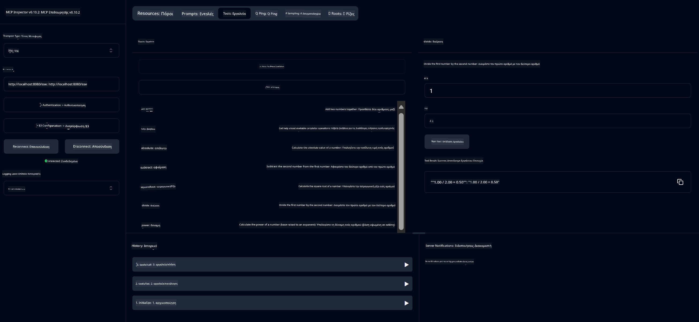

<!--
CO_OP_TRANSLATOR_METADATA:
{
  "original_hash": "13231e9951b68efd9df8c56bd5cdb27e",
  "translation_date": "2025-07-13T22:26:53+00:00",
  "source_file": "03-GettingStarted/samples/java/calculator/README.md",
  "language_code": "el"
}
-->
# Basic Calculator MCP Service

Αυτή η υπηρεσία παρέχει βασικές λειτουργίες αριθμομηχανής μέσω του Model Context Protocol (MCP) χρησιμοποιώντας Spring Boot με μεταφορά WebFlux. Έχει σχεδιαστεί ως ένα απλό παράδειγμα για αρχάριους που μαθαίνουν για υλοποιήσεις MCP.

Για περισσότερες πληροφορίες, δείτε την τεκμηρίωση αναφοράς [MCP Server Boot Starter](https://docs.spring.io/spring-ai/reference/api/mcp/mcp-server-boot-starter-docs.html).

## Επισκόπηση

Η υπηρεσία παρουσιάζει:
- Υποστήριξη για SSE (Server-Sent Events)
- Αυτόματη εγγραφή εργαλείων με τη χρήση της σημείωσης `@Tool` του Spring AI
- Βασικές λειτουργίες αριθμομηχανής:
  - Πρόσθεση, αφαίρεση, πολλαπλασιασμός, διαίρεση
  - Υπολογισμός δύναμης και τετραγωνική ρίζα
  - Υπολογισμός υπολοίπου (modulus) και απόλυτης τιμής
  - Συνάρτηση βοήθειας για περιγραφές λειτουργιών

## Χαρακτηριστικά

Αυτή η υπηρεσία αριθμομηχανής προσφέρει τις εξής δυνατότητες:

1. **Βασικές Αριθμητικές Λειτουργίες**:
   - Πρόσθεση δύο αριθμών
   - Αφαίρεση ενός αριθμού από έναν άλλο
   - Πολλαπλασιασμός δύο αριθμών
   - Διαίρεση ενός αριθμού με έναν άλλο (με έλεγχο διαίρεσης με το μηδέν)

2. **Προχωρημένες Λειτουργίες**:
   - Υπολογισμός δύναμης (ανύψωση βάσης σε εκθέτη)
   - Υπολογισμός τετραγωνικής ρίζας (με έλεγχο αρνητικού αριθμού)
   - Υπολογισμός υπολοίπου (modulus)
   - Υπολογισμός απόλυτης τιμής

3. **Σύστημα Βοήθειας**:
   - Ενσωματωμένη συνάρτηση βοήθειας που εξηγεί όλες τις διαθέσιμες λειτουργίες

## Χρήση της Υπηρεσίας

Η υπηρεσία εκθέτει τα παρακάτω API endpoints μέσω του πρωτοκόλλου MCP:

- `add(a, b)`: Προσθέτει δύο αριθμούς
- `subtract(a, b)`: Αφαιρεί τον δεύτερο αριθμό από τον πρώτο
- `multiply(a, b)`: Πολλαπλασιάζει δύο αριθμούς
- `divide(a, b)`: Διαιρεί τον πρώτο αριθμό με τον δεύτερο (με έλεγχο μηδενικής διαίρεσης)
- `power(base, exponent)`: Υπολογίζει τη δύναμη ενός αριθμού
- `squareRoot(number)`: Υπολογίζει την τετραγωνική ρίζα (με έλεγχο αρνητικού αριθμού)
- `modulus(a, b)`: Υπολογίζει το υπόλοιπο της διαίρεσης
- `absolute(number)`: Υπολογίζει την απόλυτη τιμή
- `help()`: Παρέχει πληροφορίες για τις διαθέσιμες λειτουργίες

## Πελάτης Δοκιμής

Ένας απλός πελάτης δοκιμής περιλαμβάνεται στο πακέτο `com.microsoft.mcp.sample.client`. Η κλάση `SampleCalculatorClient` δείχνει τις διαθέσιμες λειτουργίες της υπηρεσίας αριθμομηχανής.

## Χρήση του LangChain4j Client

Το έργο περιλαμβάνει ένα παράδειγμα πελάτη LangChain4j στο `com.microsoft.mcp.sample.client.LangChain4jClient` που δείχνει πώς να ενσωματώσετε την υπηρεσία αριθμομηχανής με το LangChain4j και τα μοντέλα GitHub:

### Προαπαιτούμενα

1. **Ρύθμιση GitHub Token**:
   
   Για να χρησιμοποιήσετε τα AI μοντέλα του GitHub (όπως το phi-4), χρειάζεστε ένα προσωπικό access token του GitHub:

   α. Μεταβείτε στις ρυθμίσεις του λογαριασμού σας στο GitHub: https://github.com/settings/tokens
   
   β. Κάντε κλικ στο "Generate new token" → "Generate new token (classic)"
   
   γ. Δώστε στο token σας ένα περιγραφικό όνομα
   
   δ. Επιλέξτε τα παρακάτω δικαιώματα:
      - `repo` (Πλήρης έλεγχος ιδιωτικών αποθετηρίων)
      - `read:org` (Ανάγνωση οργανισμού και ομάδων, ανάγνωση έργων οργανισμού)
      - `gist` (Δημιουργία gists)
      - `user:email` (Πρόσβαση σε διευθύνσεις email χρήστη (μόνο ανάγνωση))
   
   ε. Κάντε κλικ στο "Generate token" και αντιγράψτε το νέο token
   
   στ. Ορίστε το ως μεταβλητή περιβάλλοντος:
      
      Σε Windows:
      ```
      set GITHUB_TOKEN=your-github-token
      ```
      
      Σε macOS/Linux:
      ```bash
      export GITHUB_TOKEN=your-github-token
      ```

   ζ. Για μόνιμη ρύθμιση, προσθέστε το στις μεταβλητές περιβάλλοντος μέσω των ρυθμίσεων συστήματος

2. Προσθέστε την εξάρτηση LangChain4j GitHub στο έργο σας (ήδη περιλαμβάνεται στο pom.xml):
   ```xml
   <dependency>
       <groupId>dev.langchain4j</groupId>
       <artifactId>langchain4j-github</artifactId>
       <version>${langchain4j.version}</version>
   </dependency>
   ```

3. Βεβαιωθείτε ότι ο διακομιστής αριθμομηχανής τρέχει στο `localhost:8080`

### Εκτέλεση του LangChain4j Client

Αυτό το παράδειγμα δείχνει:
- Σύνδεση με τον MCP server της αριθμομηχανής μέσω μεταφοράς SSE
- Χρήση του LangChain4j για δημιουργία chat bot που αξιοποιεί τις λειτουργίες της αριθμομηχανής
- Ενσωμάτωση με τα AI μοντέλα του GitHub (τώρα χρησιμοποιώντας το μοντέλο phi-4)

Ο πελάτης στέλνει τα παρακάτω δείγματα ερωτημάτων για να δείξει τη λειτουργικότητα:
1. Υπολογισμός αθροίσματος δύο αριθμών
2. Εύρεση τετραγωνικής ρίζας ενός αριθμού
3. Λήψη πληροφοριών βοήθειας για τις διαθέσιμες λειτουργίες αριθμομηχανής

Τρέξτε το παράδειγμα και ελέγξτε την έξοδο στην κονσόλα για να δείτε πώς το AI μοντέλο χρησιμοποιεί τα εργαλεία της αριθμομηχανής για να απαντήσει στα ερωτήματα.

### Ρύθμιση Μοντέλου GitHub

Ο πελάτης LangChain4j έχει ρυθμιστεί να χρησιμοποιεί το μοντέλο phi-4 του GitHub με τις εξής ρυθμίσεις:

```java
ChatLanguageModel model = GitHubChatModel.builder()
    .apiKey(System.getenv("GITHUB_TOKEN"))
    .timeout(Duration.ofSeconds(60))
    .modelName("phi-4")
    .logRequests(true)
    .logResponses(true)
    .build();
```

Για να χρησιμοποιήσετε άλλα μοντέλα GitHub, απλά αλλάξτε την παράμετρο `modelName` σε κάποιο άλλο υποστηριζόμενο μοντέλο (π.χ. "claude-3-haiku-20240307", "llama-3-70b-8192", κ.ά.).

## Εξαρτήσεις

Το έργο απαιτεί τις παρακάτω βασικές εξαρτήσεις:

```xml
<!-- For MCP Server -->
<dependency>
    <groupId>org.springframework.ai</groupId>
    <artifactId>spring-ai-starter-mcp-server-webflux</artifactId>
</dependency>

<!-- For LangChain4j integration -->
<dependency>
    <groupId>dev.langchain4j</groupId>
    <artifactId>langchain4j-mcp</artifactId>
    <version>${langchain4j.version}</version>
</dependency>

<!-- For GitHub models support -->
<dependency>
    <groupId>dev.langchain4j</groupId>
    <artifactId>langchain4j-github</artifactId>
    <version>${langchain4j.version}</version>
</dependency>
```

## Δημιουργία του Έργου

Δημιουργήστε το έργο χρησιμοποιώντας Maven:
```bash
./mvnw clean install -DskipTests
```

## Εκτέλεση του Διακομιστή

### Χρήση Java

```bash
java -jar target/calculator-server-0.0.1-SNAPSHOT.jar
```

### Χρήση MCP Inspector

Ο MCP Inspector είναι ένα χρήσιμο εργαλείο για αλληλεπίδραση με υπηρεσίες MCP. Για να το χρησιμοποιήσετε με αυτήν την υπηρεσία αριθμομηχανής:

1. **Εγκαταστήστε και τρέξτε τον MCP Inspector** σε νέο παράθυρο τερματικού:
   ```bash
   npx @modelcontextprotocol/inspector
   ```

2. **Πρόσβαση στο web UI** κάνοντας κλικ στο URL που εμφανίζει η εφαρμογή (συνήθως http://localhost:6274)

3. **Ρύθμιση σύνδεσης**:
   - Ορίστε τον τύπο μεταφοράς σε "SSE"
   - Ορίστε το URL στο endpoint SSE του τρέχοντος διακομιστή: `http://localhost:8080/sse`
   - Κάντε κλικ στο "Connect"

4. **Χρήση εργαλείων**:
   - Κάντε κλικ στο "List Tools" για να δείτε τις διαθέσιμες λειτουργίες αριθμομηχανής
   - Επιλέξτε ένα εργαλείο και πατήστε "Run Tool" για να εκτελέσετε μια λειτουργία



### Χρήση Docker

Το έργο περιλαμβάνει ένα Dockerfile για ανάπτυξη σε container:

1. **Δημιουργία Docker image**:
   ```bash
   docker build -t calculator-mcp-service .
   ```

2. **Εκτέλεση Docker container**:
   ```bash
   docker run -p 8080:8080 calculator-mcp-service
   ```

Αυτό θα:
- Δημιουργήσει ένα multi-stage Docker image με Maven 3.9.9 και Eclipse Temurin 24 JDK
- Δημιουργήσει ένα βελτιστοποιημένο container image
- Εκθέσει την υπηρεσία στην πόρτα 8080
- Ξεκινήσει την υπηρεσία αριθμομηχανής MCP μέσα στο container

Μπορείτε να έχετε πρόσβαση στην υπηρεσία στο `http://localhost:8080` μόλις το container τρέξει.

## Αντιμετώπιση Προβλημάτων

### Συνηθισμένα Προβλήματα με το GitHub Token

1. **Προβλήματα Δικαιωμάτων Token**: Αν λάβετε σφάλμα 403 Forbidden, ελέγξτε ότι το token έχει τα σωστά δικαιώματα όπως περιγράφονται στα προαπαιτούμενα.

2. **Token Δεν Βρέθηκε**: Αν λάβετε σφάλμα "No API key found", βεβαιωθείτε ότι η μεταβλητή περιβάλλοντος GITHUB_TOKEN έχει οριστεί σωστά.

3. **Περιορισμοί Ρυθμού (Rate Limiting)**: Το GitHub API έχει όρια χρήσης. Αν συναντήσετε σφάλμα περιορισμού (κωδικός 429), περιμένετε λίγα λεπτά πριν δοκιμάσετε ξανά.

4. **Λήξη Token**: Τα tokens του GitHub μπορεί να λήξουν. Αν λάβετε σφάλματα αυθεντικοποίησης μετά από κάποιο διάστημα, δημιουργήστε νέο token και ενημερώστε τη μεταβλητή περιβάλλοντος.

Αν χρειάζεστε περαιτέρω βοήθεια, δείτε την [τεκμηρίωση LangChain4j](https://github.com/langchain4j/langchain4j) ή την [τεκμηρίωση GitHub API](https://docs.github.com/en/rest).

**Αποποίηση ευθυνών**:  
Αυτό το έγγραφο έχει μεταφραστεί χρησιμοποιώντας την υπηρεσία αυτόματης μετάφρασης AI [Co-op Translator](https://github.com/Azure/co-op-translator). Παρόλο που επιδιώκουμε την ακρίβεια, παρακαλούμε να έχετε υπόψη ότι οι αυτόματες μεταφράσεις ενδέχεται να περιέχουν λάθη ή ανακρίβειες. Το πρωτότυπο έγγραφο στη γλώσσα του θεωρείται η επίσημη πηγή. Για κρίσιμες πληροφορίες, συνιστάται επαγγελματική ανθρώπινη μετάφραση. Δεν φέρουμε ευθύνη για τυχόν παρεξηγήσεις ή λανθασμένες ερμηνείες που προκύπτουν από τη χρήση αυτής της μετάφρασης.