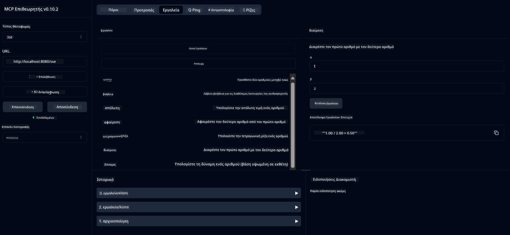

<!--
CO_OP_TRANSLATOR_METADATA:
{
  "original_hash": "13231e9951b68efd9df8c56bd5cdb27e",
  "translation_date": "2025-05-17T13:11:12+00:00",
  "source_file": "03-GettingStarted/samples/java/calculator/README.md",
  "language_code": "el"
}
-->
# Βασική Υπηρεσία Αριθμομηχανής MCP

Αυτή η υπηρεσία παρέχει βασικές λειτουργίες αριθμομηχανής μέσω του Model Context Protocol (MCP) χρησιμοποιώντας το Spring Boot με μεταφορά WebFlux. Έχει σχεδιαστεί ως ένα απλό παράδειγμα για αρχάριους που μαθαίνουν για τις υλοποιήσεις MCP.

Για περισσότερες πληροφορίες, δείτε την αναφορά τεκμηρίωσης [MCP Server Boot Starter](https://docs.spring.io/spring-ai/reference/api/mcp/mcp-server-boot-starter-docs.html).

## Επισκόπηση

Η υπηρεσία παρουσιάζει:
- Υποστήριξη για SSE (Server-Sent Events)
- Αυτόματη εγγραφή εργαλείων χρησιμοποιώντας την `@Tool` αναφορά του Spring AI
- Βασικές λειτουργίες αριθμομηχανής:
  - Πρόσθεση, αφαίρεση, πολλαπλασιασμός, διαίρεση
  - Υπολογισμός δύναμης και τετραγωνικής ρίζας
  - Υπολογισμός υπολοίπου (modulus) και απόλυτης τιμής
  - Λειτουργία βοήθειας για περιγραφές λειτουργιών

## Χαρακτηριστικά

Αυτή η υπηρεσία αριθμομηχανής προσφέρει τις ακόλουθες δυνατότητες:

1. **Βασικές Αριθμητικές Λειτουργίες**:
   - Πρόσθεση δύο αριθμών
   - Αφαίρεση ενός αριθμού από έναν άλλο
   - Πολλαπλασιασμός δύο αριθμών
   - Διαίρεση ενός αριθμού με έναν άλλο (με έλεγχο διαίρεσης με μηδέν)

2. **Προχωρημένες Λειτουργίες**:
   - Υπολογισμός δύναμης (ανύψωση βάσης σε εκθέτη)
   - Υπολογισμός τετραγωνικής ρίζας (με έλεγχο αρνητικού αριθμού)
   - Υπολογισμός υπολοίπου (modulus)
   - Υπολογισμός απόλυτης τιμής

3. **Σύστημα Βοήθειας**:
   - Ενσωματωμένη λειτουργία βοήθειας που εξηγεί όλες τις διαθέσιμες λειτουργίες

## Χρήση της Υπηρεσίας

Η υπηρεσία εκθέτει τα ακόλουθα API endpoints μέσω του πρωτοκόλλου MCP:

- `add(a, b)`: Προσθέστε δύο αριθμούς μαζί
- `subtract(a, b)`: Αφαιρέστε τον δεύτερο αριθμό από τον πρώτο
- `multiply(a, b)`: Πολλαπλασιάστε δύο αριθμούς
- `divide(a, b)`: Διαιρέστε τον πρώτο αριθμό με τον δεύτερο (με έλεγχο μηδέν)
- `power(base, exponent)`: Υπολογίστε τη δύναμη ενός αριθμού
- `squareRoot(number)`: Υπολογίστε την τετραγωνική ρίζα (με έλεγχο αρνητικού αριθμού)
- `modulus(a, b)`: Υπολογίστε το υπόλοιπο κατά τη διαίρεση
- `absolute(number)`: Υπολογίστε την απόλυτη τιμή
- `help()`: Λάβετε πληροφορίες για τις διαθέσιμες λειτουργίες

## Πελάτης Δοκιμών

Περιλαμβάνεται ένας απλός πελάτης δοκιμών στο πακέτο `com.microsoft.mcp.sample.client`. Η κλάση `SampleCalculatorClient` παρουσιάζει τις διαθέσιμες λειτουργίες της υπηρεσίας αριθμομηχανής.

## Χρήση του LangChain4j Πελάτη

Το έργο περιλαμβάνει ένα παράδειγμα πελάτη LangChain4j στο `com.microsoft.mcp.sample.client.LangChain4jClient` που δείχνει πώς να ενσωματώσετε την υπηρεσία αριθμομηχανής με τα μοντέλα LangChain4j και GitHub:

### Προαπαιτούμενα

1. **Ρύθμιση Token GitHub**:
   
   Για να χρησιμοποιήσετε τα μοντέλα AI του GitHub (όπως το phi-4), χρειάζεστε ένα προσωπικό token πρόσβασης GitHub:

   α. Μεταβείτε στις ρυθμίσεις του λογαριασμού σας στο GitHub: https://github.com/settings/tokens
   
   β. Κάντε κλικ στο "Generate new token" → "Generate new token (classic)"
   
   γ. Δώστε στο token σας ένα περιγραφικό όνομα
   
   δ. Επιλέξτε τις ακόλουθες περιοχές:
      - `repo` (Πλήρης έλεγχος ιδιωτικών αποθετηρίων)
      - `read:org` (Ανάγνωση μέλους οργανισμού και ομάδας, ανάγνωση έργων οργανισμού)
      - `gist` (Δημιουργία gists)
      - `user:email` (Πρόσβαση σε διευθύνσεις email χρήστη (μόνο ανάγνωση))
   
   ε. Κάντε κλικ στο "Generate token" και αντιγράψτε το νέο σας token
   
   στ. Ορίστε το ως μεταβλητή περιβάλλοντος:
      
      Στα Windows:
      ```
      set GITHUB_TOKEN=your-github-token
      ```
      
      Στο macOS/Linux:
      ```bash
      export GITHUB_TOKEN=your-github-token
      ```

   ζ. Για μόνιμη ρύθμιση, προσθέστε το στις μεταβλητές περιβάλλοντος μέσω των ρυθμίσεων συστήματος

2. Προσθέστε την εξάρτηση LangChain4j GitHub στο έργο σας (ήδη περιλαμβάνεται στο pom.xml):
   ```xml
   <dependency>
       <groupId>dev.langchain4j</groupId>
       <artifactId>langchain4j-github</artifactId>
       <version>${langchain4j.version}</version>
   </dependency>
   ```

3. Βεβαιωθείτε ότι ο διακομιστής αριθμομηχανής εκτελείται στο `localhost:8080`

### Εκτέλεση του LangChain4j Πελάτη

Αυτό το παράδειγμα δείχνει:
- Σύνδεση με τον διακομιστή αριθμομηχανής MCP μέσω μεταφοράς SSE
- Χρήση του LangChain4j για τη δημιουργία ενός chatbot που αξιοποιεί τις λειτουργίες αριθμομηχανής
- Ενσωμάτωση με τα μοντέλα AI του GitHub (τώρα χρησιμοποιώντας το μοντέλο phi-4)

Ο πελάτης στέλνει τα ακόλουθα δείγματα ερωτήσεων για να δείξει τη λειτουργικότητα:
1. Υπολογισμός του αθροίσματος δύο αριθμών
2. Εύρεση της τετραγωνικής ρίζας ενός αριθμού
3. Λήψη πληροφοριών βοήθειας για τις διαθέσιμες λειτουργίες αριθμομηχανής

Εκτελέστε το παράδειγμα και ελέγξτε την έξοδο της κονσόλας για να δείτε πώς το μοντέλο AI χρησιμοποιεί τα εργαλεία αριθμομηχανής για να απαντήσει στις ερωτήσεις.

### Ρύθμιση Μοντέλου GitHub

Ο πελάτης LangChain4j έχει ρυθμιστεί να χρησιμοποιεί το μοντέλο phi-4 του GitHub με τις ακόλουθες ρυθμίσεις:

```java
ChatLanguageModel model = GitHubChatModel.builder()
    .apiKey(System.getenv("GITHUB_TOKEN"))
    .timeout(Duration.ofSeconds(60))
    .modelName("phi-4")
    .logRequests(true)
    .logResponses(true)
    .build();
```

Για να χρησιμοποιήσετε διαφορετικά μοντέλα GitHub, απλά αλλάξτε την παράμετρο `modelName` σε ένα άλλο υποστηριζόμενο μοντέλο (π.χ., "claude-3-haiku-20240307", "llama-3-70b-8192", κλπ.).

## Εξαρτήσεις

Το έργο απαιτεί τις ακόλουθες βασικές εξαρτήσεις:

```xml
<!-- For MCP Server -->
<dependency>
    <groupId>org.springframework.ai</groupId>
    <artifactId>spring-ai-starter-mcp-server-webflux</artifactId>
</dependency>

<!-- For LangChain4j integration -->
<dependency>
    <groupId>dev.langchain4j</groupId>
    <artifactId>langchain4j-mcp</artifactId>
    <version>${langchain4j.version}</version>
</dependency>

<!-- For GitHub models support -->
<dependency>
    <groupId>dev.langchain4j</groupId>
    <artifactId>langchain4j-github</artifactId>
    <version>${langchain4j.version}</version>
</dependency>
```

## Κατασκευή του Έργου

Κατασκευάστε το έργο χρησιμοποιώντας το Maven:
```bash
./mvnw clean install -DskipTests
```

## Εκτέλεση του Διακομιστή

### Χρήση της Java

```bash
java -jar target/calculator-server-0.0.1-SNAPSHOT.jar
```

### Χρήση του MCP Inspector

Το MCP Inspector είναι ένα χρήσιμο εργαλείο για την αλληλεπίδραση με τις υπηρεσίες MCP. Για να το χρησιμοποιήσετε με αυτήν την υπηρεσία αριθμομηχανής:

1. **Εγκαταστήστε και εκτελέστε το MCP Inspector** σε ένα νέο παράθυρο τερματικού:
   ```bash
   npx @modelcontextprotocol/inspector
   ```

2. **Πρόσβαση στη διεπαφή web** κάνοντας κλικ στο URL που εμφανίζεται από την εφαρμογή (συνήθως http://localhost:6274)

3. **Διαμόρφωση της σύνδεσης**:
   - Ορίστε τον τύπο μεταφοράς σε "SSE"
   - Ορίστε το URL στο SSE endpoint του διακομιστή σας: `http://localhost:8080/sse`
   - Κάντε κλικ στο "Connect"

4. **Χρήση των εργαλείων**:
   - Κάντε κλικ στο "List Tools" για να δείτε τις διαθέσιμες λειτουργίες αριθμομηχανής
   - Επιλέξτε ένα εργαλείο και κάντε κλικ στο "Run Tool" για να εκτελέσετε μια λειτουργία



### Χρήση του Docker

Το έργο περιλαμβάνει ένα Dockerfile για ανάπτυξη σε κοντέινερ:

1. **Κατασκευή της εικόνας Docker**:
   ```bash
   docker build -t calculator-mcp-service .
   ```

2. **Εκτέλεση του κοντέινερ Docker**:
   ```bash
   docker run -p 8080:8080 calculator-mcp-service
   ```

Αυτό θα:
- Κατασκευάσει μια πολυστάδια εικόνα Docker με Maven 3.9.9 και Eclipse Temurin 24 JDK
- Δημιουργήσει μια βελτιστοποιημένη εικόνα κοντέινερ
- Εκθέσει την υπηρεσία στη θύρα 8080
- Εκκινήσει την υπηρεσία αριθμομηχανής MCP μέσα στο κοντέινερ

Μπορείτε να έχετε πρόσβαση στην υπηρεσία στο `http://localhost:8080` μόλις το κοντέινερ εκτελείται.

## Αντιμετώπιση Προβλημάτων

### Συνηθισμένα Θέματα με το GitHub Token

1. **Θέματα Δικαιωμάτων Token**: Αν λάβετε σφάλμα 403 Forbidden, ελέγξτε ότι το token σας έχει τις σωστές άδειες όπως περιγράφονται στα προαπαιτούμενα.

2. **Token Δεν Βρέθηκε**: Αν λάβετε σφάλμα "No API key found", βεβαιωθείτε ότι η μεταβλητή περιβάλλοντος GITHUB_TOKEN έχει οριστεί σωστά.

3. **Περιορισμός Ρυθμού**: Το API του GitHub έχει περιορισμούς ρυθμού. Αν συναντήσετε σφάλμα περιορισμού ρυθμού (κωδικός κατάστασης 429), περιμένετε λίγα λεπτά πριν προσπαθήσετε ξανά.

4. **Λήξη Token**: Τα tokens του GitHub μπορούν να λήξουν. Αν λάβετε σφάλματα πιστοποίησης μετά από κάποιο χρόνο, δημιουργήστε ένα νέο token και ενημερώστε τη μεταβλητή περιβάλλοντος σας.

Αν χρειάζεστε περαιτέρω βοήθεια, ελέγξτε την [τεκμηρίωση LangChain4j](https://github.com/langchain4j/langchain4j) ή την [τεκμηρίωση API του GitHub](https://docs.github.com/en/rest).

**Αποποίηση ευθυνών**:  
Αυτό το έγγραφο έχει μεταφραστεί χρησιμοποιώντας την υπηρεσία μετάφρασης AI [Co-op Translator](https://github.com/Azure/co-op-translator). Ενώ προσπαθούμε για ακρίβεια, παρακαλώ σημειώστε ότι οι αυτοματοποιημένες μεταφράσεις μπορεί να περιέχουν σφάλματα ή ανακρίβειες. Το πρωτότυπο έγγραφο στη μητρική του γλώσσα θα πρέπει να θεωρείται η αυθεντική πηγή. Για κρίσιμες πληροφορίες, συνιστάται επαγγελματική ανθρώπινη μετάφραση. Δεν φέρουμε ευθύνη για τυχόν παρεξηγήσεις ή παρερμηνείες που προκύπτουν από τη χρήση αυτής της μετάφρασης.