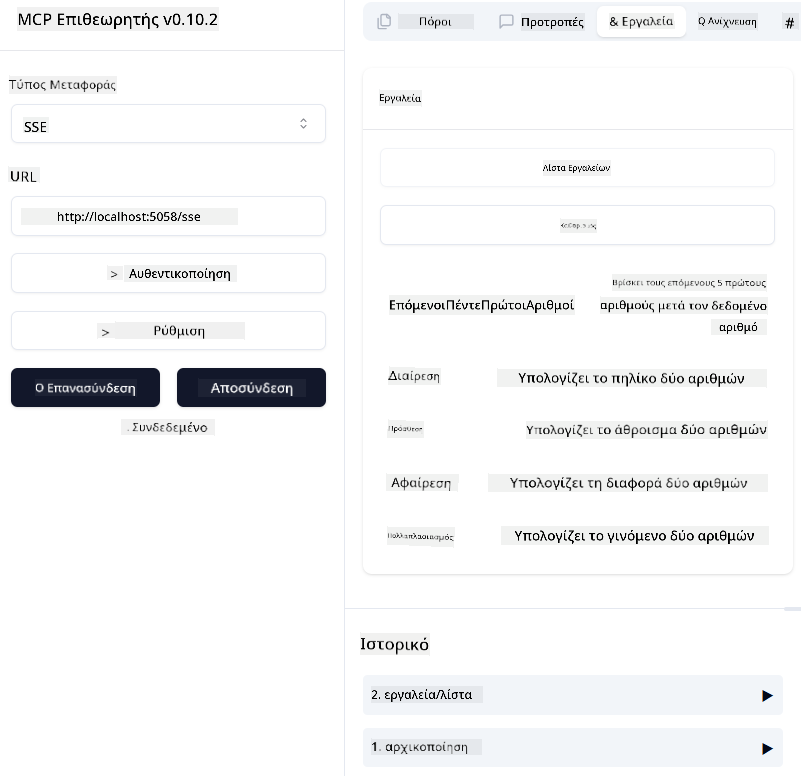

<!--
CO_OP_TRANSLATOR_METADATA:
{
  "original_hash": "5020a3e1a1c7f30c00f9e37f1fa208e3",
  "translation_date": "2025-05-17T14:08:40+00:00",
  "source_file": "04-PracticalImplementation/samples/csharp/README.md",
  "language_code": "el"
}
-->
# Δείγμα

Το προηγούμενο παράδειγμα δείχνει πώς να χρησιμοποιήσετε ένα τοπικό έργο .NET με τον τύπο `sdio`. Και πώς να εκτελέσετε τον διακομιστή τοπικά σε ένα κοντέινερ. Αυτή είναι μια καλή λύση σε πολλές περιπτώσεις. Ωστόσο, μπορεί να είναι χρήσιμο να έχετε τον διακομιστή να τρέχει απομακρυσμένα, όπως σε ένα περιβάλλον cloud. Εδώ είναι που ο τύπος `http` μπαίνει στο παιχνίδι.

Αν κοιτάξετε τη λύση στο φάκελο `04-PracticalImplementation`, μπορεί να φαίνεται πολύ πιο περίπλοκη από την προηγούμενη. Αλλά στην πραγματικότητα, δεν είναι. Αν κοιτάξετε προσεκτικά το έργο `src/mcpserver/mcpserver.csproj`, θα δείτε ότι είναι κυρίως ο ίδιος κώδικας με το προηγούμενο παράδειγμα. Η μόνη διαφορά είναι ότι χρησιμοποιούμε μια διαφορετική βιβλιοθήκη `ModelContextProtocol.AspNetCore` για να χειριστούμε τις αιτήσεις HTTP. Και αλλάζουμε τη μέθοδο `IsPrime` για να την κάνουμε ιδιωτική, απλώς για να δείξουμε ότι μπορείτε να έχετε ιδιωτικές μεθόδους στον κώδικά σας. Ο υπόλοιπος κώδικας είναι ο ίδιος με πριν.

Τα άλλα έργα είναι από [.NET Aspire](https://learn.microsoft.com/dotnet/aspire/get-started/aspire-overview). Η ύπαρξη του .NET Aspire στη λύση θα βελτιώσει την εμπειρία του προγραμματιστή κατά την ανάπτυξη και τη δοκιμή και θα βοηθήσει στην παρατηρησιμότητα. Δεν είναι απαραίτητο για την εκτέλεση του διακομιστή, αλλά είναι καλή πρακτική να το έχετε στη λύση σας.

## Ξεκινήστε τον διακομιστή τοπικά

1. Από το VS Code (με την επέκταση C# DevKit), ανοίξτε τη λύση `04-PracticalImplementation\samples\csharp\src\Calculator-chap4.sln`.
2. Πατήστε `F5` για να ξεκινήσετε τον διακομιστή. Θα πρέπει να ξεκινήσει ένα πρόγραμμα περιήγησης ιστού με τον πίνακα ελέγχου .NET Aspire.

ή

1. Από ένα τερματικό, μεταβείτε στο φάκελο `04-PracticalImplementation\samples\csharp\src`
2. Εκτελέστε την ακόλουθη εντολή για να ξεκινήσετε τον διακομιστή:
   ```bash
    dotnet run --project .\AppHost
   ```

3. Από τον Πίνακα Ελέγχου, σημειώστε τη διεύθυνση URL `http`. Θα πρέπει να είναι κάτι σαν `http://localhost:5058/`.

## Test `SSE` με το ModelContext Protocol Inspector.

Αν έχετε Node.js 22.7.5 και νεότερη έκδοση, μπορείτε να χρησιμοποιήσετε το ModelContext Protocol Inspector για να δοκιμάσετε τον διακομιστή σας.

Ξεκινήστε τον διακομιστή και εκτελέστε την ακόλουθη εντολή σε ένα τερματικό:

```bash
npx @modelcontextprotocol/inspector@latest
```



- Επιλέξτε το `SSE` as the Transport type. SSE stand for Server-Sent Events. 
- In the Url field, enter the URL of the server noted earlier,and append `/sse`. Θα πρέπει να είναι `http` (όχι `https`) something like `http://localhost:5058/sse`.
- select the Connect button.

A nice thing about the Inspector is that it provide a nice visibility on what is happening.

- Try listing the availables tools
- Try some of them, it should works just like before.


## Test `SSE` with Github Copilot Chat in VS Code

To use the `SSE` transport with Github Copilot Chat, change the configuration of the `mcp-calc` διακομιστής που δημιουργήθηκε προηγουμένως για να μοιάζει με αυτό:

```json
"mcp-calc": {
    "type": "sse",
    "url": "http://localhost:5058/sse"
}
```

Κάντε κάποιες δοκιμές:
- Ζητήστε τους 3 πρώτους αριθμούς μετά το 6780. Σημειώστε πώς το Copilot θα χρησιμοποιήσει τα νέα εργαλεία `NextFivePrimeNumbers` και θα επιστρέψει μόνο τους πρώτους 3 αριθμούς.
- Ζητήστε τους 7 πρώτους αριθμούς μετά το 111, για να δείτε τι συμβαίνει.

# Ανάπτυξη του διακομιστή στο Azure

Ας αναπτύξουμε τον διακομιστή στο Azure ώστε να μπορούν να τον χρησιμοποιήσουν περισσότερα άτομα.

Από ένα τερματικό, μεταβείτε στο φάκελο `04-PracticalImplementation\samples\csharp\src` και εκτελέστε την ακόλουθη εντολή:

```bash
azd init
```

Αυτό θα δημιουργήσει λίγα αρχεία τοπικά για να αποθηκεύσει τη διαμόρφωση των πόρων του Azure και την Υποδομή σας ως κώδικα (IaC).

Στη συνέχεια, εκτελέστε την ακόλουθη εντολή για να αναπτύξετε τον διακομιστή στο Azure:

```bash
azd up
```

Μόλις ολοκληρωθεί η ανάπτυξη, θα πρέπει να δείτε ένα μήνυμα σαν αυτό:


Μεταβείτε στον πίνακα ελέγχου Aspire και σημειώστε τη διεύθυνση URL `HTTP` για να τη χρησιμοποιήσετε στο MCP Inspector και στη συνομιλία Github Copilot.

## Τι ακολουθεί;

Δοκιμάζουμε διαφορετικούς τύπους μεταφοράς και εργαλεία δοκιμών και επίσης αναπτύσσουμε τον διακομιστή MCP στο Azure. Αλλά τι γίνεται αν ο διακομιστής μας χρειάζεται πρόσβαση σε ιδιωτικούς πόρους; Για παράδειγμα, μια βάση δεδομένων ή μια ιδιωτική API; Στο επόμενο κεφάλαιο, θα δούμε πώς μπορούμε να βελτιώσουμε την ασφάλεια του διακομιστή μας.

**Αποποίηση ευθυνών**: 
Αυτό το έγγραφο έχει μεταφραστεί χρησιμοποιώντας την υπηρεσία AI μετάφρασης [Co-op Translator](https://github.com/Azure/co-op-translator). Ενώ προσπαθούμε για ακρίβεια, παρακαλούμε να γνωρίζετε ότι οι αυτοματοποιημένες μεταφράσεις ενδέχεται να περιέχουν λάθη ή ανακρίβειες. Το πρωτότυπο έγγραφο στη γλώσσα του θα πρέπει να θεωρείται η αυθεντική πηγή. Για κρίσιμες πληροφορίες, συνιστάται επαγγελματική ανθρώπινη μετάφραση. Δεν φέρουμε ευθύνη για τυχόν παρανοήσεις ή ερμηνείες που προκύπτουν από τη χρήση αυτής της μετάφρασης.