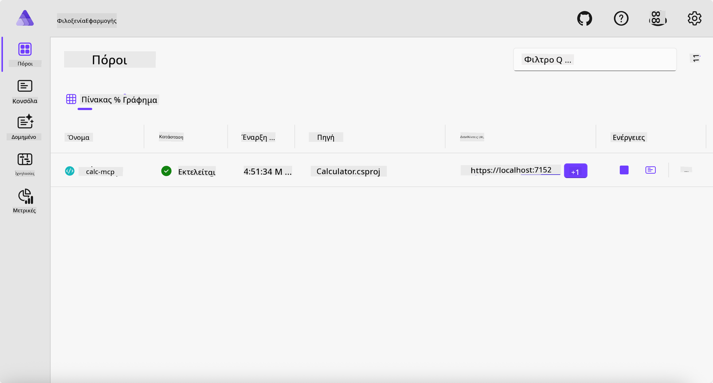
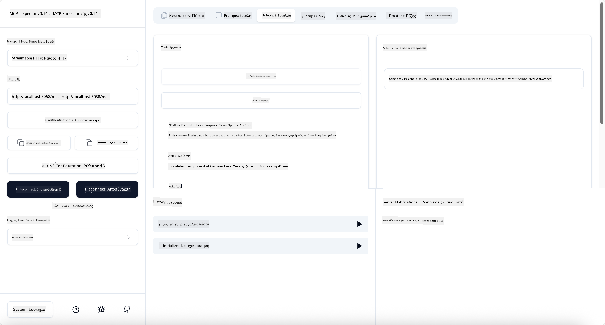
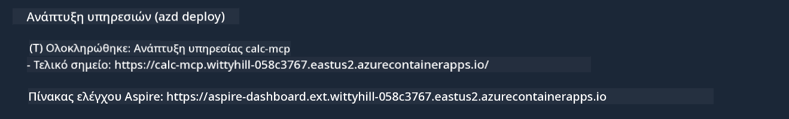

<!--
CO_OP_TRANSLATOR_METADATA:
{
  "original_hash": "0bc7bd48f55f1565f1d95ccb2c16f728",
  "translation_date": "2025-07-13T23:06:59+00:00",
  "source_file": "04-PracticalImplementation/samples/csharp/README.md",
  "language_code": "el"
}
-->
# Παράδειγμα

Το προηγούμενο παράδειγμα δείχνει πώς να χρησιμοποιήσετε ένα τοπικό έργο .NET με τον τύπο `stdio`. Και πώς να τρέξετε τον διακομιστή τοπικά μέσα σε ένα container. Αυτή είναι μια καλή λύση σε πολλές περιπτώσεις. Ωστόσο, μπορεί να είναι χρήσιμο να έχετε τον διακομιστή να τρέχει απομακρυσμένα, όπως σε ένα περιβάλλον cloud. Εδώ μπαίνει ο τύπος `http`.

Κοιτάζοντας τη λύση στον φάκελο `04-PracticalImplementation`, μπορεί να φαίνεται πολύ πιο περίπλοκη από την προηγούμενη. Αλλά στην πραγματικότητα, δεν είναι. Αν κοιτάξετε προσεκτικά το έργο `src/Calculator`, θα δείτε ότι είναι κατά βάση ο ίδιος κώδικας με το προηγούμενο παράδειγμα. Η μόνη διαφορά είναι ότι χρησιμοποιούμε μια διαφορετική βιβλιοθήκη `ModelContextProtocol.AspNetCore` για να χειριστούμε τα αιτήματα HTTP. Και αλλάζουμε τη μέθοδο `IsPrime` ώστε να γίνει ιδιωτική, απλώς για να δείξουμε ότι μπορείτε να έχετε ιδιωτικές μεθόδους στον κώδικά σας. Ο υπόλοιπος κώδικας είναι ο ίδιος με πριν.

Τα υπόλοιπα έργα προέρχονται από [.NET Aspire](https://learn.microsoft.com/dotnet/aspire/get-started/aspire-overview). Η ύπαρξη του .NET Aspire στη λύση βελτιώνει την εμπειρία του προγραμματιστή κατά την ανάπτυξη και τη δοκιμή και βοηθά στην παρατηρησιμότητα. Δεν είναι απαραίτητο για να τρέξει ο διακομιστής, αλλά είναι καλή πρακτική να το έχετε στη λύση σας.

## Εκκίνηση του διακομιστή τοπικά

1. Από το VS Code (με την επέκταση C# DevKit), μεταβείτε στον φάκελο `04-PracticalImplementation/samples/csharp`.
1. Εκτελέστε την παρακάτω εντολή για να ξεκινήσετε τον διακομιστή:

   ```bash
    dotnet watch run --project ./src/AppHost
   ```

1. Όταν ένας φυλλομετρητής ανοίξει τον πίνακα ελέγχου .NET Aspire, σημειώστε το URL `http`. Θα πρέπει να είναι κάτι σαν `http://localhost:5058/`.

   

## Δοκιμή Streamable HTTP με το MCP Inspector

Αν έχετε Node.js 22.7.5 ή νεότερη έκδοση, μπορείτε να χρησιμοποιήσετε το MCP Inspector για να δοκιμάσετε τον διακομιστή σας.

Ξεκινήστε τον διακομιστή και εκτελέστε την παρακάτω εντολή σε ένα τερματικό:

```bash
npx @modelcontextprotocol/inspector http://localhost:5058
```



- Επιλέξτε τον τύπο Μεταφοράς `Streamable HTTP`.
- Στο πεδίο Url, εισάγετε το URL του διακομιστή που σημειώσατε νωρίτερα και προσθέστε `/mcp`. Θα πρέπει να είναι `http` (όχι `https`), κάτι σαν `http://localhost:5058/mcp`.
- Πατήστε το κουμπί Connect.

Ένα καλό χαρακτηριστικό του Inspector είναι ότι παρέχει καλή ορατότητα σε ό,τι συμβαίνει.

- Δοκιμάστε να εμφανίσετε τα διαθέσιμα εργαλεία
- Δοκιμάστε μερικά από αυτά, θα πρέπει να λειτουργούν όπως πριν.

## Δοκιμή MCP Server με GitHub Copilot Chat στο VS Code

Για να χρησιμοποιήσετε τη μεταφορά Streamable HTTP με το GitHub Copilot Chat, αλλάξτε τη διαμόρφωση του διακομιστή `calc-mcp` που δημιουργήσατε προηγουμένως ώστε να μοιάζει με αυτό:

```jsonc
// .vscode/mcp.json
{
  "servers": {
    "calc-mcp": {
      "type": "http",
      "url": "http://localhost:5058/mcp"
    }
  }
}
```

Κάντε μερικές δοκιμές:

- Ζητήστε "3 πρώτους αριθμούς μετά το 6780". Παρατηρήστε πώς ο Copilot θα χρησιμοποιήσει τα νέα εργαλεία `NextFivePrimeNumbers` και θα επιστρέψει μόνο τους πρώτους 3 πρώτους αριθμούς.
- Ζητήστε "7 πρώτους αριθμούς μετά το 111", για να δείτε τι θα συμβεί.
- Ζητήστε "Ο John έχει 24 γλειφιτζούρια και θέλει να τα μοιράσει όλα στα 3 παιδιά του. Πόσα γλειφιτζούρια έχει το κάθε παιδί;", για να δείτε τι θα συμβεί.

## Ανάπτυξη του διακομιστή στο Azure

Ας αναπτύξουμε τον διακομιστή στο Azure ώστε να μπορούν να τον χρησιμοποιούν περισσότεροι.

Από ένα τερματικό, μεταβείτε στον φάκελο `04-PracticalImplementation/samples/csharp` και εκτελέστε την παρακάτω εντολή:

```bash
azd up
```

Μόλις ολοκληρωθεί η ανάπτυξη, θα πρέπει να δείτε ένα μήνυμα σαν αυτό:



Πάρτε το URL και χρησιμοποιήστε το στο MCP Inspector και στο GitHub Copilot Chat.

```jsonc
// .vscode/mcp.json
{
  "servers": {
    "calc-mcp": {
      "type": "http",
      "url": "https://calc-mcp.gentleriver-3977fbcf.australiaeast.azurecontainerapps.io/mcp"
    }
  }
}
```

## Τι ακολουθεί;

Δοκιμάζουμε διαφορετικούς τύπους μεταφοράς και εργαλεία δοκιμών. Επίσης, αναπτύσσουμε τον MCP διακομιστή σας στο Azure. Αλλά τι γίνεται αν ο διακομιστής μας χρειάζεται πρόσβαση σε ιδιωτικούς πόρους; Για παράδειγμα, μια βάση δεδομένων ή ένα ιδιωτικό API; Στο επόμενο κεφάλαιο, θα δούμε πώς μπορούμε να βελτιώσουμε την ασφάλεια του διακομιστή μας.

**Αποποίηση ευθυνών**:  
Αυτό το έγγραφο έχει μεταφραστεί χρησιμοποιώντας την υπηρεσία αυτόματης μετάφρασης AI [Co-op Translator](https://github.com/Azure/co-op-translator). Παρόλο που επιδιώκουμε την ακρίβεια, παρακαλούμε να γνωρίζετε ότι οι αυτόματες μεταφράσεις ενδέχεται να περιέχουν λάθη ή ανακρίβειες. Το πρωτότυπο έγγραφο στη γλώσσα του θεωρείται η αυθεντική πηγή. Για κρίσιμες πληροφορίες, συνιστάται επαγγελματική ανθρώπινη μετάφραση. Δεν φέρουμε ευθύνη για τυχόν παρεξηγήσεις ή λανθασμένες ερμηνείες που προκύπτουν από τη χρήση αυτής της μετάφρασης.