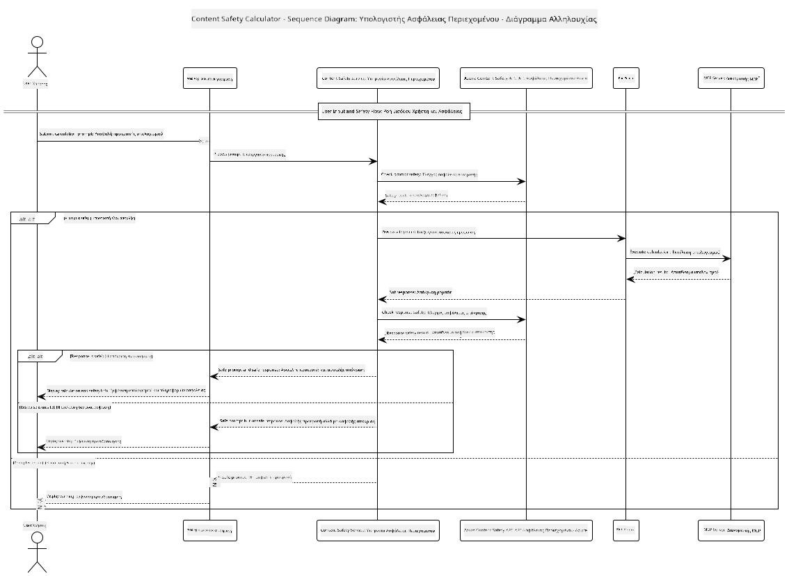

<!--
CO_OP_TRANSLATOR_METADATA:
{
  "original_hash": "e5ea5e7582f70008ea9bec3b3820f20a",
  "translation_date": "2025-07-13T23:16:22+00:00",
  "source_file": "04-PracticalImplementation/samples/java/containerapp/README.md",
  "language_code": "el"
}
-->
## Αρχιτεκτονική Συστήματος

Αυτό το έργο παρουσιάζει μια web εφαρμογή που χρησιμοποιεί έλεγχο ασφάλειας περιεχομένου πριν προωθήσει τα αιτήματα των χρηστών σε μια υπηρεσία αριθμομηχανής μέσω του Model Context Protocol (MCP).



### Πώς Λειτουργεί

1. **Είσοδος Χρήστη**: Ο χρήστης εισάγει ένα αίτημα υπολογισμού στη web διεπαφή  
2. **Έλεγχος Ασφάλειας Περιεχομένου (Είσοδος)**: Το αίτημα αναλύεται από το Azure Content Safety API  
3. **Απόφαση Ασφάλειας (Είσοδος)**:  
   - Αν το περιεχόμενο είναι ασφαλές (βαθμός σοβαρότητας < 2 σε όλες τις κατηγορίες), προωθείται στην αριθμομηχανή  
   - Αν το περιεχόμενο επισημανθεί ως πιθανώς επιβλαβές, η διαδικασία σταματά και επιστρέφει προειδοποίηση  
4. **Ενσωμάτωση Αριθμομηχανής**: Το ασφαλές περιεχόμενο επεξεργάζεται από το LangChain4j, το οποίο επικοινωνεί με τον MCP server της αριθμομηχανής  
5. **Έλεγχος Ασφάλειας Περιεχομένου (Έξοδος)**: Η απάντηση του bot αναλύεται από το Azure Content Safety API  
6. **Απόφαση Ασφάλειας (Έξοδος)**:  
   - Αν η απάντηση του bot είναι ασφαλής, εμφανίζεται στον χρήστη  
   - Αν η απάντηση επισημανθεί ως πιθανώς επιβλαβής, αντικαθίσταται με προειδοποίηση  
7. **Απάντηση**: Τα αποτελέσματα (αν είναι ασφαλή) εμφανίζονται στον χρήστη μαζί με τις δύο αναλύσεις ασφάλειας

## Χρήση του Model Context Protocol (MCP) με Υπηρεσίες Αριθμομηχανής

Αυτό το έργο δείχνει πώς να χρησιμοποιήσετε το Model Context Protocol (MCP) για να καλέσετε υπηρεσίες αριθμομηχανής MCP από το LangChain4j. Η υλοποίηση χρησιμοποιεί έναν τοπικό MCP server που τρέχει στην πόρτα 8080 για να παρέχει λειτουργίες αριθμομηχανής.

### Ρύθμιση της Υπηρεσίας Azure Content Safety

Πριν χρησιμοποιήσετε τις λειτουργίες ασφάλειας περιεχομένου, πρέπει να δημιουργήσετε έναν πόρο υπηρεσίας Azure Content Safety:

1. Συνδεθείτε στο [Azure Portal](https://portal.azure.com)  
2. Κάντε κλικ στο "Create a resource" και αναζητήστε "Content Safety"  
3. Επιλέξτε "Content Safety" και πατήστε "Create"  
4. Εισάγετε ένα μοναδικό όνομα για τον πόρο σας  
5. Επιλέξτε τη συνδρομή και την ομάδα πόρων σας (ή δημιουργήστε νέα)  
6. Επιλέξτε μια υποστηριζόμενη περιοχή (ελέγξτε το [Region availability](https://azure.microsoft.com/en-us/global-infrastructure/services/?products=cognitive-services) για λεπτομέρειες)  
7. Επιλέξτε ένα κατάλληλο επίπεδο τιμολόγησης  
8. Πατήστε "Create" για να αναπτύξετε τον πόρο  
9. Μόλις ολοκληρωθεί η ανάπτυξη, πατήστε "Go to resource"  
10. Στο αριστερό μενού, κάτω από "Resource Management", επιλέξτε "Keys and Endpoint"  
11. Αντιγράψτε ένα από τα κλειδιά και το URL του endpoint για χρήση στο επόμενο βήμα

### Διαμόρφωση Μεταβλητών Περιβάλλοντος

Ορίστε τη μεταβλητή περιβάλλοντος `GITHUB_TOKEN` για την αυθεντικοποίηση των μοντέλων GitHub:  
```sh
export GITHUB_TOKEN=<your_github_token>
```

Για τις λειτουργίες ασφάλειας περιεχομένου, ορίστε:  
```sh
export CONTENT_SAFETY_ENDPOINT=<your_content_safety_endpoint>
export CONTENT_SAFETY_KEY=<your_content_safety_key>
```

Αυτές οι μεταβλητές περιβάλλοντος χρησιμοποιούνται από την εφαρμογή για να αυθεντικοποιηθεί με την υπηρεσία Azure Content Safety. Αν δεν οριστούν, η εφαρμογή θα χρησιμοποιήσει τιμές κράτησης για επίδειξη, αλλά οι λειτουργίες ασφάλειας περιεχομένου δεν θα λειτουργήσουν σωστά.

### Εκκίνηση του MCP Server της Αριθμομηχανής

Πριν τρέξετε τον πελάτη, πρέπει να ξεκινήσετε τον MCP server της αριθμομηχανής σε λειτουργία SSE στο localhost:8080.

## Περιγραφή Έργου

Αυτό το έργο παρουσιάζει την ενσωμάτωση του Model Context Protocol (MCP) με το LangChain4j για κλήση υπηρεσιών αριθμομηχανής. Βασικά χαρακτηριστικά περιλαμβάνουν:

- Χρήση MCP για σύνδεση με υπηρεσία αριθμομηχανής για βασικές μαθηματικές πράξεις  
- Διπλό επίπεδο ελέγχου ασφάλειας περιεχομένου σε αιτήματα χρήστη και απαντήσεις bot  
- Ενσωμάτωση με το μοντέλο gpt-4.1-nano του GitHub μέσω LangChain4j  
- Χρήση Server-Sent Events (SSE) για τη μεταφορά MCP

## Ενσωμάτωση Ασφάλειας Περιεχομένου

Το έργο περιλαμβάνει ολοκληρωμένες λειτουργίες ασφάλειας περιεχομένου για να διασφαλίσει ότι τόσο οι είσοδοι των χρηστών όσο και οι απαντήσεις του συστήματος είναι απαλλαγμένες από επιβλαβές περιεχόμενο:

1. **Έλεγχος Εισόδου**: Όλα τα αιτήματα των χρηστών αναλύονται για κατηγορίες επιβλαβούς περιεχομένου όπως ρητορική μίσους, βία, αυτοτραυματισμό και σεξουαλικό περιεχόμενο πριν την επεξεργασία.  

2. **Έλεγχος Εξόδου**: Ακόμα και όταν χρησιμοποιούνται πιθανά μη λογοκριμένα μοντέλα, το σύστημα ελέγχει όλες τις παραγόμενες απαντήσεις μέσω των ίδιων φίλτρων ασφάλειας περιεχομένου πριν τις εμφανίσει στον χρήστη.

Αυτή η διπλή προσέγγιση διασφαλίζει ότι το σύστημα παραμένει ασφαλές ανεξάρτητα από το ποιο μοντέλο AI χρησιμοποιείται, προστατεύοντας τους χρήστες τόσο από επιβλαβείς εισόδους όσο και από πιθανώς προβληματικές απαντήσεις που παράγονται από το AI.

## Web Client

Η εφαρμογή περιλαμβάνει μια φιλική προς τον χρήστη web διεπαφή που επιτρέπει στους χρήστες να αλληλεπιδρούν με το σύστημα Content Safety Calculator:

### Χαρακτηριστικά Web Διεπαφής

- Απλή, διαισθητική φόρμα για εισαγωγή αιτημάτων υπολογισμού  
- Διπλός έλεγχος ασφάλειας περιεχομένου (είσοδος και έξοδος)  
- Άμεση ανατροφοδότηση για την ασφάλεια του αιτήματος και της απάντησης  
- Ένδειξη ασφάλειας με χρωματική κωδικοποίηση για εύκολη ερμηνεία  
- Καθαρός, ευέλικτος σχεδιασμός που λειτουργεί σε διάφορες συσκευές  
- Παραδείγματα ασφαλών αιτημάτων για καθοδήγηση των χρηστών

### Χρήση του Web Client

1. Ξεκινήστε την εφαρμογή:  
   ```sh
   mvn spring-boot:run
   ```

2. Ανοίξτε τον περιηγητή σας και μεταβείτε στο `http://localhost:8087`

3. Εισάγετε ένα αίτημα υπολογισμού στο διαθέσιμο πεδίο κειμένου (π.χ. "Calculate the sum of 24.5 and 17.3")

4. Πατήστε "Submit" για να επεξεργαστείτε το αίτημά σας

5. Δείτε τα αποτελέσματα, που θα περιλαμβάνουν:  
   - Ανάλυση ασφάλειας περιεχομένου του αιτήματός σας  
   - Το υπολογισμένο αποτέλεσμα (αν το αίτημα ήταν ασφαλές)  
   - Ανάλυση ασφάλειας περιεχομένου της απάντησης του bot  
   - Οποιεσδήποτε προειδοποιήσεις ασφάλειας αν η είσοδος ή η έξοδος επισημάνθηκαν

Ο web client διαχειρίζεται αυτόματα και τις δύο διαδικασίες επαλήθευσης ασφάλειας περιεχομένου, εξασφαλίζοντας ότι όλες οι αλληλεπιδράσεις είναι ασφαλείς και κατάλληλες ανεξάρτητα από το ποιο μοντέλο AI χρησιμοποιείται.

**Αποποίηση ευθυνών**:  
Αυτό το έγγραφο έχει μεταφραστεί χρησιμοποιώντας την υπηρεσία αυτόματης μετάφρασης AI [Co-op Translator](https://github.com/Azure/co-op-translator). Παρόλο που επιδιώκουμε την ακρίβεια, παρακαλούμε να γνωρίζετε ότι οι αυτόματες μεταφράσεις ενδέχεται να περιέχουν λάθη ή ανακρίβειες. Το πρωτότυπο έγγραφο στη γλώσσα του θεωρείται η αυθεντική πηγή. Για κρίσιμες πληροφορίες, συνιστάται επαγγελματική ανθρώπινη μετάφραση. Δεν φέρουμε ευθύνη για τυχόν παρεξηγήσεις ή λανθασμένες ερμηνείες που προκύπτουν από τη χρήση αυτής της μετάφρασης.