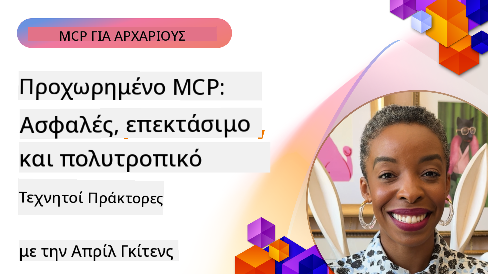

<!--
CO_OP_TRANSLATOR_METADATA:
{
  "original_hash": "d204bc94ea6027d06a703b21b711ca57",
  "translation_date": "2025-08-18T13:43:50+00:00",
  "source_file": "05-AdvancedTopics/README.md",
  "language_code": "el"
}
-->
# Προχωρημένα Θέματα στο MCP

_(Κάντε κλικ στην παραπάνω εικόνα για να παρακολουθήσετε το βίντεο αυτού του μαθήματος)_

Αυτό το κεφάλαιο καλύπτει μια σειρά από προχωρημένα θέματα στην υλοποίηση του Model Context Protocol (MCP), όπως η πολυτροπική ενσωμάτωση, η επεκτασιμότητα, οι βέλτιστες πρακτικές ασφαλείας και η ενσωμάτωση σε επιχειρησιακά περιβάλλοντα. Αυτά τα θέματα είναι κρίσιμα για την ανάπτυξη ανθεκτικών και έτοιμων για παραγωγή εφαρμογών MCP που μπορούν να ανταποκριθούν στις απαιτήσεις των σύγχρονων συστημάτων AI.

## Επισκόπηση

Αυτό το μάθημα εξετάζει προχωρημένες έννοιες στην υλοποίηση του Model Context Protocol, εστιάζοντας στην πολυτροπική ενσωμάτωση, την επεκτασιμότητα, τις βέλτιστες πρακτικές ασφαλείας και την επιχειρησιακή ενσωμάτωση. Αυτά τα θέματα είναι απαραίτητα για την ανάπτυξη εφαρμογών MCP έτοιμων για παραγωγή, που μπορούν να διαχειριστούν σύνθετες απαιτήσεις σε επιχειρησιακά περιβάλλοντα.

## Στόχοι Μάθησης

Μέχρι το τέλος αυτού του μαθήματος, θα μπορείτε να:

- Υλοποιήσετε πολυτροπικές δυνατότητες μέσα σε πλαίσια MCP
- Σχεδιάσετε επεκτάσιμες αρχιτεκτονικές MCP για σενάρια υψηλής ζήτησης
- Εφαρμόσετε βέλτιστες πρακτικές ασφαλείας ευθυγραμμισμένες με τις αρχές ασφαλείας του MCP
- Ενσωματώσετε το MCP με επιχειρησιακά συστήματα και πλαίσια AI
- Βελτιστοποιήσετε την απόδοση και την αξιοπιστία σε περιβάλλοντα παραγωγής

## Μαθήματα και Δείγματα Έργων

| Σύνδεσμος | Τίτλος | Περιγραφή |
|------|-------|-------------|
| [5.1 Ενσωμάτωση με Azure](./mcp-integration/README.md) | Ενσωμάτωση με Azure | Μάθετε πώς να ενσωματώσετε τον MCP Server σας στο Azure |
| [5.2 Πολυτροπικό Δείγμα](./mcp-multi-modality/README.md) | Πολυτροπικά Δείγματα MCP | Δείγματα για ήχο, εικόνα και πολυτροπικές αποκρίσεις |
| [5.3 Δείγμα MCP OAuth2](../../../05-AdvancedTopics/mcp-oauth2-demo) | Επίδειξη MCP OAuth2 | Ελάχιστη εφαρμογή Spring Boot που δείχνει το OAuth2 με MCP, τόσο ως Authorization όσο και ως Resource Server. Δείχνει ασφαλή έκδοση διακριτικών, προστατευμένα endpoints, ανάπτυξη σε Azure Container Apps και ενσωμάτωση με API Management. |
| [5.4 Ρίζες Πλαισίων](./mcp-root-contexts/README.md) | Ρίζες Πλαισίων | Μάθετε περισσότερα για τις ρίζες πλαισίων και πώς να τις υλοποιήσετε |
| [5.5 Δρομολόγηση](./mcp-routing/README.md) | Δρομολόγηση | Μάθετε διαφορετικούς τύπους δρομολόγησης |
| [5.6 Δειγματοληψία](./mcp-sampling/README.md) | Δειγματοληψία | Μάθετε πώς να δουλεύετε με τη δειγματοληψία |
| [5.7 Επεκτασιμότητα](./mcp-scaling/README.md) | Επεκτασιμότητα | Μάθετε για την επεκτασιμότητα |
| [5.8 Ασφάλεια](./mcp-security/README.md) | Ασφάλεια | Ασφαλίστε τον MCP Server σας |
| [5.9 Δείγμα Αναζήτησης Ιστού](./web-search-mcp/README.md) | Αναζήτηση Ιστού MCP | Python MCP server και client που ενσωματώνεται με το SerpAPI για αναζήτηση ιστού, ειδήσεων, προϊόντων και Q&A σε πραγματικό χρόνο. Δείχνει ορχήστρωση πολλαπλών εργαλείων, ενσωμάτωση εξωτερικών API και ανθεκτικό χειρισμό σφαλμάτων. |
| [5.10 Ροή Δεδομένων σε Πραγματικό Χρόνο](./mcp-realtimestreaming/README.md) | Ροή Δεδομένων | Η ροή δεδομένων σε πραγματικό χρόνο έχει γίνει απαραίτητη στον σημερινό κόσμο που βασίζεται στα δεδομένα, όπου οι επιχειρήσεις και οι εφαρμογές χρειάζονται άμεση πρόσβαση σε πληροφορίες για να λαμβάνουν έγκαιρες αποφάσεις. |
| [5.11 Αναζήτηση Ιστού σε Πραγματικό Χρόνο](./mcp-realtimesearch/README.md) | Αναζήτηση Ιστού | Πώς το MCP μετασχηματίζει την αναζήτηση ιστού σε πραγματικό χρόνο παρέχοντας μια τυποποιημένη προσέγγιση στη διαχείριση πλαισίων μεταξύ μοντέλων AI, μηχανών αναζήτησης και εφαρμογών. |
| [5.12 Επαλήθευση Ταυτότητας Entra ID για MCP Servers](./mcp-security-entra/README.md) | Επαλήθευση Ταυτότητας Entra ID | Το Microsoft Entra ID παρέχει μια ισχυρή λύση διαχείρισης ταυτότητας και πρόσβασης στο cloud, διασφαλίζοντας ότι μόνο εξουσιοδοτημένοι χρήστες και εφαρμογές μπορούν να αλληλεπιδρούν με τον MCP server σας. |
| [5.13 Ενσωμάτωση Πράκτορα Azure AI Foundry](./mcp-foundry-agent-integration/README.md) | Ενσωμάτωση Azure AI Foundry | Μάθετε πώς να ενσωματώσετε servers MCP με πράκτορες Azure AI Foundry, επιτρέποντας ισχυρή ορχήστρωση εργαλείων και επιχειρησιακές δυνατότητες AI με τυποποιημένες συνδέσεις εξωτερικών πηγών δεδομένων. |
| [5.14 Μηχανική Πλαισίων](./mcp-contextengineering/README.md) | Μηχανική Πλαισίων | Η μελλοντική ευκαιρία των τεχνικών μηχανικής πλαισίων για servers MCP, συμπεριλαμβανομένης της βελτιστοποίησης πλαισίων, της δυναμικής διαχείρισης πλαισίων και στρατηγικών για αποτελεσματική μηχανική προτροπών μέσα σε πλαίσια MCP. |

## Πρόσθετες Αναφορές

Για τις πιο ενημερωμένες πληροφορίες σχετικά με προχωρημένα θέματα MCP, ανατρέξτε στα εξής:
- [Τεκμηρίωση MCP](https://modelcontextprotocol.io/)
- [Προδιαγραφή MCP](https://spec.modelcontextprotocol.io/)
- [Αποθετήριο GitHub](https://github.com/modelcontextprotocol)

## Βασικά Σημεία

- Οι πολυτροπικές υλοποιήσεις MCP επεκτείνουν τις δυνατότητες AI πέρα από την επεξεργασία κειμένου
- Η επεκτασιμότητα είναι απαραίτητη για επιχειρησιακές αναπτύξεις και μπορεί να επιτευχθεί μέσω οριζόντιας και κάθετης κλιμάκωσης
- Ολοκληρωμένα μέτρα ασφαλείας προστατεύουν τα δεδομένα και διασφαλίζουν τον σωστό έλεγχο πρόσβασης
- Η επιχειρησιακή ενσωμάτωση με πλατφόρμες όπως το Azure OpenAI και το Microsoft AI Foundry ενισχύει τις δυνατότητες MCP
- Οι προχωρημένες υλοποιήσεις MCP επωφελούνται από βελτιστοποιημένες αρχιτεκτονικές και προσεκτική διαχείριση πόρων

## Άσκηση

Σχεδιάστε μια υλοποίηση MCP επιχειρησιακού επιπέδου για μια συγκεκριμένη περίπτωση χρήσης:

1. Προσδιορίστε τις πολυτροπικές απαιτήσεις για την περίπτωση χρήσης σας
2. Καθορίστε τα μέτρα ασφαλείας που απαιτούνται για την προστασία ευαίσθητων δεδομένων
3. Σχεδιάστε μια επεκτάσιμη αρχιτεκτονική που να μπορεί να διαχειριστεί μεταβαλλόμενα φορτία
4. Προγραμματίστε σημεία ενσωμάτωσης με επιχειρησιακά συστήματα AI
5. Τεκμηριώστε πιθανά σημεία συμφόρησης απόδοσης και στρατηγικές μετριασμού

## Πρόσθετοι Πόροι

- [Τεκμηρίωση Azure OpenAI](https://learn.microsoft.com/en-us/azure/ai-services/openai/)
- [Τεκμηρίωση Microsoft AI Foundry](https://learn.microsoft.com/en-us/ai-services/)

---

## Τι ακολουθεί

- [5.1 Ενσωμάτωση MCP](./mcp-integration/README.md)

**Αποποίηση ευθύνης**:  
Αυτό το έγγραφο έχει μεταφραστεί χρησιμοποιώντας την υπηρεσία αυτόματης μετάφρασης [Co-op Translator](https://github.com/Azure/co-op-translator). Παρόλο που καταβάλλουμε προσπάθειες για ακρίβεια, παρακαλούμε να έχετε υπόψη ότι οι αυτόματες μεταφράσεις ενδέχεται να περιέχουν σφάλματα ή ανακρίβειες. Το πρωτότυπο έγγραφο στη μητρική του γλώσσα θα πρέπει να θεωρείται η αυθεντική πηγή. Για κρίσιμες πληροφορίες, συνιστάται επαγγελματική ανθρώπινη μετάφραση. Δεν φέρουμε ευθύνη για τυχόν παρεξηγήσεις ή εσφαλμένες ερμηνείες που προκύπτουν από τη χρήση αυτής της μετάφρασης.