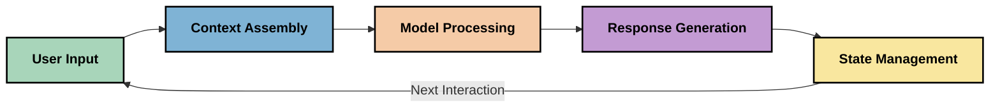
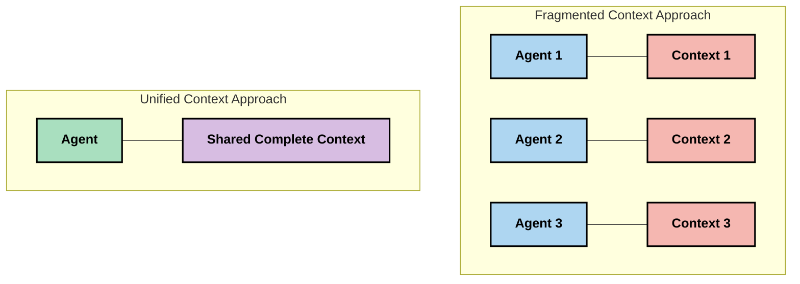

<!--
CO_OP_TRANSLATOR_METADATA:
{
  "original_hash": "fd169ca3071b81b5ee282e194bc823df",
  "translation_date": "2025-09-15T20:28:50+00:00",
  "source_file": "05-AdvancedTopics/mcp-contextengineering/README.md",
  "language_code": "el"
}
-->
# Μηχανική Πλαισίου: Ένα Αναδυόμενο Στοιχείο στο Οικοσύστημα MCP

## Επισκόπηση

Η μηχανική πλαισίου είναι μια αναδυόμενη έννοια στον χώρο της τεχνητής νοημοσύνης που εξετάζει πώς η πληροφορία δομείται, παραδίδεται και διατηρείται κατά τη διάρκεια των αλληλεπιδράσεων μεταξύ πελατών και υπηρεσιών AI. Καθώς το οικοσύστημα του Model Context Protocol (MCP) εξελίσσεται, η κατανόηση του πώς να διαχειριστούμε αποτελεσματικά το πλαίσιο γίνεται όλο και πιο σημαντική. Αυτή η ενότητα εισάγει την έννοια της μηχανικής πλαισίου και εξετάζει τις πιθανές εφαρμογές της στις υλοποιήσεις MCP.

## Στόχοι Μάθησης

Μέχρι το τέλος αυτής της ενότητας, θα μπορείτε να:

- Κατανοήσετε την αναδυόμενη έννοια της μηχανικής πλαισίου και τον πιθανό ρόλο της στις εφαρμογές MCP
- Εντοπίσετε βασικές προκλήσεις στη διαχείριση πλαισίου που αντιμετωπίζει ο σχεδιασμός του πρωτοκόλλου MCP
- Εξερευνήσετε τεχνικές για τη βελτίωση της απόδοσης των μοντέλων μέσω καλύτερης διαχείρισης πλαισίου
- Σκεφτείτε προσεγγίσεις για τη μέτρηση και αξιολόγηση της αποτελεσματικότητας του πλαισίου
- Εφαρμόσετε αυτές τις αναδυόμενες έννοιες για τη βελτίωση των εμπειριών AI μέσω του πλαισίου MCP

## Εισαγωγή στη Μηχανική Πλαισίου

Η μηχανική πλαισίου είναι μια αναδυόμενη έννοια που επικεντρώνεται στον σκόπιμο σχεδιασμό και τη διαχείριση της ροής πληροφοριών μεταξύ χρηστών, εφαρμογών και μοντέλων AI. Σε αντίθεση με καθιερωμένα πεδία όπως η μηχανική προτροπών, η μηχανική πλαισίου εξακολουθεί να ορίζεται από τους επαγγελματίες καθώς εργάζονται για την επίλυση των μοναδικών προκλήσεων της παροχής στα μοντέλα AI της σωστής πληροφορίας τη σωστή στιγμή.

Καθώς τα μεγάλα γλωσσικά μοντέλα (LLMs) εξελίσσονται, η σημασία του πλαισίου γίνεται όλο και πιο εμφανής. Η ποιότητα, η συνάφεια και η δομή του πλαισίου που παρέχουμε επηρεάζουν άμεσα τα αποτελέσματα των μοντέλων. Η μηχανική πλαισίου εξετάζει αυτή τη σχέση και επιδιώκει να αναπτύξει αρχές για αποτελεσματική διαχείριση πλαισίου.

> "Το 2025, τα μοντέλα είναι εξαιρετικά έξυπνα. Αλλά ακόμα και ο πιο έξυπνος άνθρωπος δεν θα μπορέσει να κάνει τη δουλειά του αποτελεσματικά χωρίς το πλαίσιο του τι του ζητείται να κάνει... Η 'μηχανική πλαισίου' είναι το επόμενο επίπεδο της μηχανικής προτροπών. Πρόκειται για την αυτόματη εφαρμογή αυτής της διαδικασίας σε ένα δυναμικό σύστημα." — Walden Yan, Cognition AI

Η μηχανική πλαισίου μπορεί να περιλαμβάνει:

1. **Επιλογή Πλαισίου**: Καθορισμός ποια πληροφορία είναι σχετική για μια δεδομένη εργασία
2. **Δόμηση Πλαισίου**: Οργάνωση της πληροφορίας για μέγιστη κατανόηση από το μοντέλο
3. **Παράδοση Πλαισίου**: Βελτιστοποίηση του πώς και πότε η πληροφορία αποστέλλεται στα μοντέλα
4. **Διατήρηση Πλαισίου**: Διαχείριση της κατάστασης και της εξέλιξης του πλαισίου με την πάροδο του χρόνου
5. **Αξιολόγηση Πλαισίου**: Μέτρηση και βελτίωση της αποτελεσματικότητας του πλαισίου

Αυτοί οι τομείς εστίασης είναι ιδιαίτερα σημαντικοί για το οικοσύστημα MCP, το οποίο παρέχει έναν τυποποιημένο τρόπο για τις εφαρμογές να παρέχουν πλαίσιο στα LLMs.

## Η Προοπτική του Ταξιδιού του Πλαισίου

Ένας τρόπος να οπτικοποιήσουμε τη μηχανική πλαισίου είναι να παρακολουθήσουμε το ταξίδι που κάνει η πληροφορία μέσα από ένα σύστημα MCP:

### Βασικά Στάδια στο Ταξίδι του Πλαισίου:

1. **Εισαγωγή Χρήστη**: Ακατέργαστη πληροφορία από τον χρήστη (κείμενο, εικόνες, έγγραφα)
2. **Συναρμολόγηση Πλαισίου**: Συνδυασμός εισαγωγής χρήστη με το πλαίσιο του συστήματος, το ιστορικό συνομιλίας και άλλες ανακτημένες πληροφορίες
3. **Επεξεργασία Μοντέλου**: Το μοντέλο AI επεξεργάζεται το συναρμολογημένο πλαίσιο
4. **Δημιουργία Απόκρισης**: Το μοντέλο παράγει αποτελέσματα βάσει του παρεχόμενου πλαισίου
5. **Διαχείριση Κατάστασης**: Το σύστημα ενημερώνει την εσωτερική του κατάσταση βάσει της αλληλεπίδρασης

Αυτή η προοπτική υπογραμμίζει τη δυναμική φύση του πλαισίου στα συστήματα AI και θέτει σημαντικά ερωτήματα για το πώς να διαχειριστούμε καλύτερα την πληροφορία σε κάθε στάδιο.

## Αναδυόμενες Αρχές στη Μηχανική Πλαισίου

Καθώς το πεδίο της μηχανικής πλαισίου διαμορφώνεται, ορισμένες πρώιμες αρχές αρχίζουν να αναδύονται από τους επαγγελματίες. Αυτές οι αρχές μπορεί να βοηθήσουν να ενημερωθούν οι επιλογές υλοποίησης MCP:

### Αρχή 1: Μοιραστείτε το Πλαίσιο Πλήρως

Το πλαίσιο πρέπει να μοιράζεται πλήρως μεταξύ όλων των στοιχείων ενός συστήματος και όχι να κατακερματίζεται σε πολλούς πράκτορες ή διαδικασίες. Όταν το πλαίσιο είναι διασκορπισμένο, οι αποφάσεις που λαμβάνονται σε ένα μέρος του συστήματος μπορεί να έρχονται σε σύγκρουση με αυτές που λαμβάνονται αλλού.

Στις εφαρμογές MCP, αυτό υποδηλώνει τον σχεδιασμό συστημάτων όπου το πλαίσιο ρέει απρόσκοπτα σε όλη την αλυσίδα αντί να είναι κατακερματισμένο.

### Αρχή 2: Αναγνωρίστε ότι οι Ενέργειες Εμπεριέχουν Σιωπηρές Αποφάσεις

Κάθε ενέργεια που λαμβάνει ένα μοντέλο ενσωματώνει σιωπηρές αποφάσεις για το πώς να ερμηνεύσει το πλαίσιο. Όταν πολλαπλά στοιχεία ενεργούν σε διαφορετικά πλαίσια, αυτές οι σιωπηρές αποφάσεις μπορεί να έρχονται σε σύγκρουση, οδηγώντας σε ασυνεπή αποτελέσματα.

Αυτή η αρχή έχει σημαντικές επιπτώσεις για τις εφαρμογές MCP:
- Προτιμήστε γραμμική επεξεργασία σύνθετων εργασιών αντί για παράλληλη εκτέλεση με κατακερματισμένο πλαίσιο
- Βεβαιωθείτε ότι όλα τα σημεία λήψης αποφάσεων έχουν πρόσβαση στην ίδια πληροφορία πλαισίου
- Σχεδιάστε συστήματα όπου τα επόμενα βήματα μπορούν να δουν το πλήρες πλαίσιο των προηγούμενων αποφάσεων

### Αρχή 3: Ισορροπήστε το Βάθος Πλαισίου με τους Περιορισμούς Παραθύρου

Καθώς οι συνομιλίες και οι διαδικασίες γίνονται μεγαλύτερες, τα παράθυρα πλαισίου τελικά υπερχειλίζουν. Η αποτελεσματική μηχανική πλαισίου εξετάζει προσεγγίσεις για τη διαχείριση αυτής της έντασης μεταξύ ολοκληρωμένου πλαισίου και τεχνικών περιορισμών.

Πιθανές προσεγγίσεις που εξετάζονται περιλαμβάνουν:
- Συμπίεση πλαισίου που διατηρεί βασικές πληροφορίες ενώ μειώνει τη χρήση tokens
- Προοδευτική φόρτωση πλαισίου βάσει της συνάφειας με τις τρέχουσες ανάγκες
- Περίληψη προηγούμενων αλληλεπιδράσεων ενώ διατηρούνται βασικές αποφάσεις και γεγονότα

## Προκλήσεις Πλαισίου και Σχεδιασμός Πρωτοκόλλου MCP

Το Model Context Protocol (MCP) σχεδιάστηκε με επίγνωση των μοναδικών προκλήσεων της διαχείρισης πλαισίου. Η κατανόηση αυτών των προκλήσεων βοηθά να εξηγηθούν βασικές πτυχές του σχεδιασμού του πρωτοκόλλου MCP:

### Πρόκληση 1: Περιορισμοί Παραθύρου Πλαισίου
Τα περισσότερα μοντέλα AI έχουν σταθερά μεγέθη παραθύρου πλαισίου, περιορίζοντας πόση πληροφορία μπορούν να επεξεργαστούν ταυτόχρονα.

**Αντίδραση Σχεδιασμού MCP:** 
- Το πρωτόκολλο υποστηρίζει δομημένο πλαίσιο βασισμένο σε πόρους που μπορεί να αναφέρεται αποτελεσματικά
- Οι πόροι μπορούν να σελιδοποιούνται και να φορτώνονται προοδευτικά

### Πρόκληση 2: Καθορισμός Συνάφειας
Η επιλογή της πιο σχετικής πληροφορίας για να συμπεριληφθεί στο πλαίσιο είναι δύσκολη.

**Αντίδραση Σχεδιασμού MCP:**
- Ευέλικτα εργαλεία επιτρέπουν δυναμική ανάκτηση πληροφορίας βάσει ανάγκης
- Δομημένες προτροπές επιτρέπουν συνεπή οργάνωση πλαισίου

### Πρόκληση 3: Διατήρηση Πλαισίου
Η διαχείριση της κατάστασης σε αλληλεπιδράσεις απαιτεί προσεκτική παρακολούθηση του πλαισίου.

**Αντίδραση Σχεδιασμού MCP:**
- Τυποποιημένη διαχείριση συνεδριών
- Σαφώς καθορισμένα μοτίβα αλληλεπίδρασης για την εξέλιξη του πλαισίου

### Πρόκληση 4: Πολυτροπικό Πλαίσιο
Διαφορετικοί τύποι δεδομένων (κείμενο, εικόνες, δομημένα δεδομένα) απαιτούν διαφορετική διαχείριση.

**Αντίδραση Σχεδιασμού MCP:**
- Ο σχεδιασμός του πρωτοκόλλου προσαρμόζεται σε διάφορους τύπους περιεχομένου
- Τυποποιημένη αναπαράσταση πολυτροπικής πληροφορίας

### Πρόκληση 5: Ασφάλεια και Ιδιωτικότητα
Το πλαίσιο συχνά περιέχει ευαίσθητες πληροφορίες που πρέπει να προστατεύονται.

**Αντίδραση Σχεδιασμού MCP:**
- Σαφή όρια μεταξύ ευθυνών πελάτη και διακομιστή
- Επιλογές τοπικής επεξεργασίας για ελαχιστοποίηση της έκθεσης δεδομένων

Η κατανόηση αυτών των προκλήσεων και του τρόπου με τον οποίο το MCP τις αντιμετωπίζει παρέχει μια βάση για την εξερεύνηση πιο προηγμένων τεχνικών μηχανικής πλαισίου.
- [Ιστοσελίδα Πρωτοκόλλου Πλαισίου Μοντέλου](https://modelcontextprotocol.io/)
- [Προδιαγραφή Πρωτοκόλλου Πλαισίου Μοντέλου](https://github.com/modelcontextprotocol/modelcontextprotocol)
- [Τεκμηρίωση MCP](https://modelcontextprotocol.io/docs)
- [MCP C# SDK](https://github.com/modelcontextprotocol/csharp-sdk)
- [MCP Python SDK](https://github.com/modelcontextprotocol/python-sdk)
- [MCP TypeScript SDK](https://github.com/modelcontextprotocol/typescript-sdk)
- [MCP Inspector](https://github.com/modelcontextprotocol/inspector) - Εργαλείο οπτικού ελέγχου για διακομιστές MCP

### Άρθρα Μηχανικής Πλαισίου
- [Μην Δημιουργείτε Πολυπράκτορες: Αρχές Μηχανικής Πλαισίου](https://cognition.ai/blog/dont-build-multi-agents) - Οι απόψεις του Walden Yan για τις αρχές της μηχανικής πλαισίου
- [Πρακτικός Οδηγός για Δημιουργία Πρακτόρων](https://cdn.openai.com/business-guides-and-resources/a-practical-guide-to-building-agents.pdf) - Οδηγός της OpenAI για αποτελεσματικό σχεδιασμό πρακτόρων
- [Δημιουργία Αποτελεσματικών Πρακτόρων](https://www.anthropic.com/engineering/building-effective-agents) - Η προσέγγιση της Anthropic για την ανάπτυξη πρακτόρων

### Σχετική Έρευνα
- [Δυναμική Ενίσχυση Ανάκτησης για Μεγάλα Μοντέλα Γλώσσας](https://arxiv.org/abs/2310.01487) - Έρευνα για δυναμικές προσεγγίσεις ανάκτησης
- [Χαμένοι στη Μέση: Πώς τα Μοντέλα Γλώσσας Χρησιμοποιούν Μεγάλες Συμφραζόμενες](https://arxiv.org/abs/2307.03172) - Σημαντική έρευνα για μοτίβα επεξεργασίας συμφραζομένων
- [Ιεραρχική Δημιουργία Εικόνων με Συμφραζόμενα Κειμένου μέσω CLIP Latents](https://arxiv.org/abs/2204.06125) - Έγγραφο DALL-E 2 με πληροφορίες για τη δομή συμφραζομένων
- [Εξερεύνηση του Ρόλου των Συμφραζομένων στις Αρχιτεκτονικές Μεγάλων Μοντέλων Γλώσσας](https://aclanthology.org/2023.findings-emnlp.124/) - Πρόσφατη έρευνα για τη διαχείριση συμφραζομένων
- [Συνεργασία Πολυπρακτόρων: Μια Επισκόπηση](https://arxiv.org/abs/2304.03442) - Έρευνα για συστήματα πολυπρακτόρων και τις προκλήσεις τους

### Πρόσθετοι Πόροι
- [Τεχνικές Βελτιστοποίησης Παραθύρου Συμφραζομένων](https://learn.microsoft.com/en-us/azure/ai-services/openai/concepts/context-window)
- [Προηγμένες Τεχνικές RAG](https://www.microsoft.com/en-us/research/blog/retrieval-augmented-generation-rag-and-frontier-models/)
- [Τεκμηρίωση Semantic Kernel](https://github.com/microsoft/semantic-kernel)
- [Εργαλειοθήκη AI για Διαχείριση Συμφραζομένων](https://github.com/microsoft/aitoolkit)

## Τι ακολουθεί 

- [5.15 MCP Custom Transport](../mcp-transport/README.md)

---

**Αποποίηση ευθύνης**:  
Αυτό το έγγραφο έχει μεταφραστεί χρησιμοποιώντας την υπηρεσία αυτόματης μετάφρασης [Co-op Translator](https://github.com/Azure/co-op-translator). Παρόλο που καταβάλλουμε προσπάθειες για ακρίβεια, παρακαλούμε να έχετε υπόψη ότι οι αυτοματοποιημένες μεταφράσεις ενδέχεται να περιέχουν λάθη ή ανακρίβειες. Το πρωτότυπο έγγραφο στη μητρική του γλώσσα θα πρέπει να θεωρείται η αυθεντική πηγή. Για κρίσιμες πληροφορίες, συνιστάται επαγγελματική ανθρώπινη μετάφραση. Δεν φέρουμε ευθύνη για τυχόν παρεξηγήσεις ή εσφαλμένες ερμηνείες που προκύπτουν από τη χρήση αυτής της μετάφρασης.