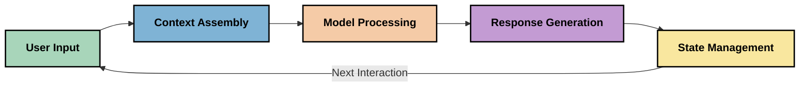
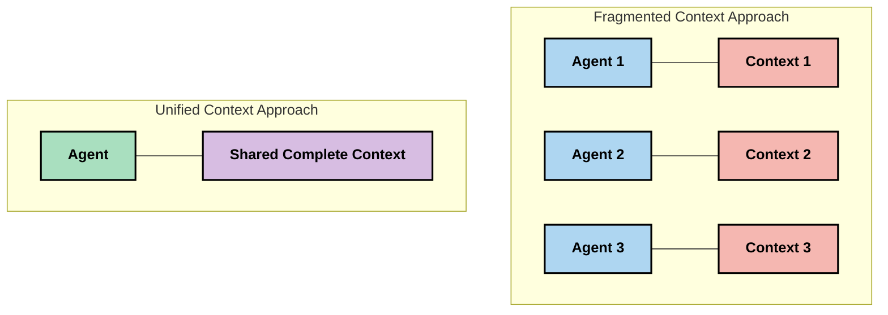
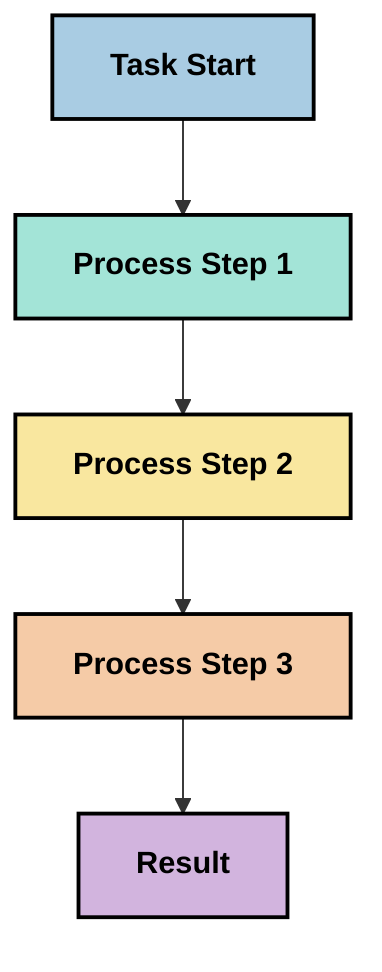
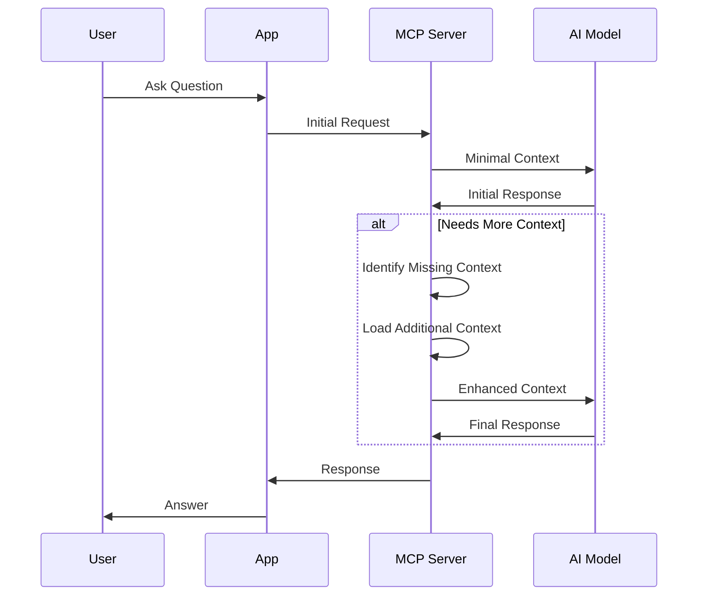
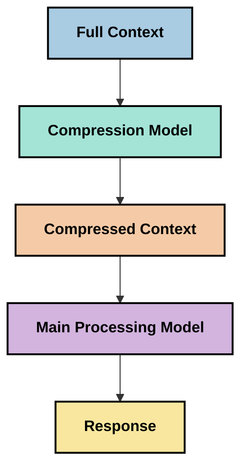

<!--
CO_OP_TRANSLATOR_METADATA:
{
  "original_hash": "5762e8e74dd99d8b7dbb31e69a82561e",
  "translation_date": "2025-07-17T08:30:12+00:00",
  "source_file": "05-AdvancedTopics/mcp-contextengineering/README.md",
  "language_code": "el"
}
-->
# Context Engineering: Μια Αναδυόμενη Έννοια στο Οικοσύστημα MCP

## Επισκόπηση

Η context engineering είναι μια αναδυόμενη έννοια στον χώρο της τεχνητής νοημοσύνης που εξερευνά τον τρόπο με τον οποίο η πληροφορία δομείται, παραδίδεται και διατηρείται κατά τη διάρκεια των αλληλεπιδράσεων μεταξύ πελατών και υπηρεσιών AI. Καθώς το οικοσύστημα του Model Context Protocol (MCP) εξελίσσεται, η κατανόηση του πώς να διαχειριζόμαστε αποτελεσματικά το context γίνεται όλο και πιο σημαντική. Αυτό το μάθημα εισάγει την έννοια της context engineering και εξερευνά τις πιθανές εφαρμογές της σε υλοποιήσεις MCP.

## Στόχοι Μάθησης

Στο τέλος αυτού του μαθήματος, θα μπορείτε να:

- Κατανοήσετε την αναδυόμενη έννοια της context engineering και τον πιθανό ρόλο της στις εφαρμογές MCP
- Αναγνωρίσετε βασικές προκλήσεις στη διαχείριση του context που αντιμετωπίζει ο σχεδιασμός του πρωτοκόλλου MCP
- Εξερευνήσετε τεχνικές για τη βελτίωση της απόδοσης μοντέλων μέσω καλύτερης διαχείρισης του context
- Σκεφτείτε προσεγγίσεις για τη μέτρηση και αξιολόγηση της αποτελεσματικότητας του context
- Εφαρμόσετε αυτές τις αναδυόμενες έννοιες για τη βελτίωση των εμπειριών AI μέσω του πλαισίου MCP

## Εισαγωγή στην Context Engineering

Η context engineering είναι μια αναδυόμενη έννοια που εστιάζει στον σκόπιμο σχεδιασμό και τη διαχείριση της ροής πληροφοριών μεταξύ χρηστών, εφαρμογών και μοντέλων AI. Σε αντίθεση με καθιερωμένους τομείς όπως η prompt engineering, η context engineering ορίζεται ακόμα από τους επαγγελματίες καθώς προσπαθούν να λύσουν τις μοναδικές προκλήσεις της παροχής των κατάλληλων πληροφοριών στα AI μοντέλα τη σωστή στιγμή.

Καθώς τα μεγάλα γλωσσικά μοντέλα (LLMs) εξελίσσονται, η σημασία του context γίνεται όλο και πιο εμφανής. Η ποιότητα, η συνάφεια και η δομή του context που παρέχουμε επηρεάζουν άμεσα τα αποτελέσματα του μοντέλου. Η context engineering εξερευνά αυτή τη σχέση και επιδιώκει να αναπτύξει αρχές για αποτελεσματική διαχείριση του context.

> "Το 2025, τα μοντέλα εκεί έξω είναι εξαιρετικά έξυπνα. Αλλά ακόμα και ο πιο έξυπνος άνθρωπος δεν θα μπορέσει να κάνει τη δουλειά του αποτελεσματικά χωρίς το context του τι του ζητείται... Η 'context engineering' είναι το επόμενο επίπεδο της prompt engineering. Πρόκειται για το να γίνεται αυτό αυτόματα σε ένα δυναμικό σύστημα." — Walden Yan, Cognition AI

Η context engineering μπορεί να περιλαμβάνει:

1. **Επιλογή Context**: Καθορισμός των πληροφοριών που είναι σχετικές για μια συγκεκριμένη εργασία
2. **Δομή Context**: Οργάνωση των πληροφοριών για μέγιστη κατανόηση από το μοντέλο
3. **Παράδοση Context**: Βελτιστοποίηση του πώς και πότε αποστέλλονται οι πληροφορίες στα μοντέλα
4. **Διατήρηση Context**: Διαχείριση της κατάστασης και της εξέλιξης του context με την πάροδο του χρόνου
5. **Αξιολόγηση Context**: Μέτρηση και βελτίωση της αποτελεσματικότητας του context

Αυτοί οι τομείς εστίασης είναι ιδιαίτερα σημαντικοί για το οικοσύστημα MCP, το οποίο παρέχει έναν τυποποιημένο τρόπο για τις εφαρμογές να παρέχουν context στα LLMs.

## Η Προοπτική του Ταξιδιού του Context

Ένας τρόπος να οπτικοποιήσουμε την context engineering είναι να ακολουθήσουμε το ταξίδι που διανύει η πληροφορία μέσα από ένα σύστημα MCP:



### Κύρια Στάδια στο Ταξίδι του Context:

1. **Είσοδος Χρήστη**: Ακατέργαστες πληροφορίες από τον χρήστη (κείμενο, εικόνες, έγγραφα)
2. **Συναρμολόγηση Context**: Συνδυασμός της εισόδου χρήστη με το context του συστήματος, το ιστορικό συνομιλίας και άλλες ανακτημένες πληροφορίες
3. **Επεξεργασία Μοντέλου**: Το μοντέλο AI επεξεργάζεται το συναρμολογημένο context
4. **Δημιουργία Απάντησης**: Το μοντέλο παράγει αποτελέσματα βασισμένα στο παρεχόμενο context
5. **Διαχείριση Κατάστασης**: Το σύστημα ενημερώνει την εσωτερική του κατάσταση βάσει της αλληλεπίδρασης

Αυτή η προοπτική αναδεικνύει τη δυναμική φύση του context στα συστήματα AI και θέτει σημαντικά ερωτήματα για το πώς να διαχειριστούμε καλύτερα τις πληροφορίες σε κάθε στάδιο.

## Αναδυόμενες Αρχές στην Context Engineering

Καθώς ο τομέας της context engineering διαμορφώνεται, κάποιες πρώιμες αρχές αρχίζουν να προκύπτουν από τους επαγγελματίες. Αυτές οι αρχές μπορεί να βοηθήσουν στον καθορισμό επιλογών υλοποίησης MCP:

### Αρχή 1: Μοιραστείτε το Context Ολοκληρωμένα

Το context θα πρέπει να μοιράζεται πλήρως μεταξύ όλων των συστατικών ενός συστήματος και όχι να κατακερματίζεται σε πολλούς πράκτορες ή διεργασίες. Όταν το context διανέμεται, οι αποφάσεις που λαμβάνονται σε ένα μέρος του συστήματος μπορεί να συγκρούονται με αυτές που λαμβάνονται αλλού.



Στις εφαρμογές MCP, αυτό υποδηλώνει το σχεδιασμό συστημάτων όπου το context ρέει απρόσκοπτα σε όλη την αλυσίδα αντί να είναι κατακερματισμένο.

### Αρχή 2: Αναγνωρίστε Ότι οι Ενέργειες Φέρουν Υπονοούμενες Αποφάσεις

Κάθε ενέργεια που λαμβάνει ένα μοντέλο ενσωματώνει υπονοούμενες αποφάσεις για το πώς να ερμηνεύσει το context. Όταν πολλαπλά συστατικά ενεργούν σε διαφορετικά contexts, αυτές οι υπονοούμενες αποφάσεις μπορεί να συγκρούονται, οδηγώντας σε ασυνεπή αποτελέσματα.

Αυτή η αρχή έχει σημαντικές επιπτώσεις για τις εφαρμογές MCP:
- Προτιμήστε τη γραμμική επεξεργασία σύνθετων εργασιών αντί για παράλληλη εκτέλεση με κατακερματισμένο context
- Διασφαλίστε ότι όλα τα σημεία λήψης αποφάσεων έχουν πρόσβαση στην ίδια πληροφορία context
- Σχεδιάστε συστήματα όπου τα επόμενα βήματα μπορούν να δουν ολόκληρο το context των προηγούμενων αποφάσεων

### Αρχή 3: Ισορροπήστε το Βάθος του Context με τους Περιορισμούς του Παραθύρου

Καθώς οι συνομιλίες και οι διαδικασίες γίνονται πιο μακροχρόνιες, τα παράθυρα context τελικά υπερφορτώνονται. Η αποτελεσματική context engineering εξερευνά προσεγγίσεις για τη διαχείριση αυτής της έντασης μεταξύ ολοκληρωμένου context και τεχνικών περιορισμών.

Πιθανές προσεγγίσεις που εξετάζονται περιλαμβάνουν:
- Συμπίεση context που διατηρεί τις βασικές πληροφορίες ενώ μειώνει τη χρήση tokens
- Προοδευτική φόρτωση context βάσει της συνάφειας με τις τρέχουσες ανάγκες
- Περίληψη προηγούμενων αλληλεπιδράσεων διατηρώντας βασικές αποφάσεις και γεγονότα

## Προκλήσεις Context και Σχεδιασμός Πρωτοκόλλου MCP

Το Model Context Protocol (MCP) σχεδιάστηκε με επίγνωση των μοναδικών προκλήσεων της διαχείρισης context. Η κατανόηση αυτών των προκλήσεων βοηθά στην εξήγηση βασικών πτυχών του σχεδιασμού του πρωτοκόλλου MCP:

### Πρόκληση 1: Περιορισμοί Παραθύρου Context  
Τα περισσότερα μοντέλα AI έχουν σταθερό μέγεθος παραθύρου context, περιορίζοντας πόσες πληροφορίες μπορούν να επεξεργαστούν ταυτόχρονα.

**Απάντηση Σχεδιασμού MCP:**  
- Το πρωτόκολλο υποστηρίζει δομημένο, βασισμένο σε πόρους context που μπορεί να αναφέρεται αποδοτικά  
- Οι πόροι μπορούν να σελιδοποιούνται και να φορτώνονται προοδευτικά

### Πρόκληση 2: Καθορισμός Συνάφειας  
Είναι δύσκολο να προσδιοριστεί ποια πληροφορία είναι πιο σχετική για να συμπεριληφθεί στο context.

**Απάντηση Σχεδιασμού MCP:**  
- Ευέλικτα εργαλεία επιτρέπουν δυναμική ανάκτηση πληροφοριών βάσει ανάγκης  
- Δομημένα prompts επιτρέπουν συνεπή οργάνωση του context

### Πρόκληση 3: Διατήρηση Context  
Η διαχείριση της κατάστασης σε αλληλεπιδράσεις απαιτεί προσεκτική παρακολούθηση του context.

**Απάντηση Σχεδιασμού MCP:**  
- Τυποποιημένη διαχείριση συνεδριών  
- Καλά ορισμένα πρότυπα αλληλεπίδρασης για την εξέλιξη του context

### Πρόκληση 4: Πολυμορφικό Context  
Διαφορετικοί τύποι δεδομένων (κείμενο, εικόνες, δομημένα δεδομένα) απαιτούν διαφορετική διαχείριση.

**Απάντηση Σχεδιασμού MCP:**  
- Ο σχεδιασμός του πρωτοκόλλου υποστηρίζει διάφορους τύπους περιεχομένου  
- Τυποποιημένη αναπαράσταση πολυμορφικών πληροφοριών

### Πρόκληση 5: Ασφάλεια και Ιδιωτικότητα  
Το context συχνά περιέχει ευαίσθητες πληροφορίες που πρέπει να προστατεύονται.

**Απάντηση Σχεδιασμού MCP:**  
- Σαφή όρια μεταξύ ευθυνών πελάτη και διακομιστή  
- Επιλογές τοπικής επεξεργασίας για ελαχιστοποίηση της έκθεσης δεδομένων

Η κατανόηση αυτών των προκλήσεων και του τρόπου που το MCP τις αντιμετωπίζει παρέχει τη βάση για την εξερεύνηση πιο προηγμένων τεχνικών context engineering.

## Αναδυόμενες Προσεγγίσεις Context Engineering

Καθώς ο τομέας της context engineering αναπτύσσεται, εμφανίζονται αρκετές υποσχόμενες προσεγγίσεις. Αυτές αντιπροσωπεύουν την τρέχουσα σκέψη και όχι καθιερωμένες βέλτιστες πρακτικές, και πιθανόν να εξελιχθούν καθώς αποκτούμε περισσότερη εμπειρία με υλοποιήσεις MCP.

### 1. Γραμμική Επεξεργασία Μονής Ροής

Σε αντίθεση με τις αρχιτεκτονικές πολλαπλών πρακτόρων που διανέμουν το context, κάποιοι επαγγελματίες διαπιστώνουν ότι η γραμμική επεξεργασία μονής ροής παράγει πιο συνεπή αποτελέσματα. Αυτό ευθυγραμμίζεται με την αρχή της διατήρησης ενιαίου context.



Αν και αυτή η προσέγγιση μπορεί να φαίνεται λιγότερο αποδοτική από την παράλληλη επεξεργασία, συχνά παράγει πιο συνεκτικά και αξιόπιστα αποτελέσματα επειδή κάθε βήμα βασίζεται σε πλήρη κατανόηση των προηγούμενων αποφάσεων.

### 2. Τμηματοποίηση και Ιεράρχηση Context

Διαίρεση μεγάλων contexts σε διαχειρίσιμα κομμάτια και ιεράρχηση των πιο σημαντικών.

```python
# Conceptual Example: Context Chunking and Prioritization
def process_with_chunked_context(documents, query):
    # 1. Break documents into smaller chunks
    chunks = chunk_documents(documents)
    
    # 2. Calculate relevance scores for each chunk
    scored_chunks = [(chunk, calculate_relevance(chunk, query)) for chunk in chunks]
    
    # 3. Sort chunks by relevance score
    sorted_chunks = sorted(scored_chunks, key=lambda x: x[1], reverse=True)
    
    # 4. Use the most relevant chunks as context
    context = create_context_from_chunks([chunk for chunk, score in sorted_chunks[:5]])
    
    # 5. Process with the prioritized context
    return generate_response(context, query)
```

Η παραπάνω ιδέα δείχνει πώς μπορούμε να χωρίσουμε μεγάλα έγγραφα σε διαχειρίσιμα τμήματα και να επιλέξουμε μόνο τα πιο σχετικά μέρη για το context. Αυτή η προσέγγιση βοηθά στην εργασία εντός των περιορισμών παραθύρου context ενώ αξιοποιεί μεγάλες βάσεις γνώσεων.

### 3. Προοδευτική Φόρτωση Context

Φόρτωση του context προοδευτικά, ανάλογα με τις ανάγκες, αντί για όλα μαζί.



Η προοδευτική φόρτωση context ξεκινά με ελάχιστο context και επεκτείνεται μόνο όταν είναι απαραίτητο. Αυτό μπορεί να μειώσει σημαντικά τη χρήση tokens για απλές ερωτήσεις, διατηρώντας παράλληλα την ικανότητα να χειρίζεται σύνθετα ερωτήματα.

### 4. Συμπίεση και Περίληψη Context

Μείωση του μεγέθους του context διατηρώντας τις βασικές πληροφορίες.



Η συμπίεση context εστιάζει σε:  
- Αφαίρεση πλεοναζουσών πληροφοριών  
- Περίληψη εκτενούς περιεχομένου  
- Εξαγωγή βασικών γεγονότων και λεπτομερειών  
- Διατήρηση κρίσιμων στοιχείων context  
- Βελτιστοποίηση για αποδοτική χρήση tokens

Αυτή η προσέγγιση μπορεί να είναι ιδιαίτερα χρήσιμη για τη διατήρηση μακροχρόνιων συνομιλιών εντός των παραθύρων context ή για την αποδοτική επεξεργασία μεγάλων εγγράφων. Κάποιοι επαγγελματίες χρησιμοποιούν εξειδικευμένα μοντέλα ειδικά για συμπίεση και περίληψη του ιστορικού συνομιλίας.

## Εξερευνητικές Σκέψεις για την Context Engineering

Καθώς εξερευνούμε τον αναδυόμενο τομέα της context engineering, υπάρχουν αρκετές σκέψεις που αξίζει να έχουμε υπόψη όταν δουλεύουμε με υλοποιήσεις MCP. Αυτές δεν είναι κατευθυντήριες βέλτιστες πρακτικές, αλλά περιοχές εξερεύνησης που μπορεί να φέρουν βελτιώσεις στη δική σας περίπτωση χρήσης.

### Σκεφτείτε τους Στόχους του Context σας

Πριν εφαρμόσετε σύνθετες λύσεις διαχείρισης context, διατυπώστε σαφώς τι προσπαθείτε να πετύχετε:  
- Ποιες συγκεκριμένες πληροφορίες χρειάζεται το μοντέλο για να είναι επιτυχημένο;  
- Ποιες πληροφορίες είναι απαραίτητες και ποιες συμπληρωματικές;  
- Ποιοι είναι οι περιορισμοί απόδοσης (καθυστέρηση, όρια tokens, κόστος);

### Εξερευνήστε Προσεγγίσεις με Στρωματοποιημένο Context

Κάποιοι επαγγελματίες βρίσκουν επιτυχία με context οργανωμένο σε εννοιολογικά στρώματα:  
- **Κεντρικό Στρώμα**: Βασικές πληροφορίες που το μοντέλο χρειάζεται πάντα  
- **Καταστάσιμο Στρώμα**: Context ειδικό για την τρέχουσα αλληλεπίδραση  
- **Υποστηρικτικό Στρώμα**: Επιπλέον πληροφορίες που μπορεί να είναι χρήσιμες  
- **Εφεδρικό Στρώμα**: Πληροφορίες προσβάσιμες μόνο όταν χρειάζεται

### Ερευνήστε Στρατηγικές Ανάκτησης

Η αποτελεσματικότητα του context συχνά εξαρτάται από τον τρόπο ανάκτησης των πληροφοριών:  
- Σημασιολογική αναζήτηση και embeddings για εύρεση εννοιολογικά σχετικών πληροφοριών  
- Αναζήτηση με λέξεις-κλειδιά για συγκεκριμένες πραγματολογικές λεπτομέρειες  
- Υβριδικές προσεγγίσεις που συνδυάζουν πολλαπλές μεθόδους ανάκτησης  
- Φιλτράρισμα μεταδεδομένων για περιορισμό του πεδίου βάσει κατηγοριών, ημερομηνιών ή πηγών

### Πειραματιστείτε με τη Συνοχή του Context

Η δομή και η ροή του context μπορεί να επηρεάσουν την κατανόηση του μοντέλου:  
- Ομαδοποίηση σχετικών πληροφοριών  
- Χρήση συνεπούς μορφοποίησης και οργάνωσης  
- Διατήρηση λογικής ή χρονολογικής σειράς όπου είναι κατάλληλο  
- Αποφυγή αντιφατικών πληροφοριών

### Ζυγίστε τα Πλεονεκτήματα και Μειονεκτήματα των Αρχιτεκτονικών Πολλαπλών Πρακτόρων

Παρόλο που οι αρχιτεκτονικές πολλαπλών πρακτόρων είναι δημοφιλείς σε πολλά πλαίσια AI, συνοδεύονται από σημαντικές προκλήσεις στη διαχείριση context:  
- Ο κατακερματισμός context μπορεί να οδηγήσει σε ασυνεπείς αποφ
- [Model Context Protocol Website](https://modelcontextprotocol.io/)
- [Model Context Protocol Specification](https://github.com/modelcontextprotocol/modelcontextprotocol)
- [MCP Documentation](https://modelcontextprotocol.io/docs)
- [MCP C# SDK](https://github.com/modelcontextprotocol/csharp-sdk)
- [MCP Python SDK](https://github.com/modelcontextprotocol/python-sdk)
- [MCP TypeScript SDK](https://github.com/modelcontextprotocol/typescript-sdk)
- [MCP Inspector](https://github.com/modelcontextprotocol/inspector) - Εργαλείο οπτικού ελέγχου για τους MCP servers

### Άρθρα για το Context Engineering
- [Don't Build Multi-Agents: Principles of Context Engineering](https://cognition.ai/blog/dont-build-multi-agents) - Οι απόψεις του Walden Yan για τις αρχές του context engineering
- [A Practical Guide to Building Agents](https://cdn.openai.com/business-guides-and-resources/a-practical-guide-to-building-agents.pdf) - Οδηγός της OpenAI για τον αποτελεσματικό σχεδιασμό agents
- [Building Effective Agents](https://www.anthropic.com/engineering/building-effective-agents) - Η προσέγγιση της Anthropic στην ανάπτυξη agents

### Σχετική Έρευνα
- [Dynamic Retrieval Augmentation for Large Language Models](https://arxiv.org/abs/2310.01487) - Έρευνα για δυναμικές μεθόδους ανάκτησης
- [Lost in the Middle: How Language Models Use Long Contexts](https://arxiv.org/abs/2307.03172) - Σημαντική έρευνα για τα πρότυπα επεξεργασίας context
- [Hierarchical Text-Conditioned Image Generation with CLIP Latents](https://arxiv.org/abs/2204.06125) - Άρθρο για το DALL-E 2 με πληροφορίες για τη δομή του context
- [Exploring the Role of Context in Large Language Model Architectures](https://aclanthology.org/2023.findings-emnlp.124/) - Πρόσφατη έρευνα για τη διαχείριση context
- [Multi-Agent Collaboration: A Survey](https://arxiv.org/abs/2304.03442) - Έρευνα για συστήματα πολλαπλών agents και τις προκλήσεις τους

### Επιπλέον Πόροι
- [Context Window Optimization Techniques](https://learn.microsoft.com/en-us/azure/ai-services/openai/concepts/context-window)
- [Advanced RAG Techniques](https://www.microsoft.com/en-us/research/blog/retrieval-augmented-generation-rag-and-frontier-models/)
- [Semantic Kernel Documentation](https://github.com/microsoft/semantic-kernel)
- [AI Toolkit for Context Management](https://github.com/microsoft/aitoolkit)

## Τι Ακολουθεί
- [6. Community Contributions](../../06-CommunityContributions/README.md)

**Αποποίηση ευθυνών**:  
Αυτό το έγγραφο έχει μεταφραστεί χρησιμοποιώντας την υπηρεσία αυτόματης μετάφρασης AI [Co-op Translator](https://github.com/Azure/co-op-translator). Παρόλο που επιδιώκουμε την ακρίβεια, παρακαλούμε να έχετε υπόψη ότι οι αυτόματες μεταφράσεις ενδέχεται να περιέχουν λάθη ή ανακρίβειες. Το πρωτότυπο έγγραφο στη γλώσσα του θεωρείται η αυθεντική πηγή. Για κρίσιμες πληροφορίες, συνιστάται επαγγελματική ανθρώπινη μετάφραση. Δεν φέρουμε ευθύνη για τυχόν παρεξηγήσεις ή λανθασμένες ερμηνείες που προκύπτουν από τη χρήση αυτής της μετάφρασης.