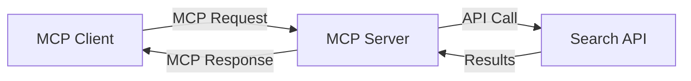
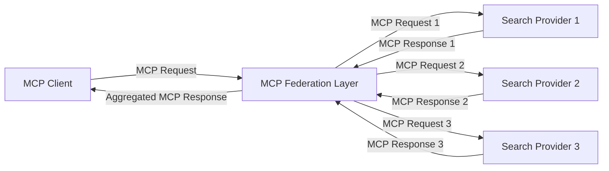
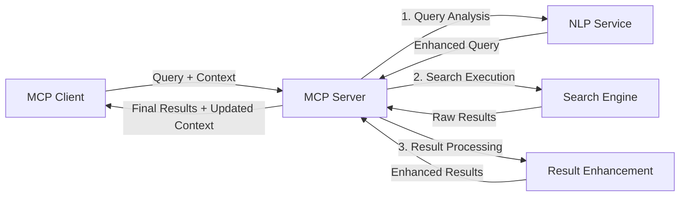

<!--
CO_OP_TRANSLATOR_METADATA:
{
  "original_hash": "333a03e51f90bdf3e6f1ba1694c73f36",
  "translation_date": "2025-07-17T05:45:30+00:00",
  "source_file": "05-AdvancedTopics/mcp-realtimesearch/README.md",
  "language_code": "el"
}
-->
## Δήλωση Αποποίησης Ευθύνης για Παραδείγματα Κώδικα

> **Σημαντική Σημείωση**: Τα παρακάτω παραδείγματα κώδικα δείχνουν την ενσωμάτωση του Model Context Protocol (MCP) με λειτουργίες αναζήτησης στο διαδίκτυο. Αν και ακολουθούν τα πρότυπα και τις δομές των επίσημων SDK του MCP, έχουν απλοποιηθεί για εκπαιδευτικούς σκοπούς.
> 
> Αυτά τα παραδείγματα παρουσιάζουν:
> 
> 1. **Υλοποίηση σε Python**: Μια υλοποίηση server FastMCP που παρέχει εργαλείο αναζήτησης στο διαδίκτυο και συνδέεται με εξωτερικό API αναζήτησης. Το παράδειγμα αυτό δείχνει σωστή διαχείριση διάρκειας ζωής, χειρισμό συμφραζομένων και υλοποίηση εργαλείων ακολουθώντας τα πρότυπα του [επίσημου MCP Python SDK](https://github.com/modelcontextprotocol/python-sdk). Ο server χρησιμοποιεί το προτεινόμενο Streamable HTTP transport, το οποίο έχει αντικαταστήσει το παλαιότερο SSE transport για παραγωγικές υλοποιήσεις.
> 
> 2. **Υλοποίηση σε JavaScript**: Μια υλοποίηση σε TypeScript/JavaScript που χρησιμοποιεί το πρότυπο FastMCP από το [επίσημο MCP TypeScript SDK](https://github.com/modelcontextprotocol/typescript-sdk) για τη δημιουργία server αναζήτησης με σωστούς ορισμούς εργαλείων και συνδέσεις πελατών. Ακολουθεί τα πιο πρόσφατα προτεινόμενα πρότυπα για διαχείριση συνεδριών και διατήρηση συμφραζομένων.
> 
> Αυτά τα παραδείγματα θα απαιτούσαν επιπλέον χειρισμό σφαλμάτων, αυθεντικοποίηση και συγκεκριμένο κώδικα ενσωμάτωσης API για χρήση σε παραγωγή. Τα σημεία πρόσβασης API αναζήτησης που εμφανίζονται (`https://api.search-service.example/search`) είναι δείγματα και θα πρέπει να αντικατασταθούν με πραγματικά σημεία πρόσβασης υπηρεσιών αναζήτησης.
> 
> Για πλήρεις λεπτομέρειες υλοποίησης και τις πιο ενημερωμένες προσεγγίσεις, παρακαλούμε ανατρέξτε στην [επίσημη προδιαγραφή MCP](https://spec.modelcontextprotocol.io/) και την τεκμηρίωση των SDK.

## Βασικές Έννοιες

### Το Πλαίσιο του Model Context Protocol (MCP)

Στη βάση του, το Model Context Protocol παρέχει έναν τυποποιημένο τρόπο για τα μοντέλα AI, τις εφαρμογές και τις υπηρεσίες να ανταλλάσσουν συμφραζόμενα. Στην αναζήτηση στο διαδίκτυο σε πραγματικό χρόνο, αυτό το πλαίσιο είναι απαραίτητο για τη δημιουργία συνεκτικών εμπειριών αναζήτησης πολλαπλών βημάτων. Βασικά στοιχεία περιλαμβάνουν:

1. **Αρχιτεκτονική Πελάτη-Εξυπηρετητή**: Το MCP καθιερώνει σαφή διαχωρισμό μεταξύ πελατών αναζήτησης (αιτούντων) και εξυπηρετητών αναζήτησης (παρόχων), επιτρέποντας ευέλικτα μοντέλα ανάπτυξης.

2. **Επικοινωνία JSON-RPC**: Το πρωτόκολλο χρησιμοποιεί JSON-RPC για ανταλλαγή μηνυμάτων, καθιστώντας το συμβατό με τεχνολογίες web και εύκολο στην υλοποίηση σε διάφορες πλατφόρμες.

3. **Διαχείριση Συμφραζομένων**: Το MCP ορίζει δομημένες μεθόδους για τη διατήρηση, ενημέρωση και αξιοποίηση των συμφραζομένων αναζήτησης σε πολλαπλές αλληλεπιδράσεις.

4. **Ορισμοί Εργαλείων**: Οι δυνατότητες αναζήτησης εκτίθενται ως τυποποιημένα εργαλεία με καλά ορισμένες παραμέτρους και τιμές επιστροφής.

5. **Υποστήριξη Ροής Δεδομένων (Streaming)**: Το πρωτόκολλο υποστηρίζει ροή αποτελεσμάτων, απαραίτητη για αναζήτηση σε πραγματικό χρόνο όπου τα αποτελέσματα μπορεί να φτάνουν σταδιακά.

### Πρότυπα Ενσωμάτωσης Αναζήτησης στο Διαδίκτυο

Κατά την ενσωμάτωση του MCP με την αναζήτηση στο διαδίκτυο, προκύπτουν διάφορα πρότυπα:

#### 1. Άμεση Ενσωμάτωση Παρόχου Αναζήτησης

Σε αυτό το πρότυπο, ο server MCP συνδέεται απευθείας με ένα ή περισσότερα API αναζήτησης, μεταφράζοντας τα αιτήματα MCP σε κλήσεις ειδικές για το API και μορφοποιώντας τα αποτελέσματα ως απαντήσεις MCP.

#### 2. Ομοσπονδιακή Αναζήτηση με Διατήρηση Συμφραζομένων

Αυτό το πρότυπο διανέμει τα ερωτήματα αναζήτησης σε πολλούς παρόχους αναζήτησης συμβατούς με MCP, καθένας από τους οποίους μπορεί να ειδικεύεται σε διαφορετικούς τύπους περιεχομένου ή δυνατότητες αναζήτησης, διατηρώντας ενιαίο συμφραζόμενο.

#### 3. Αλυσίδα Αναζήτησης με Ενισχυμένα Συμφραζόμενα

Σε αυτό το πρότυπο, η διαδικασία αναζήτησης χωρίζεται σε πολλαπλά στάδια, με τα συμφραζόμενα να εμπλουτίζονται σε κάθε βήμα, οδηγώντας σε σταδιακά πιο σχετικά αποτελέσματα.

### Συστατικά του Συμφραζόμενου Αναζήτησης

Στην αναζήτηση στο διαδίκτυο βασισμένη στο MCP, τα συμφραζόμενα συνήθως περιλαμβάνουν:

- **Ιστορικό Ερωτημάτων**: Προηγούμενα ερωτήματα αναζήτησης στη συνεδρία
- **Προτιμήσεις Χρήστη**: Γλώσσα, περιοχή, ρυθμίσεις ασφαλούς αναζήτησης
- **Ιστορικό Αλληλεπιδράσεων**: Ποια αποτελέσματα επιλέχθηκαν, χρόνος παραμονής στα αποτελέσματα
- **Παράμετροι Αναζήτησης**: Φίλτρα, σειροθέτηση και άλλοι τροποποιητές αναζήτησης
- **Γνώση Τομέα**: Συμφραζόμενα ειδικού θέματος σχετικά με την αναζήτηση
- **Χρονικό Συμφραζόμενο**: Παράγοντες σχετικότητας βάσει χρόνου
- **Προτιμήσεις Πηγών**: Αξιόπιστες ή προτιμώμενες πηγές πληροφορίας

## Περίπτωσεις Χρήσης και Εφαρμογές

### Έρευνα και Συλλογή Πληροφοριών

Το MCP βελτιώνει τις ροές εργασίας έρευνας με:

- Διατήρηση συμφραζομένων έρευνας σε συνεδρίες αναζήτησης
- Δυνατότητα πιο εξελιγμένων και συμφραζόμενων ερωτημάτων
- Υποστήριξη ομοσπονδιακής αναζήτησης από πολλαπλές πηγές
- Διευκόλυνση εξαγωγής γνώσης από τα αποτελέσματα αναζήτησης

### Παρακολούθηση Ειδήσεων και Τάσεων σε Πραγματικό Χρόνο

Η αναζήτηση με MCP προσφέρει πλεονεκτήματα για την παρακολούθηση ειδήσεων:

- Ανακάλυψη σχεδόν σε πραγματικό χρόνο αναδυόμενων ειδησεογραφικών θεμάτων
- Συμφραζόμενος φιλτράρισμα σχετικών πληροφοριών
- Παρακολούθηση θεμάτων και οντοτήτων σε πολλαπλές πηγές
- Εξατομικευμένες ειδοποιήσεις ειδήσεων βάσει συμφραζομένων χρήστη

### Περιήγηση και Έρευνα με Υποστήριξη AI

Το MCP δημιουργεί νέες δυνατότητες για περιήγηση με υποστήριξη AI:

- Συμφραζόμενες προτάσεις αναζήτησης βασισμένες στη τρέχουσα δραστηριότητα περιηγητή
- Αδιάλειπτη ενσωμάτωση αναζήτησης στο διαδίκτυο με βοηθούς βασισμένους σε LLM
- Βελτίωση αναζήτησης πολλαπλών βημάτων με διατήρηση συμφραζομένων
- Ενισχυμένος έλεγχος γεγονότων και επαλήθευση πληροφοριών

## Μελλοντικές Τάσεις και Καινοτομίες

### Εξέλιξη του MCP στην Αναζήτηση στο Διαδίκτυο

Κοιτάζοντας μπροστά, αναμένουμε το MCP να εξελιχθεί ώστε να καλύψει:

- **Πολυτροπική Αναζήτηση**: Ενσωμάτωση αναζήτησης κειμένου, εικόνας, ήχου και βίντεο με διατηρημένα συμφραζόμενα
- **Αποκεντρωμένη Αναζήτηση**: Υποστήριξη κατανεμημένων και ομοσπονδιακών οικοσυστημάτων αναζήτησης
- **Απόρρητο Αναζήτησης**: Μηχανισμοί αναζήτησης που διαφυλάσσουν το απόρρητο με επίγνωση του πλαισίου
- **Κατανόηση Ερωτήματος**: Βαθιά σημασιολογική ανάλυση φυσικών γλωσσικών ερωτημάτων αναζήτησης

### Πιθανές Εξελίξεις στην Τεχνολογία

Αναδυόμενες τεχνολογίες που θα διαμορφώσουν το μέλλον της αναζήτησης MCP:

1. **Νευρωνικές Αρχιτεκτονικές Αναζήτησης**: Συστήματα αναζήτησης βασισμένα σε ενσωματώσεις, βελτιστοποιημένα για MCP  
2. **Προσωποποιημένο Πλαίσιο Αναζήτησης**: Μάθηση ατομικών προτύπων αναζήτησης χρηστών με την πάροδο του χρόνου  
3. **Ενσωμάτωση Γραφήματος Γνώσης**: Ενισχυμένη αναζήτηση με πλαίσιο μέσω εξειδικευμένων γραφημάτων γνώσης  
4. **Δια-μορφικό Πλαίσιο**: Διατήρηση του πλαισίου ανάμεσα σε διαφορετικές μορφές αναζήτησης  

## Πρακτικές Ασκήσεις

### Άσκηση 1: Ρύθμιση Βασικής Αλυσίδας Αναζήτησης MCP

Σε αυτή την άσκηση, θα μάθετε πώς να:  
- Διαμορφώσετε ένα βασικό περιβάλλον αναζήτησης MCP  
- Υλοποιήσετε χειριστές πλαισίου για αναζήτηση στο διαδίκτυο  
- Δοκιμάσετε και επικυρώσετε τη διατήρηση του πλαισίου σε διαδοχικές αναζητήσεις  

### Άσκηση 2: Δημιουργία Βοηθού Έρευνας με MCP Αναζήτηση

Δημιουργήστε μια ολοκληρωμένη εφαρμογή που:  
- Επεξεργάζεται ερωτήσεις έρευνας σε φυσική γλώσσα  
- Εκτελεί αναζητήσεις στο διαδίκτυο με επίγνωση πλαισίου  
- Συνθέτει πληροφορίες από πολλαπλές πηγές  
- Παρουσιάζει οργανωμένα ευρήματα έρευνας  

### Άσκηση 3: Υλοποίηση Ομοσπονδίας Αναζήτησης από Πολλαπλές Πηγές με MCP

Προχωρημένη άσκηση που καλύπτει:  
- Αποστολή ερωτημάτων με επίγνωση πλαισίου σε πολλαπλές μηχανές αναζήτησης  
- Κατάταξη και συγκέντρωση αποτελεσμάτων  
- Αποφυγή διπλοτύπων αποτελεσμάτων με βάση το πλαίσιο  
- Διαχείριση μεταδεδομένων ειδικών για κάθε πηγή  

## Επιπλέον Πόροι

- [Model Context Protocol Specification](https://spec.modelcontextprotocol.io/) - Επίσημη προδιαγραφή MCP και λεπτομερής τεκμηρίωση πρωτοκόλλου  
- [Model Context Protocol Documentation](https://modelcontextprotocol.io/) - Αναλυτικά σεμινάρια και οδηγοί υλοποίησης  
- [MCP Python SDK](https://github.com/modelcontextprotocol/python-sdk) - Επίσημη υλοποίηση MCP σε Python  
- [MCP TypeScript SDK](https://github.com/modelcontextprotocol/typescript-sdk) - Επίσημη υλοποίηση MCP σε TypeScript  
- [MCP Reference Servers](https://github.com/modelcontextprotocol/servers) - Υλοποιήσεις αναφοράς για MCP servers  
- [Bing Web Search API Documentation](https://learn.microsoft.com/en-us/bing/search-apis/bing-web-search/overview) - API αναζήτησης στο διαδίκτυο της Microsoft  
- [Google Custom Search JSON API](https://developers.google.com/custom-search/v1/overview) - Προγραμματιζόμενη μηχανή αναζήτησης της Google  
- [SerpAPI Documentation](https://serpapi.com/search-api) - API για σελίδες αποτελεσμάτων μηχανών αναζήτησης  
- [Meilisearch Documentation](https://www.meilisearch.com/docs) - Ανοιχτού κώδικα μηχανή αναζήτησης  
- [Elasticsearch Documentation](https://www.elastic.co/guide/index.html) - Κατανεμημένη μηχανή αναζήτησης και ανάλυσης  
- [LangChain Documentation](https://python.langchain.com/docs/get_started/introduction) - Δημιουργία εφαρμογών με LLMs  

## Μαθησιακά Αποτελέσματα

Ολοκληρώνοντας αυτό το μάθημα, θα μπορείτε να:  

- Κατανοείτε τα βασικά της αναζήτησης στο διαδίκτυο σε πραγματικό χρόνο και τις προκλήσεις της  
- Εξηγείτε πώς το Model Context Protocol (MCP) βελτιώνει τις δυνατότητες αναζήτησης σε πραγματικό χρόνο  
- Υλοποιείτε λύσεις αναζήτησης βασισμένες σε MCP χρησιμοποιώντας δημοφιλή frameworks και APIs  
- Σχεδιάζετε και αναπτύσσετε κλιμακούμενες, υψηλής απόδοσης αρχιτεκτονικές αναζήτησης με MCP  
- Εφαρμόζετε τις έννοιες MCP σε διάφορες περιπτώσεις χρήσης, όπως σημασιολογική αναζήτηση, βοήθεια στην έρευνα και περιήγηση με υποστήριξη AI  
- Αξιολογείτε τις αναδυόμενες τάσεις και τις μελλοντικές καινοτομίες στις τεχνολογίες αναζήτησης βασισμένες σε MCP  

### Θεωρήσεις Ασφάλειας και Εμπιστοσύνης

Κατά την υλοποίηση λύσεων αναζήτησης στο διαδίκτυο βασισμένων σε MCP, θυμηθείτε τις ακόλουθες σημαντικές αρχές από την προδιαγραφή MCP:  

1. **Συναίνεση και Έλεγχος Χρήστη**: Οι χρήστες πρέπει να δίνουν ρητή συναίνεση και να κατανοούν όλες τις προσβάσεις και λειτουργίες δεδομένων. Αυτό είναι ιδιαίτερα σημαντικό για υλοποιήσεις αναζήτησης που μπορεί να έχουν πρόσβαση σε εξωτερικές πηγές δεδομένων.  

2. **Απόρρητο Δεδομένων**: Διασφαλίστε την κατάλληλη διαχείριση των ερωτημάτων και αποτελεσμάτων αναζήτησης, ειδικά όταν περιέχουν ευαίσθητες πληροφορίες. Εφαρμόστε κατάλληλους ελέγχους πρόσβασης για την προστασία των δεδομένων των χρηστών.  

3. **Ασφάλεια Εργαλείων**: Υλοποιήστε σωστή εξουσιοδότηση και επικύρωση για τα εργαλεία αναζήτησης, καθώς αποτελούν πιθανές απειλές ασφαλείας μέσω εκτέλεσης αυθαίρετου κώδικα. Οι περιγραφές της συμπεριφοράς των εργαλείων πρέπει να θεωρούνται μη αξιόπιστες εκτός αν προέρχονται από αξιόπιστο server.  

4. **Σαφής Τεκμηρίωση**: Παρέχετε ξεκάθαρη τεκμηρίωση σχετικά με τις δυνατότητες, τους περιορισμούς και τις παραμέτρους ασφαλείας της υλοποίησης αναζήτησης MCP, ακολουθώντας τις οδηγίες της προδιαγραφής MCP.  

5. **Αξιόπιστες Ροές Συναίνεσης**: Δημιουργήστε αξιόπιστες ροές συναίνεσης και εξουσιοδότησης που εξηγούν με σαφήνεια τι κάνει κάθε εργαλείο πριν την ενεργοποίηση της χρήσης του, ειδικά για εργαλεία που αλληλεπιδρούν με εξωτερικούς πόρους διαδικτύου.  

Για πλήρεις λεπτομέρειες σχετικά με την ασφάλεια και τις θεωρήσεις εμπιστοσύνης του MCP, ανατρέξτε στην [επίσημη τεκμηρίωση](https://modelcontextprotocol.io/specification/2025-03-26#security-and-trust-%26-safety).  

## Τι ακολουθεί  

- [5.12 Entra ID Authentication for Model Context Protocol Servers](../mcp-security-entra/README.md)

**Αποποίηση ευθυνών**:  
Αυτό το έγγραφο έχει μεταφραστεί χρησιμοποιώντας την υπηρεσία αυτόματης μετάφρασης AI [Co-op Translator](https://github.com/Azure/co-op-translator). Παρόλο που επιδιώκουμε την ακρίβεια, παρακαλούμε να γνωρίζετε ότι οι αυτόματες μεταφράσεις ενδέχεται να περιέχουν λάθη ή ανακρίβειες. Το πρωτότυπο έγγραφο στη γλώσσα του θεωρείται η αυθεντική πηγή. Για κρίσιμες πληροφορίες, συνιστάται επαγγελματική ανθρώπινη μετάφραση. Δεν φέρουμε ευθύνη για τυχόν παρεξηγήσεις ή λανθασμένες ερμηνείες που προκύπτουν από τη χρήση αυτής της μετάφρασης.