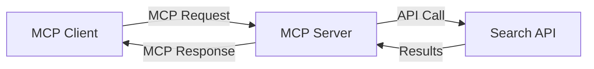
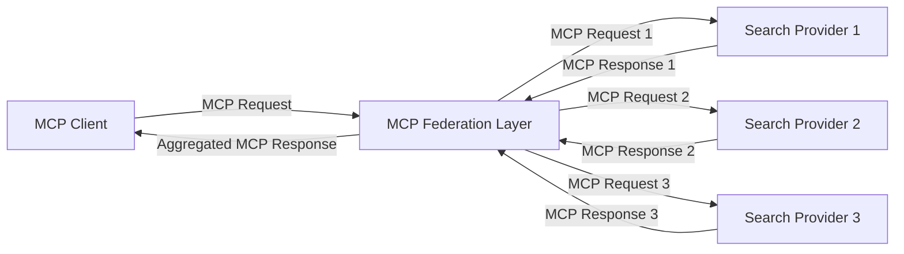
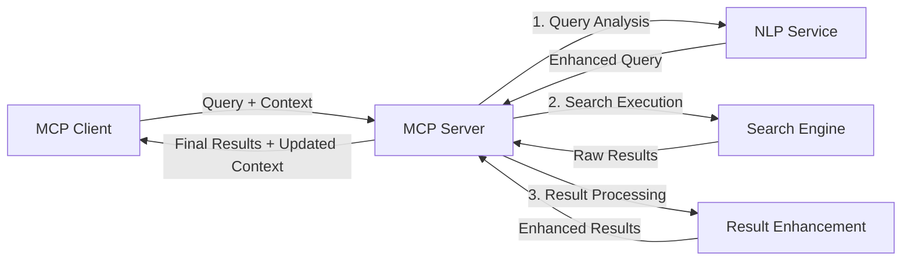

<!--
CO_OP_TRANSLATOR_METADATA:
{
  "original_hash": "16bef2c93c6a86d4ca6a8ce9e120e384",
  "translation_date": "2025-06-13T02:46:51+00:00",
  "source_file": "05-AdvancedTopics/mcp-realtimesearch/README.md",
  "language_code": "el"
}
-->
## Δήλωση Αποποίησης Ευθύνης Κώδικα

> **Σημαντική Σημείωση**: Τα παρακάτω παραδείγματα κώδικα παρουσιάζουν την ενσωμάτωση του Model Context Protocol (MCP) με λειτουργίες διαδικτυακής αναζήτησης. Αν και ακολουθούν τα πρότυπα και τις δομές των επίσημων SDK MCP, έχουν απλοποιηθεί για εκπαιδευτικούς σκοπούς.
> 
> Αυτά τα παραδείγματα παρουσιάζουν:
> 
> 1. **Υλοποίηση σε Python**: Μια υλοποίηση FastMCP server που παρέχει εργαλείο διαδικτυακής αναζήτησης και συνδέεται με εξωτερικό API αναζήτησης. Το παράδειγμα αυτό δείχνει σωστή διαχείριση του κύκλου ζωής, χειρισμό του context και υλοποίηση εργαλείου ακολουθώντας τα πρότυπα του [επίσημου MCP Python SDK](https://github.com/modelcontextprotocol/python-sdk). Ο server χρησιμοποιεί το προτεινόμενο Streamable HTTP transport, που έχει αντικαταστήσει το παλαιότερο SSE transport για παραγωγικές υλοποιήσεις.
> 
> 2. **Υλοποίηση σε JavaScript**: Μια υλοποίηση σε TypeScript/JavaScript που χρησιμοποιεί το πρότυπο FastMCP από το [επίσημο MCP TypeScript SDK](https://github.com/modelcontextprotocol/typescript-sdk) για τη δημιουργία server αναζήτησης με σωστούς ορισμούς εργαλείων και συνδέσεις πελατών. Ακολουθεί τις πιο πρόσφατες προτεινόμενες πρακτικές για διαχείριση συνεδριών και διατήρηση context.
> 
> Αυτά τα παραδείγματα απαιτούν επιπλέον χειρισμό σφαλμάτων, αυθεντικοποίηση και συγκεκριμένο κώδικα ενσωμάτωσης API για χρήση σε παραγωγή. Τα API endpoints αναζήτησης που εμφανίζονται (`https://api.search-service.example/search`) είναι δείγματα και θα πρέπει να αντικατασταθούν με πραγματικά endpoints υπηρεσιών αναζήτησης.
> 
> Για πλήρεις λεπτομέρειες υλοποίησης και τις πιο ενημερωμένες προσεγγίσεις, ανατρέξτε στο [επίσημο MCP specification](https://spec.modelcontextprotocol.io/) και την τεκμηρίωση SDK.

## Βασικές Έννοιες

### Το Πλαίσιο Model Context Protocol (MCP)

Στον πυρήνα του, το Model Context Protocol παρέχει έναν τυποποιημένο τρόπο για ανταλλαγή context μεταξύ AI μοντέλων, εφαρμογών και υπηρεσιών. Στην πραγματικού χρόνου διαδικτυακή αναζήτηση, αυτό το πλαίσιο είναι απαραίτητο για τη δημιουργία συνεκτικών, πολύ-βηματικών εμπειριών αναζήτησης. Κύρια συστατικά περιλαμβάνουν:

1. **Αρχιτεκτονική Πελάτη-Εξυπηρετητή**: Το MCP καθιερώνει σαφή διαχωρισμό μεταξύ πελατών αναζήτησης (αιτούντων) και εξυπηρετητών αναζήτησης (παρόχων), επιτρέποντας ευέλικτα μοντέλα ανάπτυξης.

2. **Επικοινωνία JSON-RPC**: Το πρωτόκολλο χρησιμοποιεί JSON-RPC για ανταλλαγή μηνυμάτων, καθιστώντας το συμβατό με τεχνολογίες web και εύκολο στην υλοποίηση σε διάφορες πλατφόρμες.

3. **Διαχείριση Context**: Το MCP ορίζει δομημένες μεθόδους για τη διατήρηση, ενημέρωση και αξιοποίηση του context αναζήτησης μέσα από πολλαπλές αλληλεπιδράσεις.

4. **Ορισμοί Εργαλείων**: Οι δυνατότητες αναζήτησης εκτίθενται ως τυποποιημένα εργαλεία με καλά ορισμένες παραμέτρους και τιμές επιστροφής.

5. **Υποστήριξη Streaming**: Το πρωτόκολλο υποστηρίζει ροή αποτελεσμάτων, κρίσιμη για αναζήτηση σε πραγματικό χρόνο όπου τα αποτελέσματα μπορεί να φτάνουν προοδευτικά.

### Πρότυπα Ενσωμάτωσης Διαδικτυακής Αναζήτησης

Κατά την ενσωμάτωση του MCP με διαδικτυακή αναζήτηση, αναδύονται διάφορα πρότυπα:

#### 1. Άμεση Ενσωμάτωση Παρόχου Αναζήτησης

Σε αυτό το πρότυπο, ο MCP server αλληλεπιδρά απευθείας με ένα ή περισσότερα API αναζήτησης, μετατρέποντας αιτήματα MCP σε κλήσεις ειδικές για το API και μορφοποιώντας τα αποτελέσματα ως απαντήσεις MCP.

#### 2. Ομοσπονδιακή Αναζήτηση με Διατήρηση Context

Αυτό το πρότυπο διανέμει τα ερωτήματα αναζήτησης σε πολλούς MCP-συμβατούς παρόχους, ο καθένας ενδεχομένως εξειδικευμένος σε διαφορετικούς τύπους περιεχομένου ή δυνατοτήτων αναζήτησης, ενώ διατηρεί ενιαίο context.

#### 3. Αλυσίδα Αναζήτησης με Ενισχυμένο Context

Σε αυτό το πρότυπο, η διαδικασία αναζήτησης χωρίζεται σε πολλαπλά στάδια, με το context να εμπλουτίζεται σε κάθε βήμα, οδηγώντας σε ολοένα πιο συναφή αποτελέσματα.

### Συστατικά του Context Αναζήτησης

Στην διαδικτυακή αναζήτηση βάσει MCP, το context συνήθως περιλαμβάνει:

- **Ιστορικό Ερωτημάτων**: Προηγούμενα ερωτήματα αναζήτησης στη συνεδρία
- **Προτιμήσεις Χρήστη**: Γλώσσα, περιοχή, ρυθμίσεις ασφαλούς αναζήτησης
- **Ιστορικό Αλληλεπιδράσεων**: Ποια αποτελέσματα επιλέχθηκαν, χρόνος παραμονής σε αποτελέσματα
- **Παράμετροι Αναζήτησης**: Φίλτρα, σειρές ταξινόμησης και άλλοι τροποποιητές αναζήτησης
- **Γνώση Τομέα**: Σχετικό context ειδικού θέματος
- **Χρονικό Context**: Παράγοντες σχετικότητας με βάση το χρόνο
- **Προτιμήσεις Πηγών**: Αξιόπιστες ή προτιμώμενες πηγές πληροφορίας

## Περιπτώσεις Χρήσης και Εφαρμογές

### Έρευνα και Συλλογή Πληροφοριών

Το MCP βελτιώνει τις ροές εργασίας έρευνας μέσω:

- Διατήρησης του context έρευνας σε συνεδρίες αναζήτησης
- Δυνατότητας πιο εξελιγμένων και σχετικών ερωτημάτων βάσει context
- Υποστήριξης ομοσπονδιακής αναζήτησης από πολλαπλές πηγές
- Διευκόλυνσης εξαγωγής γνώσης από αποτελέσματα αναζήτησης

### Παρακολούθηση Ειδήσεων και Τάσεων σε Πραγματικό Χρόνο

Η αναζήτηση με MCP προσφέρει πλεονεκτήματα για παρακολούθηση ειδήσεων:

- Ανακάλυψη ειδήσεων σχεδόν σε πραγματικό χρόνο
- Φιλτράρισμα σχετικών πληροφοριών βάσει context
- Παρακολούθηση θεμάτων και οντοτήτων από πολλαπλές πηγές
- Εξατομικευμένες ειδοποιήσεις ειδήσεων με βάση το context χρήστη

### Περιήγηση και Έρευνα με Ενίσχυση από AI

Το MCP δημιουργεί νέες δυνατότητες για περιήγηση με AI:

- Προτάσεις αναζήτησης βάσει τρέχουσας δραστηριότητας περιηγητή
- Ομαλή ενσωμάτωση διαδικτυακής αναζήτησης με βοηθούς βασισμένους σε LLM
- Πολύ-βηματική βελτίωση αναζήτησης με διατήρηση context
- Ενισχυμένος έλεγχος γεγονότων και επαλήθευση πληροφοριών

## Μελλοντικές Τάσεις και Καινοτομίες

### Εξέλιξη του MCP στη Διαδικτυακή Αναζήτηση

Προβλέπουμε ότι το MCP θα εξελιχθεί για να καλύψει:

- **Πολυτροπική Αναζήτηση**: Ενσωμάτωση κειμένου, εικόνας, ήχου και βίντεο με διατηρημένο context
- **Αποκεντρωμένη Αναζήτηση**: Υποστήριξη κατανεμημένων και ομοσπονδιακών οικοσυστημάτων αναζήτησης
- **Απόρρητο Αναζήτησης**: Μηχανισμοί αναζήτησης που σέβονται το απόρρητο με γνώση context
- **Κατανόηση Ερωτημάτων**: Βαθιά σημασιολογική ανάλυση φυσικής γλώσσας στα ερωτήματα αναζήτησης

### Πιθανές Τεχνολογικές Προόδους

Αναδυόμενες τεχνολογίες που θα διαμορφώσουν το μέλλον του MCP:

1. **Νευρωνικές Αρχιτεκτονικές Αναζήτησης**: Συστήματα αναζήτησης βασισμένα σε ενσωματώσεις βελτιστοποιημένα για MCP
2. **Προσωποποιημένο Context Αναζήτησης**: Μάθηση προτύπων αναζήτησης κάθε χρήστη με το χρόνο
3. **Ενσωμάτωση Γραφήματος Γνώσης**: Ενισχυμένη αναζήτηση με γραφήματα γνώσης ειδικών τομέων
4. **Δια-τροπικό Context**: Διατήρηση context μεταξύ διαφορετικών μορφών αναζήτησης

## Πρακτικές Ασκήσεις

### Άσκηση 1: Ρύθμιση Βασικού Σωλήνα Αναζήτησης MCP

Σε αυτή την άσκηση θα μάθετε να:
- Διαμορφώνετε ένα βασικό περιβάλλον αναζήτησης MCP
- Υλοποιείτε χειριστές context για διαδικτυακή αναζήτηση
- Δοκιμάζετε και επαληθεύετε τη διατήρηση context σε επαναλαμβανόμενες αναζητήσεις

### Άσκηση 2: Δημιουργία Βοηθού Έρευνας με MCP Αναζήτηση

Δημιουργήστε μια πλήρη εφαρμογή που:
- Επεξεργάζεται ερωτήσεις έρευνας σε φυσική γλώσσα
- Εκτελεί αναζητήσεις στο web με επίγνωση context
- Συνθέτει πληροφορίες από πολλαπλές πηγές
- Παρουσιάζει οργανωμένα ευρήματα έρευνας

### Άσκηση 3: Υλοποίηση Ομοσπονδιακής Αναζήτησης Πολλαπλών Πηγών με MCP

Προχωρημένη άσκηση που καλύπτει:
- Αποστολή ερωτημάτων με επίγνωση context σε πολλαπλές μηχανές αναζήτησης
- Κατάταξη και συγχώνευση αποτελεσμάτων
- Αποφυγή διπλοεγγραφών βάσει context
- Διαχείριση μεταδεδομένων πηγής

## Επιπλέον Πόροι

- [Προδιαγραφή Model Context Protocol](https://spec.modelcontextprotocol.io/) - Επίσημη προδιαγραφή MCP και λεπτομερής τεκμηρίωση πρωτοκόλλου
- [Τεκμηρίωση Model Context Protocol](https://modelcontextprotocol.io/) - Αναλυτικά tutorials και οδηγοί υλοποίησης
- [MCP Python SDK](https://github.com/modelcontextprotocol/python-sdk) - Επίσημη Python υλοποίηση του MCP πρωτοκόλλου
- [MCP TypeScript SDK](https://github.com/modelcontextprotocol/typescript-sdk) - Επίσημη TypeScript υλοποίηση του MCP πρωτοκόλλου
- [MCP Αναφορικοί Servers](https://github.com/modelcontextprotocol/servers) - Αναφορικές υλοποιήσεις MCP servers
- [Bing Web Search API Documentation](https://learn.microsoft.com/en-us/bing/search-apis/bing-web-search/overview) - Το API διαδικτυακής αναζήτησης της Microsoft
- [Google Custom Search JSON API](https://developers.google.com/custom-search/v1/overview) - Το προγραμματιζόμενο μηχανισμό αναζήτησης της Google
- [SerpAPI Documentation](https://serpapi.com/search-api) - API σελίδας αποτελεσμάτων μηχανής αναζήτησης
- [Meilisearch Documentation](https://www.meilisearch.com/docs) - Ανοιχτού κώδικα μηχανή αναζήτησης
- [Elasticsearch Documentation](https://www.elastic.co/guide/index.html) - Κατανεμημένη μηχανή αναζήτησης και ανάλυσης
- [LangChain Documentation](https://python.langchain.com/docs/get_started/introduction) - Δημιουργία εφαρμογών με LLMs

## Μαθησιακά Αποτελέσματα

Ολοκληρώνοντας αυτή τη μονάδα, θα μπορείτε να:

- Κατανοείτε τα βασικά της διαδικτυακής αναζήτησης σε πραγματικό χρόνο και τις προκλήσεις της
- Εξηγείτε πώς το Model Context Protocol (MCP) βελτιώνει τις δυνατότητες της διαδικτυακής αναζήτησης σε πραγματικό χρόνο
- Υλοποιείτε λύσεις αναζήτησης βασισμένες σε MCP χρησιμοποιώντας δημοφιλή frameworks και APIs
- Σχεδιάζετε και αναπτύσσετε κλιμακούμενες, υψηλής απόδοσης αρχιτεκτονικές αναζήτησης με MCP
- Εφαρμόζετε τις έννοιες MCP σε διάφορες περιπτώσεις χρήσης όπως σημασιολογική αναζήτηση, βοηθούς έρευνας και περιήγηση με ενίσχυση AI
- Αξιολογείτε τις αναδυόμενες τάσεις και μελλοντικές καινοτομίες σε τεχνολογίες αναζήτησης βάσει MCP

### Θεωρήσεις Ασφάλειας και Εμπιστοσύνης

Κατά την υλοποίηση λύσεων διαδικτυακής αναζήτησης με βάση MCP, θυμηθείτε αυτές τις σημαντικές αρχές από την προδιαγραφή MCP:

1. **Συναίνεση και Έλεγχος Χρήστη**: Οι χρήστες πρέπει να δίνουν ρητή συναίνεση και να κατανοούν όλες τις προσβάσεις και λειτουργίες δεδομένων. Αυτό είναι ιδιαίτερα σημαντικό για υλοποιήσεις διαδικτυακής αναζήτησης που ενδέχεται να προσπελαύνουν εξωτερικές πηγές δεδομένων.

2. **Απόρρητο Δεδομένων**: Διασφαλίστε κατάλληλο χειρισμό των ερωτημάτων και αποτελεσμάτων αναζήτησης, ειδικά όταν περιέχουν ευαίσθητες πληροφορίες. Εφαρμόστε ελέγχους πρόσβασης για την προστασία των δεδομένων χρήστη.

3. **Ασφάλεια Εργαλείων**: Υλοποιήστε σωστή εξουσιοδότηση και επικύρωση για τα εργαλεία αναζήτησης, καθώς αποτελούν πιθανές πηγές κινδύνου μέσω εκτέλεσης αυθαίρετου κώδικα. Οι περιγραφές συμπεριφοράς εργαλείων πρέπει να θεωρούνται μη αξιόπιστες εκτός αν προέρχονται από αξιόπιστο server.

4. **Σαφής Τεκμηρίωση**: Παρέχετε ξεκάθαρη τεκμηρίωση για τις δυνατότητες, τους περιορισμούς και τις ασφαλιστικές σκέψεις της υλοποίησής σας, ακολουθώντας τις οδηγίες της προδιαγραφής MCP.

5. **Ανθεκτικές Ροές Συναίνεσης**: Δημιουργήστε ανθεκτικές ροές συναίνεσης και εξουσιοδότησης που εξηγούν σαφώς τι κάνει κάθε εργαλείο πριν την ενεργοποίηση, ειδικά για εργαλεία που αλληλεπιδρούν με εξωτερικούς διαδικτυακούς πόρους.

Για πλήρεις λεπτομέρειες σχετικά με την ασφάλεια και τις θεωρήσεις εμπιστοσύνης του MCP, ανατρέξτε στην [επίσημη τεκμηρίωση](https://modelcontextprotocol.io/specification/2025-03-26#security-and-trust-%26-safety).

## Τι Ακολουθεί

- [6. Συμβολές Κοινότητας](../../06-CommunityContributions/README.md)

**Αποποίηση Ευθύνης**:  
Αυτό το έγγραφο έχει μεταφραστεί χρησιμοποιώντας την υπηρεσία μετάφρασης με τεχνητή νοημοσύνη [Co-op Translator](https://github.com/Azure/co-op-translator). Παρόλο που επιδιώκουμε ακρίβεια, παρακαλούμε να γνωρίζετε ότι οι αυτοματοποιημένες μεταφράσεις μπορεί να περιέχουν λάθη ή ανακρίβειες. Το πρωτότυπο έγγραφο στη μητρική του γλώσσα πρέπει να θεωρείται η αυθεντική πηγή. Για κρίσιμες πληροφορίες, συνιστάται επαγγελματική μετάφραση από ανθρώπινο μεταφραστή. Δεν φέρουμε ευθύνη για τυχόν παρεξηγήσεις ή λανθασμένες ερμηνείες που προκύπτουν από τη χρήση αυτής της μετάφρασης.