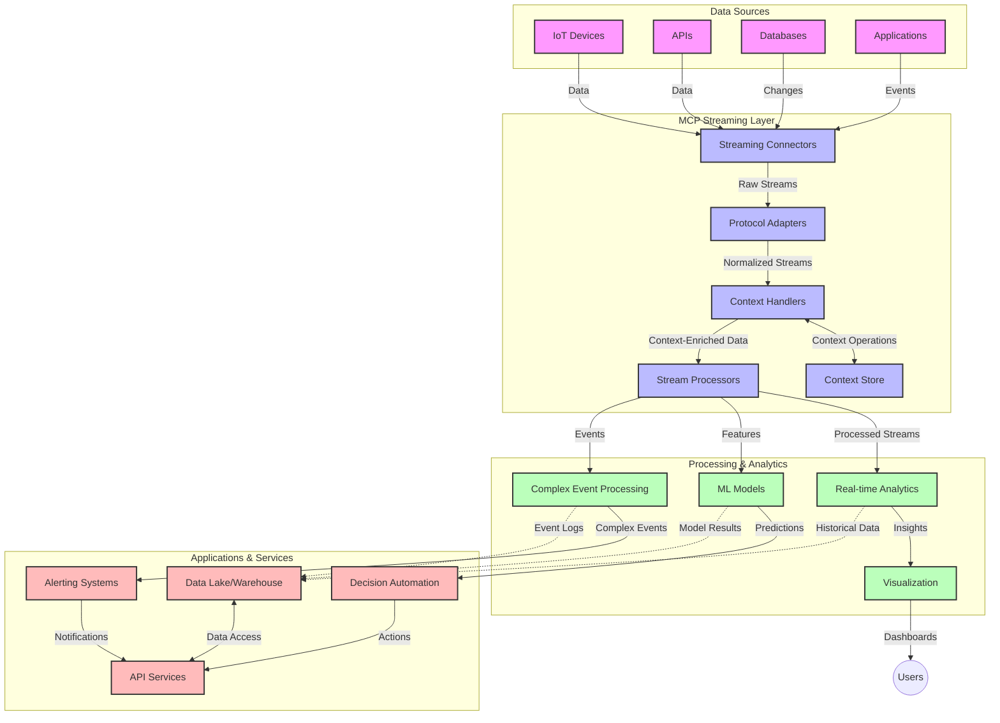

<!--
CO_OP_TRANSLATOR_METADATA:
{
  "original_hash": "195f7287638b77a549acadd96c8f981c",
  "translation_date": "2025-07-14T01:41:00+00:00",
  "source_file": "05-AdvancedTopics/mcp-realtimestreaming/README.md",
  "language_code": "el"
}
-->
# Πρωτόκολλο Πλαισίου Μοντέλου για Ροή Δεδομένων σε Πραγματικό Χρόνο

## Επισκόπηση

Η ροή δεδομένων σε πραγματικό χρόνο έχει γίνει απαραίτητη στον σημερινό κόσμο που βασίζεται στα δεδομένα, όπου επιχειρήσεις και εφαρμογές χρειάζονται άμεση πρόσβαση σε πληροφορίες για να λαμβάνουν έγκαιρες αποφάσεις. Το Πρωτόκολλο Πλαισίου Μοντέλου (MCP) αποτελεί σημαντική πρόοδο στην βελτιστοποίηση αυτών των διαδικασιών ροής σε πραγματικό χρόνο, ενισχύοντας την αποδοτικότητα της επεξεργασίας δεδομένων, διατηρώντας την ακεραιότητα του πλαισίου και βελτιώνοντας τη συνολική απόδοση του συστήματος.

Αυτό το module εξερευνά πώς το MCP μετασχηματίζει τη ροή δεδομένων σε πραγματικό χρόνο παρέχοντας μια τυποποιημένη προσέγγιση στη διαχείριση πλαισίου ανάμεσα σε μοντέλα AI, πλατφόρμες ροής και εφαρμογές.

## Εισαγωγή στη Ροή Δεδομένων σε Πραγματικό Χρόνο

Η ροή δεδομένων σε πραγματικό χρόνο είναι ένα τεχνολογικό παράδειγμα που επιτρέπει τη συνεχή μεταφορά, επεξεργασία και ανάλυση δεδομένων καθώς αυτά παράγονται, δίνοντας τη δυνατότητα στα συστήματα να αντιδρούν άμεσα σε νέες πληροφορίες. Σε αντίθεση με την παραδοσιακή επεξεργασία παρτίδων που λειτουργεί σε στατικά σύνολα δεδομένων, η ροή επεξεργάζεται δεδομένα εν κινήσει, παρέχοντας γνώσεις και ενέργειες με ελάχιστη καθυστέρηση.

### Βασικές Έννοιες της Ροής Δεδομένων σε Πραγματικό Χρόνο:

- **Συνεχής Ροή Δεδομένων**: Τα δεδομένα επεξεργάζονται ως μια συνεχής, ατελείωτη ροή γεγονότων ή εγγραφών.
- **Επεξεργασία Χαμηλής Καθυστέρησης**: Τα συστήματα σχεδιάζονται για να ελαχιστοποιούν το χρόνο μεταξύ παραγωγής και επεξεργασίας των δεδομένων.
- **Κλιμακωσιμότητα**: Οι αρχιτεκτονικές ροής πρέπει να διαχειρίζονται μεταβλητούς όγκους και ταχύτητες δεδομένων.
- **Ανθεκτικότητα σε Σφάλματα**: Τα συστήματα πρέπει να είναι ανθεκτικά σε αποτυχίες για να εξασφαλίζουν αδιάλειπτη ροή δεδομένων.
- **Κατάσταση Επεξεργασίας**: Η διατήρηση του πλαισίου ανάμεσα στα γεγονότα είναι κρίσιμη για ουσιαστική ανάλυση.

### Το Πρωτόκολλο Πλαισίου Μοντέλου και η Ροή σε Πραγματικό Χρόνο

Το Πρωτόκολλο Πλαισίου Μοντέλου (MCP) αντιμετωπίζει αρκετές κρίσιμες προκλήσεις σε περιβάλλοντα ροής σε πραγματικό χρόνο:

1. **Συνεχής Πλαίσιο**: Το MCP τυποποιεί τον τρόπο διατήρησης του πλαισίου ανάμεσα σε κατανεμημένα στοιχεία ροής, εξασφαλίζοντας ότι τα μοντέλα AI και οι κόμβοι επεξεργασίας έχουν πρόσβαση σε σχετικό ιστορικό και περιβαλλοντικό πλαίσιο.

2. **Αποδοτική Διαχείριση Κατάστασης**: Παρέχοντας δομημένους μηχανισμούς για τη μετάδοση πλαισίου, το MCP μειώνει το φόρτο διαχείρισης κατάστασης στις ροές δεδομένων.

3. **Διαλειτουργικότητα**: Το MCP δημιουργεί μια κοινή γλώσσα για την ανταλλαγή πλαισίου μεταξύ διαφορετικών τεχνολογιών ροής και μοντέλων AI, επιτρέποντας πιο ευέλικτες και επεκτάσιμες αρχιτεκτονικές.

4. **Βελτιστοποιημένο Πλαίσιο για Ροή**: Οι υλοποιήσεις MCP μπορούν να δώσουν προτεραιότητα στα πιο σημαντικά στοιχεία πλαισίου για τη λήψη αποφάσεων σε πραγματικό χρόνο, βελτιστοποιώντας τόσο την απόδοση όσο και την ακρίβεια.

5. **Προσαρμοστική Επεξεργασία**: Με σωστή διαχείριση πλαισίου μέσω MCP, τα συστήματα ροής μπορούν να προσαρμόζουν δυναμικά την επεξεργασία βάσει εξελισσόμενων συνθηκών και προτύπων στα δεδομένα.

Σε σύγχρονες εφαρμογές, από δίκτυα αισθητήρων IoT μέχρι πλατφόρμες χρηματοοικονομικών συναλλαγών, η ενσωμάτωση του MCP με τεχνολογίες ροής επιτρέπει πιο έξυπνη, με επίγνωση πλαισίου επεξεργασία που ανταποκρίνεται κατάλληλα σε πολύπλοκες, εξελισσόμενες καταστάσεις σε πραγματικό χρόνο.

## Στόχοι Μάθησης

Στο τέλος αυτού του μαθήματος, θα μπορείτε να:

- Κατανοείτε τα βασικά της ροής δεδομένων σε πραγματικό χρόνο και τις προκλήσεις της
- Εξηγείτε πώς το Πρωτόκολλο Πλαισίου Μοντέλου (MCP) βελτιώνει τη ροή δεδομένων σε πραγματικό χρόνο
- Υλοποιείτε λύσεις ροής βασισμένες σε MCP χρησιμοποιώντας δημοφιλή frameworks όπως Kafka και Pulsar
- Σχεδιάζετε και αναπτύσσετε ανθεκτικές σε σφάλματα, υψηλής απόδοσης αρχιτεκτονικές ροής με MCP
- Εφαρμόζετε έννοιες MCP σε περιπτώσεις χρήσης IoT, χρηματοοικονομικών συναλλαγών και αναλύσεων με AI
- Αξιολογείτε αναδυόμενες τάσεις και μελλοντικές καινοτομίες σε τεχνολογίες ροής βασισμένες σε MCP

### Ορισμός και Σημασία

Η ροή δεδομένων σε πραγματικό χρόνο περιλαμβάνει τη συνεχή δημιουργία, επεξεργασία και παράδοση δεδομένων με ελάχιστη καθυστέρηση. Σε αντίθεση με την επεξεργασία παρτίδων, όπου τα δεδομένα συλλέγονται και επεξεργάζονται σε ομάδες, τα δεδομένα ροής επεξεργάζονται σταδιακά καθώς φτάνουν, επιτρέποντας άμεσες γνώσεις και ενέργειες.

Βασικά χαρακτηριστικά της ροής δεδομένων σε πραγματικό χρόνο:

- **Χαμηλή Καθυστέρηση**: Επεξεργασία και ανάλυση δεδομένων μέσα σε χιλιοστά του δευτερολέπτου έως δευτερόλεπτα
- **Συνεχής Ροή**: Αδιάλειπτες ροές δεδομένων από διάφορες πηγές
- **Άμεση Επεξεργασία**: Ανάλυση δεδομένων καθώς φτάνουν και όχι σε παρτίδες
- **Αρχιτεκτονική με Βάση τα Γεγονότα**: Ανταπόκριση σε γεγονότα καθώς συμβαίνουν

### Προκλήσεις στην Παραδοσιακή Ροή Δεδομένων

Οι παραδοσιακές προσεγγίσεις ροής δεδομένων αντιμετωπίζουν αρκετούς περιορισμούς:

1. **Απώλεια Πλαισίου**: Δυσκολία στη διατήρηση πλαισίου σε κατανεμημένα συστήματα
2. **Προβλήματα Κλιμάκωσης**: Δυσκολίες στην κλιμάκωση για διαχείριση μεγάλου όγκου και ταχύτητας δεδομένων
3. **Πολυπλοκότητα Ενσωμάτωσης**: Προβλήματα διαλειτουργικότητας μεταξύ διαφορετικών συστημάτων
4. **Διαχείριση Καθυστέρησης**: Ισορροπία μεταξύ διαμέσου ρυθμού και χρόνου επεξεργασίας
5. **Συνέπεια Δεδομένων**: Εξασφάλιση ακρίβειας και πληρότητας δεδομένων σε όλη τη ροή

## Κατανόηση του Πρωτοκόλλου Πλαισίου Μοντέλου (MCP)

### Τι είναι το MCP;

Το Πρωτόκολλο Πλαισίου Μοντέλου (MCP) είναι ένα τυποποιημένο πρωτόκολλο επικοινωνίας σχεδιασμένο να διευκολύνει την αποδοτική αλληλεπίδραση μεταξύ μοντέλων AI και εφαρμογών. Στο πλαίσιο της ροής δεδομένων σε πραγματικό χρόνο, το MCP παρέχει ένα πλαίσιο για:

- Διατήρηση του πλαισίου σε όλη τη ροή δεδομένων
- Τυποποίηση μορφών ανταλλαγής δεδομένων
- Βελτιστοποίηση της μετάδοσης μεγάλων συνόλων δεδομένων
- Ενίσχυση της επικοινωνίας μοντέλου προς μοντέλο και μοντέλου προς εφαρμογή

### Βασικά Συστατικά και Αρχιτεκτονική

Η αρχιτεκτονική MCP για ροή σε πραγματικό χρόνο αποτελείται από αρκετά βασικά στοιχεία:

1. **Διαχειριστές Πλαισίου**: Διαχειρίζονται και διατηρούν πληροφορίες πλαισίου σε όλη τη ροή
2. **Επεξεργαστές Ροής**: Επεξεργάζονται εισερχόμενες ροές δεδομένων με τεχνικές επίγνωσης πλαισίου
3. **Πρωτόκολλα Προσαρμογείς**: Μετατρέπουν μεταξύ διαφορετικών πρωτοκόλλων ροής διατηρώντας το πλαίσιο
4. **Αποθήκη Πλαισίου**: Αποθηκεύει και ανακτά αποδοτικά πληροφορίες πλαισίου
5. **Συνδετήρες Ροής**: Συνδέονται με διάφορες πλατφόρμες ροής (Kafka, Pulsar, Kinesis κ.ά.)



### Πώς το MCP Βελτιώνει τη Διαχείριση Δεδομένων σε Πραγματικό Χρόνο

Το MCP αντιμετωπίζει τις παραδοσιακές προκλήσεις ροής μέσω:

- **Ακεραιότητας Πλαισίου**: Διατήρηση σχέσεων μεταξύ δεδομένων σε όλη τη ροή
- **Βελτιστοποιημένη Μετάδοση**: Μείωση πλεονασμού στην ανταλλαγή δεδομένων μέσω έξυπνης διαχείρισης πλαισίου
- **Τυποποιημένα Interfaces**: Παροχή συνεπών APIs για τα στοιχεία ροής
- **Μείωση Καθυστέρησης**: Ελαχιστοποίηση του φόρτου επεξεργασίας μέσω αποδοτικής διαχείρισης πλαισίου
- **Ενισχυμένη Κλιμακωσιμότητα**: Υποστήριξη οριζόντιας κλιμάκωσης διατηρώντας το πλαίσιο

## Ενσωμάτωση και Υλοποίηση

Τα συστήματα ροής δεδομένων σε πραγματικό χρόνο απαιτούν προσεκτικό σχεδιασμό αρχιτεκτονικής και υλοποίηση για τη διατήρηση τόσο της απόδοσης όσο και της ακεραιότητας πλαισίου. Το Πρωτόκολλο Πλαισίου Μοντέλου προσφέρει μια τυποποιημένη προσέγγιση για την ενσωμάτωση μοντέλων AI και τεχνολογιών ροής, επιτρέποντας πιο εξελιγμένες, με επίγνωση πλαισίου, γραμμές επεξεργασίας.

### Επισκόπηση Ενσωμάτωσης MCP σε Αρχιτεκτονικές Ροής

Η υλοποίηση MCP σε περιβάλλοντα ροής σε πραγματικό χρόνο περιλαμβάνει βασικές παραμέτρους:

1. **Σειριοποίηση και Μεταφορά Πλαισίου**: Το MCP παρέχει αποδοτικούς μηχανισμούς κωδικοποίησης πληροφοριών πλαισίου μέσα σε πακέτα δεδομένων ροής, εξασφαλίζοντας ότι το απαραίτητο πλαίσιο ακολουθεί τα δεδομένα σε όλη τη γραμμή επεξεργασίας. Αυτό περιλαμβάνει τυποποιημένες μορφές σειριοποίησης βελτιστοποιημένες για μεταφορά ροής.

2. **Κατάσταση Επεξεργασίας Ροής**: Το MCP επιτρέπει πιο έξυπνη επεξεργασία με διατήρηση κατάστασης, διατηρώντας συνεπή αναπαράσταση πλαισίου ανάμεσα σε κόμβους επεξεργασίας. Αυτό είναι ιδιαίτερα χρήσιμο σε κατανεμημένες αρχιτεκτονικές ροής όπου η διαχείριση κατάστασης είναι παραδοσιακά δύσκολη.

3. **Χρόνος Γεγονότος έναντι Χρόνου Επεξεργασίας**: Οι υλοποιήσεις MCP σε συστήματα ροής πρέπει να αντιμετωπίζουν την κοινή πρόκληση διάκρισης μεταξύ του πότε συνέβησαν τα γεγονότα και πότε επεξεργάστηκαν. Το πρωτόκολλο μπορεί να ενσωματώνει χρονικό πλαίσιο που διατηρεί τη σημασιολογία του χρόνου γεγονότος.

4. **Διαχείριση Πίεσης Πίσω (Backpressure)**: Με την τυποποίηση της διαχείρισης πλαισίου, το MCP βοηθά στη διαχείριση της πίεσης πίσω στα συστήματα ροής, επιτρέποντας στα στοιχεία να επικοινωνούν τις δυνατότητες επεξεργασίας τους και να προσαρμόζουν τη ροή αναλόγως.

5. **Παράθυρα Πλαισίου και Συγκέντρωση**: Το MCP διευκολύνει πιο εξελιγμένες λειτουργίες παραθύρων παρέχοντας δομημένες αναπαραστάσεις χρονικών και σχεσιακών πλαισίων, επιτρέποντας πιο ουσιαστικές συγκεντρώσεις σε ροές γεγονότων.

6. **Ακριβώς Μία Φορά Επεξεργασία**: Σε συστήματα ροής που απαιτούν ακριβώς-μία-φορά σημασιολογία, το MCP μπορεί να ενσωματώνει μεταδεδομένα επεξεργασίας για να βοηθά στην παρακολούθηση και επαλήθευση της κατάστασης επεξεργασίας σε κατανεμημένα στοιχεία.

Η υλοποίηση του MCP σε διάφορες τεχνολογίες ροής δημιουργεί μια ενιαία προσέγγιση στη διαχείριση πλαισίου, μειώνοντας την ανάγκη για προσαρμοσμένο κώδικα ενσωμάτωσης ενώ ενισχύει την ικανότητα του συστήματος να διατηρεί ουσιαστικό πλαίσιο καθώς τα δεδομένα ρέουν μέσα στη γραμμή επεξεργασίας.

### MCP σε Διάφορα Frameworks Ροής Δεδομένων

Αυτά τα παραδείγματα ακολουθούν την τρέχουσα προδιαγραφή MCP που εστιάζει σε ένα πρωτόκολλο βασισμένο σε JSON-RPC με διακριτούς μηχανισμούς μεταφοράς. Ο κώδικας δείχνει πώς μπορείτε να υλοποιήσετε προσαρμοσμένες μεταφορές που ενσωματώνουν πλατφόρμες ροής όπως Kafka και Pulsar διατηρώντας πλήρη συμβατότητα με το πρωτόκολλο MCP.

Τα παραδείγματα έχουν σχεδιαστεί για να δείξουν πώς οι πλατφόρμες ροής μπορούν να ενσωματωθούν με το MCP για να παρέχουν επεξεργασία δεδομένων σε πραγματικό χρόνο διατηρώντας την επίγνωση πλαισίου που είναι κεντρική στο MCP. Αυτή η προσέγγιση εξασφαλίζει ότι τα δείγματα κώδικα αντικατοπτρίζουν με ακρίβεια την τρέχουσα κατάσταση της προδιαγραφής MCP έως τον Ιούνιο του 2025.

Το MCP μπορεί να ενσωματωθεί με δημοφιλή frameworks ροής όπως:

#### Ενσωμάτωση Apache Kafka

```python
import asyncio
import json
from typing import Dict, Any, Optional
from confluent_kafka import Consumer, Producer, KafkaError
from mcp.client import Client, ClientCapabilities
from mcp.core.message import JsonRpcMessage
from mcp.core.transports import Transport

# Custom transport class to bridge MCP with Kafka
class KafkaMCPTransport(Transport):
    def __init__(self, bootstrap_servers: str, input_topic: str, output_topic: str):
        self.bootstrap_servers = bootstrap_servers
        self.input_topic = input_topic
        self.output_topic = output_topic
        self.producer = Producer({'bootstrap.servers': bootstrap_servers})
        self.consumer = Consumer({
            'bootstrap.servers': bootstrap_servers,
            'group.id': 'mcp-client-group',
            'auto.offset.reset': 'earliest'
        })
        self.message_queue = asyncio.Queue()
        self.running = False
        self.consumer_task = None
        
    async def connect(self):
        """Connect to Kafka and start consuming messages"""
        self.consumer.subscribe([self.input_topic])
        self.running = True
        self.consumer_task = asyncio.create_task(self._consume_messages())
        return self
        
    async def _consume_messages(self):
        """Background task to consume messages from Kafka and queue them for processing"""
        while self.running:
            try:
                msg = self.consumer.poll(1.0)
                if msg is None:
                    await asyncio.sleep(0.1)
                    continue
                
                if msg.error():
                    if msg.error().code() == KafkaError._PARTITION_EOF:
                        continue
                    print(f"Consumer error: {msg.error()}")
                    continue
                
                # Parse the message value as JSON-RPC
                try:
                    message_str = msg.value().decode('utf-8')
                    message_data = json.loads(message_str)
                    mcp_message = JsonRpcMessage.from_dict(message_data)
                    await self.message_queue.put(mcp_message)
                except Exception as e:
                    print(f"Error parsing message: {e}")
            except Exception as e:
                print(f"Error in consumer loop: {e}")
                await asyncio.sleep(1)
    
    async def read(self) -> Optional[JsonRpcMessage]:
        """Read the next message from the queue"""
        try:
            message = await self.message_queue.get()
            return message
        except Exception as e:
            print(f"Error reading message: {e}")
            return None
    
    async def write(self, message: JsonRpcMessage) -> None:
        """Write a message to the Kafka output topic"""
        try:
            message_json = json.dumps(message.to_dict())
            self.producer.produce(
                self.output_topic,
                message_json.encode('utf-8'),
                callback=self._delivery_report
            )
            self.producer.poll(0)  # Trigger callbacks
        except Exception as e:
            print(f"Error writing message: {e}")
    
    def _delivery_report(self, err, msg):
        """Kafka producer delivery callback"""
        if err is not None:
            print(f'Message delivery failed: {err}')
        else:
            print(f'Message delivered to {msg.topic()} [{msg.partition()}]')
    
    async def close(self) -> None:
        """Close the transport"""
        self.running = False
        if self.consumer_task:
            self.consumer_task.cancel()
            try:
                await self.consumer_task
            except asyncio.CancelledError:
                pass
        self.consumer.close()
        self.producer.flush()

# Example usage of the Kafka MCP transport
async def kafka_mcp_example():
    # Create MCP client with Kafka transport
    client = Client(
        {"name": "kafka-mcp-client", "version": "1.0.0"},
        ClientCapabilities({})
    )
    
    # Create and connect the Kafka transport
    transport = KafkaMCPTransport(
        bootstrap_servers="localhost:9092",
        input_topic="mcp-responses",
        output_topic="mcp-requests"
    )
    
    await client.connect(transport)
    
    try:
        # Initialize the MCP session
        await client.initialize()
        
        # Example of executing a tool via MCP
        response = await client.execute_tool(
            "process_data",
            {
                "data": "sample data",
                "metadata": {
                    "source": "sensor-1",
                    "timestamp": "2025-06-12T10:30:00Z"
                }
            }
        )
        
        print(f"Tool execution response: {response}")
        
        # Clean shutdown
        await client.shutdown()
    finally:
        await transport.close()

# Run the example
if __name__ == "__main__":
    asyncio.run(kafka_mcp_example())
```

#### Υλοποίηση Apache Pulsar

```python
import asyncio
import json
import pulsar
from typing import Dict, Any, Optional
from mcp.core.message import JsonRpcMessage
from mcp.core.transports import Transport
from mcp.server import Server, ServerOptions
from mcp.server.tools import Tool, ToolExecutionContext, ToolMetadata

# Create a custom MCP transport that uses Pulsar
class PulsarMCPTransport(Transport):
    def __init__(self, service_url: str, request_topic: str, response_topic: str):
        self.service_url = service_url
        self.request_topic = request_topic
        self.response_topic = response_topic
        self.client = pulsar.Client(service_url)
        self.producer = self.client.create_producer(response_topic)
        self.consumer = self.client.subscribe(
            request_topic,
            "mcp-server-subscription",
            consumer_type=pulsar.ConsumerType.Shared
        )
        self.message_queue = asyncio.Queue()
        self.running = False
        self.consumer_task = None
    
    async def connect(self):
        """Connect to Pulsar and start consuming messages"""
        self.running = True
        self.consumer_task = asyncio.create_task(self._consume_messages())
        return self
    
    async def _consume_messages(self):
        """Background task to consume messages from Pulsar and queue them for processing"""
        while self.running:
            try:
                # Non-blocking receive with timeout
                msg = self.consumer.receive(timeout_millis=500)
                
                # Process the message
                try:
                    message_str = msg.data().decode('utf-8')
                    message_data = json.loads(message_str)
                    mcp_message = JsonRpcMessage.from_dict(message_data)
                    await self.message_queue.put(mcp_message)
                    
                    # Acknowledge the message
                    self.consumer.acknowledge(msg)
                except Exception as e:
                    print(f"Error processing message: {e}")
                    # Negative acknowledge if there was an error
                    self.consumer.negative_acknowledge(msg)
            except Exception as e:
                # Handle timeout or other exceptions
                await asyncio.sleep(0.1)
    
    async def read(self) -> Optional[JsonRpcMessage]:
        """Read the next message from the queue"""
        try:
            message = await self.message_queue.get()
            return message
        except Exception as e:
            print(f"Error reading message: {e}")
            return None
    
    async def write(self, message: JsonRpcMessage) -> None:
        """Write a message to the Pulsar output topic"""
        try:
            message_json = json.dumps(message.to_dict())
            self.producer.send(message_json.encode('utf-8'))
        except Exception as e:
            print(f"Error writing message: {e}")
    
    async def close(self) -> None:
        """Close the transport"""
        self.running = False
        if self.consumer_task:
            self.consumer_task.cancel()
            try:
                await self.consumer_task
            except asyncio.CancelledError:
                pass
        self.consumer.close()
        self.producer.close()
        self.client.close()

# Define a sample MCP tool that processes streaming data
@Tool(
    name="process_streaming_data",
    description="Process streaming data with context preservation",
    metadata=ToolMetadata(
        required_capabilities=["streaming"]
    )
)
async def process_streaming_data(
    ctx: ToolExecutionContext,
    data: str,
    source: str,
    priority: str = "medium"
) -> Dict[str, Any]:
    """
    Process streaming data while preserving context
    
    Args:
        ctx: Tool execution context
        data: The data to process
        source: The source of the data
        priority: Priority level (low, medium, high)
        
    Returns:
        Dict containing processed results and context information
    """
    # Example processing that leverages MCP context
    print(f"Processing data from {source} with priority {priority}")
    
    # Access conversation context from MCP
    conversation_id = ctx.conversation_id if hasattr(ctx, 'conversation_id') else "unknown"
    
    # Return results with enhanced context
    return {
        "processed_data": f"Processed: {data}",
        "context": {
            "conversation_id": conversation_id,
            "source": source,
            "priority": priority,
            "processing_timestamp": ctx.get_current_time_iso()
        }
    }

# Example MCP server implementation using Pulsar transport
async def run_mcp_server_with_pulsar():
    # Create MCP server
    server = Server(
        {"name": "pulsar-mcp-server", "version": "1.0.0"},
        ServerOptions(
            capabilities={"streaming": True}
        )
    )
    
    # Register our tool
    server.register_tool(process_streaming_data)
    
    # Create and connect Pulsar transport
    transport = PulsarMCPTransport(
        service_url="pulsar://localhost:6650",
        request_topic="mcp-requests",
        response_topic="mcp-responses"
    )
    
    try:
        # Start the server with the Pulsar transport
        await server.run(transport)
    finally:
        await transport.close()

# Run the server
if __name__ == "__main__":
    asyncio.run(run_mcp_server_with_pulsar())
```

### Καλές Πρακτικές για Ανάπτυξη

Κατά την υλοποίηση MCP για ροή σε πραγματικό χρόνο:

1. **Σχεδιάστε για Ανθεκτικότητα σε Σφάλματα**:
   - Υλοποιήστε σωστή διαχείριση σφαλμάτων
   - Χρησιμοποιήστε dead-letter queues για αποτυχημένα μηνύματα
   - Σχεδιάστε επεξεργαστές που είναι ιδιόμορφοι (idempotent)

2. **Βελτιστοποιήστε για Απόδοση**:
   - Ρυθμίστε κατάλληλα μεγέθη buffer
   - Χρησιμοποιήστε ομαδοποίηση όπου είναι κατάλληλο
   - Υλοποιήστε μηχανισμούς πίεσης πίσω (backpressure)

3. **Παρακολουθήστε και Ελέγξτε**:
   - Παρακολουθήστε μετρικές επεξεργασίας ροής
   - Ελέγ

**Αποποίηση ευθυνών**:  
Αυτό το έγγραφο έχει μεταφραστεί χρησιμοποιώντας την υπηρεσία αυτόματης μετάφρασης AI [Co-op Translator](https://github.com/Azure/co-op-translator). Παρόλο που επιδιώκουμε την ακρίβεια, παρακαλούμε να γνωρίζετε ότι οι αυτόματες μεταφράσεις ενδέχεται να περιέχουν λάθη ή ανακρίβειες. Το πρωτότυπο έγγραφο στη μητρική του γλώσσα πρέπει να θεωρείται η αυθεντική πηγή. Για κρίσιμες πληροφορίες, συνιστάται επαγγελματική ανθρώπινη μετάφραση. Δεν φέρουμε ευθύνη για τυχόν παρεξηγήσεις ή λανθασμένες ερμηνείες που προκύπτουν από τη χρήση αυτής της μετάφρασης.