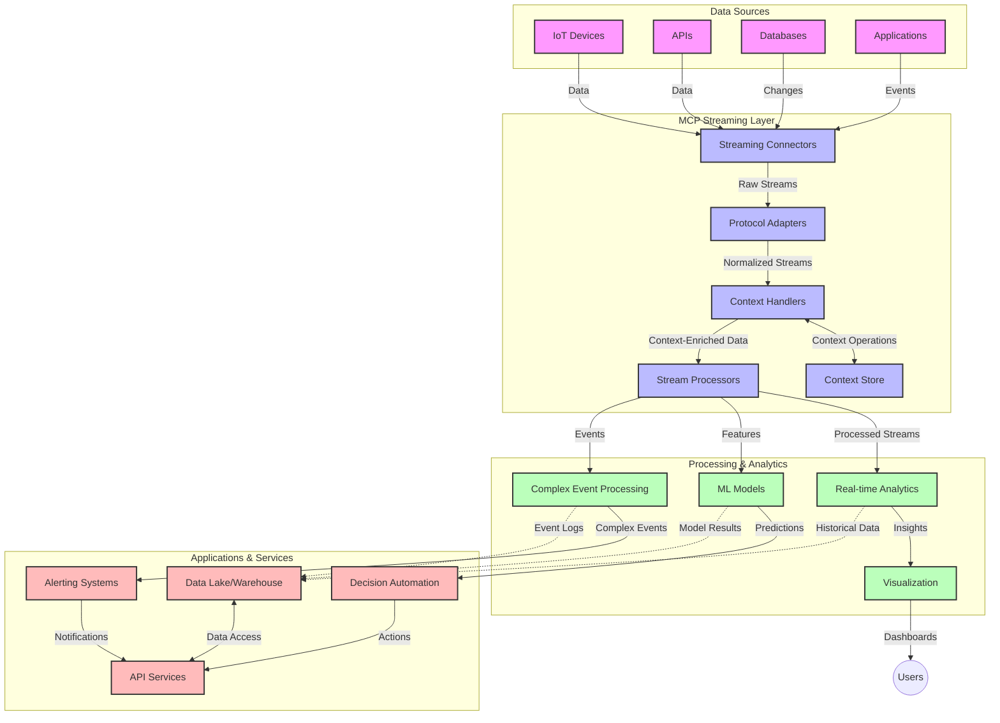

<!--
CO_OP_TRANSLATOR_METADATA:
{
  "original_hash": "68c518dbff8a3b127ed2aa934054c56c",
  "translation_date": "2025-06-11T17:15:28+00:00",
  "source_file": "05-AdvancedTopics/mcp-realtimestreaming/README.md",
  "language_code": "el"
}
-->
# Πρωτόκολλο Πλαισίου Μοντέλου για Ροή Δεδομένων σε Πραγματικό Χρόνο

## Επισκόπηση

Η ροή δεδομένων σε πραγματικό χρόνο έχει καταστεί απαραίτητη στον σημερινό κόσμο που βασίζεται στα δεδομένα, όπου επιχειρήσεις και εφαρμογές χρειάζονται άμεση πρόσβαση σε πληροφορίες για να λαμβάνουν έγκαιρες αποφάσεις. Το Πρωτόκολλο Πλαισίου Μοντέλου (MCP) αποτελεί σημαντική εξέλιξη στην βελτιστοποίηση αυτών των διαδικασιών ροής σε πραγματικό χρόνο, ενισχύοντας την αποδοτικότητα της επεξεργασίας δεδομένων, διατηρώντας την συνοχή του πλαισίου και βελτιώνοντας τη συνολική απόδοση του συστήματος.

Αυτό το module εξερευνά πώς το MCP μεταμορφώνει τη ροή δεδομένων σε πραγματικό χρόνο, παρέχοντας μια τυποποιημένη προσέγγιση στη διαχείριση πλαισίου ανάμεσα σε μοντέλα AI, πλατφόρμες ροής και εφαρμογές.

## Εισαγωγή στη Ροή Δεδομένων σε Πραγματικό Χρόνο

Η ροή δεδομένων σε πραγματικό χρόνο είναι ένα τεχνολογικό μοντέλο που επιτρέπει τη συνεχή μεταφορά, επεξεργασία και ανάλυση δεδομένων καθώς αυτά παράγονται, επιτρέποντας στα συστήματα να αντιδρούν άμεσα σε νέες πληροφορίες. Σε αντίθεση με την παραδοσιακή παρτίδα επεξεργασίας που λειτουργεί σε στατικά σύνολα δεδομένων, η ροή επεξεργάζεται δεδομένα εν κινήσει, παρέχοντας γνώσεις και ενέργειες με ελάχιστη καθυστέρηση.

### Βασικές Έννοιες της Ροής Δεδομένων σε Πραγματικό Χρόνο:

- **Συνεχής Ροή Δεδομένων**: Τα δεδομένα επεξεργάζονται ως μια αδιάκοπη, ατελείωτη ροή γεγονότων ή εγγραφών.
- **Επεξεργασία Χαμηλής Καθυστέρησης**: Τα συστήματα σχεδιάζονται ώστε να ελαχιστοποιούν το χρόνο μεταξύ παραγωγής και επεξεργασίας δεδομένων.
- **Κλιμάκωση**: Οι αρχιτεκτονικές ροής πρέπει να διαχειρίζονται μεταβλητούς όγκους και ταχύτητες δεδομένων.
- **Ανοχή σε Σφάλματα**: Τα συστήματα πρέπει να είναι ανθεκτικά σε αποτυχίες για να εξασφαλίζουν αδιάκοπη ροή δεδομένων.
- **Κατάσταση Επεξεργασίας**: Η διατήρηση πλαισίου ανάμεσα σε γεγονότα είναι κρίσιμη για ουσιαστική ανάλυση.

### Το Πρωτόκολλο Πλαισίου Μοντέλου και η Ροή σε Πραγματικό Χρόνο

Το MCP αντιμετωπίζει σημαντικές προκλήσεις σε περιβάλλοντα ροής σε πραγματικό χρόνο:

1. **Συνεχής Διατήρηση Πλαισίου**: Το MCP τυποποιεί τον τρόπο διατήρησης του πλαισίου ανάμεσα σε κατανεμημένα στοιχεία ροής, εξασφαλίζοντας ότι τα μοντέλα AI και οι κόμβοι επεξεργασίας έχουν πρόσβαση σε σχετικό ιστορικό και περιβαλλοντικό πλαίσιο.

2. **Αποδοτική Διαχείριση Κατάστασης**: Παρέχοντας δομημένους μηχανισμούς για τη μετάδοση πλαισίου, το MCP μειώνει το φόρτο διαχείρισης κατάστασης στις ροές δεδομένων.

3. **Διαλειτουργικότητα**: Το MCP δημιουργεί κοινή γλώσσα για την ανταλλαγή πλαισίου ανάμεσα σε διαφορετικές τεχνολογίες ροής και μοντέλα AI, επιτρέποντας πιο ευέλικτες και επεκτάσιμες αρχιτεκτονικές.

4. **Βελτιστοποιημένο Πλαίσιο για Ροή**: Οι υλοποιήσεις MCP μπορούν να δώσουν προτεραιότητα στα πιο σημαντικά στοιχεία πλαισίου για τη λήψη αποφάσεων σε πραγματικό χρόνο, βελτιστοποιώντας τόσο την απόδοση όσο και την ακρίβεια.

5. **Προσαρμοστική Επεξεργασία**: Με σωστή διαχείριση πλαισίου μέσω MCP, τα συστήματα ροής μπορούν να προσαρμόζουν δυναμικά την επεξεργασία βάσει εξελισσόμενων συνθηκών και προτύπων στα δεδομένα.

Σε σύγχρονες εφαρμογές, από δίκτυα αισθητήρων IoT μέχρι πλατφόρμες χρηματοοικονομικών συναλλαγών, η ενσωμάτωση του MCP με τεχνολογίες ροής επιτρέπει πιο έξυπνη, ευαισθητοποιημένη επεξεργασία που ανταποκρίνεται κατάλληλα σε σύνθετες, εξελισσόμενες καταστάσεις σε πραγματικό χρόνο.

## Στόχοι Μάθησης

Με το τέλος αυτού του μαθήματος, θα μπορείτε να:

- Κατανοήσετε τα βασικά της ροής δεδομένων σε πραγματικό χρόνο και τις προκλήσεις της
- Εξηγήσετε πώς το Πρωτόκολλο Πλαισίου Μοντέλου (MCP) βελτιώνει τη ροή δεδομένων σε πραγματικό χρόνο
- Υλοποιήσετε λύσεις ροής βασισμένες σε MCP χρησιμοποιώντας δημοφιλή frameworks όπως Kafka και Pulsar
- Σχεδιάσετε και αναπτύξετε αρχιτεκτονικές ροής υψηλής απόδοσης και ανοχής σφαλμάτων με MCP
- Εφαρμόσετε έννοιες MCP σε περιπτώσεις χρήσης IoT, χρηματοοικονομικών συναλλαγών και αναλύσεων με AI
- Αξιολογήσετε τις αναδυόμενες τάσεις και μελλοντικές καινοτομίες στις τεχνολογίες ροής βασισμένες σε MCP

### Ορισμός και Σημασία

Η ροή δεδομένων σε πραγματικό χρόνο περιλαμβάνει τη συνεχή παραγωγή, επεξεργασία και παράδοση δεδομένων με ελάχιστη καθυστέρηση. Σε αντίθεση με την παρτίδα επεξεργασίας, όπου τα δεδομένα συλλέγονται και επεξεργάζονται ομαδικά, τα δεδομένα ροής επεξεργάζονται σταδιακά καθώς φτάνουν, επιτρέποντας άμεσες γνώσεις και ενέργειες.

Βασικά χαρακτηριστικά της ροής δεδομένων σε πραγματικό χρόνο είναι:

- **Χαμηλή Καθυστέρηση**: Επεξεργασία και ανάλυση δεδομένων μέσα σε χιλιοστά του δευτερολέπτου έως δευτερόλεπτα
- **Συνεχής Ροή**: Αδιάκοπες ροές δεδομένων από διάφορες πηγές
- **Άμεση Επεξεργασία**: Ανάλυση δεδομένων καθώς φτάνουν και όχι σε παρτίδες
- **Αρχιτεκτονική με Βάση τα Γεγονότα**: Ανταπόκριση σε γεγονότα καθώς συμβαίνουν

### Προκλήσεις στην Παραδοσιακή Ροή Δεδομένων

Οι παραδοσιακές προσεγγίσεις ροής δεδομένων αντιμετωπίζουν αρκετούς περιορισμούς:

1. **Απώλεια Πλαισίου**: Δυσκολία στη διατήρηση πλαισίου ανάμεσα σε κατανεμημένα συστήματα
2. **Προβλήματα Κλιμάκωσης**: Δυσκολίες στην κλιμάκωση για διαχείριση μεγάλου όγκου και ταχύτητας δεδομένων
3. **Πολυπλοκότητα Ενσωμάτωσης**: Προβλήματα διαλειτουργικότητας ανάμεσα σε διαφορετικά συστήματα
4. **Διαχείριση Καθυστέρησης**: Ισορροπία ανάμεσα σε ρυθμό διεκπεραίωσης και χρόνο επεξεργασίας
5. **Συνέπεια Δεδομένων**: Εξασφάλιση ακρίβειας και πληρότητας δεδομένων σε όλο το ρεύμα

## Κατανόηση του Πρωτοκόλλου Πλαισίου Μοντέλου (MCP)

### Τι είναι το MCP;

Το Πρωτόκολλο Πλαισίου Μοντέλου (MCP) είναι ένα τυποποιημένο πρωτόκολλο επικοινωνίας σχεδιασμένο να διευκολύνει αποδοτική αλληλεπίδραση μεταξύ μοντέλων AI και εφαρμογών. Στο πλαίσιο της ροής δεδομένων σε πραγματικό χρόνο, το MCP παρέχει ένα πλαίσιο για:

- Διατήρηση του πλαισίου σε όλο το κανάλι δεδομένων
- Τυποποίηση μορφών ανταλλαγής δεδομένων
- Βελτιστοποίηση μετάδοσης μεγάλων συνόλων δεδομένων
- Ενίσχυση της επικοινωνίας μοντέλου προς μοντέλο και μοντέλου προς εφαρμογή

### Κύρια Συστατικά και Αρχιτεκτονική

Η αρχιτεκτονική MCP για ροή σε πραγματικό χρόνο αποτελείται από βασικά στοιχεία:

1. **Διαχειριστές Πλαισίου**: Διαχειρίζονται και διατηρούν πληροφορίες πλαισίου σε όλο το κανάλι ροής
2. **Επεξεργαστές Ροής**: Επεξεργάζονται εισερχόμενες ροές δεδομένων με τεχνικές που λαμβάνουν υπόψη το πλαίσιο
3. **Πρωτόκολλα Προσαρμογής**: Μετατρέπουν ανάμεσα σε διαφορετικά πρωτόκολλα ροής διατηρώντας το πλαίσιο
4. **Αποθήκη Πλαισίου**: Αποθηκεύει και ανακτά αποδοτικά πληροφορίες πλαισίου
5. **Συνδέσμοι Ροής**: Συνδέονται με διάφορες πλατφόρμες ροής (Kafka, Pulsar, Kinesis κ.ά.)



### Πώς το MCP Βελτιώνει τη Διαχείριση Δεδομένων σε Πραγματικό Χρόνο

Το MCP αντιμετωπίζει τις παραδοσιακές προκλήσεις ροής μέσω:

- **Ακεραιότητας Πλαισίου**: Διατήρηση σχέσεων μεταξύ δεδομένων σε όλο το κανάλι
- **Βελτιστοποιημένη Μετάδοση**: Μείωση πλεονασμού στην ανταλλαγή δεδομένων μέσω έξυπνης διαχείρισης πλαισίου
- **Τυποποιημένα APIs**: Παροχή συνεπών διεπαφών για τα στοιχεία ροής
- **Μείωση Καθυστέρησης**: Ελαχιστοποίηση του φόρτου επεξεργασίας μέσω αποδοτικής διαχείρισης πλαισίου
- **Ενισχυμένη Κλιμάκωση**: Υποστήριξη οριζόντιας κλιμάκωσης διατηρώντας το πλαίσιο

## Ενσωμάτωση και Υλοποίηση

Τα συστήματα ροής δεδομένων σε πραγματικό χρόνο απαιτούν προσεκτικό σχεδιασμό και υλοποίηση για να διατηρήσουν τόσο την απόδοση όσο και την συνοχή του πλαισίου. Το Πρωτόκολλο Πλαισίου Μοντέλου προσφέρει μια τυποποιημένη προσέγγιση για την ενσωμάτωση μοντέλων AI και τεχνολογιών ροής, επιτρέποντας πιο εξελιγμένες, ευαισθητοποιημένες στην κατάσταση, διαδικασίες.

### Επισκόπηση Ενσωμάτωσης MCP σε Αρχιτεκτονικές Ροής

Η υλοποίηση του MCP σε περιβάλλοντα ροής πραγματικού χρόνου περιλαμβάνει βασικές παραμέτρους:

1. **Σειριοποίηση και Μεταφορά Πλαισίου**: Το MCP παρέχει αποδοτικούς μηχανισμούς κωδικοποίησης των πληροφοριών πλαισίου μέσα σε πακέτα δεδομένων ροής, εξασφαλίζοντας ότι το απαραίτητο πλαίσιο ακολουθεί τα δεδομένα σε όλο το κανάλι επεξεργασίας. Αυτό περιλαμβάνει τυποποιημένες μορφές σειριοποίησης βελτιστοποιημένες για μεταφορά σε ροή.

2. **Κατάσταση Επεξεργασίας Ροής**: Το MCP επιτρέπει πιο έξυπνη επεξεργασία με διατήρηση κατάστασης, διατηρώντας συνεπή αναπαράσταση πλαισίου ανάμεσα σε κόμβους επεξεργασίας. Αυτό είναι ιδιαίτερα χρήσιμο σε κατανεμημένες αρχιτεκτονικές ροής όπου η διαχείριση κατάστασης είναι παραδοσιακά δύσκολη.

3. **Χρόνος Γεγονότος έναντι Χρόνου Επεξεργασίας**: Οι υλοποιήσεις MCP πρέπει να αντιμετωπίζουν τη συνηθισμένη πρόκληση διάκρισης μεταξύ της χρονικής στιγμής που συνέβη το γεγονός και της στιγμής που επεξεργάζεται. Το πρωτόκολλο μπορεί να ενσωματώσει χρονικό πλαίσιο που διατηρεί τη σημασιολογία του χρόνου γεγονότος.

4. **Διαχείριση Πίεσης Πίσω (Backpressure)**: Με την τυποποίηση της διαχείρισης πλαισίου, το MCP βοηθά στη διαχείριση πίεσης πίσω στα συστήματα ροής, επιτρέποντας στα στοιχεία να επικοινωνούν τις δυνατότητες επεξεργασίας τους και να προσαρμόζουν τη ροή αναλόγως.

5. **Παράθυρα Πλαισίου και Συγκέντρωση**: Το MCP διευκολύνει πιο σύνθετες λειτουργίες παραθύρων παρέχοντας δομημένες αναπαραστάσεις χρονικού και σχεσιακού πλαισίου, επιτρέποντας ουσιαστικότερες συγκεντρώσεις σε ροές γεγονότων.

6. **Ακριβώς Μία Φορά Επεξεργασία**: Σε συστήματα ροής που απαιτούν ακριβώς μία φορά σημασιολογία, το MCP μπορεί να ενσωματώσει μεταδεδομένα επεξεργασίας για να βοηθήσει στην παρακολούθηση και επαλήθευση της κατάστασης επεξεργασίας σε κατανεμημένα στοιχεία.

Η υλοποίηση του MCP σε διάφορες τεχνολογίες ροής δημιουργεί μια ενιαία προσέγγιση στη διαχείριση πλαισίου, μειώνοντας την ανάγκη για ειδικό κώδικα ενσωμάτωσης και ενισχύοντας την ικανότητα του συστήματος να διατηρεί ουσιαστικό πλαίσιο καθώς τα δεδομένα ρέουν μέσα στο κανάλι.

### MCP σε Διάφορα Πλαίσια Ροής Δεδομένων

Το MCP μπορεί να ενσωματωθεί σε δημοφιλή πλαίσια ροής, όπως:

#### Ενσωμάτωση Apache Kafka

```python
from mcp_streaming import MCPKafkaConnector

# Initialize MCP Kafka connector
connector = MCPKafkaConnector(
    bootstrap_servers='localhost:9092',
    context_preservation=True
)

# Create a context-aware consumer
consumer = connector.create_consumer('input-topic')

# Process streaming data with context
for message in consumer:
    context = message.get_context()
    data = message.get_value()
    
    # Process with context awareness
    result = process_with_context(data, context)
    
    # Produce output with preserved context
    connector.produce('output-topic', result, context=context)
```

#### Υλοποίηση Apache Pulsar

```python
from mcp_streaming import MCPPulsarClient

# Initialize MCP Pulsar client
client = MCPPulsarClient('pulsar://localhost:6650')

# Subscribe with context awareness
consumer = client.subscribe('input-topic', 'subscription-name', 
                           context_enabled=True)

# Process messages with context preservation
while True:
    message = consumer.receive()
    context = message.get_context()
    
    # Process with context
    result = process_with_context(message.data(), context)
    
    # Acknowledge the message
    consumer.acknowledge(message)
    
    # Send result with preserved context
    producer = client.create_producer('output-topic')
    producer.send(result, context=context)
```

### Καλές Πρακτικές για Ανάπτυξη

Κατά την υλοποίηση MCP για ροή σε πραγματικό χρόνο:

1. **Σχεδιάστε για Ανοχή σε Σφάλματα**:
   - Υλοποιήστε κατάλληλη διαχείριση σφαλμάτων
   - Χρησιμοποιήστε ουρές dead-letter για αποτυχημένα μηνύματα
   - Σχεδιάστε επεξεργαστές με ιδιότητα idempotency

2. **Βελτιστοποιήστε για Απόδοση**:
   - Ρυθμίστε κατάλληλα μεγέθη buffer
   - Χρησιμοποιήστε ομαδοποίηση όπου ενδείκνυται
   - Υλοποιήστε μηχανισμούς backpressure

3. **Παρακολουθήστε και Παρατηρήστε**:
   - Παρακολουθήστε μετρικές επεξεργασίας ροής
   - Ελέγξτε τη διάδοση πλαισίου
   - Ορίστε ειδοποιήσεις για ανωμαλίες

4. **Ασφαλίστε τις Ροές σας**:
   - Υλοποιήστε κρυπτογράφηση για ευαίσθητα δεδομένα
   - Χρησιμοποιήστε αυθεντικοποίηση και εξουσιοδότηση
   - Εφαρμόστε κατάλληλους ελέγχους πρόσβασης

### MCP στο IoT και Edge Computing

Το MCP ενισχύει τη ροή δεδομένων IoT με:

- Διατήρηση πλαισίου συσκευών σε όλο το κανάλι επεξεργασίας
- Ενεργοποίηση αποδοτικής ροής δεδομένων από edge σε cloud
- Υποστήριξη αναλύσεων σε πραγματικό χρόνο σε ροές IoT
- Διευκόλυνση επικοινωνίας συσκευών με πλαίσιο

Παράδειγμα: Δίκτυα Αισθητήρων Έξυπνης Πόλης  
```
Sensors → Edge Gateways → MCP Stream Processors → Real-time Analytics → Automated Responses
```

### Ρόλος στις Χρηματοοικονομικές Συναλλαγές και Υψηλής Συχνότητας Συναλλαγές

Το MCP προσφέρει σημαντικά πλεονεκτήματα στη ροή χρηματοοικονομικών δεδομένων:

- Επεξεργασία με

**Αποποίηση Ευθυνών**:  
Αυτό το έγγραφο έχει μεταφραστεί χρησιμοποιώντας την υπηρεσία αυτόματης μετάφρασης AI [Co-op Translator](https://github.com/Azure/co-op-translator). Παρόλο που προσπαθούμε για ακρίβεια, παρακαλούμε να έχετε υπόψη ότι οι αυτοματοποιημένες μεταφράσεις μπορεί να περιέχουν λάθη ή ανακρίβειες. Το πρωτότυπο έγγραφο στη μητρική του γλώσσα πρέπει να θεωρείται η αυθεντική πηγή. Για κρίσιμες πληροφορίες, συνιστάται επαγγελματική ανθρώπινη μετάφραση. Δεν φέρουμε ευθύνη για τυχόν παρεξηγήσεις ή λανθασμένες ερμηνείες που προκύπτουν από τη χρήση αυτής της μετάφρασης.