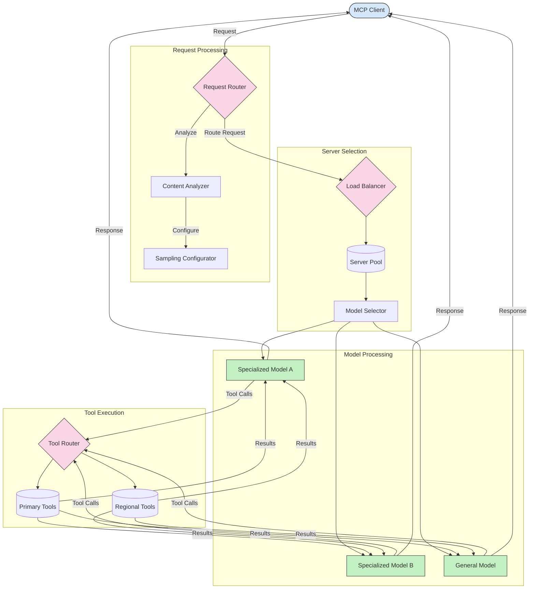

<!--
CO_OP_TRANSLATOR_METADATA:
{
  "original_hash": "2f1b473818b5a6cc9a9bbf777fffa6d4",
  "translation_date": "2025-07-14T21:47:48+00:00",
  "source_file": "05-AdvancedTopics/mcp-routing/README.md",
  "language_code": "el"
}
-->
## Δειγματοληψία και Αρχιτεκτονική Δρομολόγησης στο MCP

Η δειγματοληψία είναι ένα κρίσιμο στοιχείο του Πρωτοκόλλου Πλαισίου Μοντέλου (MCP) που επιτρέπει την αποδοτική επεξεργασία και δρομολόγηση αιτημάτων. Περιλαμβάνει την ανάλυση των εισερχόμενων αιτημάτων για να καθοριστεί το πιο κατάλληλο μοντέλο ή υπηρεσία που θα τα διαχειριστεί, βάσει διαφόρων κριτηρίων όπως ο τύπος περιεχομένου, το πλαίσιο χρήστη και το φορτίο του συστήματος.

Η δειγματοληψία και η δρομολόγηση μπορούν να συνδυαστούν για να δημιουργήσουν μια στιβαρή αρχιτεκτονική που βελτιστοποιεί τη χρήση πόρων και εξασφαλίζει υψηλή διαθεσιμότητα. Η διαδικασία δειγματοληψίας μπορεί να χρησιμοποιηθεί για την ταξινόμηση των αιτημάτων, ενώ η δρομολόγηση τα κατευθύνει στα κατάλληλα μοντέλα ή υπηρεσίες.

Το παρακάτω διάγραμμα απεικονίζει πώς η δειγματοληψία και η δρομολόγηση συνεργάζονται σε μια ολοκληρωμένη αρχιτεκτονική MCP:

## Τι ακολουθεί

- [5.6 Δειγματοληψία](../mcp-sampling/README.md)

**Αποποίηση ευθυνών**:  
Αυτό το έγγραφο έχει μεταφραστεί χρησιμοποιώντας την υπηρεσία αυτόματης μετάφρασης AI [Co-op Translator](https://github.com/Azure/co-op-translator). Παρόλο που επιδιώκουμε την ακρίβεια, παρακαλούμε να γνωρίζετε ότι οι αυτόματες μεταφράσεις ενδέχεται να περιέχουν λάθη ή ανακρίβειες. Το πρωτότυπο έγγραφο στη μητρική του γλώσσα πρέπει να θεωρείται η αυθεντική πηγή. Για κρίσιμες πληροφορίες, συνιστάται επαγγελματική ανθρώπινη μετάφραση. Δεν φέρουμε ευθύνη για τυχόν παρεξηγήσεις ή λανθασμένες ερμηνείες που προκύπτουν από τη χρήση αυτής της μετάφρασης.