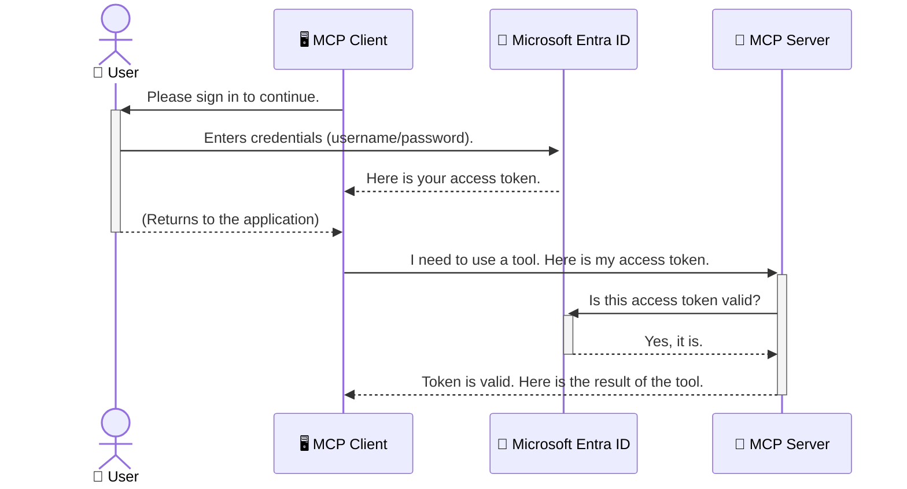

<!--
CO_OP_TRANSLATOR_METADATA:
{
  "original_hash": "0abf26a6c4dbe905d5d49ccdc0ccfe92",
  "translation_date": "2025-06-26T16:30:47+00:00",
  "source_file": "05-AdvancedTopics/mcp-security-entra/README.md",
  "language_code": "el"
}
-->
# Ασφάλεια Ροών Εργασίας Τεχνητής Νοημοσύνης: Επαλήθευση Ταυτότητας Entra ID για Διακομιστές Πρωτοκόλλου Model Context

## Εισαγωγή  
Η ασφάλεια του διακομιστή Model Context Protocol (MCP) είναι εξίσου σημαντική με το να κλειδώνετε την πόρτα του σπιτιού σας. Αν αφήσετε τον διακομιστή MCP ανοιχτό, τα εργαλεία και τα δεδομένα σας είναι εκτεθειμένα σε μη εξουσιοδοτημένη πρόσβαση, κάτι που μπορεί να οδηγήσει σε παραβιάσεις ασφάλειας. Το Microsoft Entra ID προσφέρει μια ισχυρή λύση διαχείρισης ταυτότητας και πρόσβασης βασισμένη στο cloud, βοηθώντας να διασφαλιστεί ότι μόνο εξουσιοδοτημένοι χρήστες και εφαρμογές μπορούν να αλληλεπιδρούν με τον διακομιστή MCP σας. Σε αυτήν την ενότητα, θα μάθετε πώς να προστατεύετε τις ροές εργασίας AI σας χρησιμοποιώντας την επαλήθευση ταυτότητας Entra ID.

## Στόχοι Μάθησης  
Στο τέλος αυτής της ενότητας, θα μπορείτε να:

- Κατανοήσετε τη σημασία της ασφάλειας των διακομιστών MCP.  
- Εξηγήσετε τις βασικές αρχές του Microsoft Entra ID και της επαλήθευσης ταυτότητας OAuth 2.0.  
- Αναγνωρίσετε τη διαφορά μεταξύ δημόσιων και εμπιστευτικών πελατών.  
- Υλοποιήσετε την επαλήθευση ταυτότητας Entra ID τόσο σε τοπικά (δημόσιοι πελάτες) όσο και σε απομακρυσμένα (εμπιστευτικοί πελάτες) σενάρια διακομιστών MCP.  
- Εφαρμόσετε βέλτιστες πρακτικές ασφάλειας κατά την ανάπτυξη ροών εργασίας AI.

## Ασφάλεια και MCP  

Όπως δεν αφήνετε την πόρτα του σπιτιού σας ξεκλείδωτη, έτσι δεν πρέπει να αφήνετε τον διακομιστή MCP σας ανοιχτό σε όλους. Η ασφάλεια των ροών εργασίας AI είναι απαραίτητη για την κατασκευή ανθεκτικών, αξιόπιστων και ασφαλών εφαρμογών. Αυτό το κεφάλαιο θα σας εισάγει στη χρήση του Microsoft Entra ID για την ασφάλεια των διακομιστών MCP, διασφαλίζοντας ότι μόνο εξουσιοδοτημένοι χρήστες και εφαρμογές έχουν πρόσβαση στα εργαλεία και τα δεδομένα σας.

## Γιατί η Ασφάλεια Είναι Σημαντική για τους Διακομιστές MCP  

Φανταστείτε ότι ο διακομιστής MCP σας έχει ένα εργαλείο που μπορεί να στείλει emails ή να έχει πρόσβαση σε μια βάση δεδομένων πελατών. Ένας μη ασφαλής διακομιστής σημαίνει ότι οποιοσδήποτε θα μπορούσε να χρησιμοποιήσει αυτό το εργαλείο, οδηγώντας σε μη εξουσιοδοτημένη πρόσβαση σε δεδομένα, ανεπιθύμητα μηνύματα ή άλλες κακόβουλες ενέργειες.

Με την εφαρμογή της επαλήθευσης ταυτότητας, διασφαλίζετε ότι κάθε αίτημα προς τον διακομιστή σας επαληθεύεται, επιβεβαιώνοντας την ταυτότητα του χρήστη ή της εφαρμογής που κάνει το αίτημα. Αυτό είναι το πρώτο και πιο κρίσιμο βήμα για την ασφάλεια των ροών εργασίας AI σας.

## Εισαγωγή στο Microsoft Entra ID  

[**Microsoft Entra ID**](https://adoption.microsoft.com/microsoft-security/entra/) είναι μια υπηρεσία διαχείρισης ταυτότητας και πρόσβασης βασισμένη στο cloud. Σκεφτείτε το σαν έναν παγκόσμιο φύλακα ασφαλείας για τις εφαρμογές σας. Αναλαμβάνει τη σύνθετη διαδικασία επαλήθευσης ταυτότητας χρηστών (authentication) και καθορισμού των δικαιωμάτων τους (authorization).

Χρησιμοποιώντας το Entra ID, μπορείτε να:

- Ενεργοποιήσετε ασφαλή σύνδεση για τους χρήστες.  
- Προστατεύσετε APIs και υπηρεσίες.  
- Διαχειριστείτε πολιτικές πρόσβασης από ένα κεντρικό σημείο.

Για τους διακομιστές MCP, το Entra ID παρέχει μια αξιόπιστη και ευρέως αποδεκτή λύση για τη διαχείριση του ποιος μπορεί να έχει πρόσβαση στις δυνατότητες του διακομιστή σας.

---

## Κατανόηση της "Μαγείας": Πώς Λειτουργεί η Επαλήθευση Ταυτότητας Entra ID  

Το Entra ID χρησιμοποιεί ανοιχτά πρότυπα όπως το **OAuth 2.0** για την επαλήθευση ταυτότητας. Παρόλο που οι λεπτομέρειες μπορεί να είναι πολύπλοκες, η βασική ιδέα είναι απλή και μπορεί να γίνει κατανοητή με μια αναλογία.

### Μια Απαλή Εισαγωγή στο OAuth 2.0: Το Κλειδί του Parking  

Σκεφτείτε το OAuth 2.0 σαν μια υπηρεσία παρκαρίσματος για το αυτοκίνητό σας. Όταν φτάνετε σε ένα εστιατόριο, δεν δίνετε στον παρκαδόρο το γενικό κλειδί σας. Αντίθετα, δίνετε ένα **κλειδί παρκαρίσματος** που έχει περιορισμένες άδειες — μπορεί να ξεκινήσει το αυτοκίνητο και να κλειδώσει τις πόρτες, αλλά δεν μπορεί να ανοίξει το πορτμπαγκάζ ή το ντουλαπάκι.

Σε αυτή την αναλογία:

- **Εσείς** είστε ο **Χρήστης**.  
- **Το αυτοκίνητό σας** είναι ο **Διακομιστής MCP** με τα πολύτιμα εργαλεία και δεδομένα του.  
- Ο **Παρκαδόρος** είναι το **Microsoft Entra ID**.  
- Ο **Υπάλληλος Παρκαρίσματος** είναι ο **Πελάτης MCP** (η εφαρμογή που προσπαθεί να αποκτήσει πρόσβαση στο διακομιστή).  
- Το **Κλειδί Παρκαρίσματος** είναι το **Access Token**.

Το access token είναι μια ασφαλής αλφαριθμητική συμβολοσειρά που λαμβάνει ο πελάτης MCP από το Entra ID μετά τη σύνδεσή σας. Ο πελάτης παρουσιάζει αυτό το token στον διακομιστή MCP με κάθε αίτημα. Ο διακομιστής μπορεί να επαληθεύσει το token για να βεβαιωθεί ότι το αίτημα είναι νόμιμο και ότι ο πελάτης έχει τα απαραίτητα δικαιώματα, χωρίς να χρειάζεται ποτέ να χειριστεί τα πραγματικά σας διαπιστευτήρια (όπως ο κωδικός πρόσβασής σας).

### Η Ροή Επαλήθευσης Ταυτότητας  

Έτσι λειτουργεί η διαδικασία στην πράξη:



### Εισαγωγή στη Βιβλιοθήκη Επαλήθευσης Ταυτότητας της Microsoft (MSAL)  

Πριν περάσουμε στον κώδικα, είναι σημαντικό να γνωρίσετε ένα βασικό συστατικό που θα δείτε στα παραδείγματα: τη **Microsoft Authentication Library (MSAL)**.

Η MSAL είναι μια βιβλιοθήκη που έχει αναπτύξει η Microsoft και κάνει πολύ πιο εύκολη τη διαχείριση της επαλήθευσης ταυτότητας για προγραμματιστές. Αντί να γράφετε όλο τον πολύπλοκο κώδικα για τη διαχείριση των security tokens, των συνδέσεων και της ανανέωσης των συνεδριών, η MSAL αναλαμβάνει αυτό το βάρος.

Η χρήση μιας βιβλιοθήκης όπως η MSAL συνιστάται έντονα γιατί:

- **Είναι Ασφαλής:** Εφαρμόζει πρότυπα της βιομηχανίας και βέλτιστες πρακτικές ασφάλειας, μειώνοντας τον κίνδυνο ευπαθειών στον κώδικά σας.  
- **Απλοποιεί την Ανάπτυξη:** Αποκρύπτει την πολυπλοκότητα των πρωτοκόλλων OAuth 2.0 και OpenID Connect, επιτρέποντάς σας να προσθέσετε αξιόπιστη επαλήθευση ταυτότητας με λίγες γραμμές κώδικα.  
- **Υποστηρίζεται Ενεργά:** Η Microsoft ενημερώνει και συντηρεί την MSAL για να αντιμετωπίζει νέες απειλές ασφαλείας και αλλαγές πλατφορμών.

Η MSAL υποστηρίζει πολλές γλώσσες και πλαίσια εφαρμογών, όπως .NET, JavaScript/TypeScript, Python, Java, Go και κινητές πλατφόρμες όπως iOS και Android. Αυτό σημαίνει ότι μπορείτε να χρησιμοποιήσετε τα ίδια πρότυπα επαλήθευσης σε όλο το τεχνολογικό σας οικοσύστημα.

Για περισσότερες πληροφορίες σχετικά με την MSAL, μπορείτε να δείτε την επίσημη [τεκμηρίωση επισκόπησης MSAL](https://learn.microsoft.com/entra/identity-platform/msal-overview).

---

## Ασφάλεια του Διακομιστή MCP με Entra ID: Οδηγός Βήμα-βήμα  

Τώρα, ας δούμε πώς να ασφαλίσετε έναν τοπικό διακομιστή MCP (που επικοινωνεί μέσω `stdio`) using Entra ID. This example uses a **public client**, which is suitable for applications running on a user's machine, like a desktop app or a local development server.

### Scenario 1: Securing a Local MCP Server (with a Public Client)

In this scenario, we'll look at an MCP server that runs locally, communicates over `stdio`, and uses Entra ID to authenticate the user before allowing access to its tools. The server will have a single tool that fetches the user's profile information from the Microsoft Graph API.

#### 1. Setting Up the Application in Entra ID

Before writing any code, you need to register your application in Microsoft Entra ID. This tells Entra ID about your application and grants it permission to use the authentication service.

1. Navigate to the **[Microsoft Entra portal](https://entra.microsoft.com/)**.
2. Go to **App registrations** and click **New registration**.
3. Give your application a name (e.g., "My Local MCP Server").
4. For **Supported account types**, select **Accounts in this organizational directory only**.
5. You can leave the **Redirect URI** blank for this example.
6. Click **Register**.

Once registered, take note of the **Application (client) ID** and **Directory (tenant) ID**. You'll need these in your code.

#### 2. The Code: A Breakdown

Let's look at the key parts of the code that handle authentication. The full code for this example is available in the [Entra ID - Local - WAM](https://github.com/Azure-Samples/mcp-auth-servers/tree/main/src/entra-id-local-wam) folder of the [mcp-auth-servers GitHub repository](https://github.com/Azure-Samples/mcp-auth-servers).

**`AuthenticationService.cs`**

This class is responsible for handling the interaction with Entra ID.

- **`CreateAsync`**: This method initializes the `PublicClientApplication` from the MSAL (Microsoft Authentication Library). It's configured with your application's `clientId` and `tenantId`.
- **`WithBroker`**: This enables the use of a broker (like the Windows Web Account Manager), which provides a more secure and seamless single sign-on experience.
- **`AcquireTokenAsync`**: Αυτή είναι η βασική μέθοδος. Προσπαθεί πρώτα να πάρει ένα token σιωπηλά (δηλαδή ο χρήστης δεν χρειάζεται να συνδεθεί ξανά αν έχει ήδη ενεργή συνεδρία). Αν δεν μπορεί να αποκτήσει σιωπηλά το token, ζητά από τον χρήστη να συνδεθεί αλληλεπιδραστικά.

```csharp
// Simplified for clarity
public static async Task<AuthenticationService> CreateAsync(ILogger<AuthenticationService> logger)
{
    var msalClient = PublicClientApplicationBuilder
        .Create(_clientId) // Your Application (client) ID
        .WithAuthority(AadAuthorityAudience.AzureAdMyOrg)
        .WithTenantId(_tenantId) // Your Directory (tenant) ID
        .WithBroker(new BrokerOptions(BrokerOptions.OperatingSystems.Windows))
        .Build();

    // ... cache registration ...

    return new AuthenticationService(logger, msalClient);
}

public async Task<string> AcquireTokenAsync()
{
    try
    {
        // Try silent authentication first
        var accounts = await _msalClient.GetAccountsAsync();
        var account = accounts.FirstOrDefault();

        AuthenticationResult? result = null;

        if (account != null)
        {
            result = await _msalClient.AcquireTokenSilent(_scopes, account).ExecuteAsync();
        }
        else
        {
            // If no account, or silent fails, go interactive
            result = await _msalClient.AcquireTokenInteractive(_scopes).ExecuteAsync();
        }

        return result.AccessToken;
    }
    catch (Exception ex)
    {
        _logger.LogError(ex, "An error occurred while acquiring the token.");
        throw; // Optionally rethrow the exception for higher-level handling
    }
}
```

**`Program.cs`**

This is where the MCP server is set up and the authentication service is integrated.

- **`AddSingleton<AuthenticationService>`**: This registers the `AuthenticationService` with the dependency injection container, so it can be used by other parts of the application (like our tool).
- **`GetUserDetailsFromGraph` tool**: This tool requires an instance of `AuthenticationService`. Before it does anything, it calls `authService.AcquireTokenAsync()` για να πάρει ένα έγκυρο access token. Αν η επαλήθευση ταυτότητας είναι επιτυχής, χρησιμοποιεί το token για να καλέσει το Microsoft Graph API και να πάρει τις λεπτομέρειες του χρήστη.

```csharp
// Simplified for clarity
[McpServerTool(Name = "GetUserDetailsFromGraph")]
public static async Task<string> GetUserDetailsFromGraph(
    AuthenticationService authService)
{
    try
    {
        // This will trigger the authentication flow
        var accessToken = await authService.AcquireTokenAsync();

        // Use the token to create a GraphServiceClient
        var graphClient = new GraphServiceClient(
            new BaseBearerTokenAuthenticationProvider(new TokenProvider(authService)));

        var user = await graphClient.Me.GetAsync();

        return System.Text.Json.JsonSerializer.Serialize(user);
    }
    catch (Exception ex)
    {
        return $"Error: {ex.Message}";
    }
}
```

#### 3. Πώς Λειτουργούν Όλα Μαζί  

1. Όταν ο πελάτης MCP προσπαθεί να χρησιμοποιήσει το `GetUserDetailsFromGraph` tool, the tool first calls `AcquireTokenAsync`.
2. `AcquireTokenAsync` triggers the MSAL library to check for a valid token.
3. If no token is found, MSAL, through the broker, will prompt the user to sign in with their Entra ID account.
4. Once the user signs in, Entra ID issues an access token.
5. The tool receives the token and uses it to make a secure call to the Microsoft Graph API.
6. The user's details are returned to the MCP client.

This process ensures that only authenticated users can use the tool, effectively securing your local MCP server.

### Scenario 2: Securing a Remote MCP Server (with a Confidential Client)

When your MCP server is running on a remote machine (like a cloud server) and communicates over a protocol like HTTP Streaming, the security requirements are different. In this case, you should use a **confidential client** and the **Authorization Code Flow**. This is a more secure method because the application's secrets are never exposed to the browser.

This example uses a TypeScript-based MCP server that uses Express.js to handle HTTP requests.

#### 1. Setting Up the Application in Entra ID

The setup in Entra ID is similar to the public client, but with one key difference: you need to create a **client secret**.

1. Navigate to the **[Microsoft Entra portal](https://entra.microsoft.com/)**.
2. In your app registration, go to the **Certificates & secrets** tab.
3. Click **New client secret**, give it a description, and click **Add**.
4. **Important:** Copy the secret value immediately. You will not be able to see it again.
5. You also need to configure a **Redirect URI**. Go to the **Authentication** tab, click **Add a platform**, select **Web**, and enter the redirect URI for your application (e.g., `http://localhost:3001/auth/callback`).

> **⚠️ Important Security Note:** For production applications, Microsoft strongly recommends using **secretless authentication** methods such as **Managed Identity** or **Workload Identity Federation** instead of client secrets. Client secrets pose security risks as they can be exposed or compromised. Managed identities provide a more secure approach by eliminating the need to store credentials in your code or configuration.
>
> For more information about managed identities and how to implement them, see the [Managed identities for Azure resources overview](https://learn.microsoft.com/entra/identity/managed-identities-azure-resources/overview).

#### 2. The Code: A Breakdown

This example uses a session-based approach. When the user authenticates, the server stores the access token and refresh token in a session and gives the user a session token. This session token is then used for subsequent requests. The full code for this example is available in the [Entra ID - Confidential client](https://github.com/Azure-Samples/mcp-auth-servers/tree/main/src/entra-id-cca-session) folder of the [mcp-auth-servers GitHub repository](https://github.com/Azure-Samples/mcp-auth-servers).

**`Server.ts`**

This file sets up the Express server and the MCP transport layer.

- **`requireBearerAuth`**: This is middleware that protects the `/sse` and `/message` endpoints. It checks for a valid bearer token in the `Authorization` header of the request.
- **`EntraIdServerAuthProvider`**: This is a custom class that implements the `McpServerAuthorizationProvider` interface. It's responsible for handling the OAuth 2.0 flow.
- **`/auth/callback`**: Αυτό το endpoint διαχειρίζεται την ανακατεύθυνση από το Entra ID αφού ο χρήστης έχει επαληθευτεί. Ανταλλάσσει τον κωδικό εξουσιοδότησης για ένα access token και ένα refresh token.

```typescript
// Simplified for clarity
const app = express();
const { server } = createServer();
const provider = new EntraIdServerAuthProvider();

// Protect the SSE endpoint
app.get("/sse", requireBearerAuth({
  provider,
  requiredScopes: ["User.Read"]
}), async (req, res) => {
  // ... connect to the transport ...
});

// Protect the message endpoint
app.post("/message", requireBearerAuth({
  provider,
  requiredScopes: ["User.Read"]
}), async (req, res) => {
  // ... handle the message ...
});

// Handle the OAuth 2.0 callback
app.get("/auth/callback", (req, res) => {
  provider.handleCallback(req.query.code, req.query.state)
    .then(result => {
      // ... handle success or failure ...
    });
});
```

**`Tools.ts`**

This file defines the tools that the MCP server provides. The `getUserDetails` εργαλείο είναι παρόμοιο με το προηγούμενο παράδειγμα, αλλά παίρνει το access token από τη συνεδρία.

```typescript
// Simplified for clarity
server.setRequestHandler(CallToolRequestSchema, async (request) => {
  const { name } = request.params;
  const context = request.params?.context as { token?: string } | undefined;
  const sessionToken = context?.token;

  if (name === ToolName.GET_USER_DETAILS) {
    if (!sessionToken) {
      throw new AuthenticationError("Authentication token is missing or invalid. Ensure the token is provided in the request context.");
    }

    // Get the Entra ID token from the session store
    const tokenData = tokenStore.getToken(sessionToken);
    const entraIdToken = tokenData.accessToken;

    const graphClient = Client.init({
      authProvider: (done) => {
        done(null, entraIdToken);
      }
    });

    const user = await graphClient.api('/me').get();

    // ... return user details ...
  }
});
```

**`auth/EntraIdServerAuthProvider.ts`**

This class handles the logic for:

- Redirecting the user to the Entra ID sign-in page.
- Exchanging the authorization code for an access token.
- Storing the tokens in the `tokenStore`.
- Refreshing the access token when it expires.

#### 3. How It All Works Together

1. When a user first tries to connect to the MCP server, the `requireBearerAuth` middleware will see that they don't have a valid session and will redirect them to the Entra ID sign-in page.
2. The user signs in with their Entra ID account.
3. Entra ID redirects the user back to the `/auth/callback` endpoint with an authorization code.
4. The server exchanges the code for an access token and a refresh token, stores them, and creates a session token which is sent to the client.
5. The client can now use this session token in the `Authorization` header for all future requests to the MCP server.
6. When the `getUserDetails` εργαλείο καλείται, χρησιμοποιεί το token της συνεδρίας για να αναζητήσει το access token του Entra ID και μετά το χρησιμοποιεί για να καλέσει το Microsoft Graph API.

Αυτή η ροή είναι πιο σύνθετη από τη ροή δημόσιου πελάτη, αλλά είναι απαραίτητη για endpoints που είναι προσβάσιμα μέσω διαδικτύου. Επειδή οι απομακρυσμένοι διακομιστές MCP είναι προσβάσιμοι μέσω του δημόσιου διαδικτύου, χρειάζονται πιο ισχυρά μέτρα ασφάλειας για προστασία από μη εξουσιοδοτημένη πρόσβαση και πιθανές επιθέσεις.

## Βέλτιστες Πρακτικές Ασφάλειας  

- **Χρησιμοποιείτε πάντα HTTPS**: Κρυπτογραφήστε την επικοινωνία μεταξύ πελάτη και διακομιστή για να προστατεύσετε τα tokens από υποκλοπή.  
- **Εφαρμόστε Έλεγχο Πρόσβασης Βασισμένο σε Ρόλους (RBAC)**: Μην ελέγχετε μόνο *αν* ένας χρήστης είναι επαληθευμένος, αλλά και *τι* δικαιώματα έχει. Μπορείτε να ορίσετε ρόλους στο Entra ID και να τους ελέγχετε στον διακομιστή MCP.  
- **Παρακολούθηση και Αξιολόγηση**: Καταγράψτε όλα τα γεγονότα επαλήθευσης για να ανιχνεύετε και να ανταποκρίνεστε σε ύποπτες δραστηριότητες.  
- **Διαχείριση Περιορισμών Ροής (rate limiting) και Throttling**: Το Microsoft Graph και άλλα APIs εφαρμόζουν περιορισμούς για την αποφυγή κατάχρησης. Υλοποιήστε λογική εκθετικής επανάληψης και retry στον διακομιστή MCP για να χειρίζεστε ομαλά τις απαντήσεις HTTP 429 (Too Many Requests). Σκεφτείτε την προσωρινή αποθήκευση δεδομένων που ζητούνται συχνά για να μειώσετε τις κλήσεις API.  
- **Ασφαλής Αποθήκευση Tokens**: Αποθηκεύστε τα access tokens και refresh tokens με ασφάλεια. Για τοπικές εφαρμογές, χρησιμοποιήστε τους μηχανισμούς ασφαλούς αποθήκευσης του συστήματος. Για διακομιστές, εξετάστε τη χρήση κρυπτογραφημένης αποθήκευσης ή υπηρεσιών διαχείρισης κλειδιών όπως το Azure Key Vault.  
- **Διαχείριση Λήξης Tokens**: Τα access tokens έχουν περιορισμένη διάρκεια ζωής. Υλοποιήστε αυτόματη ανανέωση token με τη χρήση refresh tokens για να διατηρήσετε μια απρόσκοπτη εμπειρία χρήστη χωρίς να απαιτείται επανεπαλήθευση.  
- **Σκεφτείτε τη Χρήση Azure API Management**: Ενώ η εφαρμογή ασφάλειας απευθείας στον διακομιστή MCP σας δίνει λεπτομερή έλεγχο, οι πύλες API όπως το Azure API Management μπορούν να αναλάβουν αυτόματα πολλά θέματα ασφάλειας, όπως επαλήθευση ταυτότητας, εξουσιοδότηση, περιορισμούς ροής και παρακολούθηση. Παρέχουν ένα κεντρικό επίπεδο ασφάλειας μεταξύ των πελατών σας και των διακομιστών MCP. Για περισσότερες λεπτομέρειες σχετικά με τη χρήση πυλών API με MCP, δείτε το [Azure API Management Your Auth Gateway For MCP Servers](https://techcommunity.microsoft.com/blog/integrationsonazureblog/azure-api-management-your-auth-gateway-for-mcp-servers/4402690).

## Βασικά Συμπεράσματα  

- Η ασφάλεια του διακομιστή MCP είναι κρίσιμη για την προστασία των δεδομένων και των εργαλείων σας.  
- Το Microsoft Entra ID παρέχει μια ισχυρή και κλιμακούμενη λύση για επαλήθευση ταυτότητας και εξουσιοδότηση.  
- Χρησιμοποιήστε **δημόσιο πελάτη** για τοπικές εφαρμογές και **εμπιστευτικό πελάτη** για απομακρυσμένους διακομιστές.  
- Η **Ροή Κώδικα Εξουσιοδότησης (Authorization Code Flow)** είναι η πιο ασφαλής επιλογή για web εφαρμογές.

## Άσκηση  

1. Σκεφτείτε έναν διακομιστή MCP που θα μπορούσατε να δημιουργήσετε. Θα ήταν τοπικός ή απομακρυσμένος;  
2. Βάσει της απάντησής σας, θα χρησιμοποιούσατε δημόσιο ή εμπιστευτικό πελάτη;  
3. Ποια δικαιώματα θα ζητούσε ο διακομιστής MCP σας για να εκτελεί ενέργειες στο Microsoft Graph;

## Πρακτικές Ασκήσεις  

### Άσκηση 1: Καταχώριση Εφαρμογής στο Entra ID  
Πλοηγηθείτε στην πύλη Microsoft Entra.  
Καταχωρίστε μια νέα εφαρμογή για τον διακομιστή MCP σας.  
Καταγράψτε το Application (client) ID και το Directory (tenant) ID.

### Άσκηση 2: Ασφάλεια Τοπικού Διακομιστή MCP (Δημόσιος Πελάτης)  
- Ακολουθήστε το παράδειγμα κώδικα για να ενσωματώσετε την MSAL για την επαλήθευση ταυτότητας χρηστών.  
- Δοκιμάστε τη ροή επαλήθευσης καλώντας το εργαλείο MCP που παίρνει λεπτομέ

**Αποποίηση ευθυνών**:  
Αυτό το έγγραφο έχει μεταφραστεί χρησιμοποιώντας την υπηρεσία αυτόματης μετάφρασης AI [Co-op Translator](https://github.com/Azure/co-op-translator). Παρόλο που επιδιώκουμε την ακρίβεια, παρακαλούμε να έχετε υπόψη ότι οι αυτόματες μεταφράσεις ενδέχεται να περιέχουν λάθη ή ανακρίβειες. Το πρωτότυπο έγγραφο στη γλώσσα του θεωρείται η επίσημη πηγή. Για κρίσιμες πληροφορίες συνιστάται η επαγγελματική ανθρώπινη μετάφραση. Δεν φέρουμε ευθύνη για τυχόν παρεξηγήσεις ή λανθασμένες ερμηνείες που προκύπτουν από τη χρήση αυτής της μετάφρασης.