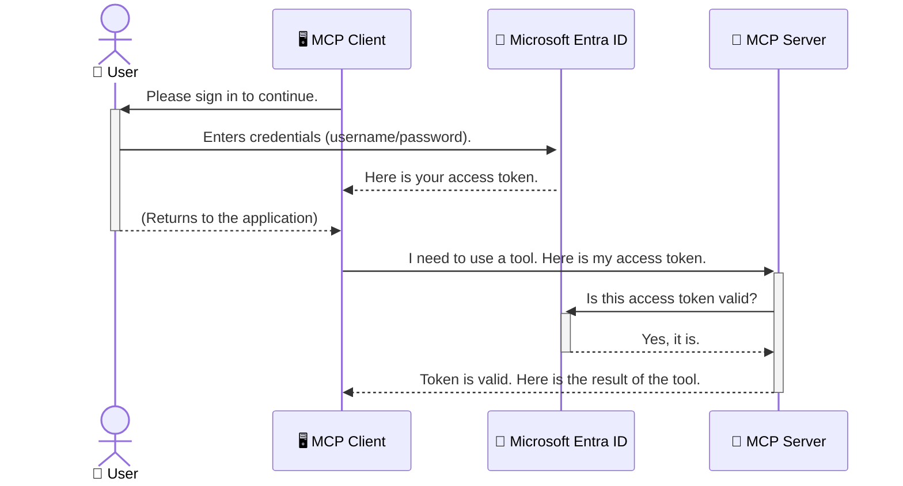

<!--
CO_OP_TRANSLATOR_METADATA:
{
  "original_hash": "6e562d7e5a77c8982da4aa8f762ad1d8",
  "translation_date": "2025-07-02T09:28:49+00:00",
  "source_file": "05-AdvancedTopics/mcp-security-entra/README.md",
  "language_code": "el"
}
-->
# Ασφάλεια Ροών Εργασίας Τεχνητής Νοημοσύνης: Πιστοποίηση Entra ID για Διακομιστές Model Context Protocol

## Εισαγωγή  
Η ασφάλεια του διακομιστή Model Context Protocol (MCP) είναι εξίσου σημαντική με το να κλειδώνεις την εξώπορτα του σπιτιού σου. Αν αφήσεις τον διακομιστή MCP ανοιχτό, τα εργαλεία και τα δεδομένα σου γίνονται ευάλωτα σε μη εξουσιοδοτημένη πρόσβαση, κάτι που μπορεί να οδηγήσει σε παραβιάσεις ασφαλείας. Το Microsoft Entra ID παρέχει μια ισχυρή λύση διαχείρισης ταυτότητας και πρόσβασης στο νέφος, βοηθώντας να διασφαλιστεί ότι μόνο εξουσιοδοτημένοι χρήστες και εφαρμογές μπορούν να αλληλεπιδρούν με τον MCP διακομιστή σου. Σε αυτή την ενότητα, θα μάθεις πώς να προστατεύεις τις ροές εργασίας AI χρησιμοποιώντας την πιστοποίηση Entra ID.

## Στόχοι Μάθησης  
Με το τέλος αυτής της ενότητας, θα μπορείς να:

- Κατανοείς τη σημασία της ασφάλειας των διακομιστών MCP.  
- Εξηγείς τις βασικές αρχές του Microsoft Entra ID και της πιστοποίησης OAuth 2.0.  
- Αναγνωρίζεις τη διαφορά μεταξύ δημόσιων και εμπιστευτικών πελατών.  
- Εφαρμόζεις την πιστοποίηση Entra ID σε τοπικά (δημόσιος πελάτης) και απομακρυσμένα (εμπιστευτικός πελάτης) σενάρια MCP διακομιστών.  
- Εφαρμόζεις βέλτιστες πρακτικές ασφαλείας κατά την ανάπτυξη ροών εργασίας AI.  

## Ασφάλεια και MCP

Όπως δεν θα άφηνες την εξώπορτα του σπιτιού σου ξεκλείδωτη, έτσι δεν πρέπει να αφήνεις τον MCP διακομιστή σου ανοιχτό σε όλους. Η ασφάλεια των ροών εργασίας AI είναι απαραίτητη για την ανάπτυξη αξιόπιστων, ασφαλών και αξιόπιστων εφαρμογών. Αυτό το κεφάλαιο θα σε εισαγάγει στη χρήση του Microsoft Entra ID για να ασφαλίσεις τους MCP διακομιστές σου, διασφαλίζοντας ότι μόνο εξουσιοδοτημένοι χρήστες και εφαρμογές έχουν πρόσβαση στα εργαλεία και τα δεδομένα σου.

## Γιατί η Ασφάλεια είναι Σημαντική για τους MCP Διακομιστές

Φαντάσου ότι ο MCP διακομιστής σου έχει ένα εργαλείο που μπορεί να στείλει email ή να έχει πρόσβαση σε μια βάση δεδομένων πελατών. Ένας μη ασφαλής διακομιστής σημαίνει ότι οποιοσδήποτε μπορεί να χρησιμοποιήσει αυτό το εργαλείο, με αποτέλεσμα μη εξουσιοδοτημένη πρόσβαση σε δεδομένα, αποστολή ανεπιθύμητης αλληλογραφίας ή άλλες κακόβουλες ενέργειες.

Με την εφαρμογή της πιστοποίησης, διασφαλίζεις ότι κάθε αίτημα προς τον διακομιστή σου επαληθεύεται, επιβεβαιώνοντας την ταυτότητα του χρήστη ή της εφαρμογής που το υποβάλλει. Αυτή είναι η πρώτη και πιο κρίσιμη ενέργεια για την ασφάλεια των ροών εργασίας AI σου.

## Εισαγωγή στο Microsoft Entra ID

[**Microsoft Entra ID**](https://adoption.microsoft.com/microsoft-security/entra/) είναι μια υπηρεσία διαχείρισης ταυτότητας και πρόσβασης στο νέφος. Σκέψου το σαν έναν καθολικό φύλακα ασφαλείας για τις εφαρμογές σου. Αναλαμβάνει τη σύνθετη διαδικασία επαλήθευσης ταυτότητας χρηστών (πιστοποίηση) και καθορίζει τι επιτρέπεται να κάνουν (εξουσιοδότηση).

Χρησιμοποιώντας το Entra ID, μπορείς να:

- Ενεργοποιήσεις ασφαλή σύνδεση για χρήστες.  
- Προστατεύσεις APIs και υπηρεσίες.  
- Διαχειριστείς πολιτικές πρόσβασης από ένα κεντρικό σημείο.  

Για τους MCP διακομιστές, το Entra ID παρέχει μια αξιόπιστη και ευρέως αποδεκτή λύση για τη διαχείριση του ποιος μπορεί να έχει πρόσβαση στις λειτουργίες του διακομιστή.

---

## Κατανόηση της Μαγικής Λειτουργίας: Πώς Λειτουργεί η Πιστοποίηση Entra ID

Το Entra ID χρησιμοποιεί ανοιχτά πρότυπα όπως το **OAuth 2.0** για τη διαχείριση της πιστοποίησης. Παρόλο που οι λεπτομέρειες μπορεί να είναι περίπλοκες, η βασική ιδέα είναι απλή και μπορεί να εξηγηθεί με μια αναλογία.

### Μια Απαλή Εισαγωγή στο OAuth 2.0: Το Κλειδί του Παρκαδόρου

Σκέψου το OAuth 2.0 σαν μια υπηρεσία παρκαδόρου για το αυτοκίνητό σου. Όταν φτάνεις σε ένα εστιατόριο, δεν δίνεις στον παρκαδόρο το γενικό κλειδί σου. Αντίθετα, του δίνεις ένα **κλειδί παρκαδόρου** με περιορισμένες αρμοδιότητες — μπορεί να ξεκινήσει το αυτοκίνητο και να κλειδώσει τις πόρτες, αλλά δεν μπορεί να ανοίξει το πορτμπαγκάζ ή το ντουλαπάκι.

Στην αναλογία αυτή:

- **Εσύ** είσαι ο **Χρήστης**.  
- **Το αυτοκίνητό σου** είναι ο **MCP Διακομιστής** με τα πολύτιμα εργαλεία και δεδομένα.  
- Ο **Παρκαδόρος** είναι το **Microsoft Entra ID**.  
- Ο **Υπάλληλος Στάθμευσης** είναι ο **MCP Πελάτης** (η εφαρμογή που προσπαθεί να αποκτήσει πρόσβαση στο διακομιστή).  
- Το **Κλειδί Παρκαδόρου** είναι το **Access Token**.  

Το access token είναι μια ασφαλής συμβολοσειρά που λαμβάνει ο MCP πελάτης από το Entra ID μετά τη σύνδεσή σου. Ο πελάτης παρουσιάζει αυτό το token στον MCP διακομιστή σε κάθε αίτημα. Ο διακομιστής μπορεί να επαληθεύσει το token για να βεβαιωθεί ότι το αίτημα είναι νόμιμο και ότι ο πελάτης έχει τα απαραίτητα δικαιώματα, χωρίς να χρειάζεται ποτέ να χειριστεί τους πραγματικούς σου κωδικούς (όπως τον κωδικό πρόσβασής σου).

### Η Ροή Πιστοποίησης

Έτσι λειτουργεί η διαδικασία στην πράξη:



### Εισαγωγή στη Microsoft Authentication Library (MSAL)

Πριν δούμε τον κώδικα, είναι σημαντικό να γνωρίσεις ένα βασικό στοιχείο που θα δεις στα παραδείγματα: τη **Microsoft Authentication Library (MSAL)**.

Η MSAL είναι μια βιβλιοθήκη που έχει αναπτύξει η Microsoft και κάνει πολύ πιο εύκολη τη διαχείριση της πιστοποίησης για τους προγραμματιστές. Αντί να γράφεις όλο τον σύνθετο κώδικα για τη διαχείριση των security tokens, των συνδέσεων και της ανανέωσης των συνεδριών, η MSAL αναλαμβάνει το πιο δύσκολο μέρος.

Η χρήση μιας βιβλιοθήκης όπως η MSAL συνιστάται έντονα γιατί:

- **Είναι Ασφαλής:** Εφαρμόζει πρωτόκολλα βιομηχανικών προτύπων και βέλτιστες πρακτικές ασφαλείας, μειώνοντας τον κίνδυνο ευπαθειών στον κώδικά σου.  
- **Απλοποιεί την Ανάπτυξη:** Αφαιρεί την πολυπλοκότητα των πρωτοκόλλων OAuth 2.0 και OpenID Connect, επιτρέποντάς σου να προσθέσεις αξιόπιστη πιστοποίηση στην εφαρμογή σου με λίγες γραμμές κώδικα.  
- **Υποστηρίζεται Ενεργά:** Η Microsoft διατηρεί και ενημερώνει την MSAL για να αντιμετωπίζει νέες απειλές ασφαλείας και αλλαγές πλατφορμών.  

Η MSAL υποστηρίζει πολλές γλώσσες προγραμματισμού και πλαίσια εφαρμογών, όπως .NET, JavaScript/TypeScript, Python, Java, Go, καθώς και κινητές πλατφόρμες όπως iOS και Android. Αυτό σημαίνει ότι μπορείς να χρησιμοποιείς συνεπείς προσεγγίσεις πιστοποίησης σε όλο το τεχνολογικό σου στοίβαγμα.

Για να μάθεις περισσότερα για την MSAL, μπορείς να δεις την επίσημη [τεκμηρίωση επισκόπησης MSAL](https://learn.microsoft.com/entra/identity-platform/msal-overview).

---

## Ασφάλεια του MCP Διακομιστή σου με Entra ID: Οδηγός Βήμα προς Βήμα

Ας δούμε πώς να ασφαλίσεις έναν τοπικό MCP διακομιστή (που επικοινωνεί μέσω `stdio`) using Entra ID. This example uses a **public client**, which is suitable for applications running on a user's machine, like a desktop app or a local development server.

### Scenario 1: Securing a Local MCP Server (with a Public Client)

In this scenario, we'll look at an MCP server that runs locally, communicates over `stdio`, and uses Entra ID to authenticate the user before allowing access to its tools. The server will have a single tool that fetches the user's profile information from the Microsoft Graph API.

#### 1. Setting Up the Application in Entra ID

Before writing any code, you need to register your application in Microsoft Entra ID. This tells Entra ID about your application and grants it permission to use the authentication service.

1. Navigate to the **[Microsoft Entra portal](https://entra.microsoft.com/)**.
2. Go to **App registrations** and click **New registration**.
3. Give your application a name (e.g., "My Local MCP Server").
4. For **Supported account types**, select **Accounts in this organizational directory only**.
5. You can leave the **Redirect URI** blank for this example.
6. Click **Register**.

Once registered, take note of the **Application (client) ID** and **Directory (tenant) ID**. You'll need these in your code.

#### 2. The Code: A Breakdown

Let's look at the key parts of the code that handle authentication. The full code for this example is available in the [Entra ID - Local - WAM](https://github.com/Azure-Samples/mcp-auth-servers/tree/main/src/entra-id-local-wam) folder of the [mcp-auth-servers GitHub repository](https://github.com/Azure-Samples/mcp-auth-servers).

**`AuthenticationService.cs`**

This class is responsible for handling the interaction with Entra ID.

- **`CreateAsync`**: This method initializes the `PublicClientApplication` from the MSAL (Microsoft Authentication Library). It's configured with your application's `clientId` and `tenantId`.
- **`WithBroker`**: This enables the use of a broker (like the Windows Web Account Manager), which provides a more secure and seamless single sign-on experience.
- **`AcquireTokenAsync`**: Αυτή είναι η βασική μέθοδος. Προσπαθεί πρώτα να αποκτήσει ένα token σιωπηλά (χωρίς να απαιτείται εκ νέου σύνδεση αν υπάρχει ήδη έγκυρη συνεδρία). Αν δεν είναι δυνατή η σιωπηλή απόκτηση token, ζητά από το χρήστη να συνδεθεί αλληλεπιδραστικά.

```csharp
// Simplified for clarity
public static async Task<AuthenticationService> CreateAsync(ILogger<AuthenticationService> logger)
{
    var msalClient = PublicClientApplicationBuilder
        .Create(_clientId) // Your Application (client) ID
        .WithAuthority(AadAuthorityAudience.AzureAdMyOrg)
        .WithTenantId(_tenantId) // Your Directory (tenant) ID
        .WithBroker(new BrokerOptions(BrokerOptions.OperatingSystems.Windows))
        .Build();

    // ... cache registration ...

    return new AuthenticationService(logger, msalClient);
}

public async Task<string> AcquireTokenAsync()
{
    try
    {
        // Try silent authentication first
        var accounts = await _msalClient.GetAccountsAsync();
        var account = accounts.FirstOrDefault();

        AuthenticationResult? result = null;

        if (account != null)
        {
            result = await _msalClient.AcquireTokenSilent(_scopes, account).ExecuteAsync();
        }
        else
        {
            // If no account, or silent fails, go interactive
            result = await _msalClient.AcquireTokenInteractive(_scopes).ExecuteAsync();
        }

        return result.AccessToken;
    }
    catch (Exception ex)
    {
        _logger.LogError(ex, "An error occurred while acquiring the token.");
        throw; // Optionally rethrow the exception for higher-level handling
    }
}
```

**`Program.cs`**

This is where the MCP server is set up and the authentication service is integrated.

- **`AddSingleton<AuthenticationService>`**: This registers the `AuthenticationService` with the dependency injection container, so it can be used by other parts of the application (like our tool).
- **`GetUserDetailsFromGraph` tool**: This tool requires an instance of `AuthenticationService`. Before it does anything, it calls `authService.AcquireTokenAsync()` για να πάρει ένα έγκυρο access token. Αν η πιστοποίηση είναι επιτυχής, χρησιμοποιεί το token για να καλέσει το Microsoft Graph API και να πάρει τα στοιχεία του χρήστη.

```csharp
// Simplified for clarity
[McpServerTool(Name = "GetUserDetailsFromGraph")]
public static async Task<string> GetUserDetailsFromGraph(
    AuthenticationService authService)
{
    try
    {
        // This will trigger the authentication flow
        var accessToken = await authService.AcquireTokenAsync();

        // Use the token to create a GraphServiceClient
        var graphClient = new GraphServiceClient(
            new BaseBearerTokenAuthenticationProvider(new TokenProvider(authService)));

        var user = await graphClient.Me.GetAsync();

        return System.Text.Json.JsonSerializer.Serialize(user);
    }
    catch (Exception ex)
    {
        return $"Error: {ex.Message}";
    }
}
```

#### 3. Πώς Λειτουργούν Όλα Μαζί

1. Όταν ο MCP πελάτης προσπαθεί να χρησιμοποιήσει το `GetUserDetailsFromGraph` tool, the tool first calls `AcquireTokenAsync`.
2. `AcquireTokenAsync` triggers the MSAL library to check for a valid token.
3. If no token is found, MSAL, through the broker, will prompt the user to sign in with their Entra ID account.
4. Once the user signs in, Entra ID issues an access token.
5. The tool receives the token and uses it to make a secure call to the Microsoft Graph API.
6. The user's details are returned to the MCP client.

This process ensures that only authenticated users can use the tool, effectively securing your local MCP server.

### Scenario 2: Securing a Remote MCP Server (with a Confidential Client)

When your MCP server is running on a remote machine (like a cloud server) and communicates over a protocol like HTTP Streaming, the security requirements are different. In this case, you should use a **confidential client** and the **Authorization Code Flow**. This is a more secure method because the application's secrets are never exposed to the browser.

This example uses a TypeScript-based MCP server that uses Express.js to handle HTTP requests.

#### 1. Setting Up the Application in Entra ID

The setup in Entra ID is similar to the public client, but with one key difference: you need to create a **client secret**.

1. Navigate to the **[Microsoft Entra portal](https://entra.microsoft.com/)**.
2. In your app registration, go to the **Certificates & secrets** tab.
3. Click **New client secret**, give it a description, and click **Add**.
4. **Important:** Copy the secret value immediately. You will not be able to see it again.
5. You also need to configure a **Redirect URI**. Go to the **Authentication** tab, click **Add a platform**, select **Web**, and enter the redirect URI for your application (e.g., `http://localhost:3001/auth/callback`).

> **⚠️ Important Security Note:** For production applications, Microsoft strongly recommends using **secretless authentication** methods such as **Managed Identity** or **Workload Identity Federation** instead of client secrets. Client secrets pose security risks as they can be exposed or compromised. Managed identities provide a more secure approach by eliminating the need to store credentials in your code or configuration.
>
> For more information about managed identities and how to implement them, see the [Managed identities for Azure resources overview](https://learn.microsoft.com/entra/identity/managed-identities-azure-resources/overview).

#### 2. The Code: A Breakdown

This example uses a session-based approach. When the user authenticates, the server stores the access token and refresh token in a session and gives the user a session token. This session token is then used for subsequent requests. The full code for this example is available in the [Entra ID - Confidential client](https://github.com/Azure-Samples/mcp-auth-servers/tree/main/src/entra-id-cca-session) folder of the [mcp-auth-servers GitHub repository](https://github.com/Azure-Samples/mcp-auth-servers).

**`Server.ts`**

This file sets up the Express server and the MCP transport layer.

- **`requireBearerAuth`**: This is middleware that protects the `/sse` and `/message` endpoints. It checks for a valid bearer token in the `Authorization` header of the request.
- **`EntraIdServerAuthProvider`**: This is a custom class that implements the `McpServerAuthorizationProvider` interface. It's responsible for handling the OAuth 2.0 flow.
- **`/auth/callback`**: Αυτό το endpoint χειρίζεται την ανακατεύθυνση από το Entra ID αφού ο χρήστης έχει πιστοποιηθεί. Ανταλλάσσει τον κωδικό εξουσιοδότησης για ένα access token και ένα refresh token.

```typescript
// Simplified for clarity
const app = express();
const { server } = createServer();
const provider = new EntraIdServerAuthProvider();

// Protect the SSE endpoint
app.get("/sse", requireBearerAuth({
  provider,
  requiredScopes: ["User.Read"]
}), async (req, res) => {
  // ... connect to the transport ...
});

// Protect the message endpoint
app.post("/message", requireBearerAuth({
  provider,
  requiredScopes: ["User.Read"]
}), async (req, res) => {
  // ... handle the message ...
});

// Handle the OAuth 2.0 callback
app.get("/auth/callback", (req, res) => {
  provider.handleCallback(req.query.code, req.query.state)
    .then(result => {
      // ... handle success or failure ...
    });
});
```

**`Tools.ts`**

This file defines the tools that the MCP server provides. The `getUserDetails` εργαλείο είναι παρόμοιο με το προηγούμενο παράδειγμα, αλλά παίρνει το access token από τη συνεδρία.

```typescript
// Simplified for clarity
server.setRequestHandler(CallToolRequestSchema, async (request) => {
  const { name } = request.params;
  const context = request.params?.context as { token?: string } | undefined;
  const sessionToken = context?.token;

  if (name === ToolName.GET_USER_DETAILS) {
    if (!sessionToken) {
      throw new AuthenticationError("Authentication token is missing or invalid. Ensure the token is provided in the request context.");
    }

    // Get the Entra ID token from the session store
    const tokenData = tokenStore.getToken(sessionToken);
    const entraIdToken = tokenData.accessToken;

    const graphClient = Client.init({
      authProvider: (done) => {
        done(null, entraIdToken);
      }
    });

    const user = await graphClient.api('/me').get();

    // ... return user details ...
  }
});
```

**`auth/EntraIdServerAuthProvider.ts`**

This class handles the logic for:

- Redirecting the user to the Entra ID sign-in page.
- Exchanging the authorization code for an access token.
- Storing the tokens in the `tokenStore`.
- Refreshing the access token when it expires.

#### 3. How It All Works Together

1. When a user first tries to connect to the MCP server, the `requireBearerAuth` middleware will see that they don't have a valid session and will redirect them to the Entra ID sign-in page.
2. The user signs in with their Entra ID account.
3. Entra ID redirects the user back to the `/auth/callback` endpoint with an authorization code.
4. The server exchanges the code for an access token and a refresh token, stores them, and creates a session token which is sent to the client.
5. The client can now use this session token in the `Authorization` header for all future requests to the MCP server.
6. When the `getUserDetails` εργαλείο καλείται, χρησιμοποιώντας το token της συνεδρίας για να αναζητήσει το Entra ID access token και στη συνέχεια το χρησιμοποιεί για να καλέσει το Microsoft Graph API.

Αυτή η ροή είναι πιο σύνθετη από αυτήν του δημόσιου πελάτη, αλλά απαιτείται για endpoints που είναι προσβάσιμα μέσω διαδικτύου. Επειδή οι απομακρυσμένοι MCP διακομιστές είναι προσβάσιμοι μέσω του δημόσιου διαδικτύου, χρειάζονται ισχυρότερα μέτρα ασφαλείας για να προστατευθούν από μη εξουσιοδοτημένη πρόσβαση και πιθανές επιθέσεις.

## Βέλτιστες Πρακτικές Ασφαλείας

- **Χρησιμοποιείτε πάντα HTTPS**: Κρυπτογραφεί την επικοινωνία μεταξύ πελάτη και διακομιστή για να προστατεύσει τα tokens από υποκλοπή.  
- **Εφαρμόστε Έλεγχο Πρόσβασης με Βάση Ρόλους (RBAC)**: Μην ελέγχετε μόνο αν ο χρήστης είναι πιστοποιημένος, αλλά και τι δικαιώματα έχει. Μπορείτε να ορίσετε ρόλους στο Entra ID και να τους ελέγχετε στον MCP διακομιστή σας.  
- **Παρακολούθηση και Έλεγχος**: Καταγράψτε όλα τα γεγονότα πιστοποίησης για να εντοπίζετε και να ανταποκρίνεστε σε ύποπτες δραστηριότητες.  
- **Διαχείριση Περιορισμού Ροής και Ρυθμού**: Το Microsoft Graph και άλλα APIs εφαρμόζουν περιορισμούς για να αποτρέψουν κατάχρηση. Εφαρμόστε λογική εκθετικής επανάληψης και retry στον MCP διακομιστή σας για να χειρίζεστε ομαλά τις απαντήσεις HTTP 429 (Too Many Requests). Σκεφτείτε την αποθήκευση συχνά προσπελαύσιμων δεδομένων για να μειώσετε τις κλήσεις API.  
- **Ασφαλής Αποθήκευση Tokens**: Αποθηκεύστε τα access και refresh tokens με ασφάλεια. Για τοπικές εφαρμογές, χρησιμοποιήστε τους μηχανισμούς ασφαλούς αποθήκευσης του συστήματος. Για διακομιστές, εξετάστε την κρυπτογραφημένη αποθήκευση ή υπηρεσίες διαχείρισης κλειδιών όπως το Azure Key Vault.  
- **Διαχείριση Λήξης Tokens**: Τα access tokens έχουν περιορισμένη διάρκεια ζωής. Εφαρμόστε αυτόματη ανανέωση token με χρήση refresh tokens για να διατηρείται η απρόσκοπτη εμπειρία χρήστη χωρίς να απαιτείται επαναπιστοποίηση.  
- **Σκεφτείτε τη Χρήση του Azure API Management**: Παρόλο που η ασφάλεια απευθείας στον MCP διακομιστή σας παρέχει λεπτομερή έλεγχο, τα API Gateways όπως το Azure API Management μπορούν να αναλάβουν αυτόματα πολλά από αυτά τα ζητήματα ασφαλείας, όπως πιστοποίηση, εξουσιοδότηση, περιορισμό ροής και παρακολούθηση. Προσφέρουν ένα κεντρικό επίπεδο ασφάλειας ανάμεσα στους πελάτες και τους MCP διακομιστές σας. Για περισσότερες πληροφορίες σχετικά με τη χρήση API Gateways με MCP, δείτε το [Azure API Management Your Auth Gateway For MCP Servers](https://techcommunity.microsoft.com/blog/integrationsonazureblog/azure-api-management-your-auth-gateway-for-mcp-servers/4402690).

## Κύρια Συμπεράσματα

- Η ασφάλεια του MCP διακομιστή σου είναι ζωτικής σημασίας για την προστασία των δεδομένων και των εργαλείων σου.  
- Το Microsoft Entra ID παρέχει μια ισχυρή και κλιμακούμενη λύση για πιστοποίηση και εξουσιοδότηση.  
- Χρησιμοποίησε **δημόσιο πελάτη** για τοπικές εφαρμογές και **εμπιστευτικό πελάτη** για απομακρυσμένους διακομιστές.  
- Η **Ροή Κώδικα Εξουσιοδότησης** είναι η πιο ασφαλής επιλογή για web εφαρμογές.  

## Άσκηση

1. Σκέψου έναν MCP διακομιστή που θα μπορούσες να δημιουργήσεις. Θα ήταν τοπικός ή απομακρυσμένος;  
2. Με βάση την απάντησή σου, θα χρησιμοποιούσες δημόσιο ή εμπιστευτικό πελάτη;  
3. Ποια άδεια θα ζητούσε ο MCP διακομιστής σου για να εκτελεί ενέργειες ενάντια στο Microsoft Graph;  

## Πρακτικές Ασκήσεις

### Άσκηση 1: Εγγραφή Εφαρμογής στο Entra ID  
Πήγαινε στην πύλη Microsoft Entra.  
Καταχώρησε μια νέα εφαρμογή για τον MCP διακομιστή σου.  
Καταχώρησε το Application (client) ID και το Directory (tenant) ID.

### Άσκηση 2: Ασφάλεια Τοπικού MCP Διακομιστή (Δημόσιος Πελάτης)  
- Ακολούθησε το παράδειγμα κώδικα για να ενσωματώσεις τη MSAL για πιστοποίηση χρηστών.  
- Δοκίμασε τη ροή πιστοποίησης καλώντας το εργαλείο MCP που αντλεί στοιχεία χρήστη από το Microsoft Graph.

### Άσκηση 3: Ασφάλεια Απομακρυσμένου MCP Διακομιστή (Εμπιστευτικός Πελάτης)  
- Καταχώρησε έναν εμπιστευτικό πελάτη στο Entra ID και δημιούργησε ένα client secret.  
- Ρύθμισε τον MCP διακομιστή Express.js να χρησιμοποιεί τη Ροή Κώδικ

**Αποποίηση ευθυνών**:  
Αυτό το έγγραφο έχει μεταφραστεί χρησιμοποιώντας την υπηρεσία μετάφρασης με τεχνητή νοημοσύνη [Co-op Translator](https://github.com/Azure/co-op-translator). Παρόλο που προσπαθούμε για ακρίβεια, παρακαλούμε να γνωρίζετε ότι οι αυτόματες μεταφράσεις μπορεί να περιέχουν λάθη ή ανακρίβειες. Το πρωτότυπο έγγραφο στη μητρική του γλώσσα πρέπει να θεωρείται η αυθεντική πηγή. Για κρίσιμες πληροφορίες, συνιστάται επαγγελματική ανθρώπινη μετάφραση. Δεν φέρουμε ευθύνη για τυχόν παρεξηγήσεις ή λανθασμένες ερμηνείες που προκύπτουν από τη χρήση αυτής της μετάφρασης.