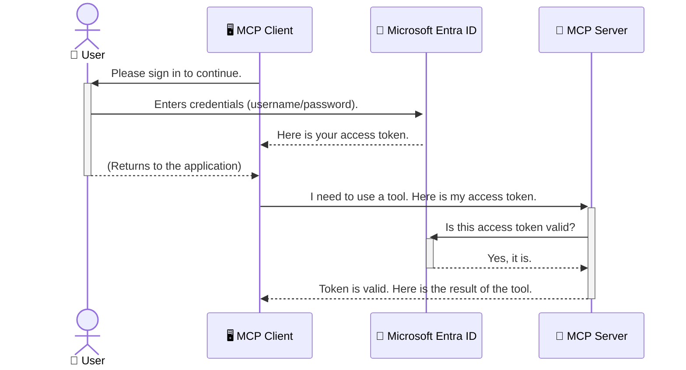

<!--
CO_OP_TRANSLATOR_METADATA:
{
  "original_hash": "6e562d7e5a77c8982da4aa8f762ad1d8",
  "translation_date": "2025-07-14T03:04:12+00:00",
  "source_file": "05-AdvancedTopics/mcp-security-entra/README.md",
  "language_code": "el"
}
-->
# Ασφάλεια Ροών Εργασίας Τεχνητής Νοημοσύνης: Πιστοποίηση Entra ID για Διακομιστές Model Context Protocol

## Εισαγωγή  
Η ασφάλεια του διακομιστή Model Context Protocol (MCP) είναι εξίσου σημαντική με το να κλειδώνεις την πόρτα του σπιτιού σου. Αν αφήσεις τον MCP διακομιστή ανοιχτό, εκθέτεις τα εργαλεία και τα δεδομένα σου σε μη εξουσιοδοτημένη πρόσβαση, που μπορεί να οδηγήσει σε παραβιάσεις ασφαλείας. Το Microsoft Entra ID προσφέρει μια ισχυρή λύση διαχείρισης ταυτότητας και πρόσβασης στο cloud, βοηθώντας να διασφαλιστεί ότι μόνο εξουσιοδοτημένοι χρήστες και εφαρμογές μπορούν να αλληλεπιδρούν με τον MCP διακομιστή σου. Σε αυτή την ενότητα, θα μάθεις πώς να προστατεύεις τις ροές εργασίας AI χρησιμοποιώντας την πιστοποίηση Entra ID.

## Στόχοι Μάθησης  
Στο τέλος αυτής της ενότητας, θα είσαι σε θέση να:

- Κατανοείς τη σημασία της ασφάλειας των MCP διακομιστών.  
- Εξηγείς τα βασικά του Microsoft Entra ID και της πιστοποίησης OAuth 2.0.  
- Αναγνωρίζεις τη διαφορά μεταξύ δημόσιων και εμπιστευτικών πελατών.  
- Εφαρμόζεις την πιστοποίηση Entra ID σε τοπικά (δημόσιος πελάτης) και απομακρυσμένα (εμπιστευτικός πελάτης) σενάρια MCP διακομιστών.  
- Εφαρμόζεις βέλτιστες πρακτικές ασφάλειας κατά την ανάπτυξη ροών εργασίας AI.

## Ασφάλεια και MCP  

Όπως δεν θα άφηνες την πόρτα του σπιτιού σου ξεκλείδωτη, έτσι δεν πρέπει να αφήνεις τον MCP διακομιστή σου ανοιχτό για οποιονδήποτε. Η ασφάλεια των ροών εργασίας AI είναι απαραίτητη για τη δημιουργία αξιόπιστων, ασφαλών και σταθερών εφαρμογών. Αυτό το κεφάλαιο θα σε εισάγει στη χρήση του Microsoft Entra ID για την ασφάλεια των MCP διακομιστών, διασφαλίζοντας ότι μόνο εξουσιοδοτημένοι χρήστες και εφαρμογές μπορούν να αλληλεπιδρούν με τα εργαλεία και τα δεδομένα σου.

## Γιατί η Ασφάλεια Είναι Σημαντική για τους MCP Διακομιστές  

Φαντάσου ότι ο MCP διακομιστής σου έχει ένα εργαλείο που μπορεί να στείλει email ή να έχει πρόσβαση σε μια βάση δεδομένων πελατών. Ένας μη ασφαλής διακομιστής σημαίνει ότι οποιοσδήποτε θα μπορούσε να χρησιμοποιήσει αυτό το εργαλείο, οδηγώντας σε μη εξουσιοδοτημένη πρόσβαση σε δεδομένα, ανεπιθύμητα μηνύματα ή άλλες κακόβουλες ενέργειες.

Με την εφαρμογή πιστοποίησης, διασφαλίζεις ότι κάθε αίτημα προς τον διακομιστή σου επαληθεύεται, επιβεβαιώνοντας την ταυτότητα του χρήστη ή της εφαρμογής που κάνει το αίτημα. Αυτό είναι το πρώτο και πιο κρίσιμο βήμα για την ασφάλεια των ροών εργασίας AI.

## Εισαγωγή στο Microsoft Entra ID  

[**Microsoft Entra ID**](https://adoption.microsoft.com/microsoft-security/entra/) είναι μια υπηρεσία διαχείρισης ταυτότητας και πρόσβασης στο cloud. Σκέψου το σαν έναν καθολικό φύλακα ασφαλείας για τις εφαρμογές σου. Αναλαμβάνει τη σύνθετη διαδικασία επαλήθευσης ταυτότητας χρηστών (πιστοποίηση) και τον καθορισμό των δικαιωμάτων τους (εξουσιοδότηση).

Χρησιμοποιώντας το Entra ID, μπορείς να:

- Ενεργοποιήσεις ασφαλή σύνδεση για τους χρήστες.  
- Προστατεύσεις APIs και υπηρεσίες.  
- Διαχειριστείς πολιτικές πρόσβασης από ένα κεντρικό σημείο.

Για τους MCP διακομιστές, το Entra ID προσφέρει μια ισχυρή και ευρέως αξιόπιστη λύση για τη διαχείριση του ποιος μπορεί να έχει πρόσβαση στις δυνατότητες του διακομιστή σου.

---

## Κατανόηση της Μαγικής Λειτουργίας: Πώς Λειτουργεί η Πιστοποίηση Entra ID  

Το Entra ID χρησιμοποιεί ανοιχτά πρότυπα όπως το **OAuth 2.0** για τη διαχείριση της πιστοποίησης. Αν και οι λεπτομέρειες μπορεί να είναι πολύπλοκες, η βασική ιδέα είναι απλή και μπορεί να γίνει κατανοητή με μια αναλογία.

### Μια Απαλή Εισαγωγή στο OAuth 2.0: Το Κλειδί του Βαλέ  

Σκέψου το OAuth 2.0 σαν μια υπηρεσία valet για το αυτοκίνητό σου. Όταν φτάνεις σε ένα εστιατόριο, δεν δίνεις στον valet το κύριο κλειδί σου. Αντίθετα, του δίνεις ένα **κλειδί valet** με περιορισμένα δικαιώματα — μπορεί να ξεκινήσει το αυτοκίνητο και να κλειδώσει τις πόρτες, αλλά δεν μπορεί να ανοίξει το πορτ-μπαγκάζ ή το ντουλαπάκι.

Σε αυτή την αναλογία:

- **Εσύ** είσαι ο **Χρήστης**.  
- **Το αυτοκίνητό σου** είναι ο **MCP Διακομιστής** με τα πολύτιμα εργαλεία και δεδομένα του.  
- Ο **Valet** είναι το **Microsoft Entra ID**.  
- Ο **Υπάλληλος Στάθμευσης** είναι ο **MCP Client** (η εφαρμογή που προσπαθεί να έχει πρόσβαση στον διακομιστή).  
- Το **Κλειδί Valet** είναι το **Access Token**.

Το access token είναι μια ασφαλής αλφαριθμητική συμβολοσειρά που λαμβάνει ο MCP client από το Entra ID μετά τη σύνδεσή σου. Ο client παρουσιάζει αυτό το token στον MCP διακομιστή με κάθε αίτημα. Ο διακομιστής μπορεί να επαληθεύσει το token για να βεβαιωθεί ότι το αίτημα είναι νόμιμο και ότι ο client έχει τα απαραίτητα δικαιώματα, χωρίς ποτέ να χρειάζεται να χειριστεί τα πραγματικά σου διαπιστευτήρια (όπως τον κωδικό σου).

### Η Ροή Πιστοποίησης  

Έτσι λειτουργεί η διαδικασία στην πράξη:



### Εισαγωγή στη Microsoft Authentication Library (MSAL)  

Πριν δούμε τον κώδικα, είναι σημαντικό να παρουσιάσουμε ένα βασικό στοιχείο που θα δεις στα παραδείγματα: τη **Microsoft Authentication Library (MSAL)**.

Η MSAL είναι μια βιβλιοθήκη που έχει αναπτύξει η Microsoft και διευκολύνει πολύ τους προγραμματιστές στη διαχείριση της πιστοποίησης. Αντί να γράφεις όλο τον πολύπλοκο κώδικα για τη διαχείριση των security tokens, των συνδέσεων και των ανανεώσεων συνεδριών, η MSAL αναλαμβάνει το βαρύ φορτίο.

Η χρήση μιας βιβλιοθήκης όπως η MSAL συνιστάται έντονα γιατί:

- **Είναι Ασφαλής:** Εφαρμόζει πρωτόκολλα βιομηχανικού επιπέδου και βέλτιστες πρακτικές ασφαλείας, μειώνοντας τον κίνδυνο ευπαθειών στον κώδικά σου.  
- **Απλοποιεί την Ανάπτυξη:** Αφαιρεί την πολυπλοκότητα των πρωτοκόλλων OAuth 2.0 και OpenID Connect, επιτρέποντάς σου να προσθέσεις ισχυρή πιστοποίηση στην εφαρμογή σου με λίγες μόνο γραμμές κώδικα.  
- **Υποστηρίζεται και Συντηρείται:** Η Microsoft διατηρεί ενεργά και ενημερώνει τη MSAL για να αντιμετωπίζει νέες απειλές ασφαλείας και αλλαγές πλατφορμών.

Η MSAL υποστηρίζει πολλές γλώσσες και πλαίσια εφαρμογών, όπως .NET, JavaScript/TypeScript, Python, Java, Go, καθώς και κινητές πλατφόρμες όπως iOS και Android. Αυτό σημαίνει ότι μπορείς να χρησιμοποιήσεις τα ίδια συνεπή πρότυπα πιστοποίησης σε όλο το τεχνολογικό σου στοίβαγμα.

Για να μάθεις περισσότερα για τη MSAL, μπορείς να δεις την επίσημη [τεκμηρίωση επισκόπησης MSAL](https://learn.microsoft.com/entra/identity-platform/msal-overview).

---

## Ασφάλεια του MCP Διακομιστή σου με Entra ID: Οδηγός Βήμα-βήμα  

Ας δούμε τώρα πώς να ασφαλίσεις έναν τοπικό MCP διακομιστή (που επικοινωνεί μέσω `stdio`) χρησιμοποιώντας το Entra ID. Αυτό το παράδειγμα χρησιμοποιεί έναν **δημόσιο πελάτη**, κατάλληλο για εφαρμογές που τρέχουν στη μηχανή του χρήστη, όπως μια επιτραπέζια εφαρμογή ή τοπικός διακομιστής ανάπτυξης.

### Σενάριο 1: Ασφάλεια Τοπικού MCP Διακομιστή (με Δημόσιο Πελάτη)  

Σε αυτό το σενάριο, εξετάζουμε έναν MCP διακομιστή που τρέχει τοπικά, επικοινωνεί μέσω `stdio` και χρησιμοποιεί το Entra ID για να πιστοποιήσει τον χρήστη πριν επιτρέψει την πρόσβαση στα εργαλεία του. Ο διακομιστής θα έχει ένα εργαλείο που ανακτά τις πληροφορίες προφίλ του χρήστη από το Microsoft Graph API.

#### 1. Ρύθμιση της Εφαρμογής στο Entra ID  

Πριν γράψεις κώδικα, πρέπει να καταχωρήσεις την εφαρμογή σου στο Microsoft Entra ID. Αυτό ενημερώνει το Entra ID για την εφαρμογή σου και της δίνει άδεια να χρησιμοποιεί την υπηρεσία πιστοποίησης.

1. Πήγαινε στο **[Microsoft Entra portal](https://entra.microsoft.com/)**.  
2. Μετάβαση σε **App registrations** και πάτησε **New registration**.  
3. Δώσε ένα όνομα στην εφαρμογή σου (π.χ. "My Local MCP Server").  
4. Στο **Supported account types**, επίλεξε **Accounts in this organizational directory only**.  
5. Μπορείς να αφήσεις το **Redirect URI** κενό για αυτό το παράδειγμα.  
6. Πάτησε **Register**.

Μόλις καταχωρηθεί, σημείωσε το **Application (client) ID** και το **Directory (tenant) ID**. Θα τα χρειαστείς στον κώδικά σου.

#### 2. Ο Κώδικας: Ανάλυση  

Ας δούμε τα βασικά μέρη του κώδικα που διαχειρίζονται την πιστοποίηση. Ο πλήρης κώδικας για αυτό το παράδειγμα είναι διαθέσιμος στον φάκελο [Entra ID - Local - WAM](https://github.com/Azure-Samples/mcp-auth-servers/tree/main/src/entra-id-local-wam) του [mcp-auth-servers GitHub repository](https://github.com/Azure-Samples/mcp-auth-servers).

**`AuthenticationService.cs`**

Αυτή η κλάση είναι υπεύθυνη για την αλληλεπίδραση με το Entra ID.

- **`CreateAsync`**: Αρχικοποιεί το `PublicClientApplication` από τη MSAL. Ρυθμίζεται με το `clientId` και το `tenantId` της εφαρμογής σου.  
- **`WithBroker`**: Ενεργοποιεί τη χρήση broker (όπως το Windows Web Account Manager), που προσφέρει μια πιο ασφαλή και ομαλή εμπειρία single sign-on.  
- **`AcquireTokenAsync`**: Η βασική μέθοδος. Προσπαθεί πρώτα να πάρει ένα token σιωπηλά (χωρίς να ζητήσει ξανά σύνδεση αν υπάρχει έγκυρη συνεδρία). Αν δεν βρεθεί token, ζητά από τον χρήστη να συνδεθεί διαδραστικά.

```csharp
// Simplified for clarity
public static async Task<AuthenticationService> CreateAsync(ILogger<AuthenticationService> logger)
{
    var msalClient = PublicClientApplicationBuilder
        .Create(_clientId) // Your Application (client) ID
        .WithAuthority(AadAuthorityAudience.AzureAdMyOrg)
        .WithTenantId(_tenantId) // Your Directory (tenant) ID
        .WithBroker(new BrokerOptions(BrokerOptions.OperatingSystems.Windows))
        .Build();

    // ... cache registration ...

    return new AuthenticationService(logger, msalClient);
}

public async Task<string> AcquireTokenAsync()
{
    try
    {
        // Try silent authentication first
        var accounts = await _msalClient.GetAccountsAsync();
        var account = accounts.FirstOrDefault();

        AuthenticationResult? result = null;

        if (account != null)
        {
            result = await _msalClient.AcquireTokenSilent(_scopes, account).ExecuteAsync();
        }
        else
        {
            // If no account, or silent fails, go interactive
            result = await _msalClient.AcquireTokenInteractive(_scopes).ExecuteAsync();
        }

        return result.AccessToken;
    }
    catch (Exception ex)
    {
        _logger.LogError(ex, "An error occurred while acquiring the token.");
        throw; // Optionally rethrow the exception for higher-level handling
    }
}
```

**`Program.cs`**

Εδώ γίνεται η ρύθμιση του MCP διακομιστή και η ενσωμάτωση της υπηρεσίας πιστοποίησης.

- **`AddSingleton<AuthenticationService>`**: Καταχωρεί την `AuthenticationService` στο container εξαρτήσεων, ώστε να μπορεί να χρησιμοποιηθεί από άλλα μέρη της εφαρμογής (όπως το εργαλείο μας).  
- Το εργαλείο **`GetUserDetailsFromGraph`** χρειάζεται μια παρουσία της `AuthenticationService`. Πριν κάνει οτιδήποτε, καλεί `authService.AcquireTokenAsync()` για να πάρει ένα έγκυρο access token. Αν η πιστοποίηση πετύχει, χρησιμοποιεί το token για να καλέσει το Microsoft Graph API και να πάρει τα στοιχεία του χρήστη.

```csharp
// Simplified for clarity
[McpServerTool(Name = "GetUserDetailsFromGraph")]
public static async Task<string> GetUserDetailsFromGraph(
    AuthenticationService authService)
{
    try
    {
        // This will trigger the authentication flow
        var accessToken = await authService.AcquireTokenAsync();

        // Use the token to create a GraphServiceClient
        var graphClient = new GraphServiceClient(
            new BaseBearerTokenAuthenticationProvider(new TokenProvider(authService)));

        var user = await graphClient.Me.GetAsync();

        return System.Text.Json.JsonSerializer.Serialize(user);
    }
    catch (Exception ex)
    {
        return $"Error: {ex.Message}";
    }
}
```

#### 3. Πώς Λειτουργεί Όλο Μαζί  

1. Όταν ο MCP client προσπαθεί να χρησιμοποιήσει το εργαλείο `GetUserDetailsFromGraph`, το εργαλείο καλεί πρώτα `AcquireTokenAsync`.  
2. Η `AcquireTokenAsync` ενεργοποιεί τη βιβλιοθήκη MSAL να ελέγξει για έγκυρο token.  
3. Αν δεν βρεθεί token, η MSAL μέσω του broker ζητά από τον χρήστη να συνδεθεί με τον λογαριασμό Entra ID.  
4. Μόλις ο χρήστης συνδεθεί, το Entra ID εκδίδει ένα access token.  
5. Το εργαλείο λαμβάνει το token και το χρησιμοποιεί για να κάνει μια ασφαλή κλήση στο Microsoft Graph API.  
6. Τα στοιχεία του χρήστη επιστρέφονται στον MCP client.

Αυτή η διαδικασία διασφαλίζει ότι μόνο πιστοποιημένοι χρήστες μπορούν να χρησιμοποιήσουν το εργαλείο, προστατεύοντας αποτελεσματικά τον τοπικό MCP διακομιστή σου.

### Σενάριο 2: Ασφάλεια Απομακρυσμένου MCP Διακομιστή (με Εμπιστευτικό Πελάτη)  

Όταν ο MCP διακομιστής σου τρέχει σε απομακρυσμένη μηχανή (π.χ. cloud server) και επικοινωνεί μέσω πρωτοκόλλου όπως HTTP Streaming, οι απαιτήσεις ασφαλείας είναι διαφορετικές. Σε αυτή την περίπτωση, πρέπει να χρησιμοποιήσεις έναν **εμπιστευτικό πελάτη** και τη **Ροή Κωδικού Εξουσιοδότησης (Authorization Code Flow)**. Αυτή είναι μια πιο ασφαλής μέθοδος γιατί τα μυστικά της εφαρμογής δεν εκτίθενται ποτέ στον browser.

Αυτό το παράδειγμα χρησιμοποιεί έναν MCP διακομιστή βασισμένο σε TypeScript που χρησιμοποιεί το Express.js για τη διαχείριση HTTP αιτημάτων.

#### 1. Ρύθμιση της Εφαρμογής στο Entra ID  

Η ρύθμιση στο Entra ID είναι παρόμοια με τον δημόσιο πελάτη, αλλά με μια βασική διαφορά: πρέπει να δημιουργήσεις ένα **client secret**.

1. Πήγαινε στο **[Microsoft Entra portal](https://entra.microsoft.com/)**.  
2. Στην καταχώρηση της εφαρμογής σου, πήγαινε στην καρτέλα **Certificates & secrets**.  
3. Πάτησε **New client secret**, δώσε μια περιγραφή και πάτησε **Add**.  
4. **Σημαντικό:** Αντέγραψε αμέσως την τιμή του secret. Δεν θα μπορείς να τη δεις ξανά.  
5. Πρέπει επίσης να ρυθμίσεις ένα **Redirect URI**. Πήγαινε στην καρτέλα **Authentication**, πάτησε **Add a platform**, επίλεξε **Web** και εισήγαγε το redirect URI της εφαρμογής σου (π.χ. `http://localhost:3001/auth/callback`).

> **⚠️ Σημαντική Σημείωση Ασφαλείας:** Για εφαρμογές παραγωγής, η Microsoft συνιστά έντονα τη χρήση **πιστοποίησης χωρίς μυστικά** όπως **Managed Identity** ή **Workload Identity Federation** αντί για client secrets. Τα client secrets ενέχουν κινδύνους ασφαλείας καθώς μπορεί να εκτεθούν ή να παραβιαστούν. Οι managed identities προσφέρουν πιο ασφαλή προσέγγιση, εξαλείφοντας την ανάγκη αποθήκευσης διαπιστευτηρίων στον κώδικα ή τη ρύθμιση.  
>  
> Για περισσότερες πληροφορίες σχετικά με τις managed identities και την υλοποίησή τους, δες το [Managed identities for Azure resources overview](https://learn.microsoft.com/entra/identity/managed-identities-azure-resources/overview).

#### 2. Ο Κώδικας: Ανάλυση  

Αυτό το παράδειγμα χρησιμοποιεί προσέγγιση βασισμένη σε συνεδρίες. Όταν ο χρήστης πιστοποιείται, ο διακομιστής αποθηκεύει το access token και το refresh token στη συνεδρία και δίνει στον χρήστη ένα session token. Αυτό το session token χρησιμοποιείται για τα επόμενα αιτήματα. Ο πλήρης κώδικας για αυτό το παράδειγμα είναι διαθέσιμος στον φάκελο [Entra ID - Confidential client](https://github.com/Azure-Samples/mcp-auth-servers/tree/main/src/entra-id-cca-session) του [mcp-auth-servers GitHub repository](https://github.com/Azure-Samples
4. Ο διακομιστής ανταλλάσσει τον κωδικό με ένα access token και ένα refresh token, τα αποθηκεύει και δημιουργεί ένα session token το οποίο αποστέλλεται στον πελάτη.  
5. Ο πελάτης μπορεί πλέον να χρησιμοποιεί αυτό το session token στην κεφαλίδα `Authorization` για όλα τα μελλοντικά αιτήματα προς τον MCP διακομιστή.  
6. Όταν καλείται το εργαλείο `getUserDetails`, χρησιμοποιεί το session token για να αναζητήσει το Entra ID access token και στη συνέχεια το χρησιμοποιεί για να καλέσει το Microsoft Graph API.

Αυτή η ροή είναι πιο σύνθετη από τη ροή του public client, αλλά είναι απαραίτητη για endpoints που είναι προσβάσιμα μέσω διαδικτύου. Επειδή οι απομακρυσμένοι MCP διακομιστές είναι προσβάσιμοι μέσω του δημόσιου διαδικτύου, χρειάζονται αυστηρότερα μέτρα ασφαλείας για να προστατευτούν από μη εξουσιοδοτημένη πρόσβαση και πιθανές επιθέσεις.


## Καλές Πρακτικές Ασφαλείας

- **Χρησιμοποιείτε πάντα HTTPS**: Κρυπτογραφήστε την επικοινωνία μεταξύ πελάτη και διακομιστή για να προστατεύσετε τα tokens από υποκλοπή.  
- **Εφαρμόστε Role-Based Access Control (RBAC)**: Μην ελέγχετε μόνο *αν* ένας χρήστης είναι αυθεντικοποιημένος, αλλά και *τι* έχει δικαίωμα να κάνει. Μπορείτε να ορίσετε ρόλους στο Entra ID και να τους ελέγχετε στον MCP διακομιστή σας.  
- **Παρακολούθηση και έλεγχος**: Καταγράψτε όλα τα γεγονότα αυθεντικοποίησης ώστε να μπορείτε να εντοπίζετε και να ανταποκρίνεστε σε ύποπτες δραστηριότητες.  
- **Διαχείριση περιορισμών ρυθμού και throttling**: Το Microsoft Graph και άλλα APIs εφαρμόζουν περιορισμούς ρυθμού για να αποτρέψουν κατάχρηση. Εφαρμόστε λογική εκθετικής επανάληψης (exponential backoff) και επανειλημμένες προσπάθειες στον MCP διακομιστή σας για να διαχειριστείτε ομαλά τις απαντήσεις HTTP 429 (Too Many Requests). Σκεφτείτε την προσωρινή αποθήκευση (caching) συχνά προσπελαύσιμων δεδομένων για να μειώσετε τις κλήσεις API.  
- **Ασφαλής αποθήκευση tokens**: Αποθηκεύστε τα access tokens και refresh tokens με ασφάλεια. Για τοπικές εφαρμογές, χρησιμοποιήστε τους μηχανισμούς ασφαλούς αποθήκευσης του συστήματος. Για διακομιστές, εξετάστε τη χρήση κρυπτογραφημένης αποθήκευσης ή υπηρεσιών ασφαλούς διαχείρισης κλειδιών όπως το Azure Key Vault.  
- **Διαχείριση λήξης tokens**: Τα access tokens έχουν περιορισμένη διάρκεια ζωής. Εφαρμόστε αυτόματη ανανέωση token χρησιμοποιώντας τα refresh tokens για να διατηρείτε μια ομαλή εμπειρία χρήστη χωρίς να απαιτείται επανεπιβεβαίωση ταυτότητας.  
- **Σκεφτείτε τη χρήση του Azure API Management**: Ενώ η υλοποίηση ασφάλειας απευθείας στον MCP διακομιστή σας προσφέρει λεπτομερή έλεγχο, τα API Gateways όπως το Azure API Management μπορούν να διαχειριστούν αυτόματα πολλά από αυτά τα ζητήματα ασφαλείας, συμπεριλαμβανομένης της αυθεντικοποίησης, εξουσιοδότησης, περιορισμού ρυθμού και παρακολούθησης. Παρέχουν ένα κεντρικό επίπεδο ασφάλειας που βρίσκεται ανάμεσα στους πελάτες σας και τους MCP διακομιστές σας. Για περισσότερες λεπτομέρειες σχετικά με τη χρήση API Gateways με MCP, δείτε το [Azure API Management Your Auth Gateway For MCP Servers](https://techcommunity.microsoft.com/blog/integrationsonazureblog/azure-api-management-your-auth-gateway-for-mcp-servers/4402690).


## Βασικά Συμπεράσματα

- Η ασφάλεια του MCP διακομιστή σας είναι κρίσιμη για την προστασία των δεδομένων και των εργαλείων σας.  
- Το Microsoft Entra ID παρέχει μια ισχυρή και επεκτάσιμη λύση για αυθεντικοποίηση και εξουσιοδότηση.  
- Χρησιμοποιήστε έναν **public client** για τοπικές εφαρμογές και έναν **confidential client** για απομακρυσμένους διακομιστές.  
- Η **Authorization Code Flow** είναι η πιο ασφαλής επιλογή για web εφαρμογές.


## Άσκηση

1. Σκεφτείτε έναν MCP διακομιστή που θα μπορούσατε να δημιουργήσετε. Θα ήταν τοπικός ή απομακρυσμένος;  
2. Με βάση την απάντησή σας, θα χρησιμοποιούσατε public ή confidential client;  
3. Ποια άδεια θα ζητούσε ο MCP διακομιστής σας για να εκτελεί ενέργειες στο Microsoft Graph;


## Πρακτικές Ασκήσεις

### Άσκηση 1: Καταχώρηση Εφαρμογής στο Entra ID  
Πλοηγηθείτε στην πύλη Microsoft Entra.  
Καταχωρήστε μια νέα εφαρμογή για τον MCP διακομιστή σας.  
Καταγράψτε το Application (client) ID και το Directory (tenant) ID.

### Άσκηση 2: Ασφάλεια Τοπικού MCP Διακομιστή (Public Client)  
- Ακολουθήστε το παράδειγμα κώδικα για να ενσωματώσετε το MSAL (Microsoft Authentication Library) για αυθεντικοποίηση χρήστη.  
- Δοκιμάστε τη ροή αυθεντικοποίησης καλώντας το εργαλείο MCP που ανακτά λεπτομέρειες χρήστη από το Microsoft Graph.

### Άσκηση 3: Ασφάλεια Απομακρυσμένου MCP Διακομιστή (Confidential Client)  
- Καταχωρήστε έναν confidential client στο Entra ID και δημιουργήστε ένα client secret.  
- Διαμορφώστε τον MCP διακομιστή σας με Express.js ώστε να χρησιμοποιεί την Authorization Code Flow.  
- Δοκιμάστε τα προστατευμένα endpoints και επιβεβαιώστε την πρόσβαση με βάση τα tokens.

### Άσκηση 4: Εφαρμογή Καλών Πρακτικών Ασφαλείας  
- Ενεργοποιήστε HTTPS για τον τοπικό ή απομακρυσμένο διακομιστή σας.  
- Εφαρμόστε role-based access control (RBAC) στη λογική του διακομιστή σας.  
- Προσθέστε διαχείριση λήξης tokens και ασφαλή αποθήκευση tokens.

## Πόροι

1. **Τεκμηρίωση Επισκόπησης MSAL**  
   Μάθετε πώς η Microsoft Authentication Library (MSAL) επιτρέπει την ασφαλή απόκτηση tokens σε διάφορες πλατφόρμες:  
   [MSAL Overview on Microsoft Learn](https://learn.microsoft.com/en-gb/entra/msal/overview)

2. **Azure-Samples/mcp-auth-servers GitHub Repository**  
   Παραδείγματα υλοποίησης MCP διακομιστών που δείχνουν ροές αυθεντικοποίησης:  
   [Azure-Samples/mcp-auth-servers on GitHub](https://github.com/Azure-Samples/mcp-auth-servers)

3. **Επισκόπηση Managed Identities για Azure Resources**  
   Κατανοήστε πώς να εξαλείψετε μυστικά χρησιμοποιώντας διαχειριζόμενες ταυτότητες που ανατίθενται από το σύστημα ή τον χρήστη:  
   [Managed Identities Overview on Microsoft Learn](https://learn.microsoft.com/en-us/entra/identity/managed-identities-azure-resources/)

4. **Azure API Management: Your Auth Gateway for MCP Servers**  
   Αναλυτική παρουσίαση της χρήσης του APIM ως ασφαλούς πύλης OAuth2 για MCP διακομιστές:  
   [Azure API Management Your Auth Gateway For MCP Servers](https://techcommunity.microsoft.com/blog/integrationsonazureblog/azure-api-management-your-auth-gateway-for-mcp-servers/4402690)

5. **Αναφορά Δικαιωμάτων Microsoft Graph**  
   Ολοκληρωμένη λίστα εξουσιοδοτήσεων για delegated και application permissions στο Microsoft Graph:  
   [Microsoft Graph Permissions Reference](https://learn.microsoft.com/zh-tw/graph/permissions-reference)


## Μαθησιακά Αποτελέσματα  
Μετά την ολοκλήρωση αυτής της ενότητας, θα μπορείτε να:

- Εξηγείτε γιατί η αυθεντικοποίηση είναι κρίσιμη για MCP διακομιστές και ροές εργασίας AI.  
- Ρυθμίζετε και διαμορφώνετε την αυθεντικοποίηση Entra ID για τοπικά και απομακρυσμένα σενάρια MCP διακομιστών.  
- Επιλέγετε τον κατάλληλο τύπο πελάτη (public ή confidential) ανάλογα με την ανάπτυξη του διακομιστή σας.  
- Εφαρμόζετε ασφαλείς πρακτικές κωδικοποίησης, συμπεριλαμβανομένης της αποθήκευσης tokens και της εξουσιοδότησης βάσει ρόλων.  
- Προστατεύετε με σιγουριά τον MCP διακομιστή και τα εργαλεία του από μη εξουσιοδοτημένη πρόσβαση.

## Τι ακολουθεί

- [5.13 Model Context Protocol (MCP) Integration with Azure AI Foundry](../mcp-foundry-agent-integration/README.md)

**Αποποίηση ευθυνών**:  
Αυτό το έγγραφο έχει μεταφραστεί χρησιμοποιώντας την υπηρεσία αυτόματης μετάφρασης AI [Co-op Translator](https://github.com/Azure/co-op-translator). Παρόλο που επιδιώκουμε την ακρίβεια, παρακαλούμε να γνωρίζετε ότι οι αυτόματες μεταφράσεις ενδέχεται να περιέχουν λάθη ή ανακρίβειες. Το πρωτότυπο έγγραφο στη γλώσσα του θεωρείται η αυθεντική πηγή. Για κρίσιμες πληροφορίες, συνιστάται επαγγελματική ανθρώπινη μετάφραση. Δεν φέρουμε ευθύνη για τυχόν παρεξηγήσεις ή λανθασμένες ερμηνείες που προκύπτουν από τη χρήση αυτής της μετάφρασης.