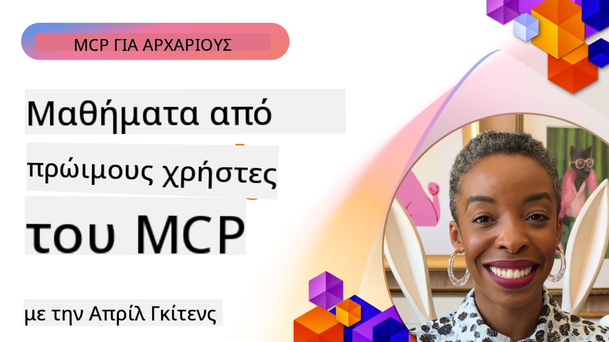

<!--
CO_OP_TRANSLATOR_METADATA:
{
  "original_hash": "41f16dac486d2086a53bc644a01cbe42",
  "translation_date": "2025-08-18T13:39:55+00:00",
  "source_file": "07-LessonsfromEarlyAdoption/README.md",
  "language_code": "el"
}
-->
# 🌟 Μαθήματα από Πρώιμους Υιοθετητές

[](https://youtu.be/jds7dSmNptE)

_(Κάντε κλικ στην εικόνα παραπάνω για να δείτε το βίντεο αυτού του μαθήματος)_

## 🎯 Τι Καλύπτει Αυτή η Ενότητα

Αυτή η ενότητα εξετάζει πώς πραγματικοί οργανισμοί και προγραμματιστές αξιοποιούν το Model Context Protocol (MCP) για να επιλύσουν πραγματικές προκλήσεις και να προωθήσουν την καινοτομία. Μέσα από λεπτομερείς μελέτες περιπτώσεων και πρακτικά παραδείγματα, θα ανακαλύψετε πώς το MCP επιτρέπει ασφαλή, κλιμακούμενη ενσωμάτωση AI που συνδέει γλωσσικά μοντέλα, εργαλεία και δεδομένα επιχειρήσεων.

### 📚 Δείτε το MCP σε Δράση

Θέλετε να δείτε αυτές τις αρχές να εφαρμόζονται σε εργαλεία έτοιμα για παραγωγή; Δείτε τον οδηγό μας [**10 Microsoft MCP Servers Που Μεταμορφώνουν την Παραγωγικότητα των Προγραμματιστών**](microsoft-mcp-servers.md), ο οποίος παρουσιάζει πραγματικούς MCP servers της Microsoft που μπορείτε να χρησιμοποιήσετε σήμερα.

## Επισκόπηση

Αυτό το μάθημα εξετάζει πώς οι πρώιμοι υιοθετητές αξιοποίησαν το Model Context Protocol (MCP) για να επιλύσουν πραγματικές προκλήσεις και να προωθήσουν την καινοτομία σε διάφορους κλάδους. Μέσα από λεπτομερείς μελέτες περιπτώσεων και πρακτικά έργα, θα δείτε πώς το MCP επιτρέπει τυποποιημένη, ασφαλή και κλιμακούμενη ενσωμάτωση AI—συνδέοντας μεγάλα γλωσσικά μοντέλα, εργαλεία και δεδομένα επιχειρήσεων σε ένα ενιαίο πλαίσιο. Θα αποκτήσετε πρακτική εμπειρία στον σχεδιασμό και την ανάπτυξη λύσεων βασισμένων στο MCP, θα μάθετε από αποδεδειγμένα πρότυπα υλοποίησης και θα ανακαλύψετε βέλτιστες πρακτικές για την ανάπτυξη του MCP σε περιβάλλοντα παραγωγής. Το μάθημα επίσης αναδεικνύει αναδυόμενες τάσεις, μελλοντικές κατευθύνσεις και πόρους ανοιχτού κώδικα για να σας βοηθήσει να παραμείνετε στην αιχμή της τεχνολογίας MCP και του εξελισσόμενου οικοσυστήματός της.

## Στόχοι Μάθησης

- Ανάλυση πραγματικών υλοποιήσεων MCP σε διάφορους κλάδους
- Σχεδιασμός και ανάπτυξη ολοκληρωμένων εφαρμογών βασισμένων στο MCP
- Εξερεύνηση αναδυόμενων τάσεων και μελλοντικών κατευθύνσεων στην τεχνολογία MCP
- Εφαρμογή βέλτιστων πρακτικών σε πραγματικά σενάρια ανάπτυξης

## Πραγματικές Υλοποιήσεις MCP

### Μελέτη Περίπτωσης 1: Αυτοματοποίηση Υποστήριξης Πελατών Επιχειρήσεων

Μια πολυεθνική εταιρεία υλοποίησε μια λύση βασισμένη στο MCP για να τυποποιήσει τις αλληλεπιδράσεις AI στα συστήματα υποστήριξης πελατών της. Αυτό τους επέτρεψε να:

- Δημιουργήσουν μια ενιαία διεπαφή για πολλούς παρόχους LLM
- Διατηρήσουν συνεπή διαχείριση προτροπών μεταξύ τμημάτων
- Εφαρμόσουν ισχυρούς ελέγχους ασφαλείας και συμμόρφωσης
- Αλλάξουν εύκολα μεταξύ διαφορετικών μοντέλων AI ανάλογα με τις ανάγκες

**Τεχνική Υλοποίηση:**

```python
# Python MCP server implementation for customer support
import logging
import asyncio
from modelcontextprotocol import create_server, ServerConfig
from modelcontextprotocol.server import MCPServer
from modelcontextprotocol.transports import create_http_transport
from modelcontextprotocol.resources import ResourceDefinition
from modelcontextprotocol.prompts import PromptDefinition
from modelcontextprotocol.tool import ToolDefinition

# Configure logging
logging.basicConfig(level=logging.INFO)

async def main():
    # Create server configuration
    config = ServerConfig(
        name="Enterprise Customer Support Server",
        version="1.0.0",
        description="MCP server for handling customer support inquiries"
    )
    
    # Initialize MCP server
    server = create_server(config)
    
    # Register knowledge base resources
    server.resources.register(
        ResourceDefinition(
            name="customer_kb",
            description="Customer knowledge base documentation"
        ),
        lambda params: get_customer_documentation(params)
    )
    
    # Register prompt templates
    server.prompts.register(
        PromptDefinition(
            name="support_template",
            description="Templates for customer support responses"
        ),
        lambda params: get_support_templates(params)
    )
    
    # Register support tools
    server.tools.register(
        ToolDefinition(
            name="ticketing",
            description="Create and update support tickets"
        ),
        handle_ticketing_operations
    )
    
    # Start server with HTTP transport
    transport = create_http_transport(port=8080)
    await server.run(transport)

if __name__ == "__main__":
    asyncio.run(main())
```

**Αποτελέσματα:** Μείωση κόστους μοντέλων κατά 30%, βελτίωση συνέπειας απαντήσεων κατά 45% και ενισχυμένη συμμόρφωση σε παγκόσμιες λειτουργίες.

### Μελέτη Περίπτωσης 2: Βοηθός Διάγνωσης Υγείας

Ένας πάροχος υγειονομικής περίθαλψης ανέπτυξε μια υποδομή MCP για την ενσωμάτωση πολλών εξειδικευμένων ιατρικών μοντέλων AI, διασφαλίζοντας παράλληλα την προστασία ευαίσθητων δεδομένων ασθενών:

- Απρόσκοπτη εναλλαγή μεταξύ γενικών και εξειδικευμένων ιατρικών μοντέλων
- Αυστηροί έλεγχοι απορρήτου και ίχνη ελέγχου
- Ενσωμάτωση με υπάρχοντα συστήματα Ηλεκτρονικών Ιατρικών Αρχείων (EHR)
- Συνεπής μηχανική προτροπών για ιατρική ορολογία

**Τεχνική Υλοποίηση:**

```csharp
// C# MCP host application implementation in healthcare application
using Microsoft.Extensions.DependencyInjection;
using ModelContextProtocol.SDK.Client;
using ModelContextProtocol.SDK.Security;
using ModelContextProtocol.SDK.Resources;

public class DiagnosticAssistant
{
    private readonly MCPHostClient _mcpClient;
    private readonly PatientContext _patientContext;
    
    public DiagnosticAssistant(PatientContext patientContext)
    {
        _patientContext = patientContext;
        
        // Configure MCP client with healthcare-specific settings
        var clientOptions = new ClientOptions
        {
            Name = "Healthcare Diagnostic Assistant",
            Version = "1.0.0",
            Security = new SecurityOptions
            {
                Encryption = EncryptionLevel.Medical,
                AuditEnabled = true
            }
        };
        
        _mcpClient = new MCPHostClientBuilder()
            .WithOptions(clientOptions)
            .WithTransport(new HttpTransport("https://healthcare-mcp.example.org"))
            .WithAuthentication(new HIPAACompliantAuthProvider())
            .Build();
    }
    
    public async Task<DiagnosticSuggestion> GetDiagnosticAssistance(
        string symptoms, string patientHistory)
    {
        // Create request with appropriate resources and tool access
        var resourceRequest = new ResourceRequest
        {
            Name = "patient_records",
            Parameters = new Dictionary<string, object>
            {
                ["patientId"] = _patientContext.PatientId,
                ["requestingProvider"] = _patientContext.ProviderId
            }
        };
        
        // Request diagnostic assistance using appropriate prompt
        var response = await _mcpClient.SendPromptRequestAsync(
            promptName: "diagnostic_assistance",
            parameters: new Dictionary<string, object>
            {
                ["symptoms"] = symptoms,
                patientHistory = patientHistory,
                relevantGuidelines = _patientContext.GetRelevantGuidelines()
            });
            
        return DiagnosticSuggestion.FromMCPResponse(response);
    }
}
```

**Αποτελέσματα:** Βελτιωμένες διαγνωστικές προτάσεις για γιατρούς, πλήρης συμμόρφωση με HIPAA και σημαντική μείωση της εναλλαγής μεταξύ συστημάτων.

### Μελέτη Περίπτωσης 3: Ανάλυση Κινδύνου Χρηματοοικονομικών Υπηρεσιών

Ένας χρηματοοικονομικός οργανισμός υλοποίησε το MCP για να τυποποιήσει τις διαδικασίες ανάλυσης κινδύνου σε διαφορετικά τμήματα:

- Δημιουργία ενιαίας διεπαφής για μοντέλα πιστωτικού κινδύνου, ανίχνευσης απάτης και επενδυτικού κινδύνου
- Εφαρμογή αυστηρών ελέγχων πρόσβασης και έκδοσης μοντέλων
- Διασφάλιση δυνατότητας ελέγχου όλων των συστάσεων AI
- Διατήρηση συνεπούς μορφοποίησης δεδομένων σε διαφορετικά συστήματα

**Τεχνική Υλοποίηση:**

```java
// Java MCP server for financial risk assessment
import org.mcp.server.*;
import org.mcp.security.*;

public class FinancialRiskMCPServer {
    public static void main(String[] args) {
        // Create MCP server with financial compliance features
        MCPServer server = new MCPServerBuilder()
            .withModelProviders(
                new ModelProvider("risk-assessment-primary", new AzureOpenAIProvider()),
                new ModelProvider("risk-assessment-audit", new LocalLlamaProvider())
            )
            .withPromptTemplateDirectory("./compliance/templates")
            .withAccessControls(new SOCCompliantAccessControl())
            .withDataEncryption(EncryptionStandard.FINANCIAL_GRADE)
            .withVersionControl(true)
            .withAuditLogging(new DatabaseAuditLogger())
            .build();
            
        server.addRequestValidator(new FinancialDataValidator());
        server.addResponseFilter(new PII_RedactionFilter());
        
        server.start(9000);
        
        System.out.println("Financial Risk MCP Server running on port 9000");
    }
}
```

**Αποτελέσματα:** Ενισχυμένη συμμόρφωση με κανονισμούς, 40% ταχύτεροι κύκλοι ανάπτυξης μοντέλων και βελτιωμένη συνέπεια αξιολόγησης κινδύνου μεταξύ τμημάτων.

### Μελέτη Περίπτωσης 4: Microsoft Playwright MCP Server για Αυτοματοποίηση Περιηγητή

Η Microsoft ανέπτυξε τον [Playwright MCP server](https://github.com/microsoft/playwright-mcp) για να επιτρέψει ασφαλή, τυποποιημένη αυτοματοποίηση περιηγητή μέσω του Model Context Protocol. Αυτός ο server έτοιμος για παραγωγή επιτρέπει στους AI agents και LLMs να αλληλεπιδρούν με περιηγητές ιστού με ελεγχόμενο, ελεγχόμενο και επεκτάσιμο τρόπο—επιτρέποντας περιπτώσεις χρήσης όπως αυτοματοποιημένες δοκιμές ιστού, εξαγωγή δεδομένων και ολοκληρωμένες ροές εργασίας.

> **🎯 Εργαλείο Έτοιμο για Παραγωγή**
> 
> Αυτή η μελέτη περίπτωσης παρουσιάζει έναν πραγματικό MCP server που μπορείτε να χρησιμοποιήσετε σήμερα! Μάθετε περισσότερα για τον Playwright MCP Server και άλλους 9 MCP servers της Microsoft στον οδηγό μας [**Microsoft MCP Servers Guide**](microsoft-mcp-servers.md#8--playwright-mcp-server).

**Κύρια Χαρακτηριστικά:**
- Παρέχει δυνατότητες αυτοματοποίησης περιηγητή (πλοήγηση, συμπλήρωση φορμών, λήψη στιγμιότυπων οθόνης κ.λπ.) ως εργαλεία MCP
- Εφαρμόζει αυστηρούς ελέγχους πρόσβασης και sandboxing για την αποτροπή μη εξουσιοδοτημένων ενεργειών
- Παρέχει λεπτομερή αρχεία ελέγχου για όλες τις αλληλεπιδράσεις περιηγητή
- Υποστηρίζει ενσωμάτωση με Azure OpenAI και άλλους παρόχους LLM για αυτοματοποίηση με βάση agents
- Τροφοδοτεί τις δυνατότητες περιήγησης ιστού του GitHub Copilot

**Τεχνική Υλοποίηση:**

```typescript
// TypeScript: Registering Playwright browser automation tools in an MCP server
import { createServer, ToolDefinition } from 'modelcontextprotocol';
import { launch } from 'playwright';

const server = createServer({
  name: 'Playwright MCP Server',
  version: '1.0.0',
  description: 'MCP server for browser automation using Playwright'
});

// Register a tool for navigating to a URL and capturing a screenshot
server.tools.register(
  new ToolDefinition({
    name: 'navigate_and_screenshot',
    description: 'Navigate to a URL and capture a screenshot',
    parameters: {
      url: { type: 'string', description: 'The URL to visit' }
    }
  }),
  async ({ url }) => {
    const browser = await launch();
    const page = await browser.newPage();
    await page.goto(url);
    const screenshot = await page.screenshot();
    await browser.close();
    return { screenshot };
  }
);

// Start the MCP server
server.listen(8080);
```

**Αποτελέσματα:**

- Επέτρεψε ασφαλή, προγραμματική αυτοματοποίηση περιηγητή για AI agents και LLMs
- Μείωσε την προσπάθεια χειροκίνητων δοκιμών και βελτίωσε την κάλυψη δοκιμών για εφαρμογές ιστού
- Παρείχε ένα επαναχρησιμοποιήσιμο, επεκτάσιμο πλαίσιο για ενσωμάτωση εργαλείων βασισμένων σε περιηγητή σε επιχειρηματικά περιβάλλοντα
- Τροφοδοτεί τις δυνατότητες περιήγησης ιστού του GitHub Copilot

**Αναφορές:**

- [Playwright MCP Server GitHub Repository](https://github.com/microsoft/playwright-mcp)
- [Microsoft AI and Automation Solutions](https://azure.microsoft.com/en-us/products/ai-services/)
> **🎯 Εργαλείο Έτοιμο για Παραγωγή**
> 
> Αυτός είναι ένας πραγματικός MCP server που μπορείτε να χρησιμοποιήσετε σήμερα! Μάθετε περισσότερα για τον MCP Server των Microsoft Learn Docs στον [**Οδηγό Microsoft MCP Servers**](microsoft-mcp-servers.md#1--microsoft-learn-docs-mcp-server).
**Κύρια Χαρακτηριστικά:**
- Πρόσβαση σε πραγματικό χρόνο στην επίσημη τεκμηρίωση της Microsoft, τεκμηρίωση Azure και Microsoft 365
- Προηγμένες δυνατότητες σημασιολογικής αναζήτησης που κατανοούν το πλαίσιο και την πρόθεση
- Πάντα ενημερωμένες πληροφορίες καθώς δημοσιεύεται περιεχόμενο στο Microsoft Learn
- Ολοκληρωμένη κάλυψη από το Microsoft Learn, την τεκμηρίωση Azure και τις πηγές του Microsoft 365
- Επιστροφή έως και 10 υψηλής ποιότητας αποσπασμάτων περιεχομένου με τίτλους άρθρων και URLs

**Γιατί Είναι Κρίσιμο:**
- Λύνει το πρόβλημα της "παρωχημένης γνώσης AI" για τις τεχνολογίες της Microsoft
- Εξασφαλίζει ότι οι βοηθοί AI έχουν πρόσβαση στις τελευταίες δυνατότητες του .NET, C#, Azure και Microsoft 365
- Παρέχει αξιόπιστες, πρώτης πηγής πληροφορίες για ακριβή δημιουργία κώδικα
- Απαραίτητο για προγραμματιστές που εργάζονται με τις ταχέως εξελισσόμενες τεχνολογίες της Microsoft

**Αποτελέσματα:**
- Σημαντική βελτίωση της ακρίβειας του κώδικα που παράγεται από AI για τις τεχνολογίες της Microsoft
- Μείωση του χρόνου που δαπανάται για την αναζήτηση ενημερωμένης τεκμηρίωσης και βέλτιστων πρακτικών
- Αυξημένη παραγωγικότητα προγραμματιστών με ανάκτηση τεκμηρίωσης που κατανοεί το πλαίσιο
- Ομαλή ενσωμάτωση στις ροές εργασίας ανάπτυξης χωρίς να χρειάζεται να φύγετε από το IDE

**Αναφορές:**
- [Microsoft Learn Docs MCP Server GitHub Repository](https://github.com/MicrosoftDocs/mcp)
- [Microsoft Learn Documentation](https://learn.microsoft.com/)

## Πρακτικά Έργα

### Έργο 1: Δημιουργία Διακομιστή MCP Πολλαπλών Παρόχων

**Στόχος:** Δημιουργήστε έναν διακομιστή MCP που μπορεί να δρομολογεί αιτήματα σε πολλούς παρόχους μοντέλων AI βάσει συγκεκριμένων κριτηρίων.

**Απαιτήσεις:**

- Υποστήριξη τουλάχιστον τριών διαφορετικών παρόχων μοντέλων (π.χ. OpenAI, Anthropic, τοπικά μοντέλα)
- Υλοποίηση μηχανισμού δρομολόγησης βάσει μεταδεδομένων αιτήματος
- Δημιουργία συστήματος διαμόρφωσης για τη διαχείριση διαπιστευτηρίων παρόχων
- Προσθήκη προσωρινής αποθήκευσης για βελτιστοποίηση απόδοσης και κόστους
- Δημιουργία απλού πίνακα ελέγχου για την παρακολούθηση χρήσης

**Βήματα Υλοποίησης:**

1. Ρύθμιση της βασικής υποδομής διακομιστή MCP
2. Υλοποίηση προσαρμογέων παρόχων για κάθε υπηρεσία μοντέλου AI
3. Δημιουργία λογικής δρομολόγησης βάσει χαρακτηριστικών αιτήματος
4. Προσθήκη μηχανισμών προσωρινής αποθήκευσης για συχνά αιτήματα
5. Ανάπτυξη του πίνακα ελέγχου παρακολούθησης
6. Δοκιμή με διάφορα μοτίβα αιτημάτων

**Τεχνολογίες:** Επιλέξτε από Python (.NET/Java/Python ανάλογα με την προτίμησή σας), Redis για προσωρινή αποθήκευση και ένα απλό web framework για τον πίνακα ελέγχου.

### Έργο 2: Σύστημα Διαχείρισης Προτροπών για Επιχειρήσεις

**Στόχος:** Αναπτύξτε ένα σύστημα βασισμένο σε MCP για τη διαχείριση, την έκδοση και την ανάπτυξη προτύπων προτροπών σε έναν οργανισμό.

**Απαιτήσεις:**

- Δημιουργία κεντρικού αποθετηρίου για πρότυπα προτροπών
- Υλοποίηση ροών εργασίας έκδοσης και έγκρισης
- Δημιουργία δυνατοτήτων δοκιμής προτύπων με δείγματα εισόδων
- Ανάπτυξη ελέγχων πρόσβασης βάσει ρόλων
- Δημιουργία API για ανάκτηση και ανάπτυξη προτύπων

**Βήματα Υλοποίησης:**

1. Σχεδιασμός του σχήματος βάσης δεδομένων για αποθήκευση προτύπων
2. Δημιουργία του βασικού API για λειτουργίες CRUD προτύπων
3. Υλοποίηση του συστήματος έκδοσης
4. Ανάπτυξη της ροής εργασίας έγκρισης
5. Δημιουργία του πλαισίου δοκιμών
6. Δημιουργία απλής διεπαφής ιστού για διαχείριση
7. Ενσωμάτωση με διακομιστή MCP

**Τεχνολογίες:** Επιλέξτε backend framework, SQL ή NoSQL βάση δεδομένων και frontend framework για τη διεπαφή διαχείρισης.

### Έργο 3: Πλατφόρμα Δημιουργίας Περιεχομένου με Βάση το MCP

**Στόχος:** Δημιουργήστε μια πλατφόρμα δημιουργίας περιεχομένου που αξιοποιεί το MCP για να παρέχει συνεπή αποτελέσματα σε διαφορετικούς τύπους περιεχομένου.

**Απαιτήσεις:**

- Υποστήριξη πολλαπλών μορφών περιεχομένου (άρθρα blog, κοινωνικά δίκτυα, διαφημιστικά κείμενα)
- Υλοποίηση δημιουργίας βάσει προτύπων με επιλογές προσαρμογής
- Δημιουργία συστήματος αναθεώρησης και παροχής σχολίων
- Παρακολούθηση μετρήσεων απόδοσης περιεχομένου
- Υποστήριξη έκδοσης και επανάληψης περιεχομένου

**Βήματα Υλοποίησης:**

1. Ρύθμιση της υποδομής πελάτη MCP
2. Δημιουργία προτύπων για διαφορετικούς τύπους περιεχομένου
3. Ανάπτυξη της ροής δημιουργίας περιεχομένου
4. Υλοποίηση του συστήματος αναθεώρησης
5. Δημιουργία του συστήματος παρακολούθησης μετρήσεων
6. Δημιουργία διεπαφής χρήστη για διαχείριση προτύπων και δημιουργία περιεχομένου

**Τεχνολογίες:** Η προτιμώμενη γλώσσα προγραμματισμού, web framework και σύστημα βάσης δεδομένων.

## Μελλοντικές Κατευθύνσεις για την Τεχνολογία MCP

### Αναδυόμενες Τάσεις

1. **Πολυτροπικό MCP**
   - Επέκταση του MCP για τυποποίηση αλληλεπιδράσεων με μοντέλα εικόνας, ήχου και βίντεο
   - Ανάπτυξη δυνατοτήτων διασταυρούμενης λογικής μεταξύ διαφορετικών μορφών
   - Τυποποιημένες μορφές προτροπών για διαφορετικές μορφές

2. **Ομοσπονδιακή Υποδομή MCP**
   - Κατανεμημένα δίκτυα MCP που μπορούν να μοιράζονται πόρους μεταξύ οργανισμών
   - Τυποποιημένα πρωτόκολλα για ασφαλή κοινή χρήση μοντέλων
   - Τεχνικές υπολογισμού που διατηρούν την ιδιωτικότητα

3. **Αγορές MCP**
   - Οικοσυστήματα για κοινή χρήση και εμπορευματοποίηση προτύπων και προσθηκών MCP
   - Διαδικασίες διασφάλισης ποιότητας και πιστοποίησης
   - Ενσωμάτωση με αγορές μοντέλων

4. **MCP για Υπολογιστές Άκρης**
   - Προσαρμογή προτύπων MCP για συσκευές με περιορισμένους πόρους
   - Βελτιστοποιημένα πρωτόκολλα για περιβάλλοντα χαμηλού εύρους ζώνης
   - Εξειδικευμένες υλοποιήσεις MCP για οικοσυστήματα IoT

5. **Κανονιστικά Πλαίσια**
   - Ανάπτυξη επεκτάσεων MCP για συμμόρφωση με κανονισμούς
   - Τυποποιημένα ίχνη ελέγχου και διεπαφές εξηγήσεων
   - Ενσωμάτωση με αναδυόμενα πλαίσια διακυβέρνησης AI

### Λύσεις MCP από τη Microsoft

Η Microsoft και το Azure έχουν αναπτύξει αρκετά αποθετήρια ανοιχτού κώδικα για να βοηθήσουν τους προγραμματιστές να υλοποιήσουν το MCP σε διάφορα σενάρια:

#### Οργανισμός Microsoft

1. [playwright-mcp](https://github.com/microsoft/playwright-mcp) - Ένας διακομιστής MCP Playwright για αυτοματοποίηση και δοκιμές προγραμμάτων περιήγησης
2. [files-mcp-server](https://github.com/microsoft/files-mcp-server) - Υλοποίηση διακομιστή MCP OneDrive για τοπικές δοκιμές και συνεισφορά της κοινότητας
3. [NLWeb](https://github.com/microsoft/NlWeb) - Συλλογή ανοιχτών πρωτοκόλλων και εργαλείων για το AI Web

#### Οργανισμός Azure-Samples

1. [mcp](https://github.com/Azure-Samples/mcp) - Δείγματα, εργαλεία και πόροι για την κατασκευή και ενσωμάτωση διακομιστών MCP στο Azure
2. [mcp-auth-servers](https://github.com/Azure-Samples/mcp-auth-servers) - Αναφορά διακομιστών MCP που επιδεικνύουν αυθεντικοποίηση
3. [remote-mcp-functions](https://github.com/Azure-Samples/remote-mcp-functions) - Υλοποιήσεις απομακρυσμένων διακομιστών MCP με Azure Functions

... (Η λίστα συνεχίζεται όπως στο πρωτότυπο κείμενο)

## Ασκήσεις

1. Αναλύστε μία από τις μελέτες περίπτωσης και προτείνετε μια εναλλακτική προσέγγιση υλοποίησης.
2. Επιλέξτε μία από τις ιδέες έργων και δημιουργήστε μια λεπτομερή τεχνική προδιαγραφή.
3. Ερευνήστε έναν κλάδο που δεν καλύπτεται στις μελέτες περίπτωσης και περιγράψτε πώς το MCP θα μπορούσε να αντιμετωπίσει τις συγκεκριμένες προκλήσεις του.
4. Εξερευνήστε μία από τις μελλοντικές κατευθύνσεις και δημιουργήστε μια ιδέα για μια νέα επέκταση MCP που να την υποστηρίζει.

Επόμενο: [Microsoft MCP Server](../07-LessonsfromEarlyAdoption/microsoft-mcp-servers.md)

**Αποποίηση Ευθύνης**:  
Αυτό το έγγραφο έχει μεταφραστεί χρησιμοποιώντας την υπηρεσία αυτόματης μετάφρασης [Co-op Translator](https://github.com/Azure/co-op-translator). Παρόλο που καταβάλλουμε προσπάθειες για ακρίβεια, παρακαλούμε να έχετε υπόψη ότι οι αυτόματες μεταφράσεις ενδέχεται να περιέχουν σφάλματα ή ανακρίβειες. Το πρωτότυπο έγγραφο στη μητρική του γλώσσα θα πρέπει να θεωρείται η αυθεντική πηγή. Για κρίσιμες πληροφορίες, συνιστάται επαγγελματική ανθρώπινη μετάφραση. Δεν φέρουμε ευθύνη για τυχόν παρεξηγήσεις ή εσφαλμένες ερμηνείες που προκύπτουν από τη χρήση αυτής της μετάφρασης.