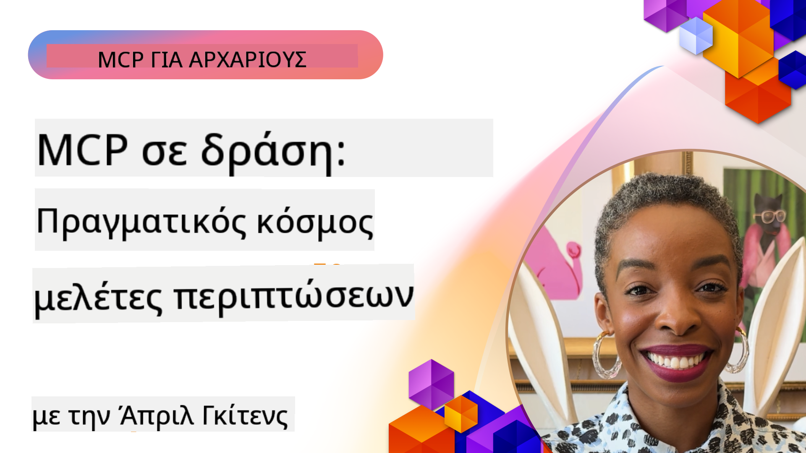

<!--
CO_OP_TRANSLATOR_METADATA:
{
  "original_hash": "1611dc5f6a2a35a789fc4c95fc5bfbe8",
  "translation_date": "2025-09-26T18:26:56+00:00",
  "source_file": "09-CaseStudy/README.md",
  "language_code": "el"
}
-->
# MCP σε Δράση: Μελέτες Περίπτωσης από τον Πραγματικό Κόσμο

_(Κάντε κλικ στην εικόνα παραπάνω για να δείτε το βίντεο αυτού του μαθήματος)_

Το Model Context Protocol (MCP) μεταμορφώνει τον τρόπο με τον οποίο οι εφαρμογές AI αλληλεπιδρούν με δεδομένα, εργαλεία και υπηρεσίες. Αυτή η ενότητα παρουσιάζει μελέτες περιπτώσεων από τον πραγματικό κόσμο που δείχνουν πρακτικές εφαρμογές του MCP σε διάφορα επιχειρηματικά σενάρια.

## Επισκόπηση

Αυτή η ενότητα παρουσιάζει συγκεκριμένα παραδείγματα υλοποιήσεων MCP, αναδεικνύοντας πώς οι οργανισμοί αξιοποιούν αυτό το πρωτόκολλο για να λύσουν σύνθετες επιχειρηματικές προκλήσεις. Εξετάζοντας αυτές τις μελέτες περιπτώσεων, θα αποκτήσετε πληροφορίες για την ευελιξία, την κλιμακωσιμότητα και τα πρακτικά οφέλη του MCP σε πραγματικά σενάρια.

## Βασικοί Στόχοι Μάθησης

Εξετάζοντας αυτές τις μελέτες περιπτώσεων, θα:

- Κατανοήσετε πώς το MCP μπορεί να εφαρμοστεί για την επίλυση συγκεκριμένων επιχειρηματικών προβλημάτων
- Μάθετε για διαφορετικά μοτίβα ενσωμάτωσης και αρχιτεκτονικές προσεγγίσεις
- Αναγνωρίσετε βέλτιστες πρακτικές για την υλοποίηση του MCP σε επιχειρηματικά περιβάλλοντα
- Αποκτήσετε πληροφορίες για τις προκλήσεις και τις λύσεις που συναντώνται σε υλοποιήσεις από τον πραγματικό κόσμο
- Εντοπίσετε ευκαιρίες για να εφαρμόσετε παρόμοια μοτίβα στα δικά σας έργα

## Επιλεγμένες Μελέτες Περίπτωσης

### 1. [Azure AI Travel Agents – Αναφορά Υλοποίησης](./travelagentsample.md)

Αυτή η μελέτη περίπτωσης εξετάζει τη συνολική λύση αναφοράς της Microsoft που δείχνει πώς να δημιουργήσετε μια εφαρμογή ταξιδιωτικού σχεδιασμού με πολλούς πράκτορες, βασισμένη στην AI, χρησιμοποιώντας MCP, Azure OpenAI και Azure AI Search. Το έργο παρουσιάζει:

- Ορχήστρωση πολλών πρακτόρων μέσω MCP
- Ενσωμάτωση επιχειρηματικών δεδομένων με το Azure AI Search
- Ασφαλής, κλιμακούμενη αρχιτεκτονική με χρήση υπηρεσιών Azure
- Επεκτάσιμα εργαλεία με επαναχρησιμοποιούμενα MCP components
- Συνομιλιακή εμπειρία χρήστη με τη δύναμη του Azure OpenAI

Οι λεπτομέρειες της αρχιτεκτονικής και της υλοποίησης παρέχουν πολύτιμες πληροφορίες για τη δημιουργία σύνθετων συστημάτων πολλών πρακτόρων με το MCP ως στρώμα συντονισμού.

### 2. [Ενημέρωση Αντικειμένων Azure DevOps από Δεδομένα YouTube](./UpdateADOItemsFromYT.md)

Αυτή η μελέτη περίπτωσης δείχνει μια πρακτική εφαρμογή του MCP για την αυτοματοποίηση διαδικασιών ροής εργασίας. Δείχνει πώς μπορούν να χρησιμοποιηθούν τα εργαλεία MCP για:

- Εξαγωγή δεδομένων από διαδικτυακές πλατφόρμες (YouTube)
- Ενημέρωση αντικειμένων εργασίας σε συστήματα Azure DevOps
- Δημιουργία επαναλαμβανόμενων αυτοματοποιημένων ροών εργασίας
- Ενσωμάτωση δεδομένων από διαφορετικά συστήματα

Αυτό το παράδειγμα δείχνει πώς ακόμη και σχετικά απλές υλοποιήσεις MCP μπορούν να προσφέρουν σημαντικά οφέλη αποδοτικότητας, αυτοματοποιώντας ρουτίνες εργασίες και βελτιώνοντας τη συνέπεια δεδομένων μεταξύ συστημάτων.

### 3. [Ανάκτηση Τεκμηρίωσης σε Πραγματικό Χρόνο με MCP](./docs-mcp/README.md)

Αυτή η μελέτη περίπτωσης σας καθοδηγεί στη σύνδεση ενός Python κονσόλα client με έναν MCP server για την ανάκτηση και καταγραφή τεκμηρίωσης της Microsoft σε πραγματικό χρόνο και με βάση το περιεχόμενο. Θα μάθετε πώς να:

- Συνδεθείτε με έναν MCP server χρησιμοποιώντας έναν Python client και το επίσημο MCP SDK
- Χρησιμοποιήσετε streaming HTTP clients για αποδοτική ανάκτηση δεδομένων σε πραγματικό χρόνο
- Καλείτε εργαλεία τεκμηρίωσης στον server και να καταγράφετε απαντήσεις απευθείας στην κονσόλα
- Ενσωματώσετε ενημερωμένη τεκμηρίωση της Microsoft στη ροή εργασίας σας χωρίς να αφήσετε το τερματικό

Το κεφάλαιο περιλαμβάνει μια πρακτική άσκηση, ένα ελάχιστο δείγμα κώδικα και συνδέσμους για πρόσθετους πόρους για βαθύτερη μάθηση. Δείτε την πλήρη καθοδήγηση και τον κώδικα στο συνδεδεμένο κεφάλαιο για να κατανοήσετε πώς το MCP μπορεί να μεταμορφώσει την πρόσβαση στην τεκμηρίωση και την παραγωγικότητα των προγραμματιστών σε περιβάλλοντα κονσόλας.

### 4. [Διαδραστική Εφαρμογή Δημιουργίας Σχεδίου Μελέτης με MCP](./docs-mcp/README.md)

Αυτή η μελέτη περίπτωσης δείχνει πώς να δημιουργήσετε μια διαδραστική εφαρμογή ιστού χρησιμοποιώντας το Chainlit και το Model Context Protocol (MCP) για τη δημιουργία εξατομικευμένων σχεδίων μελέτης για οποιοδήποτε θέμα. Οι χρήστες μπορούν να καθορίσουν ένα θέμα (όπως "Πιστοποίηση AI-900") και μια διάρκεια μελέτης (π.χ. 8 εβδομάδες), και η εφαρμογή θα παρέχει μια εβδομαδιαία ανάλυση προτεινόμενου περιεχομένου. Το Chainlit επιτρέπει μια συνομιλιακή διεπαφή, κάνοντας την εμπειρία ελκυστική και προσαρμοστική.

- Συνομιλιακή εφαρμογή ιστού με τη δύναμη του Chainlit
- Προτροπές από τον χρήστη για θέμα και διάρκεια
- Εβδομαδιαίες συστάσεις περιεχομένου μέσω MCP
- Απαντήσεις σε πραγματικό χρόνο και προσαρμοστικότητα σε συνομιλιακή διεπαφή

Το έργο δείχνει πώς η συνομιλιακή AI και το MCP μπορούν να συνδυαστούν για τη δημιουργία δυναμικών, προσαρμοσμένων εκπαιδευτικών εργαλείων σε ένα σύγχρονο περιβάλλον ιστού.

### 5. [Τεκμηρίωση Εντός Επεξεργαστή με MCP Server στο VS Code](./docs-mcp/README.md)

Αυτή η μελέτη περίπτωσης δείχνει πώς μπορείτε να φέρετε την τεκμηρίωση του Microsoft Learn απευθείας στο περιβάλλον του VS Code σας χρησιμοποιώντας τον MCP server—χωρίς να χρειάζεται να αλλάξετε καρτέλες του προγράμματος περιήγησης! Θα δείτε πώς να:

- Αναζητήσετε και να διαβάσετε τεκμηρίωση μέσα στο VS Code χρησιμοποιώντας το MCP panel ή την εντολή palette
- Αναφέρετε τεκμηρίωση και να εισάγετε συνδέσμους απευθείας στα README ή αρχεία markdown του μαθήματός σας
- Χρησιμοποιήσετε το GitHub Copilot και το MCP μαζί για απρόσκοπτες ροές εργασίας τεκμηρίωσης και κώδικα με τη δύναμη της AI
- Επικυρώσετε και να βελτιώσετε την τεκμηρίωση σας με σχόλια σε πραγματικό χρόνο και ακρίβεια από τη Microsoft
- Ενσωματώσετε το MCP με ροές εργασίας GitHub για συνεχή επικύρωση τεκμηρίωσης

Η υλοποίηση περιλαμβάνει:

- Παράδειγμα `.vscode/mcp.json` για εύκολη ρύθμιση
- Οδηγίες με στιγμιότυπα οθόνης για την εμπειρία εντός επεξεργαστή
- Συμβουλές για τον συνδυασμό του Copilot και του MCP για μέγιστη παραγωγικότητα

Αυτό το σενάριο είναι ιδανικό για συγγραφείς μαθημάτων, συγγραφείς τεκμηρίωσης και προγραμματιστές που θέλουν να παραμείνουν συγκεντρωμένοι στον επεξεργαστή τους ενώ εργάζονται με τεκμηρίωση, Copilot και εργαλεία επικύρωσης—όλα με τη δύναμη του MCP.

### 6. [Δημιουργία MCP Server με APIM](./apimsample.md)

Αυτή η μελέτη περίπτωσης παρέχει έναν οδηγό βήμα προς βήμα για τη δημιουργία ενός MCP server χρησιμοποιώντας το Azure API Management (APIM). Καλύπτει:

- Ρύθμιση ενός MCP server στο Azure API Management
- Έκθεση λειτουργιών API ως εργαλεία MCP
- Διαμόρφωση πολιτικών για περιορισμό ρυθμού και ασφάλεια
- Δοκιμή του MCP server χρησιμοποιώντας το Visual Studio Code και το GitHub Copilot

Αυτό το παράδειγμα δείχνει πώς να αξιοποιήσετε τις δυνατότητες του Azure για τη δημιουργία ενός ισχυρού MCP server που μπορεί να χρησιμοποιηθεί σε διάφορες εφαρμογές, ενισχύοντας την ενσωμάτωση συστημάτων AI με επιχειρηματικά APIs.

### 7. [GitHub MCP Registry — Επιτάχυνση Ενσωμάτωσης Πρακτόρων](https://github.com/mcp)

Αυτή η μελέτη περίπτωσης εξετάζει πώς το MCP Registry του GitHub, που κυκλοφόρησε τον Σεπτέμβριο του 2025, αντιμετωπίζει μια κρίσιμη πρόκληση στο οικοσύστημα AI: την κατακερματισμένη ανακάλυψη και ανάπτυξη MCP servers.

#### Επισκόπηση
Το **MCP Registry** λύνει το αυξανόμενο πρόβλημα των διάσπαρτων MCP servers σε αποθετήρια και μητρώα, που προηγουμένως καθιστούσε την ενσωμάτωση αργή και επιρρεπή σε σφάλματα. Αυτοί οι servers επιτρέπουν στους AI πράκτορες να αλληλεπιδρούν με εξωτερικά συστήματα όπως APIs, βάσεις δεδομένων και πηγές τεκμηρίωσης.

#### Δήλωση Προβλήματος
Οι προγραμματιστές που δημιουργούν ροές εργασίας πρακτόρων αντιμετώπιζαν αρκετές προκλήσεις:
- **Κακή ανακαλυψιμότητα** MCP servers σε διαφορετικές πλατφόρμες
- **Πλεονάζουσες ερωτήσεις ρύθμισης** διάσπαρτες σε φόρουμ και τεκμηρίωση
- **Κίνδυνοι ασφάλειας** από μη επαληθευμένες και μη αξιόπιστες πηγές
- **Έλλειψη τυποποίησης** στην ποιότητα και συμβατότητα των servers

#### Αρχιτεκτονική Λύσης
Το MCP Registry του GitHub συγκεντρώνει αξιόπιστους MCP servers με βασικά χαρακτηριστικά:
- **Ενσωμάτωση με ένα κλικ** μέσω VS Code για απλοποιημένη ρύθμιση
- **Ταξινόμηση βάσει σήματος** με αστέρια, δραστηριότητα και επικύρωση από την κοινότητα
- **Άμεση ενσωμάτωση** με το GitHub Copilot και άλλα εργαλεία συμβατά με MCP
- **Ανοιχτό μοντέλο συνεισφοράς** που επιτρέπει τόσο στην κοινότητα όσο και στους εταιρικούς συνεργάτες να συνεισφέρουν

#### Επιχειρηματικός Αντίκτυπος
Το μητρώο έχει προσφέρει μετρήσιμες βελτιώσεις:
- **Ταχύτερη εισαγωγή** για προγραμματιστές που χρησιμοποιούν εργαλεία όπως το Microsoft Learn MCP Server, που μεταδίδει επίσημη τεκμηρίωση απευθείας στους πράκτορες
- **Βελτιωμένη παραγωγικότητα** μέσω εξειδικευμένων servers όπως το `github-mcp-server`, που επιτρέπει φυσική γλώσσα για αυτοματοποίηση GitHub (δημιουργία PR, επανεκκίνηση CI, σάρωση κώδικα)
- **Ισχυρότερη εμπιστοσύνη στο οικοσύστημα** μέσω επιμελημένων καταχωρίσεων και διαφανών προτύπων διαμόρφωσης

#### Στρατηγική Αξία
Για επαγγελματίες που ειδικεύονται στη διαχείριση κύκλου ζωής πρακτόρων και αναπαραγόμενες ροές εργασίας, το MCP Registry παρέχει:
- **Δυνατότητες ανάπτυξης πρακτόρων** με τυποποιημένα components
- **Πίνακες αξιολόγησης με βάση το μητρώο** για συνεπή δοκιμή και επικύρωση
- **Διαλειτουργικότητα μεταξύ εργαλείων** που επιτρέπει απρόσκοπτη ενσωμάτωση σε διαφορετικές πλατφόρμες AI

Αυτή η μελέτη περίπτωσης δείχνει ότι το MCP Registry δεν είναι απλώς ένας κατάλογος—είναι μια θεμελιώδης πλατφόρμα για κλιμακούμενη, πραγματική ενσωμάτωση μοντέλων και ανάπτυξη συστημάτων πρακτόρων.

## Συμπέρασμα

Αυτές οι επτά ολοκληρωμένες μελέτες περίπτωσης δείχνουν την αξιοσημείωτη ευελιξία και τις πρακτικές εφαρμογές του Model Context Protocol σε διάφορα σενάρια από τον πραγματικό κόσμο. Από σύνθετα συστήματα ταξιδιωτικού σχεδιασμού με πολλούς πράκτορες και διαχείριση API επιχειρήσεων έως απλοποιημένες ροές εργασίας τεκμηρίωσης και το επαναστατικό MCP Registry του GitHub, αυτά τα παραδείγματα δείχνουν πώς το MCP παρέχει έναν τυποποιημένο, κλιμακούμενο τρόπο σύνδεσης συστημάτων AI με τα εργαλεία, τα δεδομένα και τις υπηρεσίες που χρειάζονται για να προσφέρουν εξαιρετική αξία.

Οι μελέτες περίπτωσης καλύπτουν πολλαπλές διαστάσεις υλοποίησης MCP:
- **Επιχειρηματική Ενσωμάτωση**: Διαχείριση API Azure και αυτοματοποίηση Azure DevOps
- **Ορχήστρωση Πολλών Πρακτόρων**: Ταξιδιωτικός σχεδιασμός με συντονισμένους πράκτορες AI
- **Παραγωγικότητα Προγραμματιστών**: Ενσωμάτωση VS Code και πρόσβαση σε τεκμηρίωση σε πραγματικό χρόνο
- **Ανάπτυξη Οικοσυστήματος**: MCP Registry του GitHub ως θεμελιώδης πλατφόρμα
- **Εκπαιδευτικές Εφαρμογές**: Διαδραστικοί δημιουργοί σχεδίων μελέτης και συνομιλιακές διεπαφές

Μελετώντας αυτές τις υλοποιήσεις, αποκτάτε κρίσιμες πληροφορίες για:
- **Αρχιτεκτονικά μοτίβα** για διαφορετικές κλίμακες και χρήσεις
- **Στρατηγικές υλοποίησης** που ισορροπούν τη λειτουργικότητα με τη συντηρησιμότητα
- **Σκέψεις ασφάλειας και κλιμακωσιμότητας** για παραγωγικές αναπτύξεις
- **Βέλτιστες πρακτικές** για ανάπτυξη MCP servers και ενσωμάτωση clients
- **Σκέψη οικοσυστήματος** για τη δημιουργία διασυνδεδεμένων λύσεων με τη δύναμη της AI

Αυτά τα παραδείγματα συλλογικά δείχνουν ότι το MCP δεν είναι απλώς ένα θεωρητικό πλαίσιο αλλά ένα ώριμο, έτοιμο για παραγωγή πρωτόκολλο που επιτρέπει πρακτικές λύσεις σε σύνθετες επιχειρηματικές προκλήσεις. Είτε δημιουργείτε απλά εργαλεία αυτοματοποίησης είτε σύνθετα συστήματα πολλών πρακτόρων, τα μοτίβα και οι προσεγγίσεις που παρουσιάζονται εδώ παρέχουν μια σταθερή βάση για τα δικά σας έργα MCP.

## Πρόσθετοι Πόροι

- [Azure AI Travel Agents GitHub Repository](https://github.com/Azure-Samples/azure-ai-travel-agents)
- [Azure DevOps MCP Tool](https://github.com/microsoft/azure-devops-mcp)
- [Playwright MCP Tool](https://github.com/microsoft/playwright-mcp)
- [Microsoft Docs MCP Server](https://github.com/MicrosoftDocs/mcp)
- [GitHub MCP Registry — Επιτάχυνση Ενσωμάτωσης Πρακτόρων](https://github.com/mcp)
- [MCP Community Examples](https://github.com/microsoft/mcp)

Επόμενο: Εργαστήριο [Απλοποίηση Ροών Εργασίας

---

