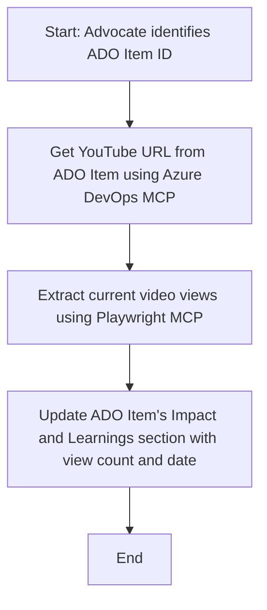

<!--
CO_OP_TRANSLATOR_METADATA:
{
  "original_hash": "14a2dfbea55ef735660a06bd6bdfe5f3",
  "translation_date": "2025-06-13T21:35:14+00:00",
  "source_file": "09-CaseStudy/UpdateADOItemsFromYT.md",
  "language_code": "el"
}
-->
# Μελέτη Περίπτωσης: Ενημέρωση αντικειμένων Azure DevOps με δεδομένα από το YouTube μέσω MCP

> **Αποποίηση ευθυνών:** Υπάρχουν ήδη διαθέσιμα διαδικτυακά εργαλεία και αναφορές που μπορούν να αυτοματοποιήσουν τη διαδικασία ενημέρωσης αντικειμένων Azure DevOps με δεδομένα από πλατφόρμες όπως το YouTube. Το παρακάτω σενάριο παρέχεται αποκλειστικά ως παράδειγμα χρήσης για να δείξει πώς μπορούν να εφαρμοστούν τα εργαλεία MCP για εργασίες αυτοματοποίησης και ενσωμάτωσης.

## Επισκόπηση

Αυτή η μελέτη περίπτωσης παρουσιάζει ένα παράδειγμα του πώς το Model Context Protocol (MCP) και τα εργαλεία του μπορούν να χρησιμοποιηθούν για να αυτοματοποιήσουν τη διαδικασία ενημέρωσης των εργασιών Azure DevOps (ADO) με πληροφορίες που προέρχονται από διαδικτυακές πλατφόρμες, όπως το YouTube. Το περιγραφόμενο σενάριο αποτελεί μία μόνο από τις πολλές δυνατότητες αυτών των εργαλείων, τα οποία μπορούν να προσαρμοστούν σε πολλές παρόμοιες ανάγκες αυτοματοποίησης.

Σε αυτό το παράδειγμα, ένας Advocate παρακολουθεί διαδικτυακές συνεδρίες χρησιμοποιώντας αντικείμενα ADO, όπου κάθε αντικείμενο περιλαμβάνει έναν σύνδεσμο βίντεο YouTube. Με την αξιοποίηση των εργαλείων MCP, ο Advocate μπορεί να διατηρεί τα αντικείμενα ADO ενημερωμένα με τις πιο πρόσφατες μετρήσεις βίντεο, όπως ο αριθμός προβολών, με επαναλαμβανόμενο και αυτοματοποιημένο τρόπο. Αυτή η προσέγγιση μπορεί να γενικευτεί και σε άλλες περιπτώσεις όπου απαιτείται η ενσωμάτωση πληροφοριών από διαδικτυακές πηγές σε ADO ή άλλα συστήματα.

## Σενάριο

Ένας Advocate είναι υπεύθυνος για την παρακολούθηση της επίδρασης των διαδικτυακών συνεδριών και της συμμετοχής της κοινότητας. Κάθε συνεδρία καταγράφεται ως εργασία ADO στο έργο 'DevRel', και η εργασία περιέχει πεδίο με το URL του βίντεο YouTube. Για να αναφερθεί με ακρίβεια η εμβέλεια της συνεδρίας, ο Advocate πρέπει να ενημερώνει το αντικείμενο ADO με τον τρέχοντα αριθμό προβολών του βίντεο και την ημερομηνία κατά την οποία ανακτήθηκαν αυτές οι πληροφορίες.

## Χρησιμοποιούμενα Εργαλεία

- [Azure DevOps MCP](https://github.com/microsoft/azure-devops-mcp): Επιτρέπει τον προγραμματιστικό χειρισμό και ενημέρωση εργασιών ADO μέσω MCP.
- [Playwright MCP](https://github.com/microsoft/playwright-mcp): Αυτοματοποιεί ενέργειες στο πρόγραμμα περιήγησης για την εξαγωγή ζωντανών δεδομένων από ιστοσελίδες, όπως στατιστικά βίντεο YouTube.

## Βήμα-βήμα Ροή Εργασίας

1. **Εντοπισμός αντικειμένου ADO**: Ξεκινήστε με το ID της εργασίας ADO (π.χ. 1234) στο έργο 'DevRel'.
2. **Ανάκτηση του URL YouTube**: Χρησιμοποιήστε το εργαλείο Azure DevOps MCP για να πάρετε το URL του YouTube από την εργασία.
3. **Εξαγωγή αριθμού προβολών**: Χρησιμοποιήστε το εργαλείο Playwright MCP για να μεταβείτε στο URL του YouTube και να εξάγετε τον τρέχοντα αριθμό προβολών.
4. **Ενημέρωση αντικειμένου ADO**: Καταχωρήστε τον τελευταίο αριθμό προβολών και την ημερομηνία ανάκτησης στην ενότητα 'Impact and Learnings' της εργασίας ADO χρησιμοποιώντας το εργαλείο Azure DevOps MCP.

## Παράδειγμα Prompt

```bash
- Work with the ADO Item ID: 1234
- The project is '2025-Awesome'
- Get the YouTube URL for the ADO item
- Use Playwright to get the current views from the YouTube video
- Update the ADO item with the current video views and the updated date of the information
```

## Διάγραμμα Ροής Mermaid



## Τεχνική Υλοποίηση

- **Ορχήστρωση MCP**: Η ροή εργασίας ελέγχεται από έναν MCP server, ο οποίος συντονίζει τη χρήση τόσο του Azure DevOps MCP όσο και του Playwright MCP.
- **Αυτοματοποίηση**: Η διαδικασία μπορεί να ενεργοποιηθεί χειροκίνητα ή να προγραμματιστεί να τρέχει σε τακτά διαστήματα ώστε να διατηρεί τα αντικείμενα ADO ενημερωμένα.
- **Επεκτασιμότητα**: Το ίδιο μοτίβο μπορεί να επεκταθεί για να ενημερώνει αντικείμενα ADO με άλλα διαδικτυακά μετρικά (π.χ. likes, σχόλια) ή από άλλες πλατφόρμες.

## Αποτελέσματα και Επίδραση

- **Αποδοτικότητα**: Μειώνει τον χειροκίνητο φόρτο εργασίας των Advocates αυτοματοποιώντας την ανάκτηση και ενημέρωση των μετρήσεων βίντεο.
- **Ακρίβεια**: Διασφαλίζει ότι τα αντικείμενα ADO αντικατοπτρίζουν τα πιο πρόσφατα διαθέσιμα δεδομένα από διαδικτυακές πηγές.
- **Επαναληψιμότητα**: Παρέχει μια επαναχρησιμοποιήσιμη ροή εργασίας για παρόμοια σενάρια που αφορούν άλλες πηγές δεδομένων ή μετρικές.

## Αναφορές

- [Azure DevOps MCP](https://github.com/microsoft/azure-devops-mcp)
- [Playwright MCP](https://github.com/microsoft/playwright-mcp)
- [Model Context Protocol (MCP)](https://modelcontextprotocol.io/)

**Αποποίηση ευθυνών**:  
Αυτό το έγγραφο έχει μεταφραστεί χρησιμοποιώντας την υπηρεσία αυτόματης μετάφρασης AI [Co-op Translator](https://github.com/Azure/co-op-translator). Παρόλο που προσπαθούμε για ακρίβεια, παρακαλούμε να λάβετε υπόψη ότι οι αυτόματες μεταφράσεις μπορεί να περιέχουν λάθη ή ανακρίβειες. Το πρωτότυπο έγγραφο στη γλώσσα του θεωρείται η αυθεντική πηγή. Για κρίσιμες πληροφορίες, συνιστάται επαγγελματική μετάφραση από άνθρωπο. Δεν φέρουμε ευθύνη για τυχόν παρεξηγήσεις ή λανθασμένες ερμηνείες που προκύπτουν από τη χρήση αυτής της μετάφρασης.