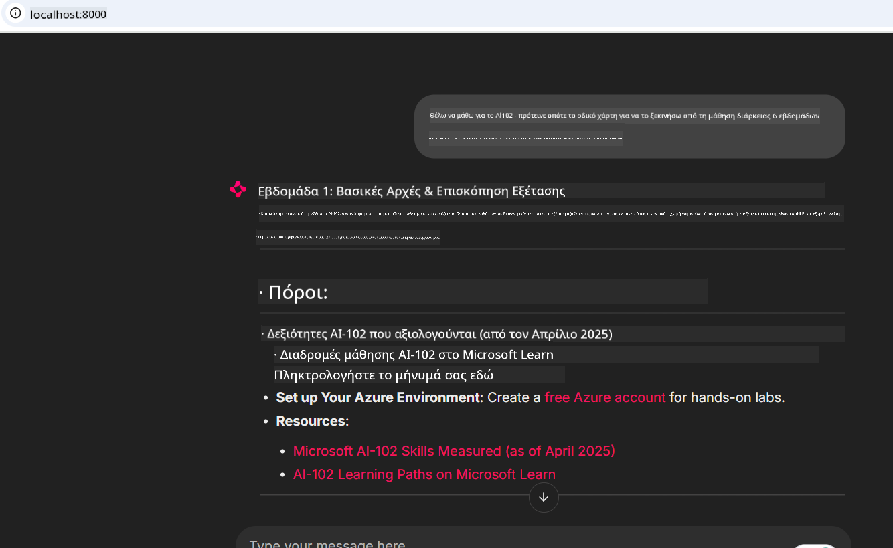
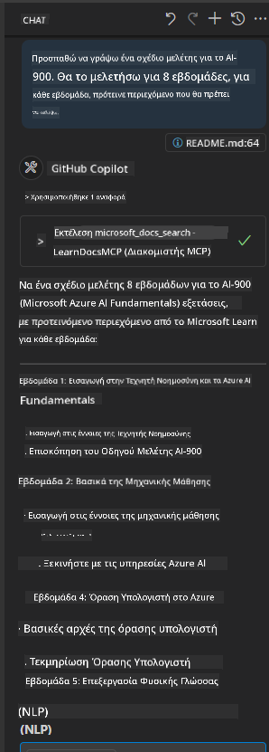

<!--
CO_OP_TRANSLATOR_METADATA:
{
  "original_hash": "4319d291c9d124ecafea52b3d04bfa0e",
  "translation_date": "2025-07-14T06:24:21+00:00",
  "source_file": "09-CaseStudy/docs-mcp/README.md",
  "language_code": "el"
}
-->
# Μελέτη Περίπτωσης: Σύνδεση με τον Microsoft Learn Docs MCP Server από έναν Πελάτη

Έχετε βρεθεί ποτέ να πηγαινοέρχεστε ανάμεσα σε ιστότοπους τεκμηρίωσης, το Stack Overflow και αμέτρητες καρτέλες μηχανών αναζήτησης, προσπαθώντας να λύσετε ένα πρόβλημα στον κώδικά σας; Ίσως να έχετε δεύτερη οθόνη αποκλειστικά για τεκμηρίωση ή να κάνετε συνεχώς alt-tab μεταξύ του IDE και του browser. Δεν θα ήταν καλύτερο αν μπορούσατε να φέρετε την τεκμηρίωση απευθείας στη ροή εργασίας σας—ενσωματωμένη στις εφαρμογές σας, το IDE σας ή ακόμα και στα δικά σας προσαρμοσμένα εργαλεία; Σε αυτή τη μελέτη περίπτωσης, θα εξερευνήσουμε πώς να το κάνετε ακριβώς αυτό, συνδεόμενοι απευθείας με τον Microsoft Learn Docs MCP server από τη δική σας εφαρμογή πελάτη.

## Επισκόπηση

Η σύγχρονη ανάπτυξη δεν είναι απλώς η γραφή κώδικα—είναι η εύρεση της σωστής πληροφορίας τη σωστή στιγμή. Η τεκμηρίωση υπάρχει παντού, αλλά σπάνια εκεί που τη χρειάζεστε περισσότερο: μέσα στα εργαλεία και τις ροές εργασίας σας. Ενσωματώνοντας την ανάκτηση τεκμηρίωσης απευθείας στις εφαρμογές σας, μπορείτε να εξοικονομήσετε χρόνο, να μειώσετε τις αλλαγές πλαισίου και να αυξήσετε την παραγωγικότητα. Σε αυτή την ενότητα, θα σας δείξουμε πώς να συνδέσετε έναν πελάτη με τον Microsoft Learn Docs MCP server, ώστε να έχετε πρόσβαση σε τεκμηρίωση σε πραγματικό χρόνο και με επίγνωση συμφραζομένων, χωρίς να βγείτε ποτέ από την εφαρμογή σας.

Θα περάσουμε μαζί τη διαδικασία δημιουργίας σύνδεσης, αποστολής αιτήματος και αποτελεσματικής διαχείρισης ροών απαντήσεων. Αυτή η προσέγγιση όχι μόνο απλοποιεί τη ροή εργασίας σας, αλλά ανοίγει και το δρόμο για την κατασκευή πιο έξυπνων και χρήσιμων εργαλείων για προγραμματιστές.

## Στόχοι Μάθησης

Γιατί το κάνουμε αυτό; Επειδή οι καλύτερες εμπειρίες προγραμματιστών είναι αυτές που αφαιρούν τα εμπόδια. Φανταστείτε έναν κόσμο όπου ο επεξεργαστής κώδικα, το chatbot ή η web εφαρμογή σας μπορούν να απαντούν άμεσα στις ερωτήσεις τεκμηρίωσης, χρησιμοποιώντας το πιο πρόσφατο περιεχόμενο από το Microsoft Learn. Μέχρι το τέλος αυτού του κεφαλαίου, θα ξέρετε πώς να:

- Κατανοείτε τα βασικά της επικοινωνίας MCP server-πελάτη για τεκμηρίωση
- Υλοποιείτε μια κονσόλα ή web εφαρμογή για σύνδεση με τον Microsoft Learn Docs MCP server
- Χρησιμοποιείτε streaming HTTP clients για ανάκτηση τεκμηρίωσης σε πραγματικό χρόνο
- Καταγράφετε και ερμηνεύετε τις απαντήσεις τεκμηρίωσης στην εφαρμογή σας

Θα δείτε πώς αυτές οι δεξιότητες μπορούν να σας βοηθήσουν να δημιουργήσετε εργαλεία που δεν είναι απλώς αντιδραστικά, αλλά πραγματικά διαδραστικά και με επίγνωση συμφραζομένων.

## Σενάριο 1 - Ανάκτηση Τεκμηρίωσης σε Πραγματικό Χρόνο με MCP

Σε αυτό το σενάριο, θα σας δείξουμε πώς να συνδέσετε έναν πελάτη με τον Microsoft Learn Docs MCP server, ώστε να έχετε πρόσβαση σε τεκμηρίωση σε πραγματικό χρόνο και με επίγνωση συμφραζομένων, χωρίς να βγείτε ποτέ από την εφαρμογή σας.

Ας το εφαρμόσουμε στην πράξη. Η εργασία σας είναι να γράψετε μια εφαρμογή που συνδέεται με τον Microsoft Learn Docs MCP server, καλεί το εργαλείο `microsoft_docs_search` και καταγράφει την ροή απάντησης στην κονσόλα.

### Γιατί αυτή η προσέγγιση;
Επειδή αποτελεί τη βάση για πιο προηγμένες ενσωματώσεις—είτε θέλετε να τροφοδοτήσετε ένα chatbot, μια επέκταση IDE ή έναν web πίνακα ελέγχου.

Θα βρείτε τον κώδικα και τις οδηγίες για αυτό το σενάριο στον φάκελο [`solution`](./solution/README.md) μέσα σε αυτή τη μελέτη περίπτωσης. Τα βήματα θα σας καθοδηγήσουν στη ρύθμιση της σύνδεσης:
- Χρησιμοποιήστε το επίσημο MCP SDK και έναν HTTP client με δυνατότητα streaming για τη σύνδεση
- Καλέστε το εργαλείο `microsoft_docs_search` με παράμετρο αναζήτησης για να ανακτήσετε τεκμηρίωση
- Υλοποιήστε σωστή καταγραφή και διαχείριση σφαλμάτων
- Δημιουργήστε μια διαδραστική κονσόλα που επιτρέπει στους χρήστες να εισάγουν πολλαπλές αναζητήσεις

Αυτό το σενάριο δείχνει πώς να:
- Συνδεθείτε με τον Docs MCP server
- Στείλετε ένα ερώτημα
- Αναλύσετε και εκτυπώσετε τα αποτελέσματα

Έτσι μπορεί να μοιάζει η εκτέλεση της λύσης:

```
Prompt> What is Azure Key Vault?
Answer> Azure Key Vault is a cloud service for securely storing and accessing secrets. ...
```

Παρακάτω υπάρχει ένα ελάχιστο δείγμα λύσης. Ο πλήρης κώδικας και οι λεπτομέρειες είναι διαθέσιμες στον φάκελο λύσης.

<details>
<summary>Python</summary>

```python
import asyncio
from mcp.client.streamable_http import streamablehttp_client
from mcp import ClientSession

async def main():
    async with streamablehttp_client("https://learn.microsoft.com/api/mcp") as (read_stream, write_stream, _):
        async with ClientSession(read_stream, write_stream) as session:
            await session.initialize()
            result = await session.call_tool("microsoft_docs_search", {"query": "Azure Functions best practices"})
            print(result.content)

if __name__ == "__main__":
    asyncio.run(main())
```

- Για την πλήρη υλοποίηση και καταγραφή, δείτε το [`scenario1.py`](../../../../09-CaseStudy/docs-mcp/solution/python/scenario1.py).
- Για οδηγίες εγκατάστασης και χρήσης, δείτε το αρχείο [`README.md`](./solution/python/README.md) στον ίδιο φάκελο.
</details>

## Σενάριο 2 - Διαδραστική Εφαρμογή Ιστού για Δημιουργία Σχεδίου Μελέτης με MCP

Σε αυτό το σενάριο, θα μάθετε πώς να ενσωματώσετε το Docs MCP σε ένα έργο ανάπτυξης web. Ο στόχος είναι να δώσετε τη δυνατότητα στους χρήστες να αναζητούν την τεκμηρίωση του Microsoft Learn απευθείας από μια web διεπαφή, καθιστώντας την τεκμηρίωση άμεσα προσβάσιμη μέσα στην εφαρμογή ή τον ιστότοπό σας.

Θα δείτε πώς να:
- Ρυθμίσετε μια web εφαρμογή
- Συνδεθείτε με τον Docs MCP server
- Διαχειριστείτε την είσοδο χρήστη και εμφανίσετε τα αποτελέσματα

Έτσι μπορεί να μοιάζει η εκτέλεση της λύσης:

```
User> I want to learn about AI102 - so suggest the roadmap to get it started from learn for 6 weeks

Assistant> Here’s a detailed 6-week roadmap to start your preparation for the AI-102: Designing and Implementing a Microsoft Azure AI Solution certification, using official Microsoft resources and focusing on exam skills areas:

---
## Week 1: Introduction & Fundamentals
- **Understand the Exam**: Review the [AI-102 exam skills outline](https://learn.microsoft.com/en-us/credentials/certifications/exams/ai-102/).
- **Set up Azure**: Sign up for a free Azure account if you don't have one.
- **Learning Path**: [Introduction to Azure AI services](https://learn.microsoft.com/en-us/training/modules/intro-to-azure-ai/)
- **Focus**: Get familiar with Azure portal, AI capabilities, and necessary tools.

....more weeks of the roadmap...

Let me know if you want module-specific recommendations or need more customized weekly tasks!
```

Παρακάτω υπάρχει ένα ελάχιστο δείγμα λύσης. Ο πλήρης κώδικας και οι λεπτομέρειες είναι διαθέσιμες στον φάκελο λύσης.



<details>
<summary>Python (Chainlit)</summary>

Το Chainlit είναι ένα πλαίσιο για τη δημιουργία συνομιλητικών AI web εφαρμογών. Κάνει εύκολη τη δημιουργία διαδραστικών chatbots και βοηθών που μπορούν να καλούν εργαλεία MCP και να εμφανίζουν αποτελέσματα σε πραγματικό χρόνο. Είναι ιδανικό για γρήγορο πρωτότυπο και φιλικές προς τον χρήστη διεπαφές.

```python
import chainlit as cl
import requests

MCP_URL = "https://learn.microsoft.com/api/mcp"

@cl.on_message
def handle_message(message):
    query = {"question": message}
    response = requests.post(MCP_URL, json=query)
    if response.ok:
        result = response.json()
        cl.Message(content=result.get("answer", "No answer found.")).send()
    else:
        cl.Message(content="Error: " + response.text).send()
```

- Για την πλήρη υλοποίηση, δείτε το [`scenario2.py`](../../../../09-CaseStudy/docs-mcp/solution/python/scenario2.py).
- Για οδηγίες εγκατάστασης και εκτέλεσης, δείτε το [`README.md`](./solution/python/README.md).
</details>

## Σενάριο 3: Τεκμηρίωση Εντός Επεξεργαστή με MCP Server στο VS Code

Αν θέλετε να έχετε το Microsoft Learn Docs απευθείας μέσα στο VS Code (αντί να αλλάζετε καρτέλες browser), μπορείτε να χρησιμοποιήσετε τον MCP server στον επεξεργαστή σας. Αυτό σας επιτρέπει να:
- Αναζητάτε και διαβάζετε τεκμηρίωση στο VS Code χωρίς να βγείτε από το περιβάλλον κώδικα.
- Αναφέρετε τεκμηρίωση και εισάγετε συνδέσμους απευθείας στα README ή στα αρχεία μαθημάτων σας.
- Συνδυάσετε το GitHub Copilot και τον MCP για μια απρόσκοπτη ροή εργασίας τεκμηρίωσης με τεχνητή νοημοσύνη.

**Θα δείτε πώς να:**
- Προσθέσετε ένα έγκυρο αρχείο `.vscode/mcp.json` στη ρίζα του χώρου εργασίας σας (δείτε παράδειγμα παρακάτω).
- Ανοίξετε τον πίνακα MCP ή να χρησιμοποιήσετε την παλέτα εντολών στο VS Code για αναζήτηση και εισαγωγή τεκμηρίωσης.
- Αναφέρετε τεκμηρίωση απευθείας στα αρχεία markdown καθώς εργάζεστε.
- Συνδυάσετε αυτή τη ροή εργασίας με το GitHub Copilot για ακόμα μεγαλύτερη παραγωγικότητα.

Ακολουθεί ένα παράδειγμα ρύθμισης του MCP server στο VS Code:

```json
{
  "servers": {
    "LearnDocsMCP": {
      "url": "https://learn.microsoft.com/api/mcp"
    }
  }
}
```

</details>

> Για λεπτομερή καθοδήγηση με στιγμιότυπα οθόνης και βήμα-βήμα οδηγό, δείτε το [`README.md`](./solution/scenario3/README.md).



Αυτή η προσέγγιση είναι ιδανική για όσους δημιουργούν τεχνικά μαθήματα, γράφουν τεκμηρίωση ή αναπτύσσουν κώδικα με συχνές ανάγκες αναφοράς.

## Βασικά Συμπεράσματα

Η ενσωμάτωση της τεκμηρίωσης απευθείας στα εργαλεία σας δεν είναι απλώς μια ευκολία—είναι μια αλλαγή στον τρόπο εργασίας που αυξάνει την παραγωγικότητα. Συνδεόμενοι με τον Microsoft Learn Docs MCP server από τον πελάτη σας, μπορείτε να:

- Εξαλείψετε τις αλλαγές πλαισίου μεταξύ κώδικα και τεκμηρίωσης
- Ανακτήσετε ενημερωμένη, συμφραζόμενη τεκμηρίωση σε πραγματικό χρόνο
- Δημιουργήσετε πιο έξυπνα, διαδραστικά εργαλεία για προγραμματιστές

Αυτές οι δεξιότητες θα σας βοηθήσουν να φτιάξετε λύσεις που είναι όχι μόνο αποδοτικές, αλλά και ευχάριστες στη χρήση.

## Πρόσθετοι Πόροι

Για να εμβαθύνετε την κατανόησή σας, εξερευνήστε αυτούς τους επίσημους πόρους:

- [Microsoft Learn Docs MCP Server (GitHub)](https://github.com/MicrosoftDocs/mcp)
- [Get started with Azure MCP Server (mcp-python)](https://learn.microsoft.com/en-us/azure/developer/azure-mcp-server/get-started#create-the-python-app)
- [What is the Azure MCP Server?](https://learn.microsoft.com/en-us/azure/developer/azure-mcp-server/)
- [Model Context Protocol (MCP) Introduction](https://modelcontextprotocol.io/introduction)
- [Add plugins from a MCP Server (Python)](https://learn.microsoft.com/en-us/semantic-kernel/concepts/plugins/adding-mcp-plugins)

**Αποποίηση ευθυνών**:  
Αυτό το έγγραφο έχει μεταφραστεί χρησιμοποιώντας την υπηρεσία αυτόματης μετάφρασης AI [Co-op Translator](https://github.com/Azure/co-op-translator). Παρόλο που επιδιώκουμε την ακρίβεια, παρακαλούμε να γνωρίζετε ότι οι αυτόματες μεταφράσεις ενδέχεται να περιέχουν λάθη ή ανακρίβειες. Το πρωτότυπο έγγραφο στη μητρική του γλώσσα πρέπει να θεωρείται η αυθεντική πηγή. Για κρίσιμες πληροφορίες, συνιστάται επαγγελματική ανθρώπινη μετάφραση. Δεν φέρουμε ευθύνη για τυχόν παρεξηγήσεις ή λανθασμένες ερμηνείες που προκύπτουν από τη χρήση αυτής της μετάφρασης.