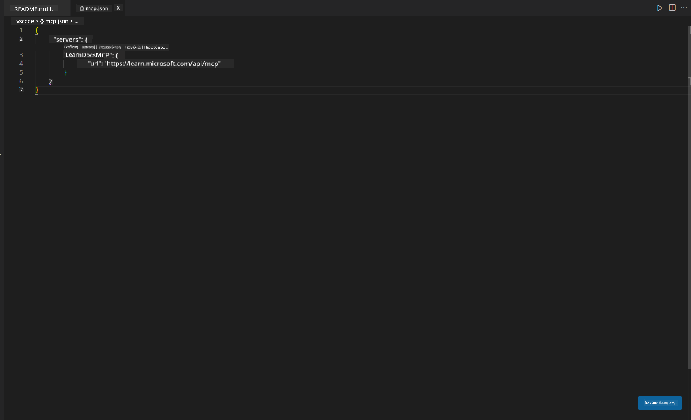
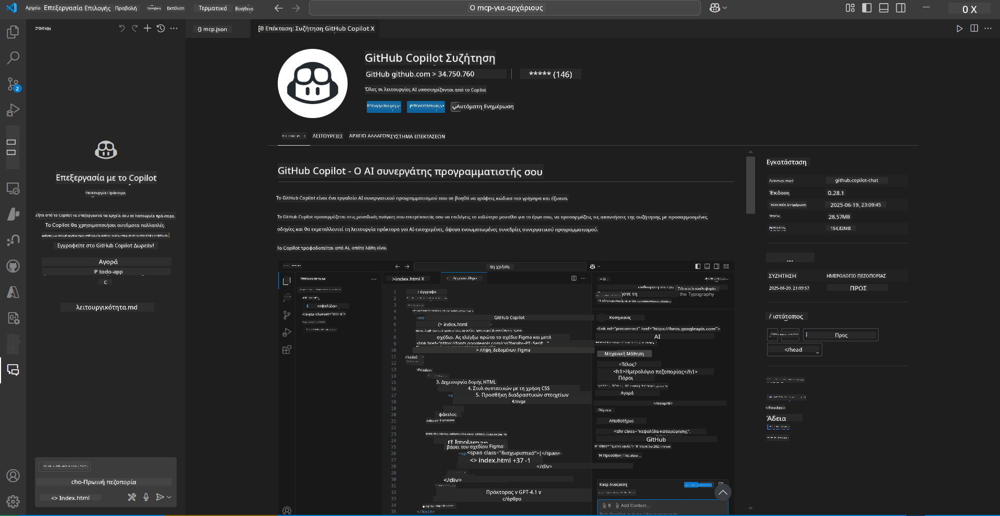
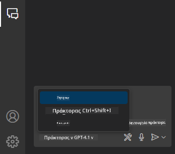
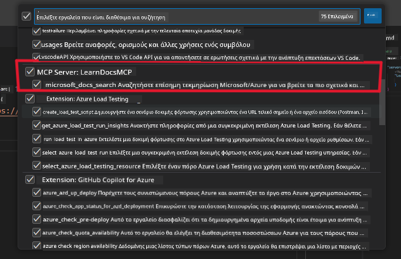
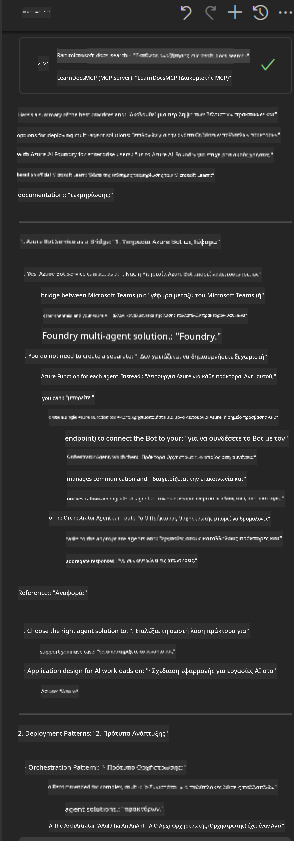

<!--
CO_OP_TRANSLATOR_METADATA:
{
  "original_hash": "db532b1ec386c9ce38c791653dc3c881",
  "translation_date": "2025-07-14T06:51:39+00:00",
  "source_file": "09-CaseStudy/docs-mcp/solution/scenario3/README.md",
  "language_code": "el"
}
-->
# Σενάριο 3: Έγγραφα μέσα στον Επεξεργαστή με MCP Server στο VS Code

## Επισκόπηση

Σε αυτό το σενάριο, θα μάθετε πώς να φέρνετε τα Microsoft Learn Docs απευθείας στο περιβάλλον του Visual Studio Code χρησιμοποιώντας τον MCP server. Αντί να αλλάζετε συνεχώς καρτέλες στον browser για να αναζητήσετε τεκμηρίωση, μπορείτε να έχετε πρόσβαση, να αναζητάτε και να αναφέρετε επίσημα έγγραφα μέσα στον ίδιο τον επεξεργαστή σας. Αυτή η προσέγγιση απλοποιεί τη ροή εργασίας σας, σας κρατά συγκεντρωμένους και επιτρέπει απρόσκοπτη ενσωμάτωση με εργαλεία όπως το GitHub Copilot.

- Αναζητήστε και διαβάστε έγγραφα μέσα στο VS Code χωρίς να βγείτε από το περιβάλλον κωδικοποίησης.
- Αναφέρετε τεκμηρίωση και εισάγετε συνδέσμους απευθείας στα αρχεία README ή στα αρχεία του μαθήματός σας.
- Χρησιμοποιήστε το GitHub Copilot και το MCP μαζί για μια ομαλή ροή εργασίας με τεκμηρίωση που υποστηρίζεται από AI.

## Στόχοι Μάθησης

Στο τέλος αυτού του κεφαλαίου, θα κατανοείτε πώς να ρυθμίσετε και να χρησιμοποιήσετε τον MCP server μέσα στο VS Code για να βελτιώσετε τη ροή εργασίας σας στην τεκμηρίωση και την ανάπτυξη. Θα μπορείτε να:

- Διαμορφώσετε τον χώρο εργασίας σας ώστε να χρησιμοποιεί τον MCP server για αναζήτηση τεκμηρίωσης.
- Αναζητάτε και να εισάγετε τεκμηρίωση απευθείας από το VS Code.
- Συνδυάσετε τη δύναμη του GitHub Copilot και του MCP για μια πιο παραγωγική ροή εργασίας με υποστήριξη AI.

Αυτές οι δεξιότητες θα σας βοηθήσουν να παραμείνετε συγκεντρωμένοι, να βελτιώσετε την ποιότητα της τεκμηρίωσης και να αυξήσετε την παραγωγικότητά σας ως προγραμματιστής ή τεχνικός συγγραφέας.

## Λύση

Για να επιτύχετε πρόσβαση σε τεκμηρίωση μέσα στον επεξεργαστή, θα ακολουθήσετε μια σειρά βημάτων που ενσωματώνουν τον MCP server με το VS Code και το GitHub Copilot. Αυτή η λύση είναι ιδανική για συγγραφείς μαθημάτων, τεχνικούς συγγραφείς και προγραμματιστές που θέλουν να διατηρήσουν την εστίασή τους στον επεξεργαστή ενώ εργάζονται με έγγραφα και το Copilot.

- Προσθέστε γρήγορα συνδέσμους αναφοράς σε ένα README ενώ γράφετε τεκμηρίωση για μάθημα ή έργο.
- Χρησιμοποιήστε το Copilot για να δημιουργήσετε κώδικα και το MCP για να βρείτε και να παραθέσετε άμεσα σχετική τεκμηρίωση.
- Μείνετε συγκεντρωμένοι στον επεξεργαστή σας και αυξήστε την παραγωγικότητά σας.

### Οδηγός Βήμα-Βήμα

Για να ξεκινήσετε, ακολουθήστε τα παρακάτω βήματα. Για κάθε βήμα, μπορείτε να προσθέσετε ένα στιγμιότυπο οθόνης από τον φάκελο assets για να απεικονίσετε οπτικά τη διαδικασία.

1. **Προσθέστε τη ρύθμιση MCP:**
   Στη ρίζα του έργου σας, δημιουργήστε ένα αρχείο `.vscode/mcp.json` και προσθέστε την παρακάτω ρύθμιση:
   ```json
   {
     "servers": {
       "LearnDocsMCP": {
         "url": "https://learn.microsoft.com/api/mcp"
       }
     }
   }
   ```
   Αυτή η ρύθμιση ενημερώνει το VS Code πώς να συνδεθεί με τον [`Microsoft Learn Docs MCP server`](https://github.com/MicrosoftDocs/mcp).
   
   
    
2. **Ανοίξτε το πάνελ GitHub Copilot Chat:**
   Αν δεν έχετε ήδη εγκαταστήσει την επέκταση GitHub Copilot, μεταβείτε στην προβολή Επεκτάσεων στο VS Code και εγκαταστήστε την. Μπορείτε να την κατεβάσετε απευθείας από το [Visual Studio Code Marketplace](https://marketplace.visualstudio.com/items?itemName=GitHub.copilot-chat). Στη συνέχεια, ανοίξτε το πάνελ Copilot Chat από την πλαϊνή μπάρα.

   

3. **Ενεργοποιήστε τη λειτουργία agent και επαληθεύστε τα εργαλεία:**
   Στο πάνελ Copilot Chat, ενεργοποιήστε τη λειτουργία agent.

   

   Μετά την ενεργοποίηση της λειτουργίας agent, βεβαιωθείτε ότι ο MCP server εμφανίζεται ως ένα από τα διαθέσιμα εργαλεία. Αυτό διασφαλίζει ότι ο agent του Copilot μπορεί να έχει πρόσβαση στον server τεκμηρίωσης για να αντλήσει σχετικές πληροφορίες.
   
   
4. **Ξεκινήστε μια νέα συνομιλία και δώστε εντολές στον agent:**
   Ανοίξτε μια νέα συνομιλία στο πάνελ Copilot Chat. Τώρα μπορείτε να δώσετε εντολές στον agent με τις ερωτήσεις σας για τεκμηρίωση. Ο agent θα χρησιμοποιήσει τον MCP server για να αντλήσει και να εμφανίσει σχετική τεκμηρίωση Microsoft Learn απευθείας στον επεξεργαστή σας.

   - *"Προσπαθώ να γράψω ένα σχέδιο μελέτης για το θέμα X. Θα το μελετήσω για 8 εβδομάδες, για κάθε εβδομάδα πρότεινε περιεχόμενο που θα πρέπει να καλύψω."*

   

5. **Ζωντανή Ερώτηση:**

   > Ας δούμε μια ζωντανή ερώτηση από την ενότητα [#get-help](https://discord.gg/D6cRhjHWSC) στο Azure AI Foundry Discord ([δείτε το αρχικό μήνυμα](https://discord.com/channels/1113626258182504448/1385498306720829572)):
   
   *"Αναζητώ απαντήσεις για το πώς να αναπτύξω μια λύση με πολλούς agents με AI agents που έχουν αναπτυχθεί στο Azure AI Foundry. Βλέπω ότι δεν υπάρχει άμεσος τρόπος ανάπτυξης, όπως τα κανάλια Copilot Studio. Ποιες είναι οι διαφορετικές μέθοδοι για να γίνει αυτή η ανάπτυξη ώστε οι επιχειρησιακοί χρήστες να αλληλεπιδρούν και να ολοκληρώνουν τη δουλειά;
Υπάρχουν πολλά άρθρα/μπλογκ που λένε ότι μπορούμε να χρησιμοποιήσουμε την υπηρεσία Azure Bot για αυτή τη δουλειά, η οποία μπορεί να λειτουργήσει ως γέφυρα μεταξύ MS Teams και Azure AI Foundry Agents. Θα λειτουργήσει αν ρυθμίσω ένα Azure bot που συνδέεται με τον Orchestrator Agent στο Azure AI Foundry μέσω Azure function για να εκτελέσει τον συντονισμό ή πρέπει να δημιουργήσω Azure function για κάθε AI agent που αποτελεί μέρος της λύσης πολλαπλών agents ώστε να γίνει ο συντονισμός στο Bot framework; Οποιεσδήποτε άλλες προτάσεις είναι ευπρόσδεκτες."*

   

   Ο agent θα απαντήσει με σχετικούς συνδέσμους τεκμηρίωσης και περιλήψεις, τις οποίες μπορείτε να εισάγετε απευθείας στα αρχεία markdown σας ή να χρησιμοποιήσετε ως αναφορές στον κώδικά σας.
   
### Παραδείγματα Ερωτήσεων

Ακολουθούν μερικά παραδείγματα ερωτήσεων που μπορείτε να δοκιμάσετε. Αυτές οι ερωτήσεις θα δείξουν πώς ο MCP server και το Copilot μπορούν να συνεργαστούν για να παρέχουν άμεση, συμφραζόμενη τεκμηρίωση και αναφορές χωρίς να βγείτε από το VS Code:

- "Δείξε μου πώς να χρησιμοποιήσω triggers των Azure Functions."
- "Εισήγαγε έναν σύνδεσμο στην επίσημη τεκμηρίωση για το Azure Key Vault."
- "Ποιες είναι οι βέλτιστες πρακτικές για την ασφάλεια των πόρων Azure;"
- "Βρες ένα quickstart για τις υπηρεσίες Azure AI."

Αυτές οι ερωτήσεις θα δείξουν πώς ο MCP server και το Copilot μπορούν να συνεργαστούν για να παρέχουν άμεση, συμφραζόμενη τεκμηρίωση και αναφορές χωρίς να βγείτε από το VS Code.

---

**Αποποίηση ευθυνών**:  
Αυτό το έγγραφο έχει μεταφραστεί χρησιμοποιώντας την υπηρεσία αυτόματης μετάφρασης AI [Co-op Translator](https://github.com/Azure/co-op-translator). Παρόλο που επιδιώκουμε την ακρίβεια, παρακαλούμε να έχετε υπόψη ότι οι αυτόματες μεταφράσεις ενδέχεται να περιέχουν λάθη ή ανακρίβειες. Το πρωτότυπο έγγραφο στη γλώσσα του θεωρείται η αυθεντική πηγή. Για κρίσιμες πληροφορίες, συνιστάται επαγγελματική ανθρώπινη μετάφραση. Δεν φέρουμε ευθύνη για τυχόν παρεξηγήσεις ή λανθασμένες ερμηνείες που προκύπτουν από τη χρήση αυτής της μετάφρασης.