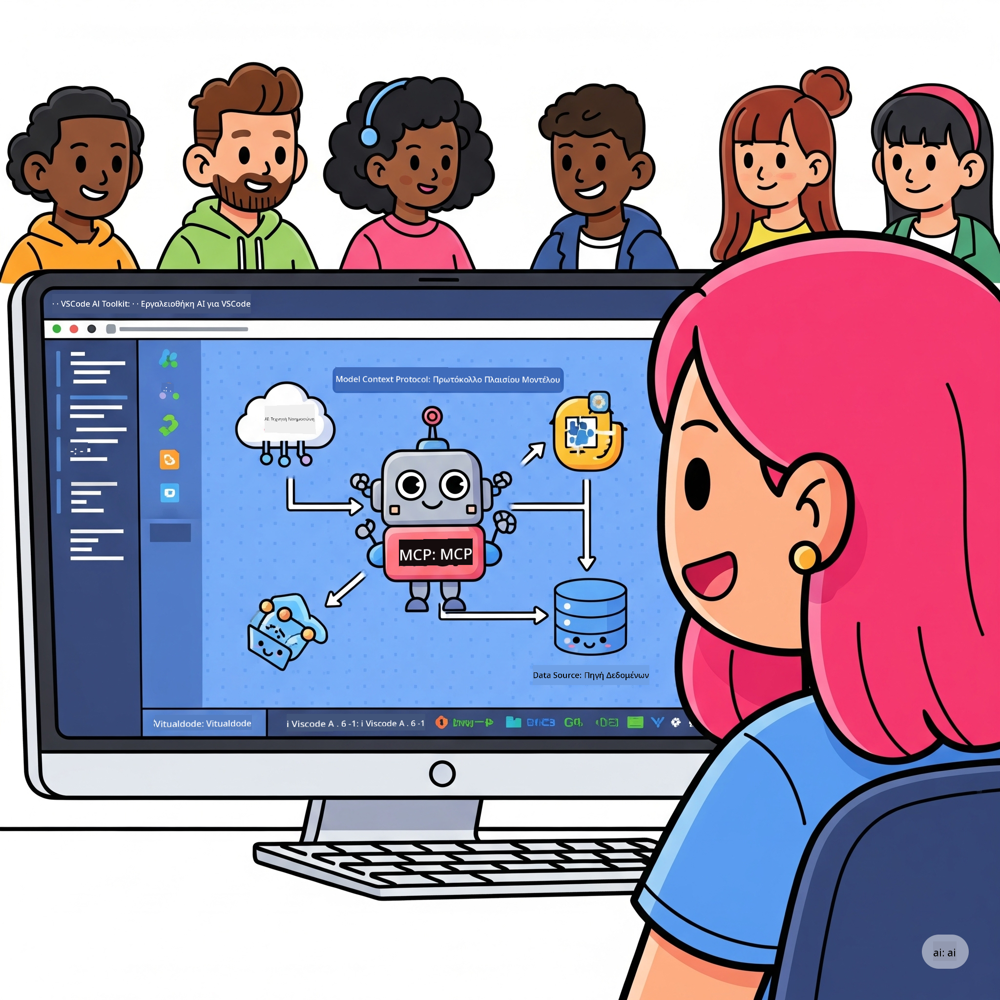

<!--
CO_OP_TRANSLATOR_METADATA:
{
  "original_hash": "787440926586cd064b0899fd1c514f52",
  "translation_date": "2025-06-10T04:56:37+00:00",
  "source_file": "10-StreamliningAIWorkflowsBuildingAnMCPServerWithAIToolkit/README.md",
  "language_code": "el"
}
-->
# Απλοποίηση Ροών Εργασίας AI: Δημιουργία MCP Server με AI Toolkit

## 🎯 Επισκόπηση

Καλώς ήρθατε στο **Model Context Protocol (MCP) Workshop**! Αυτό το ολοκληρωμένο εργαστήριο συνδυάζει δύο πρωτοποριακές τεχνολογίες που φέρνουν επανάσταση στην ανάπτυξη εφαρμογών AI:

- **🔗 Model Context Protocol (MCP)**: Ένα ανοιχτό πρότυπο για απρόσκοπτη ενσωμάτωση εργαλείων AI
- **🛠️ AI Toolkit για Visual Studio Code (AITK)**: Η ισχυρή επέκταση AI της Microsoft για ανάπτυξη

### 🎓 Τι θα μάθετε

Στο τέλος του εργαστηρίου, θα έχετε μάθει πώς να δημιουργείτε έξυπνες εφαρμογές που γεφυρώνουν τα μοντέλα AI με πραγματικά εργαλεία και υπηρεσίες. Από αυτοματοποιημένο testing μέχρι προσαρμοσμένες API ενσωματώσεις, θα αποκτήσετε πρακτικές δεξιότητες για την επίλυση σύνθετων επιχειρηματικών προκλήσεων.

## 🏗️ Τεχνολογικό Υπόβαθρο

### 🔌 Model Context Protocol (MCP)

Το MCP είναι το **"USB-C για το AI"** - ένα καθολικό πρότυπο που συνδέει μοντέλα AI με εξωτερικά εργαλεία και πηγές δεδομένων.

**✨ Κύρια Χαρακτηριστικά:**
- 🔄 **Τυποποιημένη Ενσωμάτωση**: Καθολική διεπαφή για συνδέσεις AI-εργαλείων
- 🏛️ **Ευέλικτη Αρχιτεκτονική**: Τοπικοί & απομακρυσμένοι servers μέσω stdio/SSE μεταφοράς
- 🧰 **Πλούσιο Οικοσύστημα**: Εργαλεία, prompts και πόροι σε ένα πρωτόκολλο
- 🔒 **Έτοιμο για Επιχειρήσεις**: Ενσωματωμένη ασφάλεια και αξιοπιστία

**🎯 Γιατί το MCP έχει σημασία:**
Όπως το USB-C εξάλειψε το χάος με τα καλώδια, έτσι και το MCP απλοποιεί τις ενσωματώσεις AI. Ένα πρωτόκολλο, απεριόριστες δυνατότητες.

### 🤖 AI Toolkit για Visual Studio Code (AITK)

Η βασική επέκταση AI της Microsoft που μετατρέπει το VS Code σε ένα ισχυρό εργαλείο AI.

**🚀 Βασικές Δυνατότητες:**
- 📦 **Κατάλογος Μοντέλων**: Πρόσβαση σε μοντέλα από Azure AI, GitHub, Hugging Face, Ollama
- ⚡ **Τοπική Εκτέλεση**: Βελτιστοποιημένη εκτέλεση CPU/GPU/NPU με ONNX
- 🏗️ **Agent Builder**: Οπτική ανάπτυξη AI agents με ενσωμάτωση MCP
- 🎭 **Πολυμορφικότητα**: Υποστήριξη κειμένου, εικόνας και δομημένης εξόδου

**💡 Οφέλη Ανάπτυξης:**
- Ανάπτυξη μοντέλων χωρίς ρυθμίσεις
- Οπτικός σχεδιασμός prompts
- Πραγματικός χρόνος δοκιμών
- Απρόσκοπτη ενσωμάτωση MCP server

## 📚 Διαδρομή Μάθησης

### [🚀 Ενότητα 1: Βασικά AI Toolkit](./lab1/README.md)
**Διάρκεια**: 15 λεπτά
- 🛠️ Εγκατάσταση και ρύθμιση AI Toolkit για VS Code
- 🗂️ Εξερεύνηση Καταλόγου Μοντέλων (100+ μοντέλα από GitHub, ONNX, OpenAI, Anthropic, Google)
- 🎮 Εκμάθηση Interactive Playground για δοκιμές μοντέλων σε πραγματικό χρόνο
- 🤖 Δημιουργία πρώτου AI agent με Agent Builder
- 📊 Αξιολόγηση απόδοσης μοντέλων με ενσωματωμένα metrics (F1, σχετικότητα, ομοιότητα, συνοχή)
- ⚡ Εκμάθηση batch processing και υποστήριξης multi-modal

**🎯 Αποτέλεσμα Μάθησης**: Δημιουργία λειτουργικού AI agent με πλήρη κατανόηση των δυνατοτήτων του AITK

### [🌐 Ενότητα 2: MCP με AI Toolkit Βασικά](./lab2/README.md)
**Διάρκεια**: 20 λεπτά
- 🧠 Κατανόηση αρχιτεκτονικής και εννοιών του Model Context Protocol (MCP)
- 🌐 Εξερεύνηση οικοσυστήματος MCP servers της Microsoft
- 🤖 Δημιουργία browser automation agent με Playwright MCP server
- 🔧 Ενσωμάτωση MCP servers με AI Toolkit Agent Builder
- 📊 Ρύθμιση και δοκιμή MCP εργαλείων μέσα στους agents
- 🚀 Εξαγωγή και ανάπτυξη MCP-powered agents για παραγωγή

**🎯 Αποτέλεσμα Μάθησης**: Ανάπτυξη AI agent με ενισχυμένη λειτουργικότητα μέσω εξωτερικών εργαλείων MCP

### [🔧 Ενότητα 3: Προχωρημένη Ανάπτυξη MCP με AI Toolkit](./lab3/README.md)
**Διάρκεια**: 20 λεπτά
- 💻 Δημιουργία custom MCP servers με AI Toolkit
- 🐍 Ρύθμιση και χρήση του τελευταίου MCP Python SDK (v1.9.3)
- 🔍 Ρύθμιση και χρήση MCP Inspector για debugging
- 🛠️ Κατασκευή Weather MCP Server με επαγγελματικές ροές debugging
- 🧪 Debug MCP servers τόσο στο Agent Builder όσο και στο Inspector

**🎯 Αποτέλεσμα Μάθησης**: Ανάπτυξη και αποσφαλμάτωση custom MCP servers με σύγχρονα εργαλεία

### [🐙 Ενότητα 4: Πρακτική Ανάπτυξη MCP - Custom GitHub Clone Server](./lab4/README.md)
**Διάρκεια**: 30 λεπτά
- 🏗️ Δημιουργία πραγματικού GitHub Clone MCP Server για ροές ανάπτυξης
- 🔄 Υλοποίηση έξυπνου cloning αποθετηρίων με validation και χειρισμό σφαλμάτων
- 📁 Δημιουργία έξυπνης διαχείρισης φακέλων και ενσωμάτωση VS Code
- 🤖 Χρήση GitHub Copilot Agent Mode με custom MCP εργαλεία
- 🛡️ Εφαρμογή αξιοπιστίας παραγωγής και συμβατότητας πολλαπλών πλατφορμών

**🎯 Αποτέλεσμα Μάθησης**: Ανάπτυξη παραγωγικού MCP server που απλοποιεί πραγματικές ροές εργασίας ανάπτυξης

## 💡 Πραγματικές Εφαρμογές & Επιπτώσεις

### 🏢 Επιχειρηματικές Χρήσεις

#### 🔄 Αυτοματισμός DevOps
Μεταμορφώστε τη ροή ανάπτυξης με έξυπνο αυτοματισμό:
- **Έξυπνη Διαχείριση Αποθετηρίων**: AI-driven κριτική κώδικα και αποφάσεις συγχώνευσης
- **Έξυπνο CI/CD**: Αυτόματη βελτιστοποίηση pipeline βάσει αλλαγών κώδικα
- **Κατηγοριοποίηση Θεμάτων**: Αυτόματη ταξινόμηση και ανάθεση σφαλμάτων

#### 🧪 Επανάσταση Ποιοτικού Ελέγχου
Αναβαθμίστε το testing με αυτοματισμό AI:
- **Έξυπνη Δημιουργία Test Suites**: Αυτόματη παραγωγή ολοκληρωμένων δοκιμών
- **Οπτικός Έλεγχος Παρεκκλίσεων**: AI ανίχνευση αλλαγών UI
- **Παρακολούθηση Απόδοσης**: Προληπτική ανίχνευση και επίλυση προβλημάτων

#### 📊 Νοημοσύνη Δεδομένων
Δημιουργήστε πιο έξυπνες ροές επεξεργασίας δεδομένων:
- **Προσαρμοστικές ETL Διαδικασίες**: Αυτοβελτιστοποιούμενοι μετασχηματισμοί δεδομένων
- **Ανίχνευση Ανωμαλιών**: Παρακολούθηση ποιότητας δεδομένων σε πραγματικό χρόνο
- **Έξυπνη Δρομολόγηση**: Διαχείριση ροής δεδομένων με νοημοσύνη

#### 🎧 Βελτίωση Εμπειρίας Πελατών
Δημιουργήστε εξαιρετικές αλληλεπιδράσεις πελατών:
- **Υποστήριξη με Αντίληψη Πλαισίου**: AI agents με πρόσβαση στο ιστορικό πελάτη
- **Προληπτική Επίλυση Προβλημάτων**: Προβλεπτική εξυπηρέτηση πελατών
- **Ενοποίηση Πολλαπλών Καναλιών**: Ενιαία εμπειρία AI σε πλατφόρμες

## 🛠️ Απαιτήσεις & Ρύθμιση

### 💻 Απαιτήσεις Συστήματος

| Συνιστώμενο | Απαίτηση | Σημειώσεις |
|-------------|----------|------------|
| **Λειτουργικό Σύστημα** | Windows 10+, macOS 10.15+, Linux | Οποιοδήποτε σύγχρονο OS |
| **Visual Studio Code** | Τελευταία σταθερή έκδοση | Απαραίτητο για AITK |
| **Node.js** | v18.0+ και npm | Για ανάπτυξη MCP server |
| **Python** | 3.10+ | Προαιρετικό για Python MCP servers |
| **Μνήμη** | Ελάχιστο 8GB RAM | Συνιστάται 16GB για τοπικά μοντέλα |

### 🔧 Περιβάλλον Ανάπτυξης

#### Συνιστώμενες Επεκτάσεις VS Code
- **AI Toolkit** (ms-windows-ai-studio.windows-ai-studio)
- **Python** (ms-python.python)
- **Python Debugger** (ms-python.debugpy)
- **GitHub Copilot** (GitHub.copilot) - Προαιρετικό αλλά χρήσιμο

#### Προαιρετικά Εργαλεία
- **uv**: Σύγχρονος διαχειριστής πακέτων Python
- **MCP Inspector**: Οπτικό εργαλείο debugging για MCP servers
- **Playwright**: Για παραδείγματα web automation

## 🎖️ Αποτελέσματα Μάθησης & Πιστοποίηση

### 🏆 Λίστα Ελέγχου Δεξιοτήτων

Ολοκληρώνοντας αυτό το εργαστήριο, θα έχετε κατακτήσει:

#### 🎯 Βασικές Δεξιότητες
- [ ] **Εμπειρία MCP Protocol**: Βαθιά κατανόηση αρχιτεκτονικής και προτύπων υλοποίησης
- [ ] **Εξοικείωση με AITK**: Εξειδικευμένη χρήση AI Toolkit για γρήγορη ανάπτυξη
- [ ] **Ανάπτυξη Custom Servers**: Δημιουργία, ανάπτυξη και συντήρηση παραγωγικών MCP servers
- [ ] **Εξαιρετική Ενσωμάτωση Εργαλείων**: Απρόσκοπτη σύνδεση AI με υπάρχουσες ροές ανάπτυξης
- [ ] **Εφαρμογή Επίλυσης Προβλημάτων**: Εφαρμογή δεξιοτήτων σε πραγματικές επιχειρηματικές προκλήσεις

#### 🔧 Τεχνικές Δεξιότητες
- [ ] Ρύθμιση και παραμετροποίηση AI Toolkit στο VS Code
- [ ] Σχεδιασμός και υλοποίηση custom MCP servers
- [ ] Ενσωμάτωση GitHub Models με αρχιτεκτονική MCP
- [ ] Δημιουργία αυτοματοποιημένων ροών testing με Playwright
- [ ] Ανάπτυξη AI agents για παραγωγή
- [ ] Debugging και βελτιστοποίηση απόδοσης MCP servers

#### 🚀 Προχωρημένες Ικανότητες
- [ ] Αρχιτεκτονική AI ενσωματώσεων σε επιχειρησιακή κλίμακα
- [ ] Υλοποίηση βέλτιστων πρακτικών ασφάλειας για AI εφαρμογές
- [ ] Σχεδιασμός κλιμακούμενων αρχιτεκτονικών MCP servers
- [ ] Δημιουργία προσαρμοσμένων αλυσίδων εργαλείων για συγκεκριμένους τομείς
- [ ] Καθοδήγηση άλλων στην ανάπτυξη AI-native

## 📖 Πρόσθετοι Πόροι
- [MCP Specification](https://modelcontextprotocol.io/docs)
- [AI Toolkit GitHub Repository](https://github.com/microsoft/vscode-ai-toolkit)
- [Sample MCP Servers Collection](https://github.com/modelcontextprotocol/servers)
- [Best Practices Guide](https://modelcontextprotocol.io/docs/best-practices)

---

**🚀 Έτοιμοι να φέρετε επανάσταση στη ροή ανάπτυξης AI σας;**

Ας δημιουργήσουμε μαζί το μέλλον των έξυπνων εφαρμογών με MCP και AI Toolkit!

**Αποποίηση Ευθυνών**:  
Αυτό το έγγραφο έχει μεταφραστεί χρησιμοποιώντας την υπηρεσία αυτόματης μετάφρασης AI [Co-op Translator](https://github.com/Azure/co-op-translator). Παρόλο που επιδιώκουμε ακρίβεια, παρακαλούμε να λάβετε υπόψη ότι οι αυτοματοποιημένες μεταφράσεις μπορεί να περιέχουν λάθη ή ανακρίβειες. Το πρωτότυπο έγγραφο στη γλώσσα του θεωρείται η αυθεντική πηγή. Για κρίσιμες πληροφορίες, συνιστάται επαγγελματική μετάφραση από άνθρωπο. Δεν φέρουμε ευθύνη για τυχόν παρεξηγήσεις ή λανθασμένες ερμηνείες που προκύπτουν από τη χρήση αυτής της μετάφρασης.