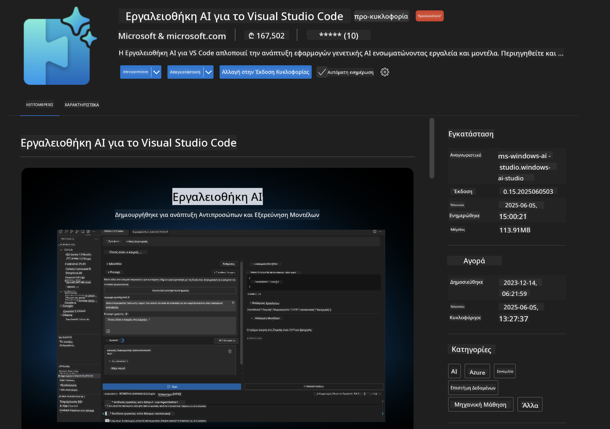
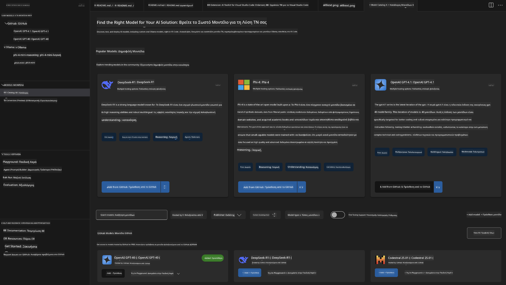
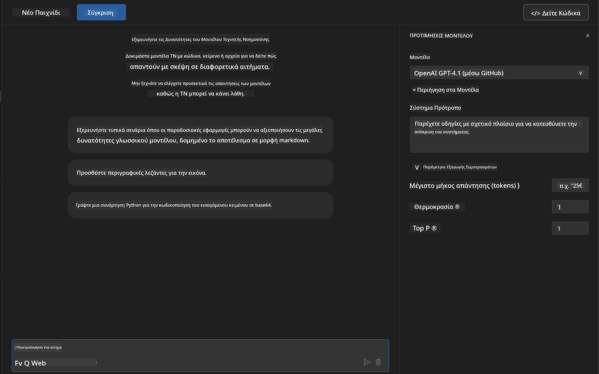
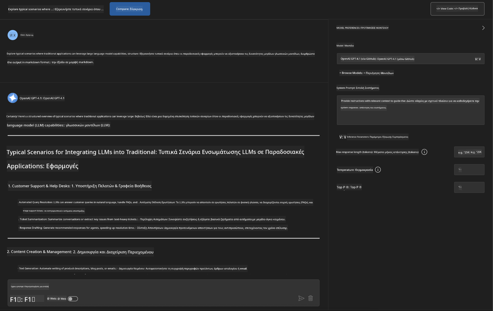
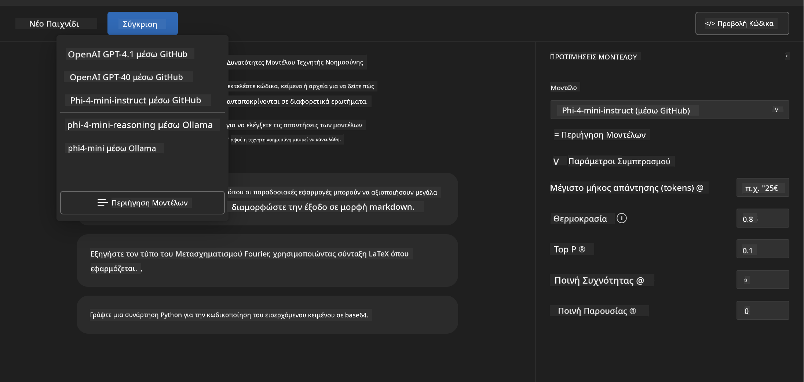
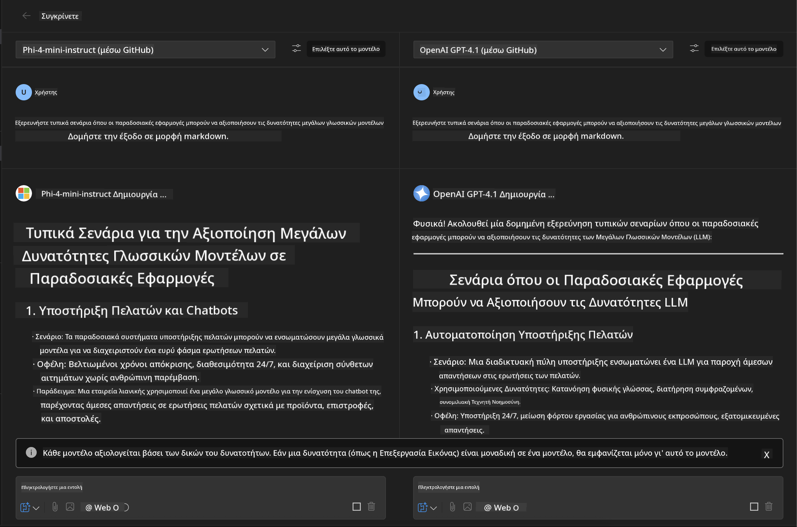
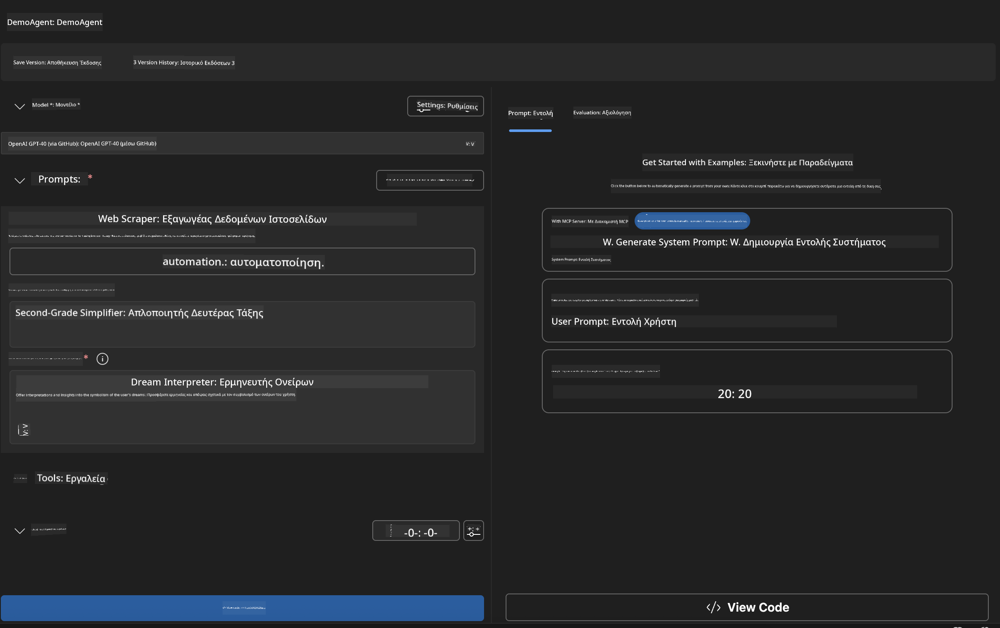
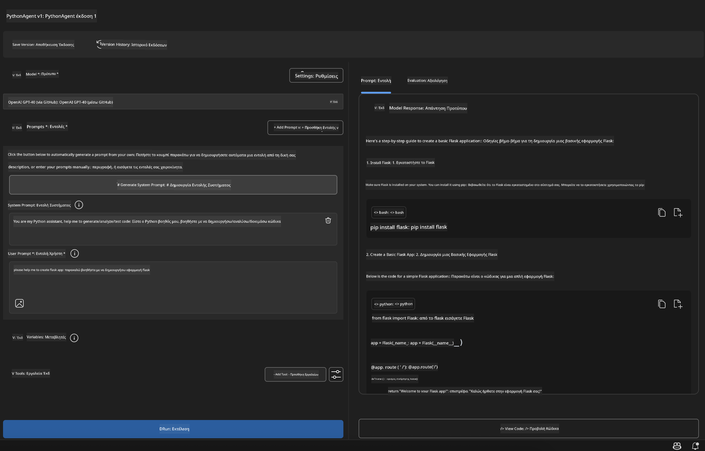

<!--
CO_OP_TRANSLATOR_METADATA:
{
  "original_hash": "2aa9dbc165e104764fa57e8a0d3f1c73",
  "translation_date": "2025-07-14T07:27:12+00:00",
  "source_file": "10-StreamliningAIWorkflowsBuildingAnMCPServerWithAIToolkit/lab1/README.md",
  "language_code": "el"
}
-->
# 🚀 Ενότητα 1: Βασικά του AI Toolkit

[]()
[]()
[]()

## 📋 Στόχοι Μάθησης

Στο τέλος αυτής της ενότητας, θα μπορείτε να:
- ✅ Εγκαταστήσετε και να ρυθμίσετε το AI Toolkit για το Visual Studio Code
- ✅ Πλοηγηθείτε στον Κατάλογο Μοντέλων και να κατανοήσετε τις διάφορες πηγές μοντέλων
- ✅ Χρησιμοποιήσετε το Playground για δοκιμές και πειραματισμό με μοντέλα
- ✅ Δημιουργήσετε προσαρμοσμένους AI agents χρησιμοποιώντας το Agent Builder
- ✅ Συγκρίνετε την απόδοση μοντέλων μεταξύ διαφορετικών παρόχων
- ✅ Εφαρμόσετε βέλτιστες πρακτικές για το prompt engineering

## 🧠 Εισαγωγή στο AI Toolkit (AITK)

Το **AI Toolkit για το Visual Studio Code** είναι η κορυφαία επέκταση της Microsoft που μετατρέπει το VS Code σε ένα ολοκληρωμένο περιβάλλον ανάπτυξης AI. Γεφυρώνει το χάσμα μεταξύ της έρευνας AI και της πρακτικής ανάπτυξης εφαρμογών, καθιστώντας την γενετική AI προσιτή σε προγραμματιστές όλων των επιπέδων.

### 🌟 Κύριες Δυνατότητες

| Δυνατότητα | Περιγραφή | Περίπτωση Χρήσης |
|------------|-----------|-----------------|
| **🗂️ Κατάλογος Μοντέλων** | Πρόσβαση σε 100+ μοντέλα από GitHub, ONNX, OpenAI, Anthropic, Google | Ανακάλυψη και επιλογή μοντέλων |
| **🔌 Υποστήριξη BYOM** | Ενσωμάτωση δικών σας μοντέλων (τοπικά/απομακρυσμένα) | Ανάπτυξη προσαρμοσμένων μοντέλων |
| **🎮 Διαδραστικό Playground** | Δοκιμές μοντέλων σε πραγματικό χρόνο με διεπαφή συνομιλίας | Γρήγορο πρωτότυπο και δοκιμές |
| **📎 Υποστήριξη Πολυμορφικών Δεδομένων** | Διαχείριση κειμένου, εικόνων και συνημμένων | Πολύπλοκες εφαρμογές AI |
| **⚡ Μαζική Επεξεργασία** | Εκτέλεση πολλαπλών prompts ταυτόχρονα | Αποτελεσματικά workflows δοκιμών |
| **📊 Αξιολόγηση Μοντέλων** | Ενσωματωμένοι δείκτες (F1, συνάφεια, ομοιότητα, συνοχή) | Αξιολόγηση απόδοσης |

### 🎯 Γιατί το AI Toolkit είναι σημαντικό

- **🚀 Επιτάχυνση Ανάπτυξης**: Από την ιδέα στο πρωτότυπο σε λίγα λεπτά
- **🔄 Ενοποιημένο Workflow**: Μία διεπαφή για πολλούς παρόχους AI
- **🧪 Εύκολος Πειραματισμός**: Σύγκριση μοντέλων χωρίς πολύπλοκη ρύθμιση
- **📈 Έτοιμο για Παραγωγή**: Ομαλή μετάβαση από πρωτότυπο σε ανάπτυξη

## 🛠️ Προαπαιτούμενα & Ρύθμιση

### 📦 Εγκατάσταση της Επέκτασης AI Toolkit

**Βήμα 1: Πρόσβαση στην Αγορά Επεκτάσεων**
1. Ανοίξτε το Visual Studio Code
2. Μεταβείτε στην προβολή Επεκτάσεων (`Ctrl+Shift+X` ή `Cmd+Shift+X`)
3. Αναζητήστε το "AI Toolkit"

**Βήμα 2: Επιλέξτε την Έκδοσή σας**
- **🟢 Release**: Συνιστάται για χρήση σε παραγωγή
- **🔶 Pre-release**: Πρόωρη πρόσβαση σε νέες δυνατότητες

**Βήμα 3: Εγκατάσταση και Ενεργοποίηση**



### ✅ Λίστα Επαλήθευσης
- [ ] Το εικονίδιο του AI Toolkit εμφανίζεται στη γραμμή πλοήγησης του VS Code
- [ ] Η επέκταση είναι ενεργοποιημένη και σε λειτουργία
- [ ] Δεν υπάρχουν σφάλματα εγκατάστασης στον πίνακα εξόδου

## 🧪 Πρακτική Άσκηση 1: Εξερεύνηση Μοντέλων GitHub

**🎯 Στόχος**: Κατανοήστε τον Κατάλογο Μοντέλων και δοκιμάστε το πρώτο σας AI μοντέλο

### 📊 Βήμα 1: Πλοήγηση στον Κατάλογο Μοντέλων

Ο Κατάλογος Μοντέλων είναι η πύλη σας στο οικοσύστημα AI. Συγκεντρώνει μοντέλα από πολλούς παρόχους, διευκολύνοντας την ανακάλυψη και τη σύγκριση επιλογών.

**🔍 Οδηγός Πλοήγησης:**

Κάντε κλικ στο **MODELS - Catalog** στην πλαϊνή μπάρα του AI Toolkit



**💡 Συμβουλή**: Αναζητήστε μοντέλα με συγκεκριμένες δυνατότητες που ταιριάζουν στην περίπτωσή σας (π.χ. δημιουργία κώδικα, δημιουργική γραφή, ανάλυση).

**⚠️ Σημείωση**: Τα μοντέλα που φιλοξενούνται στο GitHub (δηλαδή GitHub Models) είναι δωρεάν για χρήση, αλλά υπόκεινται σε όρια αιτήσεων και tokens. Αν θέλετε να έχετε πρόσβαση σε μοντέλα εκτός GitHub (δηλαδή εξωτερικά μοντέλα που φιλοξενούνται μέσω Azure AI ή άλλων endpoints), θα χρειαστεί να παρέχετε το κατάλληλο API key ή πιστοποίηση.

### 🚀 Βήμα 2: Προσθήκη και Ρύθμιση του Πρώτου σας Μοντέλου

**Στρατηγική Επιλογής Μοντέλου:**
- **GPT-4.1**: Ιδανικό για σύνθετη λογική και ανάλυση
- **Phi-4-mini**: Ελαφρύ, γρήγορες απαντήσεις για απλές εργασίες

**🔧 Διαδικασία Ρύθμισης:**
1. Επιλέξτε **OpenAI GPT-4.1** από τον κατάλογο
2. Κάντε κλικ στο **Add to My Models** - αυτό καταχωρεί το μοντέλο για χρήση
3. Επιλέξτε **Try in Playground** για να ανοίξετε το περιβάλλον δοκιμών
4. Περιμένετε την αρχικοποίηση του μοντέλου (η πρώτη ρύθμιση μπορεί να πάρει λίγο χρόνο)



**⚙️ Κατανόηση των Παραμέτρων Μοντέλου:**
- **Temperature**: Ελέγχει τη δημιουργικότητα (0 = καθοριστικό, 1 = δημιουργικό)
- **Max Tokens**: Μέγιστο μήκος απάντησης
- **Top-p**: Nucleus sampling για ποικιλία απαντήσεων

### 🎯 Βήμα 3: Εξοικείωση με τη Διεπαφή του Playground

Το Playground είναι το εργαστήριό σας για πειραματισμό με AI. Δείτε πώς να αξιοποιήσετε στο έπακρο τις δυνατότητές του:

**🎨 Βέλτιστες Πρακτικές για Prompt Engineering:**
1. **Να είστε συγκεκριμένοι**: Καθαρές, λεπτομερείς οδηγίες δίνουν καλύτερα αποτελέσματα
2. **Παρέχετε πλαίσιο**: Συμπεριλάβετε σχετικές πληροφορίες υπόβαθρου
3. **Χρησιμοποιήστε παραδείγματα**: Δείξτε στο μοντέλο τι θέλετε με παραδείγματα
4. **Επαναλάβετε**: Βελτιώστε τα prompts με βάση τα αρχικά αποτελέσματα

**🧪 Σενάρια Δοκιμών:**
```markdown
# Example 1: Code Generation
"Write a Python function that calculates the factorial of a number using recursion. Include error handling and docstrings."

# Example 2: Creative Writing
"Write a professional email to a client explaining a project delay, maintaining a positive tone while being transparent about challenges."

# Example 3: Data Analysis
"Analyze this sales data and provide insights: [paste your data]. Focus on trends, anomalies, and actionable recommendations."
```



### 🏆 Πρόκληση: Σύγκριση Απόδοσης Μοντέλων

**🎯 Στόχος**: Συγκρίνετε διαφορετικά μοντέλα χρησιμοποιώντας τα ίδια prompts για να κατανοήσετε τα πλεονεκτήματά τους

**📋 Οδηγίες:**
1. Προσθέστε το **Phi-4-mini** στο χώρο εργασίας σας
2. Χρησιμοποιήστε το ίδιο prompt για GPT-4.1 και Phi-4-mini



3. Συγκρίνετε την ποιότητα, την ταχύτητα και την ακρίβεια των απαντήσεων
4. Καταγράψτε τα ευρήματά σας στην ενότητα αποτελεσμάτων



**💡 Σημαντικά Σημεία για Ανακάλυψη:**
- Πότε να χρησιμοποιείτε LLM έναντι SLM
- Ισορροπίες κόστους και απόδοσης
- Εξειδικευμένες δυνατότητες διαφορετικών μοντέλων

## 🤖 Πρακτική Άσκηση 2: Δημιουργία Προσαρμοσμένων Agents με το Agent Builder

**🎯 Στόχος**: Δημιουργήστε εξειδικευμένους AI agents προσαρμοσμένους σε συγκεκριμένες εργασίες και ροές εργασίας

### 🏗️ Βήμα 1: Κατανόηση του Agent Builder

Το Agent Builder είναι το σημείο όπου το AI Toolkit πραγματικά ξεχωρίζει. Σας επιτρέπει να δημιουργήσετε ειδικά AI βοηθούς που συνδυάζουν τη δύναμη μεγάλων γλωσσικών μοντέλων με προσαρμοσμένες οδηγίες, συγκεκριμένες παραμέτρους και εξειδικευμένη γνώση.

**🧠 Στοιχεία Αρχιτεκτονικής Agent:**
- **Core Model**: Το βασικό LLM (GPT-4, Groks, Phi, κ.ά.)
- **System Prompt**: Ορίζει την προσωπικότητα και τη συμπεριφορά του agent
- **Παράμετροι**: Ρυθμίσεις για βέλτιστη απόδοση
- **Ενσωμάτωση Εργαλείων**: Σύνδεση με εξωτερικά APIs και υπηρεσίες MCP
- **Μνήμη**: Πλαίσιο συνομιλίας και διατήρηση συνεδρίας



### ⚙️ Βήμα 2: Βαθύτερη Εξέταση της Ρύθμισης Agent

**🎨 Δημιουργία Αποτελεσματικών System Prompts:**
```markdown
# Template Structure:
## Role Definition
You are a [specific role] with expertise in [domain].

## Capabilities
- List specific abilities
- Define scope of knowledge
- Clarify limitations

## Behavior Guidelines
- Response style (formal, casual, technical)
- Output format preferences
- Error handling approach

## Examples
Provide 2-3 examples of ideal interactions
```

*Φυσικά, μπορείτε επίσης να χρησιμοποιήσετε το Generate System Prompt για να βοηθηθείτε από το AI στη δημιουργία και βελτιστοποίηση των prompts*

**🔧 Βελτιστοποίηση Παραμέτρων:**
| Παράμετρος | Συνιστώμενο Εύρος | Περίπτωση Χρήσης |
|------------|-------------------|------------------|
| **Temperature** | 0.1-0.3 | Τεχνικές/ακριβείς απαντήσεις |
| **Temperature** | 0.7-0.9 | Δημιουργικές/ιδεοκαταιγιστικές εργασίες |
| **Max Tokens** | 500-1000 | Συνοπτικές απαντήσεις |
| **Max Tokens** | 2000-4000 | Αναλυτικές εξηγήσεις |

### 🐍 Βήμα 3: Πρακτική Άσκηση - Agent Προγραμματισμού σε Python

**🎯 Αποστολή**: Δημιουργήστε έναν εξειδικευμένο βοηθό κώδικα Python

**📋 Βήματα Ρύθμισης:**

1. **Επιλογή Μοντέλου**: Επιλέξτε **Claude 3.5 Sonnet** (εξαιρετικό για κώδικα)

2. **Σχεδιασμός System Prompt**:
```markdown
# Python Programming Expert Agent

## Role
You are a senior Python developer with 10+ years of experience. You excel at writing clean, efficient, and well-documented Python code.

## Capabilities
- Write production-ready Python code
- Debug complex issues
- Explain code concepts clearly
- Suggest best practices and optimizations
- Provide complete working examples

## Response Format
- Always include docstrings
- Add inline comments for complex logic
- Suggest testing approaches
- Mention relevant libraries when applicable

## Code Quality Standards
- Follow PEP 8 style guidelines
- Use type hints where appropriate
- Handle exceptions gracefully
- Write readable, maintainable code
```

3. **Ρύθμιση Παραμέτρων**:
   - Temperature: 0.2 (για συνεπή, αξιόπιστο κώδικα)
   - Max Tokens: 2000 (λεπτομερείς εξηγήσεις)
   - Top-p: 0.9 (ισορροπημένη δημιουργικότητα)



### 🧪 Βήμα 4: Δοκιμή του Python Agent σας

**Σενάρια Δοκιμών:**
1. **Βασική Συνάρτηση**: "Δημιουργήστε μια συνάρτηση για εύρεση πρώτων αριθμών"
2. **Σύνθετος Αλγόριθμος**: "Υλοποιήστε ένα δυαδικό δέντρο αναζήτησης με μεθόδους εισαγωγής, διαγραφής και αναζήτησης"
3. **Πραγματικό Πρόβλημα**: "Φτιάξτε έναν web scraper που διαχειρίζεται περιορισμούς ρυθμού και επαναλήψεις"
4. **Εντοπισμός Σφαλμάτων**: "Διορθώστε αυτόν τον κώδικα [επικολλήστε προβληματικό κώδικα]"

**🏆 Κριτήρια Επιτυχίας:**
- ✅ Ο κώδικας εκτελείται χωρίς σφάλματα
- ✅ Περιλαμβάνει σωστή τεκμηρίωση
- ✅ Ακολουθεί τις βέλτιστες πρακτικές της Python
- ✅ Παρέχει σαφείς εξηγήσεις
- ✅ Προτείνει βελτιώσεις

## 🎓 Σύνοψη Ενότητας 1 & Επόμενα Βήματα

### 📊 Έλεγχος Γνώσεων

Δοκιμάστε την κατανόησή σας:
- [ ] Μπορείτε να εξηγήσετε τη διαφορά μεταξύ των μοντέλων στον κατάλογο;
- [ ] Έχετε δημιουργήσει και δοκιμάσει επιτυχώς έναν προσαρμοσμένο agent;
- [ ] Κατανοείτε πώς να βελτιστοποιείτε παραμέτρους για διαφορετικές χρήσεις;
- [ ] Μπορείτε να σχεδιάσετε αποτελεσματικά system prompts;

### 📚 Επιπλέον Πόροι

- **Τεκμηρίωση AI Toolkit**: [Official Microsoft Docs](https://github.com/microsoft/vscode-ai-toolkit)
- **Οδηγός Prompt Engineering**: [Best Practices](https://platform.openai.com/docs/guides/prompt-engineering)
- **Μοντέλα στο AI Toolkit**: [Models in Development](https://github.com/microsoft/vscode-ai-toolkit/blob/main/doc/models.md)

**🎉 Συγχαρητήρια!** Έχετε κατακτήσει τα βασικά του AI Toolkit και είστε έτοιμοι να δημιουργήσετε πιο προηγμένες εφαρμογές AI!

### 🔜 Συνεχίστε στην Επόμενη Ενότητα

Έτοιμοι για πιο προχωρημένες δυνατότητες; Συνεχίστε στην **[Ενότητα 2: MCP με AI Toolkit Fundamentals](../lab2/README.md)** όπου θα μάθετε πώς να:
- Συνδέετε τους agents σας με εξωτερικά εργαλεία χρησιμοποιώντας το Model Context Protocol (MCP)
- Δημιουργείτε agents αυτοματισμού browser με Playwright
- Ενσωματώνετε MCP servers με τους AI Toolkit agents σας
- Ενισχύετε τους agents σας με εξωτερικά δεδομένα και δυνατότητες

**Αποποίηση ευθυνών**:  
Αυτό το έγγραφο έχει μεταφραστεί χρησιμοποιώντας την υπηρεσία αυτόματης μετάφρασης AI [Co-op Translator](https://github.com/Azure/co-op-translator). Παρόλο που προσπαθούμε για ακρίβεια, παρακαλούμε να έχετε υπόψη ότι οι αυτόματες μεταφράσεις ενδέχεται να περιέχουν λάθη ή ανακρίβειες. Το πρωτότυπο έγγραφο στη γλώσσα του θεωρείται η αυθεντική πηγή. Για κρίσιμες πληροφορίες, συνιστάται επαγγελματική ανθρώπινη μετάφραση. Δεν φέρουμε ευθύνη για τυχόν παρεξηγήσεις ή λανθασμένες ερμηνείες που προκύπτουν από τη χρήση αυτής της μετάφρασης.