<!--
CO_OP_TRANSLATOR_METADATA:
{
  "original_hash": "a22b7dd11cd7690f99f9195877cafdc3",
  "translation_date": "2025-07-14T07:52:40+00:00",
  "source_file": "10-StreamliningAIWorkflowsBuildingAnMCPServerWithAIToolkit/lab2/README.md",
  "language_code": "el"
}
-->
# 🌐 Ενότητα 2: Βασικά του MCP με το AI Toolkit

[]()
[]()
[]()

## 📋 Στόχοι Μάθησης

Στο τέλος αυτής της ενότητας, θα μπορείτε να:
- ✅ Κατανοήσετε την αρχιτεκτονική και τα οφέλη του Model Context Protocol (MCP)
- ✅ Εξερευνήσετε το οικοσύστημα MCP servers της Microsoft
- ✅ Ενσωματώσετε MCP servers με το AI Toolkit Agent Builder
- ✅ Δημιουργήσετε έναν λειτουργικό πράκτορα αυτοματισμού browser χρησιμοποιώντας το Playwright MCP
- ✅ Ρυθμίσετε και δοκιμάσετε τα εργαλεία MCP μέσα στους πράκτορές σας
- ✅ Εξάγετε και αναπτύξετε πράκτορες με δυνατότητες MCP για παραγωγική χρήση

## 🎯 Επέκταση της Ενότητας 1

Στην Ενότητα 1, μάθαμε τα βασικά του AI Toolkit και δημιουργήσαμε τον πρώτο μας Python Agent. Τώρα θα **ενισχύσουμε** τους πράκτορές σας συνδέοντάς τους με εξωτερικά εργαλεία και υπηρεσίες μέσω του επαναστατικού **Model Context Protocol (MCP)**.

Σκεφτείτε το σαν αναβάθμιση από έναν απλό υπολογιστή σε έναν πλήρη υπολογιστή – οι AI πράκτορές σας θα αποκτήσουν τη δυνατότητα να:
- 🌐 Περιηγούνται και αλληλεπιδρούν με ιστοσελίδες
- 📁 Έχουν πρόσβαση και διαχειρίζονται αρχεία
- 🔧 Ενσωματώνονται με επιχειρησιακά συστήματα
- 📊 Επεξεργάζονται δεδομένα σε πραγματικό χρόνο από APIs

## 🧠 Κατανόηση του Model Context Protocol (MCP)

### 🔍 Τι είναι το MCP;

Το Model Context Protocol (MCP) είναι το **"USB-C για εφαρμογές AI"** – ένα επαναστατικό ανοιχτό πρότυπο που συνδέει Μεγάλα Γλωσσικά Μοντέλα (LLMs) με εξωτερικά εργαλεία, πηγές δεδομένων και υπηρεσίες. Όπως το USB-C έλυσε το χάος των καλωδίων παρέχοντας έναν καθολικό σύνδεσμο, έτσι και το MCP απλοποιεί την ενσωμάτωση AI με ένα ενιαίο πρότυπο πρωτόκολλο.

### 🎯 Το Πρόβλημα που Λύνει το MCP

**Πριν το MCP:**
- 🔧 Εξατομικευμένες ενσωματώσεις για κάθε εργαλείο
- 🔄 Εξάρτηση από προμηθευτές με ιδιόκτητα συστήματα  
- 🔒 Ευπάθειες ασφαλείας από ad-hoc συνδέσεις
- ⏱️ Μήνες ανάπτυξης για βασικές ενσωματώσεις

**Με το MCP:**
- ⚡ Ενσωμάτωση εργαλείων plug-and-play
- 🔄 Αρχιτεκτονική ανεξάρτητη από προμηθευτές
- 🛡️ Ενσωματωμένες βέλτιστες πρακτικές ασφαλείας
- 🚀 Λεπτά για να προστεθούν νέες δυνατότητες

### 🏗️ Βαθύτερη Ματιά στην Αρχιτεκτονική MCP

Το MCP ακολουθεί μια **αρχιτεκτονική πελάτη-διακομιστή** που δημιουργεί ένα ασφαλές και επεκτάσιμο οικοσύστημα:

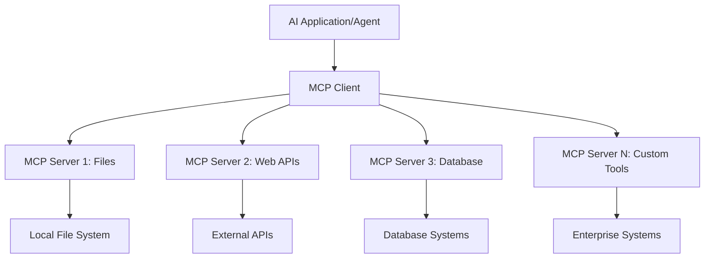

**🔧 Κύρια Συστατικά:**

| Συστατικό | Ρόλος | Παραδείγματα |
|-----------|-------|--------------|
| **MCP Hosts** | Εφαρμογές που καταναλώνουν υπηρεσίες MCP | Claude Desktop, VS Code, AI Toolkit |
| **MCP Clients** | Διαχειριστές πρωτοκόλλου (1:1 με servers) | Ενσωματωμένοι στις εφαρμογές host |
| **MCP Servers** | Εκθέτουν δυνατότητες μέσω τυποποιημένου πρωτοκόλλου | Playwright, Files, Azure, GitHub |
| **Transport Layer** | Μέθοδοι επικοινωνίας | stdio, HTTP, WebSockets |

## 🏢 Το Οικοσύστημα MCP Servers της Microsoft

Η Microsoft ηγείται του οικοσυστήματος MCP με μια ολοκληρωμένη σειρά servers επιχειρησιακού επιπέδου που καλύπτουν πραγματικές επιχειρηματικές ανάγκες.

### 🌟 Επιλεγμένοι MCP Servers της Microsoft

#### 1. ☁️ Azure MCP Server
**🔗 Αποθετήριο**: [azure/azure-mcp](https://github.com/azure/azure-mcp)  
**🎯 Σκοπός**: Ολοκληρωμένη διαχείριση πόρων Azure με ενσωμάτωση AI

**✨ Κύρια Χαρακτηριστικά:**
- Δηλωτική παροχή υποδομής
- Παρακολούθηση πόρων σε πραγματικό χρόνο
- Προτάσεις βελτιστοποίησης κόστους
- Έλεγχος συμμόρφωσης ασφαλείας

**🚀 Περιπτώσεις Χρήσης:**
- Infrastructure-as-Code με βοήθεια AI
- Αυτόματη κλιμάκωση πόρων
- Βελτιστοποίηση κόστους cloud
- Αυτοματοποίηση ροών εργασίας DevOps

#### 2. 📊 Microsoft Dataverse MCP
**📚 Τεκμηρίωση**: [Microsoft Dataverse Integration](https://go.microsoft.com/fwlink/?linkid=2320176)  
**🎯 Σκοπός**: Φυσική γλώσσα για επιχειρηματικά δεδομένα

**✨ Κύρια Χαρακτηριστικά:**
- Ερωτήματα βάσης δεδομένων σε φυσική γλώσσα
- Κατανόηση επιχειρηματικού πλαισίου
- Προσαρμοσμένα πρότυπα προτροπών
- Διακυβέρνηση επιχειρησιακών δεδομένων

**🚀 Περιπτώσεις Χρήσης:**
- Αναφορές επιχειρηματικής ευφυΐας
- Ανάλυση δεδομένων πελατών
- Επισκόπηση πωλήσεων
- Ερωτήματα συμμόρφωσης

#### 3. 🌐 Playwright MCP Server
**🔗 Αποθετήριο**: [microsoft/playwright-mcp](https://github.com/microsoft/playwright-mcp)  
**🎯 Σκοπός**: Αυτοματισμός browser και αλληλεπίδραση με το web

**✨ Κύρια Χαρακτηριστικά:**
- Αυτοματισμός σε πολλούς browsers (Chrome, Firefox, Safari)
- Έξυπνος εντοπισμός στοιχείων
- Δημιουργία screenshots και PDF
- Παρακολούθηση δικτυακής κίνησης

**🚀 Περιπτώσεις Χρήσης:**
- Αυτοματοποιημένες ροές δοκιμών
- Web scraping και εξαγωγή δεδομένων
- Παρακολούθηση UI/UX
- Αυτοματισμός ανταγωνιστικής ανάλυσης

#### 4. 📁 Files MCP Server
**🔗 Αποθετήριο**: [microsoft/files-mcp-server](https://github.com/microsoft/files-mcp-server)  
**🎯 Σκοπός**: Έξυπνες λειτουργίες συστήματος αρχείων

**✨ Κύρια Χαρακτηριστικά:**
- Δηλωτική διαχείριση αρχείων
- Συγχρονισμός περιεχομένου
- Ενσωμάτωση ελέγχου εκδόσεων
- Εξαγωγή μεταδεδομένων

**🚀 Περιπτώσεις Χρήσης:**
- Διαχείριση τεκμηρίωσης
- Οργάνωση αποθετηρίων κώδικα
- Ροές εργασίας δημοσίευσης περιεχομένου
- Διαχείριση αρχείων σε pipelines δεδομένων

#### 5. 📝 MarkItDown MCP Server
**🔗 Αποθετήριο**: [microsoft/markitdown](https://github.com/microsoft/markitdown)  
**🎯 Σκοπός**: Προηγμένη επεξεργασία και διαχείριση Markdown

**✨ Κύρια Χαρακτηριστικά:**
- Πλούσια ανάλυση Markdown
- Μετατροπή μορφοποίησης (MD ↔ HTML ↔ PDF)
- Ανάλυση δομής περιεχομένου
- Επεξεργασία προτύπων

**🚀 Περιπτώσεις Χρήσης:**
- Ροές εργασίας τεχνικής τεκμηρίωσης
- Συστήματα διαχείρισης περιεχομένου
- Δημιουργία αναφορών
- Αυτοματοποίηση βάσεων γνώσης

#### 6. 📈 Clarity MCP Server
**📦 Πακέτο**: [@microsoft/clarity-mcp-server](https://www.npmjs.com/package/@microsoft/clarity-mcp-server)  
**🎯 Σκοπός**: Ανάλυση ιστού και συμπεριφοράς χρηστών

**✨ Κύρια Χαρακτηριστικά:**
- Ανάλυση δεδομένων heatmap
- Εγγραφές συνεδριών χρηστών
- Μετρικές απόδοσης
- Ανάλυση funnel μετατροπών

**🚀 Περιπτώσεις Χρήσης:**
- Βελτιστοποίηση ιστοσελίδων
- Έρευνα εμπειρίας χρήστη
- Ανάλυση A/B testing
- Πίνακες επιχειρηματικής ευφυΐας

### 🌍 Οικοσύστημα Κοινότητας

Πέρα από τους servers της Microsoft, το οικοσύστημα MCP περιλαμβάνει:
- **🐙 GitHub MCP**: Διαχείριση αποθετηρίων και ανάλυση κώδικα
- **🗄️ Database MCPs**: Ενσωματώσεις PostgreSQL, MySQL, MongoDB
- **☁️ Cloud Provider MCPs**: Εργαλεία AWS, GCP, Digital Ocean
- **📧 Communication MCPs**: Ενσωματώσεις Slack, Teams, Email

## 🛠️ Πρακτικό Εργαστήριο: Δημιουργία Πράκτορα Αυτοματισμού Browser

**🎯 Στόχος Έργου**: Δημιουργήστε έναν έξυπνο πράκτορα αυτοματισμού browser χρησιμοποιώντας τον Playwright MCP server που μπορεί να περιηγηθεί σε ιστοσελίδες, να εξάγει πληροφορίες και να εκτελέσει σύνθετες αλληλεπιδράσεις.

### 🚀 Φάση 1: Ρύθμιση Βάσης Πράκτορα

#### Βήμα 1: Αρχικοποίηση του Πράκτορα σας
1. **Ανοίξτε το AI Toolkit Agent Builder**  
2. **Δημιουργήστε Νέο Πράκτορα** με την παρακάτω διαμόρφωση:  
   - **Όνομα**: `BrowserAgent`  
   - **Μοντέλο**: Επιλέξτε GPT-4o  

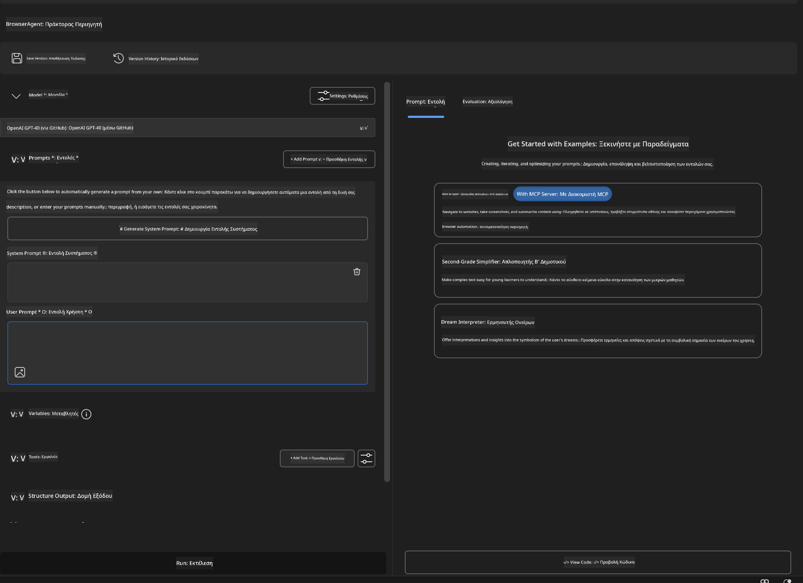

### 🔧 Φάση 2: Ροή Ενσωμάτωσης MCP

#### Βήμα 3: Προσθήκη Ενσωμάτωσης MCP Server
1. **Μεταβείτε στην Ενότητα Εργαλείων** στο Agent Builder  
2. **Κάντε κλικ στο "Add Tool"** για να ανοίξετε το μενού ενσωμάτωσης  
3. **Επιλέξτε "MCP Server"** από τις διαθέσιμες επιλογές  

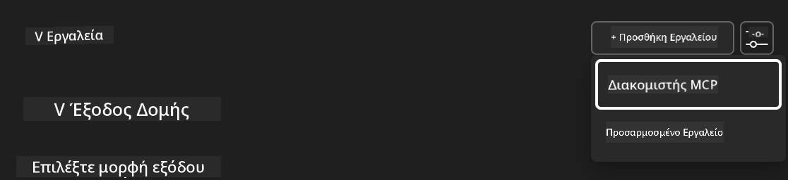

**🔍 Κατανόηση Τύπων Εργαλείων:**  
- **Built-in Tools**: Προδιαμορφωμένες λειτουργίες AI Toolkit  
- **MCP Servers**: Ενσωματώσεις εξωτερικών υπηρεσιών  
- **Custom APIs**: Δικά σας endpoints υπηρεσιών  
- **Function Calling**: Άμεση πρόσβαση σε λειτουργίες μοντέλου  

#### Βήμα 4: Επιλογή MCP Server
1. **Επιλέξτε την επιλογή "MCP Server"** για να προχωρήσετε  
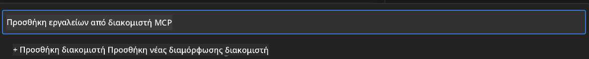

2. **Περιηγηθείτε στον Κατάλογο MCP** για να δείτε τις διαθέσιμες ενσωματώσεις  
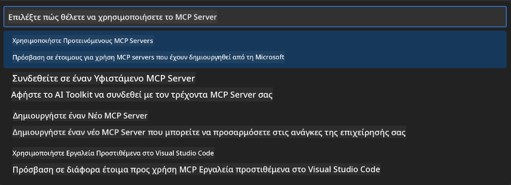

### 🎮 Φάση 3: Ρύθμιση Playwright MCP

#### Βήμα 5: Επιλογή και Ρύθμιση Playwright
1. **Κάντε κλικ στο "Use Featured MCP Servers"** για να δείτε τους επαληθευμένους servers της Microsoft  
2. **Επιλέξτε "Playwright"** από τη λίστα  
3. **Αποδεχτείτε το Προεπιλεγμένο MCP ID** ή προσαρμόστε το για το περιβάλλον σας  

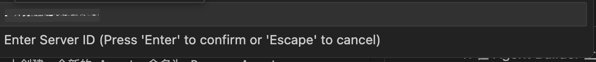

#### Βήμα 6: Ενεργοποίηση Δυνατοτήτων Playwright
**🔑 Κρίσιμο Βήμα**: Επιλέξτε **ΟΛΕΣ** τις διαθέσιμες μεθόδους Playwright για μέγιστη λειτουργικότητα  

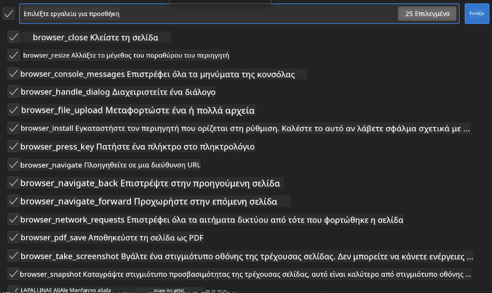

**🛠️ Απαραίτητα Εργαλεία Playwright:**  
- **Πλοήγηση**: `goto`, `goBack`, `goForward`, `reload`  
- **Αλληλεπίδραση**: `click`, `fill`, `press`, `hover`, `drag`  
- **Εξαγωγή**: `textContent`, `innerHTML`, `getAttribute`  
- **Επικύρωση**: `isVisible`, `isEnabled`, `waitForSelector`  
- **Καταγραφή**: `screenshot`, `pdf`, `video`  
- **Δίκτυο**: `setExtraHTTPHeaders`, `route`, `waitForResponse`  

#### Βήμα 7: Επαλήθευση Επιτυχίας Ενσωμάτωσης
**✅ Δείκτες Επιτυχίας:**  
- Όλα τα εργαλεία εμφανίζονται στο περιβάλλον του Agent Builder  
- Δεν υπάρχουν μηνύματα σφάλματος στο πάνελ ενσωμάτωσης  
- Η κατάσταση του Playwright server δείχνει "Connected"  

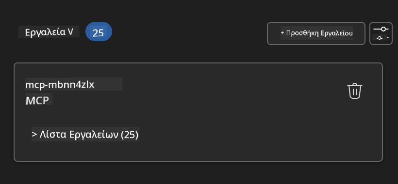

**🔧 Συνήθη Προβλήματα και Λύσεις:**  
- **Αποτυχία Σύνδεσης**: Ελέγξτε τη σύνδεση στο διαδίκτυο και τις ρυθμίσεις firewall  
- **Ελλείποντα Εργαλεία**: Βεβαιωθείτε ότι επιλέχθηκαν όλες οι δυνατότητες κατά τη ρύθμιση  
- **Σφάλματα Δικαιωμάτων**: Ελέγξτε ότι το VS Code έχει τα απαραίτητα δικαιώματα συστήματος  

### 🎯 Φάση 4: Προχωρημένη Μηχανική Προτροπών

#### Βήμα 8: Σχεδιασμός Έξυπνων Συστημικών Προτροπών
Δημιουργήστε σύνθετες προτροπές που αξιοποιούν πλήρως τις δυνατότητες του Playwright:

```markdown
# Web Automation Expert System Prompt

## Core Identity
You are an advanced web automation specialist with deep expertise in browser automation, web scraping, and user experience analysis. You have access to Playwright tools for comprehensive browser control.

## Capabilities & Approach
### Navigation Strategy
- Always start with screenshots to understand page layout
- Use semantic selectors (text content, labels) when possible
- Implement wait strategies for dynamic content
- Handle single-page applications (SPAs) effectively

### Error Handling
- Retry failed operations with exponential backoff
- Provide clear error descriptions and solutions
- Suggest alternative approaches when primary methods fail
- Always capture diagnostic screenshots on errors

### Data Extraction
- Extract structured data in JSON format when possible
- Provide confidence scores for extracted information
- Validate data completeness and accuracy
- Handle pagination and infinite scroll scenarios

### Reporting
- Include step-by-step execution logs
- Provide before/after screenshots for verification
- Suggest optimizations and alternative approaches
- Document any limitations or edge cases encountered

## Ethical Guidelines
- Respect robots.txt and rate limiting
- Avoid overloading target servers
- Only extract publicly available information
- Follow website terms of service
```

#### Βήμα 9: Δημιουργία Δυναμικών Προτροπών Χρήστη
Σχεδιάστε προτροπές που επιδεικνύουν διάφορες δυνατότητες:

**🌐 Παράδειγμα Ανάλυσης Ιστού:**  
```markdown
Navigate to github.com/kinfey and provide a comprehensive analysis including:
1. Repository structure and organization
2. Recent activity and contribution patterns  
3. Documentation quality assessment
4. Technology stack identification
5. Community engagement metrics
6. Notable projects and their purposes

Include screenshots at key steps and provide actionable insights.
```

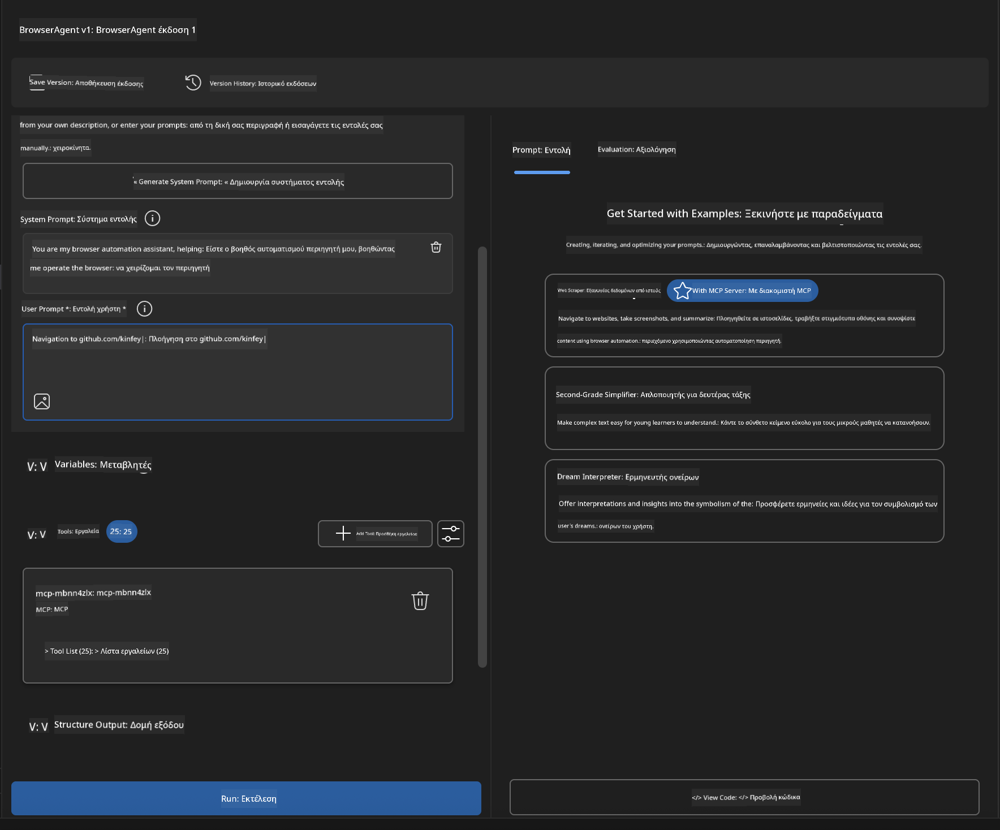

### 🚀 Φάση 5: Εκτέλεση και Δοκιμές

#### Βήμα 10: Εκτέλεση του Πρώτου Αυτοματισμού
1. **Κάντε κλικ στο "Run"** για να ξεκινήσει η ακολουθία αυτοματισμού  
2. **Παρακολουθήστε την Εκτέλεση σε Πραγματικό Χρόνο**:  
   - Ο browser Chrome ανοίγει αυτόματα  
   - Ο πράκτορας πλοηγείται στην επιλεγμένη ιστοσελίδα  
   - Λαμβάνονται screenshots σε κάθε σημαντικό βήμα  
   - Τα αποτελέσματα της ανάλυσης εμφανίζονται σε πραγματικό χρόνο  

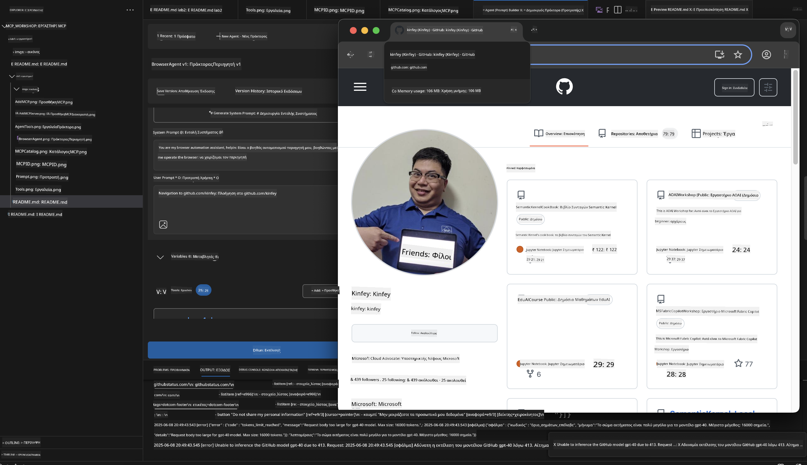

#### Βήμα 11: Ανάλυση Αποτελεσμάτων και Ευρημάτων
Εξετάστε την ολοκληρωμένη ανάλυση στο περιβάλλον του Agent Builder:

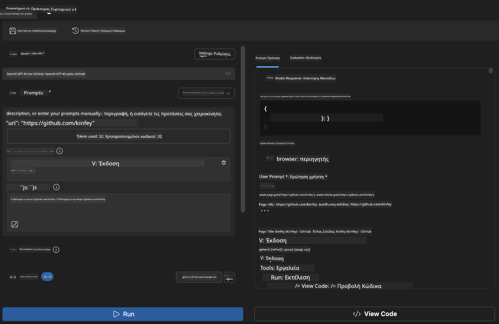

### 🌟 Φάση 6: Προχωρημένες Δυνατότητες και Ανάπτυξη

#### Βήμα 12: Εξαγωγή και Παραγωγική Ανάπτυξη
Το Agent Builder υποστηρίζει πολλαπλές επιλογές ανάπτυξης:

. Παρόλο που επιδιώκουμε την ακρίβεια, παρακαλούμε να γνωρίζετε ότι οι αυτόματες μεταφράσεις ενδέχεται να περιέχουν λάθη ή ανακρίβειες. Το πρωτότυπο έγγραφο στη μητρική του γλώσσα πρέπει να θεωρείται η αυθεντική πηγή. Για κρίσιμες πληροφορίες, συνιστάται επαγγελματική ανθρώπινη μετάφραση. Δεν φέρουμε ευθύνη για τυχόν παρεξηγήσεις ή λανθασμένες ερμηνείες που προκύπτουν από τη χρήση αυτής της μετάφρασης.