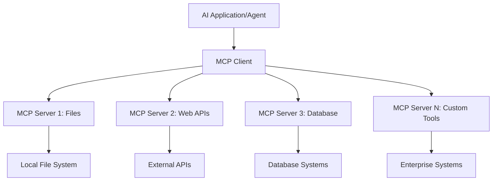
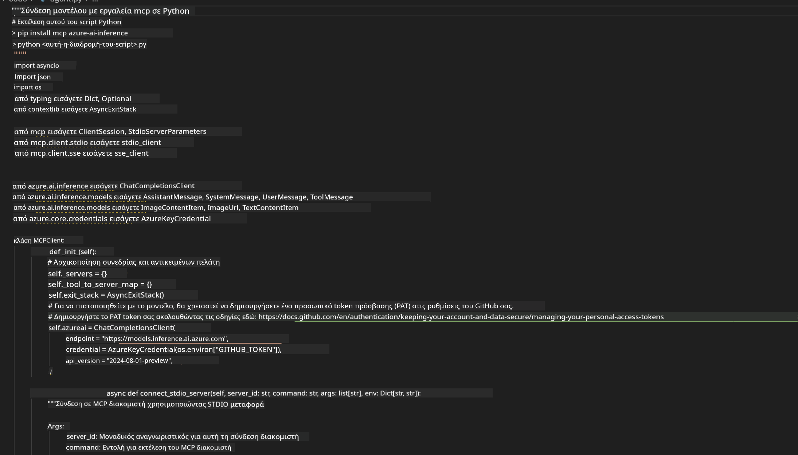

<!--
CO_OP_TRANSLATOR_METADATA:
{
  "original_hash": "a22b7dd11cd7690f99f9195877cafdc3",
  "translation_date": "2025-06-10T05:48:19+00:00",
  "source_file": "10-StreamliningAIWorkflowsBuildingAnMCPServerWithAIToolkit/lab2/README.md",
  "language_code": "el"
}
-->
# 🌐 Ενότητα 2: Βασικά του MCP με το AI Toolkit

[]()
[]()
[]()

## 📋 Μαθησιακοί Στόχοι

Στο τέλος αυτής της ενότητας, θα μπορείτε να:
- ✅ Κατανοήσετε την αρχιτεκτονική και τα πλεονεκτήματα του Model Context Protocol (MCP)
- ✅ Εξερευνήσετε το οικοσύστημα διακομιστών MCP της Microsoft
- ✅ Ενσωματώσετε διακομιστές MCP με το AI Toolkit Agent Builder
- ✅ Δημιουργήσετε έναν λειτουργικό πράκτορα αυτοματοποίησης περιηγητή χρησιμοποιώντας το Playwright MCP
- ✅ Ρυθμίσετε και δοκιμάσετε εργαλεία MCP μέσα στους πράκτορές σας
- ✅ Εξάγετε και αναπτύξετε πράκτορες με δυνατότητες MCP για παραγωγική χρήση

## 🎯 Επέκταση της Ενότητας 1

Στην Ενότητα 1, μάθαμε τα βασικά του AI Toolkit και δημιουργήσαμε τον πρώτο μας πράκτορα Python. Τώρα θα **ενισχύσουμε** τους πράκτορές σας συνδέοντάς τους με εξωτερικά εργαλεία και υπηρεσίες μέσω του πρωτοποριακού **Model Context Protocol (MCP)**.

Σκεφτείτε το σαν αναβάθμιση από έναν απλό υπολογιστή σε έναν πλήρη υπολογιστή – οι AI πράκτορές σας θα αποκτήσουν τη δυνατότητα να:
- 🌐 Περιηγούνται και αλληλεπιδρούν με ιστοσελίδες
- 📁 Έχουν πρόσβαση και διαχειρίζονται αρχεία
- 🔧 Ενσωματώνονται με επιχειρησιακά συστήματα
- 📊 Επεξεργάζονται δεδομένα σε πραγματικό χρόνο από APIs

## 🧠 Κατανόηση του Model Context Protocol (MCP)

### 🔍 Τι είναι το MCP;

Το Model Context Protocol (MCP) είναι το **«USB-C για εφαρμογές AI»** – ένα πρωτοποριακό ανοιχτό πρότυπο που συνδέει Μεγάλα Γλωσσικά Μοντέλα (LLMs) με εξωτερικά εργαλεία, πηγές δεδομένων και υπηρεσίες. Όπως το USB-C έβαλε τέλος στη σύγχυση των καλωδίων παρέχοντας έναν ενιαίο σύνδεσμο, έτσι και το MCP απλοποιεί την ενσωμάτωση AI με ένα ενιαίο πρότυπο πρωτόκολλο.

### 🎯 Το Πρόβλημα που Λύνει το MCP

**Πριν το MCP:**
- 🔧 Ειδικές ενσωματώσεις για κάθε εργαλείο
- 🔄 Εξάρτηση από προμηθευτές με κλειστές λύσεις
- 🔒 Ασφάλεια σε κίνδυνο λόγω πρόχειρων συνδέσεων
- ⏱️ Μήνες ανάπτυξης για βασικές ενσωματώσεις

**Με το MCP:**
- ⚡ Εύκολη ενσωμάτωση εργαλείων plug-and-play
- 🔄 Αρχιτεκτονική ανεξάρτητη από προμηθευτές
- 🛡️ Ενσωματωμένες βέλτιστες πρακτικές ασφάλειας
- 🚀 Λίγα λεπτά για προσθήκη νέων δυνατοτήτων

### 🏗️ Βαθύτερη Ματιά στην Αρχιτεκτονική MCP

Το MCP ακολουθεί μια **αρχιτεκτονική πελάτη-διακομιστή** που δημιουργεί ένα ασφαλές, κλιμακούμενο οικοσύστημα:



**🔧 Βασικά Στοιχεία:**

| Στοιχείο | Ρόλος | Παραδείγματα |
|-----------|-------|--------------|
| **MCP Hosts** | Εφαρμογές που χρησιμοποιούν υπηρεσίες MCP | Claude Desktop, VS Code, AI Toolkit |
| **MCP Clients** | Χειριστές πρωτοκόλλου (1:1 με διακομιστές) | Ενσωματωμένοι στις εφαρμογές host |
| **MCP Servers** | Εκθέτουν δυνατότητες μέσω του προτύπου | Playwright, Files, Azure, GitHub |
| **Transport Layer** | Μέθοδοι επικοινωνίας | stdio, HTTP, WebSockets |


## 🏢 Το Οικοσύστημα Διακομιστών MCP της Microsoft

Η Microsoft ηγείται του οικοσυστήματος MCP με μια πλήρη σειρά διακομιστών επιπέδου επιχειρήσεων που καλύπτουν πραγματικές επιχειρηματικές ανάγκες.

### 🌟 Κυριότεροι Διακομιστές MCP της Microsoft

#### 1. ☁️ Azure MCP Server
**🔗 Αποθετήριο**: [azure/azure-mcp](https://github.com/azure/azure-mcp)
**🎯 Σκοπός**: Ολοκληρωμένη διαχείριση πόρων Azure με ενσωμάτωση AI

**✨ Κύρια Χαρακτηριστικά:**
- Δηλωτική παροχή υποδομών
- Παρακολούθηση πόρων σε πραγματικό χρόνο
- Προτάσεις βελτιστοποίησης κόστους
- Έλεγχος συμμόρφωσης ασφαλείας

**🚀 Περιοχές Χρήσης:**
- Υποδομή ως Κώδικας με βοήθεια AI
- Αυτόματη κλιμάκωση πόρων
- Βελτιστοποίηση κόστους στο cloud
- Αυτοματοποίηση ροών DevOps

#### 2. 📊 Microsoft Dataverse MCP
**📚 Τεκμηρίωση**: [Microsoft Dataverse Integration](https://go.microsoft.com/fwlink/?linkid=2320176)
**🎯 Σκοπός**: Φυσική γλώσσα για δεδομένα επιχειρήσεων

**✨ Κύρια Χαρακτηριστικά:**
- Ερωτήματα βάσης δεδομένων σε φυσική γλώσσα
- Κατανόηση επιχειρηματικού πλαισίου
- Προσαρμοσμένα πρότυπα prompt
- Διακυβέρνηση επιχειρησιακών δεδομένων

**🚀 Περιοχές Χρήσης:**
- Αναφορές επιχειρηματικής ευφυΐας
- Ανάλυση δεδομένων πελατών
- Επισκόπηση πωλήσεων
- Ερωτήματα συμμόρφωσης

#### 3. 🌐 Playwright MCP Server
**🔗 Αποθετήριο**: [microsoft/playwright-mcp](https://github.com/microsoft/playwright-mcp)
**🎯 Σκοπός**: Αυτοματοποίηση περιηγητή και αλληλεπίδραση με ιστοσελίδες

**✨ Κύρια Χαρακτηριστικά:**
- Αυτοματοποίηση σε πολλούς περιηγητές (Chrome, Firefox, Safari)
- Έξυπνος εντοπισμός στοιχείων
- Λήψη στιγμιότυπων και PDF
- Παρακολούθηση δικτυακής κίνησης

**🚀 Περιοχές Χρήσης:**
- Αυτοματοποιημένες ροές δοκιμών
- Ανάκτηση και εξαγωγή δεδομένων από ιστό
- Παρακολούθηση UI/UX
- Αυτοματοποίηση ανταγωνιστικής ανάλυσης

#### 4. 📁 Files MCP Server
**🔗 Αποθετήριο**: [microsoft/files-mcp-server](https://github.com/microsoft/files-mcp-server)
**🎯 Σκοπός**: Έξυπνη διαχείριση συστήματος αρχείων

**✨ Κύρια Χαρακτηριστικά:**
- Δηλωτική διαχείριση αρχείων
- Συγχρονισμός περιεχομένου
- Ενσωμάτωση ελέγχου εκδόσεων
- Εξαγωγή μεταδεδομένων

**🚀 Περιοχές Χρήσης:**
- Διαχείριση τεκμηρίωσης
- Οργάνωση αποθετηρίων κώδικα
- Ροές εργασίας δημοσίευσης περιεχομένου
- Διαχείριση αρχείων σε pipelines δεδομένων

#### 5. 📝 MarkItDown MCP Server
**🔗 Αποθετήριο**: [microsoft/markitdown](https://github.com/microsoft/markitdown)
**🎯 Σκοπός**: Προηγμένη επεξεργασία και διαχείριση Markdown

**✨ Κύρια Χαρακτηριστικά:**
- Πλούσια ανάλυση Markdown
- Μετατροπή μορφοποίησης (MD ↔ HTML ↔ PDF)
- Ανάλυση δομής περιεχομένου
- Επεξεργασία προτύπων

**🚀 Περιοχές Χρήσης:**
- Ροές εργασίας τεχνικής τεκμηρίωσης
- Συστήματα διαχείρισης περιεχομένου
- Δημιουργία αναφορών
- Αυτοματοποίηση βάσεων γνώσεων

#### 6. 📈 Clarity MCP Server
**📦 Πακέτο**: [@microsoft/clarity-mcp-server](https://www.npmjs.com/package/@microsoft/clarity-mcp-server)
**🎯 Σκοπός**: Ανάλυση ιστότοπων και συμπεριφοράς χρηστών

**✨ Κύρια Χαρακτηριστικά:**
- Ανάλυση θερμικών χαρτών
- Εγγραφές συνεδριών χρηστών
- Μετρικές απόδοσης
- Ανάλυση διοχέτευσης μετατροπών

**🚀 Περιοχές Χρήσης:**
- Βελτιστοποίηση ιστοτόπων
- Έρευνα εμπειρίας χρήστη
- Ανάλυση A/B testing
- Πίνακες επιχειρηματικής ευφυΐας

### 🌍 Κοινοτικό Οικοσύστημα

Εκτός από τους διακομιστές της Microsoft, το οικοσύστημα MCP περιλαμβάνει:
- **🐙 GitHub MCP**: Διαχείριση αποθετηρίων και ανάλυση κώδικα
- **🗄️ Database MCPs**: Ενσωματώσεις PostgreSQL, MySQL, MongoDB
- **☁️ Cloud Provider MCPs**: Εργαλεία AWS, GCP, Digital Ocean
- **📧 Communication MCPs**: Ενσωματώσεις Slack, Teams, Email

## 🛠️ Πρακτικό Εργαστήριο: Δημιουργία Πράκτορα Αυτοματοποίησης Περιηγητή

**🎯 Στόχος Έργου**: Δημιουργήστε έναν έξυπνο πράκτορα αυτοματοποίησης περιηγητή με τον Playwright MCP server, που μπορεί να περιηγηθεί σε ιστοσελίδες, να εξάγει πληροφορίες και να εκτελεί σύνθετες αλληλεπιδράσεις στο web.

### 🚀 Φάση 1: Ρύθμιση Βάσης Πράκτορα

#### Βήμα 1: Αρχικοποιήστε τον Πράκτορά σας
1. **Ανοίξτε το AI Toolkit Agent Builder**
2. **Δημιουργήστε Νέο Πράκτορα** με την εξής διαμόρφωση:
   - **Όνομα**: `BrowserAgent`
   - **Model**: Choose GPT-4o 


### 🔧 Phase 2: MCP Integration Workflow

#### Step 3: Add MCP Server Integration
1. **Navigate to Tools Section** in Agent Builder
2. **Click "Add Tool"** to open the integration menu
3. **Select "MCP Server"** from available options


**🔍 Understanding Tool Types:**
- **Built-in Tools**: Pre-configured AI Toolkit functions
- **MCP Servers**: External service integrations
- **Custom APIs**: Your own service endpoints
- **Function Calling**: Direct model function access

#### Step 4: MCP Server Selection
1. **Choose "MCP Server"** option to proceed


2. **Browse MCP Catalog** to explore available integrations


### 🎮 Phase 3: Playwright MCP Configuration

#### Step 5: Select and Configure Playwright
1. **Click "Use Featured MCP Servers"** to access Microsoft's verified servers
2. **Select "Playwright"** from the featured list
3. **Accept Default MCP ID** or customize for your environment


#### Step 6: Enable Playwright Capabilities
**🔑 Critical Step**: Select **ALL** available Playwright methods for maximum functionality


**🛠️ Essential Playwright Tools:**
- **Navigation**: `goto`, `goBack`, `goForward`, `reload`
- **Interaction**: `click`, `fill`, `press`, `hover`, `drag`
- **Extraction**: `textContent`, `innerHTML`, `getAttribute`
- **Validation**: `isVisible`, `isEnabled`, `waitForSelector`
- **Capture**: `screenshot`, `pdf`, `video`
- **Network**: `setExtraHTTPHeaders`, `route`, `waitForResponse`

#### Βήμα 7: Επαληθεύστε την Επιτυχή Ενσωμάτωση
**✅ Δείκτες Επιτυχίας:**
- Όλα τα εργαλεία εμφανίζονται στο περιβάλλον του Agent Builder
- Δεν υπάρχουν μηνύματα σφάλματος στον πίνακα ενσωμάτωσης
- Η κατάσταση του Playwright server δείχνει "Connected"


**🔧 Συνήθη Προβλήματα και Λύσεις:**
- **Αποτυχία Σύνδεσης**: Ελέγξτε τη σύνδεση στο διαδίκτυο και τις ρυθμίσεις firewall
- **Ελλιπή Εργαλεία**: Βεβαιωθείτε ότι επιλέχθηκαν όλες οι δυνατότητες κατά τη ρύθμιση
- **Σφάλματα Δικαιωμάτων**: Ελέγξτε ότι το VS Code έχει τα απαραίτητα δικαιώματα συστήματος

### 🎯 Φάση 4: Προχωρημένος Σχεδιασμός Prompts

#### Βήμα 8: Σχεδιάστε Έξυπνα System Prompts
Δημιουργήστε σύνθετα prompts που αξιοποιούν πλήρως τις δυνατότητες του Playwright:

```markdown
# Web Automation Expert System Prompt

## Core Identity
You are an advanced web automation specialist with deep expertise in browser automation, web scraping, and user experience analysis. You have access to Playwright tools for comprehensive browser control.

## Capabilities & Approach
### Navigation Strategy
- Always start with screenshots to understand page layout
- Use semantic selectors (text content, labels) when possible
- Implement wait strategies for dynamic content
- Handle single-page applications (SPAs) effectively

### Error Handling
- Retry failed operations with exponential backoff
- Provide clear error descriptions and solutions
- Suggest alternative approaches when primary methods fail
- Always capture diagnostic screenshots on errors

### Data Extraction
- Extract structured data in JSON format when possible
- Provide confidence scores for extracted information
- Validate data completeness and accuracy
- Handle pagination and infinite scroll scenarios

### Reporting
- Include step-by-step execution logs
- Provide before/after screenshots for verification
- Suggest optimizations and alternative approaches
- Document any limitations or edge cases encountered

## Ethical Guidelines
- Respect robots.txt and rate limiting
- Avoid overloading target servers
- Only extract publicly available information
- Follow website terms of service
```

#### Βήμα 9: Δημιουργήστε Δυναμικά User Prompts
Σχεδιάστε prompts που επιδεικνύουν διάφορες δυνατότητες:

**🌐 Παράδειγμα Ανάλυσης Ιστού:**
```markdown
Navigate to github.com/kinfey and provide a comprehensive analysis including:
1. Repository structure and organization
2. Recent activity and contribution patterns  
3. Documentation quality assessment
4. Technology stack identification
5. Community engagement metrics
6. Notable projects and their purposes

Include screenshots at key steps and provide actionable insights.
```


### 🚀 Φάση 5: Εκτέλεση και Δοκιμή

#### Βήμα 10: Εκτελέστε την Πρώτη σας Αυτοματοποίηση
1. **Πατήστε "Run"** για να ξεκινήσει η ακολουθία αυτοματοποίησης
2. **Παρακολουθήστε την Εκτέλεση σε Πραγματικό Χρόνο**:
   - Ο περιηγητής Chrome ανοίγει αυτόματα
   - Ο πράκτορας πλοηγείται στον επιλεγμένο ιστότοπο
   - Λαμβάνονται στιγμιότυπα για κάθε σημαντικό βήμα
   - Τα αποτελέσματα της ανάλυσης εμφανίζονται σε πραγματικό χρόνο


#### Βήμα 11: Αναλύστε τα Αποτελέσματα και τα Ευρήματα
Εξετάστε την ολοκληρωμένη ανάλυση στο περιβάλλον του Agent Builder:


### 🌟 Φάση 6: Προηγμένες Δυνατότητες και Ανάπτυξη

#### Βήμα 12: Εξαγωγή και Παραγωγική Ανάπτυξη
Ο Agent Builder υποστηρίζει πολλαπλές επιλογές ανάπτυξης:



## 🎓 Σύνοψη Ενότητας 2 & Επόμενα Βήματα

### 🏆 Επιτυχία: Master στην Ενσωμάτωση MCP

**✅ Δεξιότητες που Κατακτήσατε:**
- [ ] Κατανόηση της αρχιτεκτονικής και των πλεονεκτημάτων MCP
- [ ] Πλοήγηση στο οικοσύστημα διακομιστών MCP της Microsoft
- [ ] Ενσωμάτωση Playwright MCP με το AI Toolkit
- [ ] Δημιουργία προηγμένων πρακτόρων αυτοματοποίησης περιηγητή
- [ ] Προχωρημένη σχεδίαση prompts για αυτοματοποίηση web

### 📚 Επιπλέον Πόροι

- **🔗 Προδιαγραφή MCP**: [Επίσημη Τεκμηρίωση Πρωτοκόλλου](https://modelcontextprotocol.io/)
- **🛠️ Playwright API**: [Πλήρης Αναφορά Μεθόδων](https://playwright.dev/docs/api/class-playwright)
- **🏢 Microsoft MCP Servers**: [Οδηγός Επιχειρησιακής Ενσωμάτωσης](https://github.com/microsoft/mcp-servers)
- **🌍 Παραδείγματα Κοινότητας**: [Gallery MCP Servers](https://github.com/modelcontextprotocol/servers)

**🎉 Συγχαρητήρια!** Έχετε κατακτήσει με επιτυχία την ενσωμάτωση MCP και τώρα μπορείτε να δημιουργήσετε παραγωγικούς AI πράκτορες με δυνατότητες εξωτερικών εργαλείων!

### 🔜 Συνεχίστε στην Επόμενη Ενότητα

Έτοιμοι να ανεβάσετε τις δεξιότητές σας στο MCP στο επόμενο επίπεδο; Προχωρήστε στο **[Ενότητα 3: Προχωρημένη Ανάπτυξη MCP με το AI Toolkit](../lab3/README.md)** όπου θα μάθετε πώς να:
- Δημιουργείτε τους δικούς σας προσαρμοσμένους διακομιστές MCP
- Ρυθμίζετε και χρησιμοποιείτε το νεότερο MCP Python SDK
- Εγκαθιστάτε το MCP Inspector για debugging
- Κυριαρχείτε σε προχωρημένες ροές ανάπτυξης διακομιστών MCP
- Δημιουργείτε έναν Weather MCP Server από το μηδέν

**Αποποίηση ευθυνών**:  
Αυτό το έγγραφο έχει μεταφραστεί χρησιμοποιώντας την υπηρεσία μετάφρασης με τεχνητή νοημοσύνη [Co-op Translator](https://github.com/Azure/co-op-translator). Παρόλο που επιδιώκουμε ακρίβεια, παρακαλούμε να λάβετε υπόψη ότι οι αυτόματες μεταφράσεις ενδέχεται να περιέχουν λάθη ή ανακρίβειες. Το πρωτότυπο έγγραφο στη μητρική του γλώσσα πρέπει να θεωρείται η επίσημη πηγή. Για κρίσιμες πληροφορίες, συνιστάται επαγγελματική μετάφραση από ανθρώπους. Δεν φέρουμε καμία ευθύνη για τυχόν παρεξηγήσεις ή λανθασμένες ερμηνείες που προκύπτουν από τη χρήση αυτής της μετάφρασης.