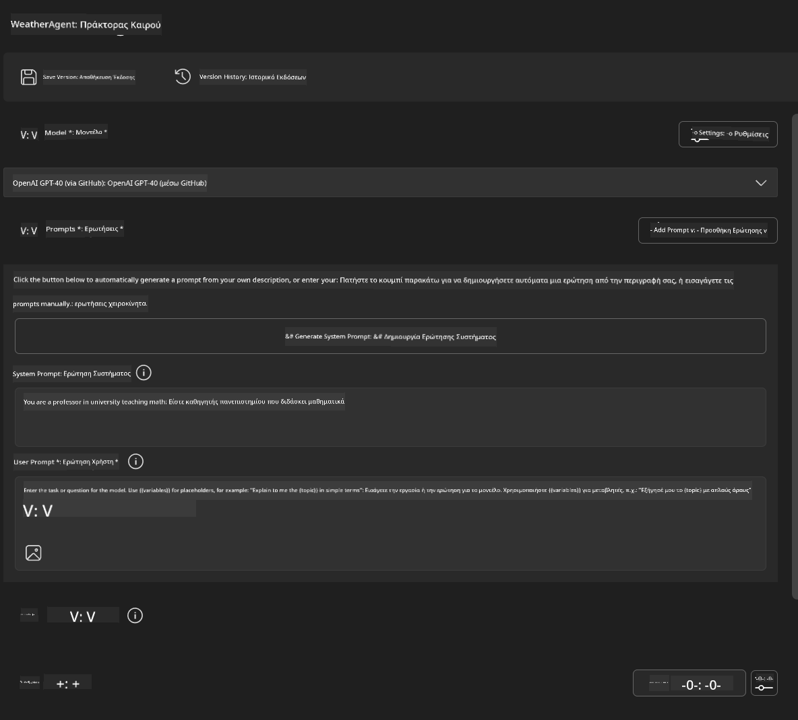
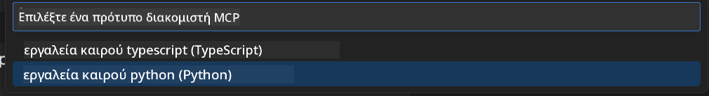
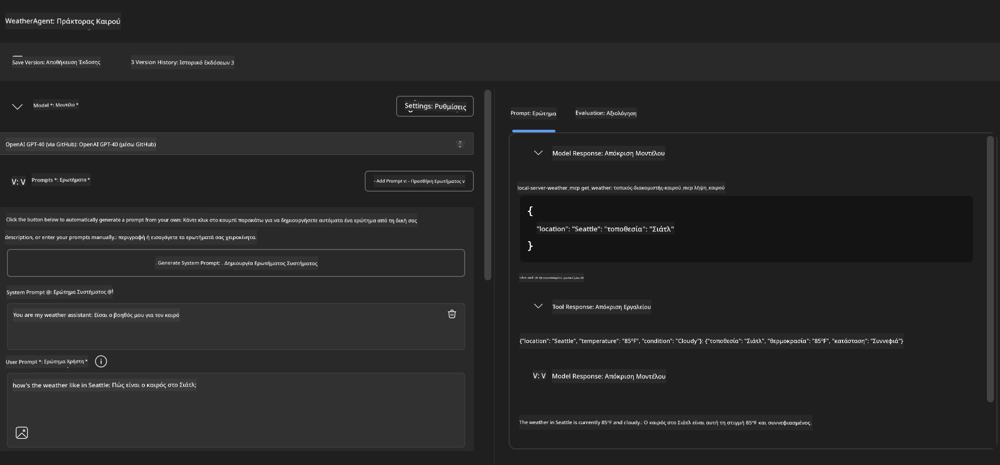
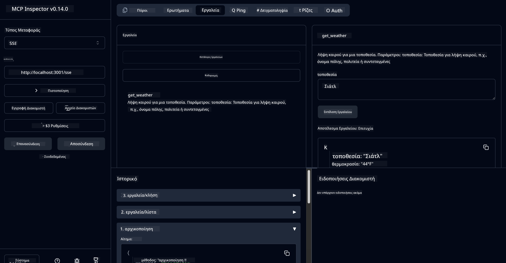

<!--
CO_OP_TRANSLATOR_METADATA:
{
  "original_hash": "dd8da3f75addcef453fe11f02a270217",
  "translation_date": "2025-06-10T06:11:46+00:00",
  "source_file": "10-StreamliningAIWorkflowsBuildingAnMCPServerWithAIToolkit/lab3/README.md",
  "language_code": "el"
}
-->
# 🔧 Module 3: Προχωρημένη Ανάπτυξη MCP με το AI Toolkit


## 🎯 Στόχοι Μάθησης

Στο τέλος αυτού του εργαστηρίου, θα μπορείτε να:

- ✅ Δημιουργείτε προσαρμοσμένους MCP servers χρησιμοποιώντας το AI Toolkit
- ✅ Διαμορφώνετε και χρησιμοποιείτε το πιο πρόσφατο MCP Python SDK (v1.9.3)
- ✅ Ρυθμίζετε και αξιοποιείτε το MCP Inspector για debugging
- ✅ Κάνετε debugging σε MCP servers τόσο στο Agent Builder όσο και στο Inspector
- ✅ Κατανοείτε προχωρημένες ροές εργασίας ανάπτυξης MCP servers

## 📋 Προαπαιτούμενα

- Ολοκλήρωση του Lab 2 (Βασικά του MCP)
- VS Code με εγκατεστημένη την επέκταση AI Toolkit
- Περιβάλλον Python 3.10+
- Node.js και npm για τη ρύθμιση του Inspector

## 🏗️ Τι θα Δημιουργήσετε

Σε αυτό το εργαστήριο, θα φτιάξετε έναν **Weather MCP Server** που παρουσιάζει:
- Προσαρμοσμένη υλοποίηση MCP server
- Ενσωμάτωση με το AI Toolkit Agent Builder
- Επαγγελματικές ροές debugging
- Σύγχρονες πρακτικές χρήσης MCP SDK

---

## 🔧 Επισκόπηση Κύριων Συστατικών

### 🐍 MCP Python SDK  
Το Model Context Protocol Python SDK παρέχει τη βάση για τη δημιουργία προσαρμοσμένων MCP servers. Θα χρησιμοποιήσετε την έκδοση 1.9.3 με βελτιωμένες δυνατότητες debugging.

### 🔍 MCP Inspector  
Ισχυρό εργαλείο debugging που προσφέρει:  
- Παρακολούθηση server σε πραγματικό χρόνο  
- Οπτικοποίηση εκτέλεσης εργαλείων  
- Έλεγχο δικτυακών αιτημάτων/απαντήσεων  
- Διαδραστικό περιβάλλον δοκιμών

---

## 📖 Βήμα-βήμα Υλοποίηση

### Βήμα 1: Δημιουργία WeatherAgent στο Agent Builder

1. **Ξεκινήστε το Agent Builder** στο VS Code μέσω της επέκτασης AI Toolkit  
2. **Δημιουργήστε νέο agent** με την παρακάτω διαμόρφωση:  
   - Όνομα Agent: `WeatherAgent`



### Βήμα 2: Αρχικοποίηση Έργου MCP Server

1. **Μεταβείτε στα Tools** → **Add Tool** στο Agent Builder  
2. **Επιλέξτε "MCP Server"** από τις διαθέσιμες επιλογές  
3. **Επιλέξτε "Create A new MCP Server"**  
4. **Επιλέξτε το πρότυπο `python-weather`**  
5. **Ονομάστε τον server σας:** `weather_mcp`



### Βήμα 3: Άνοιγμα και Επισκόπηση του Έργου

1. **Ανοίξτε το δημιουργημένο έργο** στο VS Code  
2. **Εξετάστε τη δομή του έργου:**  
   ```
   weather_mcp/
   ├── src/
   │   ├── __init__.py
   │   └── server.py
   ├── inspector/
   │   ├── package.json
   │   └── package-lock.json
   ├── .vscode/
   │   ├── launch.json
   │   └── tasks.json
   ├── pyproject.toml
   └── README.md
   ```

### Βήμα 4: Αναβάθμιση στην Τελευταία Έκδοση MCP SDK

> **🔍 Γιατί Αναβάθμιση;** Θέλουμε να χρησιμοποιήσουμε το πιο πρόσφατο MCP SDK (v1.9.3) και την υπηρεσία Inspector (0.14.0) για βελτιωμένες δυνατότητες και καλύτερο debugging.

#### 4α. Ενημέρωση Εξαρτήσεων Python

**Επεξεργαστείτε τα αρχεία `pyproject.toml`:** update [./code/weather_mcp/pyproject.toml](../../../../10-StreamliningAIWorkflowsBuildingAnMCPServerWithAIToolkit/lab3/code/weather_mcp/pyproject.toml)


#### 4b. Update Inspector Configuration

**Edit `inspector/package.json`:** update [./code/weather_mcp/inspector/package.json](../../../../10-StreamliningAIWorkflowsBuildingAnMCPServerWithAIToolkit/lab3/code/weather_mcp/inspector/package.json)

#### 4c. Update Inspector Dependencies

**Edit `inspector/package-lock.json`:** update [./code/weather_mcp/inspector/package-lock.json](../../../../10-StreamliningAIWorkflowsBuildingAnMCPServerWithAIToolkit/lab3/code/weather_mcp/inspector/package-lock.json)

> **📝 Note:** This file contains extensive dependency definitions. Below is the essential structure - the full content ensures proper dependency resolution.


> **⚡ Full Package Lock:** The complete package-lock.json contains ~3000 lines of dependency definitions. The above shows the key structure - use the provided file for complete dependency resolution.

### Step 5: Configure VS Code Debugging

*Note: Please copy the file in the specified path to replace the corresponding local file*

#### 5a. Update Launch Configuration

**Edit `.vscode/launch.json`:**

```json
{
  "version": "0.2.0",
  "configurations": [
    {
      "name": "Attach to Local MCP",
      "type": "debugpy",
      "request": "attach",
      "connect": {
        "host": "localhost",
        "port": 5678
      },
      "presentation": {
        "hidden": true
      },
      "internalConsoleOptions": "neverOpen",
      "postDebugTask": "Terminate All Tasks"
    },
    {
      "name": "Launch Inspector (Edge)",
      "type": "msedge",
      "request": "launch",
      "url": "http://localhost:6274?timeout=60000&serverUrl=http://localhost:3001/sse#tools",
      "cascadeTerminateToConfigurations": [
        "Attach to Local MCP"
      ],
      "presentation": {
        "hidden": true
      },
      "internalConsoleOptions": "neverOpen"
    },
    {
      "name": "Launch Inspector (Chrome)",
      "type": "chrome",
      "request": "launch",
      "url": "http://localhost:6274?timeout=60000&serverUrl=http://localhost:3001/sse#tools",
      "cascadeTerminateToConfigurations": [
        "Attach to Local MCP"
      ],
      "presentation": {
        "hidden": true
      },
      "internalConsoleOptions": "neverOpen"
    }
  ],
  "compounds": [
    {
      "name": "Debug in Agent Builder",
      "configurations": [
        "Attach to Local MCP"
      ],
      "preLaunchTask": "Open Agent Builder",
    },
    {
      "name": "Debug in Inspector (Edge)",
      "configurations": [
        "Launch Inspector (Edge)",
        "Attach to Local MCP"
      ],
      "preLaunchTask": "Start MCP Inspector",
      "stopAll": true
    },
    {
      "name": "Debug in Inspector (Chrome)",
      "configurations": [
        "Launch Inspector (Chrome)",
        "Attach to Local MCP"
      ],
      "preLaunchTask": "Start MCP Inspector",
      "stopAll": true
    }
  ]
}
```

**Επεξεργαστείτε το `.vscode/tasks.json`:**

```
{
  "version": "2.0.0",
  "tasks": [
    {
      "label": "Start MCP Server",
      "type": "shell",
      "command": "python -m debugpy --listen 127.0.0.1:5678 src/__init__.py sse",
      "isBackground": true,
      "options": {
        "cwd": "${workspaceFolder}",
        "env": {
          "PORT": "3001"
        }
      },
      "problemMatcher": {
        "pattern": [
          {
            "regexp": "^.*$",
            "file": 0,
            "location": 1,
            "message": 2
          }
        ],
        "background": {
          "activeOnStart": true,
          "beginsPattern": ".*",
          "endsPattern": "Application startup complete|running"
        }
      }
    },
    {
      "label": "Start MCP Inspector",
      "type": "shell",
      "command": "npm run dev:inspector",
      "isBackground": true,
      "options": {
        "cwd": "${workspaceFolder}/inspector",
        "env": {
          "CLIENT_PORT": "6274",
          "SERVER_PORT": "6277",
        }
      },
      "problemMatcher": {
        "pattern": [
          {
            "regexp": "^.*$",
            "file": 0,
            "location": 1,
            "message": 2
          }
        ],
        "background": {
          "activeOnStart": true,
          "beginsPattern": "Starting MCP inspector",
          "endsPattern": "Proxy server listening on port"
        }
      },
      "dependsOn": [
        "Start MCP Server"
      ]
    },
    {
      "label": "Open Agent Builder",
      "type": "shell",
      "command": "echo ${input:openAgentBuilder}",
      "presentation": {
        "reveal": "never"
      },
      "dependsOn": [
        "Start MCP Server"
      ],
    },
    {
      "label": "Terminate All Tasks",
      "command": "echo ${input:terminate}",
      "type": "shell",
      "problemMatcher": []
    }
  ],
  "inputs": [
    {
      "id": "openAgentBuilder",
      "type": "command",
      "command": "ai-mlstudio.agentBuilder",
      "args": {
        "initialMCPs": [ "local-server-weather_mcp" ],
        "triggeredFrom": "vsc-tasks"
      }
    },
    {
      "id": "terminate",
      "type": "command",
      "command": "workbench.action.tasks.terminate",
      "args": "terminateAll"
    }
  ]
}
```

---

## 🚀 Εκτέλεση και Δοκιμή του MCP Server

### Βήμα 6: Εγκατάσταση Εξαρτήσεων

Μετά τις αλλαγές στη διαμόρφωση, εκτελέστε τις παρακάτω εντολές:

**Εγκατάσταση εξαρτήσεων Python:**  
```bash
uv sync
```

**Εγκατάσταση εξαρτήσεων Inspector:**  
```bash
cd inspector
npm install
```

### Βήμα 7: Debugging με Agent Builder

1. **Πατήστε F5** ή χρησιμοποιήστε τη ρύθμιση **"Debug in Agent Builder"**  
2. **Επιλέξτε τη σύνθετη ρύθμιση** από τον πίνακα debugging  
3. **Περιμένετε να ξεκινήσει ο server** και να ανοίξει το Agent Builder  
4. **Δοκιμάστε τον weather MCP server** με ερωτήματα σε φυσική γλώσσα

Δώστε prompt όπως το παρακάτω

SYSTEM_PROMPT

```
You are my weather assistant
```

USER_PROMPT

```
How's the weather like in Seattle
```



### Βήμα 8: Debugging με MCP Inspector

1. **Χρησιμοποιήστε τη ρύθμιση "Debug in Inspector"** (Edge ή Chrome)  
2. **Ανοίξτε το περιβάλλον Inspector** στη διεύθυνση `http://localhost:6274`  
3. **Εξερευνήστε το διαδραστικό περιβάλλον δοκιμών:**  
   - Δείτε διαθέσιμα εργαλεία  
   - Δοκιμάστε την εκτέλεση εργαλείων  
   - Παρακολουθήστε δικτυακά αιτήματα  
   - Κάντε debugging απαντήσεων του server



---

## 🎯 Κύρια Αποτελέσματα Μάθησης

Ολοκληρώνοντας αυτό το εργαστήριο, έχετε:

- [x] **Δημιουργήσει προσαρμοσμένο MCP server** χρησιμοποιώντας πρότυπα AI Toolkit  
- [x] **Αναβαθμίσει στο πιο πρόσφατο MCP SDK** (v1.9.3) για βελτιωμένη λειτουργικότητα  
- [x] **Διαμορφώσει επαγγελματικές ροές debugging** για Agent Builder και Inspector  
- [x] **Ρυθμίσει το MCP Inspector** για διαδραστικό testing του server  
- [x] **Κατακτήσει τις ρυθμίσεις debugging στο VS Code** για ανάπτυξη MCP

## 🔧 Προχωρημένα Χαρακτηριστικά που Εξερευνήθηκαν

| Χαρακτηριστικό | Περιγραφή | Περίπτωση Χρήσης |
|---------|-------------|----------|
| **MCP Python SDK v1.9.3** | Πιο πρόσφατη υλοποίηση πρωτοκόλλου | Σύγχρονη ανάπτυξη server |
| **MCP Inspector 0.14.0** | Διαδραστικό εργαλείο debugging | Δοκιμές server σε πραγματικό χρόνο |
| **VS Code Debugging** | Ενσωματωμένο περιβάλλον ανάπτυξης | Επαγγελματική ροή debugging |
| **Agent Builder Integration** | Άμεση σύνδεση με AI Toolkit | Ολοκληρωμένες δοκιμές agent |

## 📚 Πρόσθετοι Πόροι

- [MCP Python SDK Documentation](https://modelcontextprotocol.io/docs/sdk/python)  
- [AI Toolkit Extension Guide](https://code.visualstudio.com/docs/ai/ai-toolkit)  
- [VS Code Debugging Documentation](https://code.visualstudio.com/docs/editor/debugging)  
- [Model Context Protocol Specification](https://modelcontextprotocol.io/docs/concepts/architecture)

---

**🎉 Συγχαρητήρια!** Ολοκληρώσατε με επιτυχία το Lab 3 και τώρα μπορείτε να δημιουργείτε, να κάνετε debugging και να αναπτύσσετε προσαρμοσμένους MCP servers με επαγγελματικές ροές εργασίας ανάπτυξης.

### 🔜 Συνεχίστε στο Επόμενο Module

Έτοιμοι να εφαρμόσετε τις δεξιότητές σας MCP σε πραγματικές ροές ανάπτυξης; Συνεχίστε στο **[Module 4: Practical MCP Development - Custom GitHub Clone Server](../lab4/README.md)** όπου θα:  
- Δημιουργήσετε έναν παραγωγικό MCP server που αυτοματοποιεί λειτουργίες GitHub αποθετηρίου  
- Υλοποιήσετε λειτουργία κλωνοποίησης GitHub μέσω MCP  
- Ενσωματώσετε προσαρμοσμένους MCP servers με VS Code και GitHub Copilot Agent Mode  
- Δοκιμάσετε και αναπτύξετε MCP servers σε παραγωγικά περιβάλλοντα  
- Μάθετε πρακτική αυτοματοποίηση ροών εργασίας για προγραμματιστές

**Αποποίηση ευθυνών**:  
Αυτό το έγγραφο έχει μεταφραστεί χρησιμοποιώντας την υπηρεσία αυτόματης μετάφρασης AI [Co-op Translator](https://github.com/Azure/co-op-translator). Παρόλο που προσπαθούμε για ακρίβεια, παρακαλούμε να γνωρίζετε ότι οι αυτοματοποιημένες μεταφράσεις ενδέχεται να περιέχουν λάθη ή ανακρίβειες. Το πρωτότυπο έγγραφο στη γλώσσα του πρέπει να θεωρείται η αυθεντική πηγή. Για κρίσιμες πληροφορίες, συνιστάται επαγγελματική ανθρώπινη μετάφραση. Δεν φέρουμε καμία ευθύνη για τυχόν παρεξηγήσεις ή λανθασμένες ερμηνείες που προκύπτουν από τη χρήση αυτής της μετάφρασης.