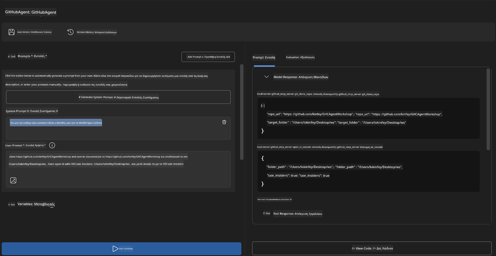
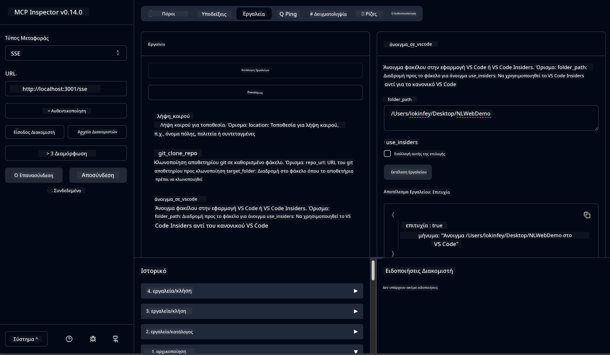

<!--
CO_OP_TRANSLATOR_METADATA:
{
  "original_hash": "f83bc722dc758efffd68667d6a1db470",
  "translation_date": "2025-06-10T06:49:54+00:00",
  "source_file": "10-StreamliningAIWorkflowsBuildingAnMCPServerWithAIToolkit/lab4/README.md",
  "language_code": "el"
}
-->
# 🐙 Module 4: Πρακτική Ανάπτυξη MCP - Προσαρμοσμένος GitHub Clone Server


> **⚡ Γρήγορη Εκκίνηση:** Δημιουργήστε έναν MCP server έτοιμο για παραγωγή που αυτοματοποιεί το cloning αποθετηρίων GitHub και την ενσωμάτωση με VS Code σε μόλις 30 λεπτά!

## 🎯 Στόχοι Μάθησης

Στο τέλος αυτού του εργαστηρίου, θα μπορείτε να:

- ✅ Δημιουργείτε προσαρμοσμένους MCP servers για πραγματικά αναπτυξιακά workflows  
- ✅ Υλοποιείτε λειτουργία cloning αποθετηρίων GitHub μέσω MCP  
- ✅ Ενσωματώνετε προσαρμοσμένους MCP servers με VS Code και Agent Builder  
- ✅ Χρησιμοποιείτε το GitHub Copilot Agent Mode με εργαλεία MCP  
- ✅ Δοκιμάζετε και αναπτύσσετε προσαρμοσμένους MCP servers σε παραγωγικά περιβάλλοντα  

## 📋 Προαπαιτούμενα

- Ολοκλήρωση των εργαστηρίων 1-3 (θεμελιώδη MCP και προχωρημένη ανάπτυξη)  
- Συνδρομή GitHub Copilot ([δωρεάν εγγραφή διαθέσιμη](https://github.com/github-copilot/signup))  
- VS Code με AI Toolkit και επεκτάσεις GitHub Copilot  
- Εγκατεστημένο και ρυθμισμένο Git CLI  

## 🏗️ Επισκόπηση Έργου

### **Πραγματική Ανάπτυξη - Πρόκληση**  
Ως προγραμματιστές, συχνά χρησιμοποιούμε το GitHub για να κλωνοποιήσουμε αποθετήρια και να τα ανοίξουμε στο VS Code ή VS Code Insiders. Αυτή η χειροκίνητη διαδικασία περιλαμβάνει:  
1. Άνοιγμα τερματικού/γραμμής εντολών  
2. Πλοήγηση στον επιθυμητό φάκελο  
3. Εκτέλεση της εντολής `git clone`  
4. Άνοιγμα του VS Code στον κλωνοποιημένο φάκελο  

**Η λύση MCP που προσφέρουμε απλοποιεί όλα αυτά σε μία έξυπνη εντολή!**

### **Τι θα Δημιουργήσετε**  
Έναν **GitHub Clone MCP Server** (`git_mcp_server`) που προσφέρει:

| Χαρακτηριστικό | Περιγραφή | Όφελος |
|---------|-------------|---------|
| 🔄 **Έξυπνο Cloning Αποθετηρίων** | Κλωνοποίηση αποθετηρίων GitHub με έλεγχο εγκυρότητας | Αυτόματος έλεγχος σφαλμάτων |
| 📁 **Έξυπνη Διαχείριση Φακέλων** | Έλεγχος και ασφαλής δημιουργία φακέλων | Αποφυγή υπεργραφής |
| 🚀 **Διαλειτουργική Ενσωμάτωση VS Code** | Άνοιγμα έργων σε VS Code/Insiders | Ομαλή μετάβαση στο workflow |
| 🛡️ **Αξιόπιστη Διαχείριση Σφαλμάτων** | Αντιμετώπιση δικτυακών, δικαιωμάτων και θεμάτων διαδρομής | Ετοιμότητα για παραγωγή |

---

## 📖 Βήμα-βήμα Υλοποίηση

### Βήμα 1: Δημιουργία GitHub Agent στον Agent Builder

1. **Εκκινήστε τον Agent Builder** μέσω της επέκτασης AI Toolkit  
2. **Δημιουργήστε νέο agent** με την παρακάτω διαμόρφωση:  
   ```
   Agent Name: GitHubAgent
   ```

3. **Αρχικοποιήστε τον προσαρμοσμένο MCP server:**  
   - Πλοηγηθείτε σε **Tools** → **Add Tool** → **MCP Server**  
   - Επιλέξτε **"Create A new MCP Server"**  
   - Επιλέξτε **Python template** για μέγιστη ευελιξία  
   - **Όνομα Server:** `git_mcp_server`  

### Βήμα 2: Ρύθμιση GitHub Copilot Agent Mode

1. **Ανοίξτε το GitHub Copilot** στο VS Code (Ctrl/Cmd + Shift + P → "GitHub Copilot: Open")  
2. **Επιλέξτε Agent Model** στο περιβάλλον του Copilot  
3. **Επιλέξτε το μοντέλο Claude 3.7** για βελτιωμένη ικανότητα λογικής  
4. **Ενεργοποιήστε την ενσωμάτωση MCP** για πρόσβαση σε εργαλεία  

> **💡 Συμβουλή:** Το Claude 3.7 προσφέρει ανώτερη κατανόηση αναπτυξιακών ροών εργασίας και προτύπων διαχείρισης σφαλμάτων.

### Βήμα 3: Υλοποίηση βασικής λειτουργικότητας MCP Server

**Χρησιμοποιήστε την παρακάτω αναλυτική εντολή με το GitHub Copilot Agent Mode:**  

```
Create two MCP tools with the following comprehensive requirements:

🔧 TOOL A: clone_repository
Requirements:
- Clone any GitHub repository to a specified local folder
- Return the absolute path of the successfully cloned project
- Implement comprehensive validation:
  ✓ Check if target directory already exists (return error if exists)
  ✓ Validate GitHub URL format (https://github.com/user/repo)
  ✓ Verify git command availability (prompt installation if missing)
  ✓ Handle network connectivity issues
  ✓ Provide clear error messages for all failure scenarios

🚀 TOOL B: open_in_vscode
Requirements:
- Open specified folder in VS Code or VS Code Insiders
- Cross-platform compatibility (Windows/Linux/macOS)
- Use direct application launch (not terminal commands)
- Auto-detect available VS Code installations
- Handle cases where VS Code is not installed
- Provide user-friendly error messages

Additional Requirements:
- Follow MCP 1.9.3 best practices
- Include proper type hints and documentation
- Implement logging for debugging purposes
- Add input validation for all parameters
- Include comprehensive error handling
```

### Βήμα 4: Δοκιμή του MCP Server σας

#### 4α. Δοκιμή στον Agent Builder

1. **Εκκινήστε τη ρύθμιση αποσφαλμάτωσης** για τον Agent Builder  
2. **Διαμορφώστε τον agent με αυτό το system prompt:**  

```
SYSTEM_PROMPT:
You are my intelligent coding repository assistant. You help developers efficiently clone GitHub repositories and set up their development environment. Always provide clear feedback about operations and handle errors gracefully.
```

3. **Δοκιμάστε με ρεαλιστικά σενάρια χρήστη:**  

```
USER_PROMPT EXAMPLES:

Scenario : Basic Clone and Open
"Clone {Your GitHub Repo link such as https://github.com/kinfey/GHCAgentWorkshop
 } and save to {The global path you specify}, then open it with VS Code Insiders"
```



**Αναμενόμενα Αποτελέσματα:**  
- ✅ Επιτυχής κλωνοποίηση με επιβεβαίωση διαδρομής  
- ✅ Αυτόματη εκκίνηση VS Code  
- ✅ Καθαρά μηνύματα σφάλματος για μη έγκυρα σενάρια  
- ✅ Σωστή διαχείριση ακραίων περιπτώσεων  

#### 4β. Δοκιμή με MCP Inspector



---

**🎉 Συγχαρητήρια!** Δημιουργήσατε με επιτυχία έναν πρακτικό, έτοιμο για παραγωγή MCP server που επιλύει πραγματικές προκλήσεις ανάπτυξης. Ο προσαρμοσμένος GitHub clone server σας δείχνει τη δύναμη του MCP για αυτοματοποίηση και βελτίωση της παραγωγικότητας των προγραμματιστών.

### 🏆 Επίτευγμα Ξεκλειδώθηκε:
- ✅ **MCP Developer** - Δημιουργία προσαρμοσμένου MCP server  
- ✅ **Workflow Automator** - Απλοποίηση αναπτυξιακών διαδικασιών  
- ✅ **Integration Expert** - Σύνδεση πολλαπλών εργαλείων ανάπτυξης  
- ✅ **Production Ready** - Κατασκευή λύσεων έτοιμων για παραγωγή  

---

## 🎓 Ολοκλήρωση Εργαστηρίου: Το Ταξίδι σας με το Model Context Protocol

**Αγαπητέ Συμμετέχοντα,**

Συγχαρητήρια για την ολοκλήρωση και των τεσσάρων modules του εργαστηρίου Model Context Protocol! Έχετε διανύσει μεγάλη απόσταση, από την κατανόηση βασικών εννοιών AI Toolkit μέχρι τη δημιουργία MCP servers έτοιμων για παραγωγή που λύνουν πραγματικές προκλήσεις ανάπτυξης.

### 🚀 Ανακεφαλαίωση Μαθησιακού Μονοπατιού:

**[Module 1](../lab1/README.md)**: Ξεκινήσατε με τα θεμέλια του AI Toolkit, δοκιμές μοντέλων και τη δημιουργία του πρώτου σας AI agent.

**[Module 2](../lab2/README.md)**: Μάθατε την αρχιτεκτονική MCP, ενσωματώσατε το Playwright MCP και δημιουργήσατε τον πρώτο σας browser automation agent.

**[Module 3](../lab3/README.md)**: Προχωρήσατε στην ανάπτυξη προσαρμοσμένων MCP servers με τον Weather MCP server και μάθατε εργαλεία αποσφαλμάτωσης.

**[Module 4](../lab4/README.md)**: Εφαρμόσατε όσα μάθατε για να δημιουργήσετε ένα πρακτικό εργαλείο αυτοματοποίησης ροής εργασίας GitHub repository.

### 🌟 Τι Έχετε Κατακτήσει:

- ✅ **AI Toolkit Ecosystem**: Μοντέλα, agents και πρότυπα ενσωμάτωσης  
- ✅ **MCP Architecture**: Σχεδίαση client-server, πρωτόκολλα μεταφοράς, ασφάλεια  
- ✅ **Developer Tools**: Από το Playground μέχρι τον Inspector και την παραγωγική ανάπτυξη  
- ✅ **Custom Development**: Δημιουργία, δοκιμή και ανάπτυξη δικών σας MCP servers  
- ✅ **Πρακτικές Εφαρμογές**: Επίλυση πραγματικών προκλήσεων ροών εργασίας με AI  

### 🔮 Επόμενα Βήματα:

1. **Δημιουργήστε τον δικό σας MCP Server**: Εφαρμόστε αυτές τις δεξιότητες για να αυτοματοποιήσετε τις δικές σας ροές εργασίας  
2. **Ενταχθείτε στην Κοινότητα MCP**: Μοιραστείτε τις δημιουργίες σας και μάθετε από άλλους  
3. **Εξερευνήστε Προχωρημένη Ενσωμάτωση**: Συνδέστε MCP servers με συστήματα επιχειρήσεων  
4. **Συμβάλετε σε Open Source**: Βοηθήστε στη βελτίωση εργαλείων και τεκμηρίωσης MCP  

Να θυμάστε, αυτό το εργαστήριο είναι μόνο η αρχή. Το οικοσύστημα Model Context Protocol εξελίσσεται γρήγορα και τώρα είστε έτοιμοι να πρωτοστατήσετε στα εργαλεία ανάπτυξης με AI.

**Σας ευχαριστούμε για τη συμμετοχή και την αφοσίωσή σας στη μάθηση!**

Ελπίζουμε αυτό το εργαστήριο να σας ενέπνευσε ιδέες που θα μεταμορφώσουν τον τρόπο που δημιουργείτε και αλληλεπιδράτε με εργαλεία AI στην αναπτυξιακή σας πορεία.

**Καλή κωδικοποίηση!**

---

**Αποποίηση ευθυνών**:  
Αυτό το έγγραφο έχει μεταφραστεί χρησιμοποιώντας την υπηρεσία αυτόματης μετάφρασης AI [Co-op Translator](https://github.com/Azure/co-op-translator). Παρόλο που προσπαθούμε για ακρίβεια, παρακαλούμε να έχετε υπόψη ότι οι αυτοματοποιημένες μεταφράσεις μπορεί να περιέχουν λάθη ή ανακρίβειες. Το πρωτότυπο έγγραφο στη μητρική του γλώσσα πρέπει να θεωρείται η αυθεντική πηγή. Για κρίσιμες πληροφορίες, συνιστάται επαγγελματική ανθρώπινη μετάφραση. Δεν φέρουμε ευθύνη για τυχόν παρεξηγήσεις ή λανθασμένες ερμηνείες που προκύπτουν από τη χρήση αυτής της μετάφρασης.