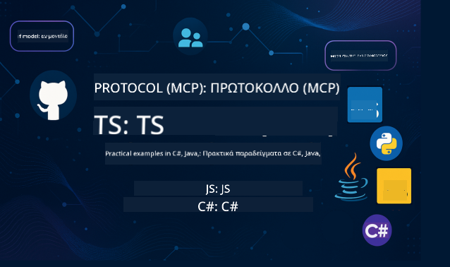

<!--
CO_OP_TRANSLATOR_METADATA:
{
  "original_hash": "866c8877136cb03e1efb9ad633a2f0a6",
  "translation_date": "2025-08-26T17:44:34+00:00",
  "source_file": "README.md",
  "language_code": "el"
}
-->
 

Ακολουθήστε αυτά τα βήματα για να ξεκινήσετε να χρησιμοποιείτε αυτούς τους πόρους:
1. **Κάντε Fork το Αποθετήριο**: Πατήστε 
2. **Κλωνοποιήστε το Αποθετήριο**:   `git clone https://github.com/microsoft/mcp-for-beginners.git`
3. [**Γίνετε μέλος στο Azure AI Foundry Discord και γνωρίστε ειδικούς και άλλους προγραμματιστές**](https://discord.com/invite/ByRwuEEgH4)

### 🌐 Υποστήριξη Πολλαπλών Γλωσσών

#### Υποστηρίζεται μέσω GitHub Action (Αυτοματοποιημένο & Πάντα Ενημερωμένο)

 [Arabic](../ar/README.md) | [Bengali](../bn/README.md) | [Bulgarian](../bg/README.md) | [Burmese (Myanmar)](../my/README.md) | [Chinese (Simplified)](../zh/README.md) | [Chinese (Traditional, Hong Kong)](../hk/README.md) | [Chinese (Traditional, Macau)](../mo/README.md) | [Chinese (Traditional, Taiwan)](../tw/README.md) | [Croatian](../hr/README.md) | [Czech](../cs/README.md) | [Danish](../da/README.md) | [Dutch](../nl/README.md) | [Finnish](../fi/README.md) | [French](../fr/README.md) | [German](../de/README.md) | [Greek](./README.md) | [Hebrew](../he/README.md) | [Hindi](../hi/README.md) | [Hungarian](../hu/README.md) | [Indonesian](../id/README.md) | [Italian](../it/README.md) | [Japanese](../ja/README.md) | [Korean](../ko/README.md) | [Malay](../ms/README.md) | [Marathi](../mr/README.md) | [Nepali](../ne/README.md) | [Norwegian](../no/README.md) | [Persian (Farsi)](../fa/README.md) | [Polish](../pl/README.md) | [Portuguese (Brazil)](../br/README.md) | [Portuguese (Portugal)](../pt/README.md) | [Punjabi (Gurmukhi)](../pa/README.md) | [Romanian](../ro/README.md) | [Russian](../ru/README.md) | [Serbian (Cyrillic)](../sr/README.md) | [Slovak](../sk/README.md) | [Slovenian](../sl/README.md) | [Spanish](../es/README.md) | [Swahili](../sw/README.md) | [Swedish](../sv/README.md) | [Tagalog (Filipino)](../tl/README.md) | [Thai](../th/README.md) | [Turkish](../tr/README.md) | [Ukrainian](../uk/README.md) | [Urdu](../ur/README.md) | [Vietnamese](../vi/README.md)

# 🚀 Εκπαιδευτικό Υλικό για το Model Context Protocol (MCP) για Αρχάριους

## **Μάθετε MCP με Πρακτικά Παραδείγματα Κώδικα σε C#, Java, JavaScript, Rust, Python και TypeScript**

## 🧠 Επισκόπηση του Εκπαιδευτικού Υλικού για το Model Context Protocol

Το **Model Context Protocol (MCP)** είναι ένα πρωτοποριακό πλαίσιο που έχει σχεδιαστεί για να τυποποιεί τις αλληλεπιδράσεις μεταξύ μοντέλων AI και εφαρμογών πελατών. Αυτό το ανοιχτού κώδικα εκπαιδευτικό υλικό προσφέρει μια δομημένη μαθησιακή διαδρομή, με πρακτικά παραδείγματα κώδικα και πραγματικές περιπτώσεις χρήσης, σε δημοφιλείς γλώσσες προγραμματισμού όπως C#, Java, JavaScript, TypeScript και Python.

Είτε είστε προγραμματιστής AI, αρχιτέκτονας συστημάτων ή μηχανικός λογισμικού, αυτός ο οδηγός είναι ο ολοκληρωμένος σας πόρος για την κατανόηση των βασικών αρχών του MCP και των στρατηγικών υλοποίησής του.

## 🔗 Επίσημοι Πόροι MCP

- 📘 [Τεκμηρίωση MCP](https://modelcontextprotocol.io/) – Αναλυτικά μαθήματα και οδηγοί χρήσης  
- 📜 [Προδιαγραφές MCP](https://modelcontextprotocol.io/docs/) – Αρχιτεκτονική πρωτοκόλλου και τεχνικές αναφορές  
- 📜 [Αρχικές Προδιαγραφές MCP](https://spec.modelcontextprotocol.io/) – Παλαιότερες τεχνικές αναφορές (ενδέχεται να περιέχουν επιπλέον λεπτομέρειες)  
- 🧑‍💻 [Αποθετήριο MCP στο GitHub](https://github.com/modelcontextprotocol) – SDKs ανοιχτού κώδικα, εργαλεία και δείγματα κώδικα
- 🌐 [Κοινότητα MCP](https://github.com/orgs/modelcontextprotocol/discussions) – Συμμετάσχετε σε συζητήσεις και συμβάλετε στην κοινότητα

## 🧭 Επισκόπηση Εκπαιδευτικού Υλικού MCP

### 📚 Πλήρης Δομή Εκπαιδευτικού Υλικού

| Ενότητα | Θέμα | Περιγραφή | Σύνδεσμος |
|--------|-------|-------------|------|
| **Ενότητα 1-3: Βασικά** | | | |
| 00 | Εισαγωγή στο MCP | Επισκόπηση του Model Context Protocol και της σημασίας του στις ροές εργασίας AI | [Διαβάστε περισσότερα](./00-Introduction/README.md) |
| 01 | Επεξήγηση Βασικών Εννοιών | Αναλυτική εξερεύνηση των βασικών εννοιών του MCP | [Διαβάστε περισσότερα](./01-CoreConcepts/README.md) |
| 02 | Ασφάλεια στο MCP | Απειλές ασφαλείας και βέλτιστες πρακτικές | [Διαβάστε περισσότερα](./02-Security/README.md) |
| 03 | Ξεκινώντας με το MCP | Ρύθμιση περιβάλλοντος, βασικοί servers/clients, ενσωμάτωση | [Διαβάστε περισσότερα](./03-GettingStarted/README.md) |
| **Ενότητα 3: Δημιουργία του Πρώτου Server & Client** | | | |
| 3.1 | Πρώτος Server | Δημιουργήστε τον πρώτο σας MCP server | [Οδηγός](./03-GettingStarted/01-first-server/README.md) |
| 3.2 | Πρώτος Client | Αναπτύξτε έναν βασικό MCP client | [Οδηγός](./03-GettingStarted/02-client/README.md) |
| 3.3 | Client με LLM | Ενσωματώστε μεγάλα γλωσσικά μοντέλα | [Οδηγός](./03-GettingStarted/03-llm-client/README.md) |
| 3.4 | Ενσωμάτωση με VS Code | Χρησιμοποιήστε MCP servers στο VS Code | [Οδηγός](./03-GettingStarted/04-vscode/README.md) |
| 3.5 | stdio Server | Δημιουργήστε servers χρησιμοποιώντας stdio transport | [Οδηγός](./03-GettingStarted/05-stdio-server/README.md) |
| 3.6 | HTTP Streaming | Υλοποιήστε HTTP streaming στο MCP | [Οδηγός](./03-GettingStarted/06-http-streaming/README.md) |
| 3.7 | AI Toolkit | Χρησιμοποιήστε το AI Toolkit με το MCP | [Οδηγός](./03-GettingStarted/07-aitk/README.md) |
| 3.8 | Δοκιμές | Δοκιμάστε την υλοποίηση του MCP server σας | [Οδηγός](./03-GettingStarted/08-testing/README.md) |
| 3.9 | Ανάπτυξη | Αναπτύξτε MCP servers σε παραγωγή | [Οδηγός](./03-GettingStarted/09-deployment/README.md) |
| **Ενότητα 4-5: Πρακτική & Προχωρημένα** | | | |
| 04 | Πρακτική Υλοποίηση | SDKs, αποσφαλμάτωση, δοκιμές, επαναχρησιμοποιήσιμα πρότυπα προτροπών | [Διαβάστε περισσότερα](./04-PracticalImplementation/README.md) |
| 05 | Προχωρημένα Θέματα στο MCP | Πολυτροπικό AI, κλιμάκωση, χρήση σε επιχειρήσεις | [Διαβάστε περισσότερα](./05-AdvancedTopics/README.md) |
| 5.1 | Ενσωμάτωση με Azure | Ενσωμάτωση MCP με Azure | [Οδηγός](./05-AdvancedTopics/mcp-integration/README.md) |
| 5.2 | Πολυτροπικότητα | Εργασία με πολλαπλές τροπικότητες | [Οδηγός](./05-AdvancedTopics/mcp-multi-modality/README.md) |
| 5.3 | Επίδειξη OAuth2 | Υλοποίηση αυθεντικοποίησης OAuth2 | [Οδηγός](./05-AdvancedTopics/mcp-oauth2-demo/README.md) |
| 5.4 | Ρίζες Συμφραζομένων | Κατανόηση και υλοποίηση ριζών συμφραζομένων | [Οδηγός](./05-AdvancedTopics/mcp-root-contexts/README.md) |
| 5.5 | Δρομολόγηση | Στρατηγικές δρομολόγησης MCP | [Οδηγός](./05-AdvancedTopics/mcp-routing/README.md) |
| 5.6 | Δειγματοληψία | Τεχνικές δειγματοληψίας στο MCP | [Οδηγός](./05-AdvancedTopics/mcp-sampling/README.md) |
| 5.7 | Κλιμάκωση | Κλιμάκωση υλοποιήσεων MCP | [Οδηγός](./05-AdvancedTopics/mcp-scaling/README.md) |
| 5.8 | Ασφάλεια | Προχωρημένες σκέψεις για την ασφάλεια | [Οδηγός](./05-AdvancedTopics/mcp-security/README.md) |
| 5.9 | Αναζήτηση στον Ιστό | Υλοποίηση δυνατοτήτων αναζήτησης στον ιστό | [Οδηγός](./05-AdvancedTopics/web-search-mcp/README.md) |
| 5.10 | Ροές σε Πραγματικό Χρόνο | Δημιουργία λειτουργικότητας ροών σε πραγματικό χρόνο | [Οδηγός](./05-AdvancedTopics/mcp-realtimestreaming/README.md) |
| 5.11 | Αναζήτηση σε Πραγματικό Χρόνο | Υλοποίηση αναζήτησης σε πραγματικό χρόνο | [Οδηγός](./05-AdvancedTopics/mcp-realtimesearch/README.md) |
| 5.12 | Αυθεντικοποίηση Entra ID | Αυθεντικοποίηση με Microsoft Entra ID | [Οδηγός](./05-AdvancedTopics/mcp-security-entra/README.md) |
| 5.13 | Ενσωμάτωση Foundry | Ενσωμάτωση με Azure AI Foundry | [Οδηγός](./05-AdvancedTopics/mcp-foundry-agent-integration/README.md) |
| 5.14 | Μηχανική Συμφραζομένων | Τεχνικές για αποτελεσματική μηχανική συμφραζομένων | [Οδηγός](./05-AdvancedTopics/mcp-contextengineering/README.md) |
| **Ενότητα 6-10: Κοινότητα & Βέλτιστες Πρακτικές** | | | |
| 06 | Συνεισφορές Κοινότητας | Πώς να συνεισφέρετε στο οικοσύστημα MCP | [Οδηγός](./06-CommunityContributions/README.md) |
| 07 | Συμπεράσματα από Πρώιμη Υιοθέτηση | Ιστορίες πραγματικής υλοποίησης | [Οδηγός](./07-LessonsFromEarlyAdoption/README.md) |
| 08 | Βέλτιστες Πρακτικές για MCP | Απόδοση, ανοχή σε σφάλματα, ανθεκτικότητα | [Οδηγός](./08-BestPractices/README.md) |
| 09 | Μελέτες Περίπτωσης MCP | Παραδείγματα πρακτικής υλοποίησης | [Οδηγός](./09-CaseStudy/README.md) |
| 10 | Εργαστήριο Πρακτικής | Δημιουργία MCP Server με AI Toolkit | [Εργαστήριο](./10-StreamliningAIWorkflowsBuildingAnMCPServerWithAIToolkit/README.md) |

### 💻 Δείγματα Κώδικα

#### Βασικά Δείγματα Υπολογιστή MCP

| Γλώσσα | Περιγραφή | Σύνδεσμος |
|----------|-------------|------|
| C# | Παράδειγμα MCP Server | [Δείτε τον Κώδικα](./03-GettingStarted/samples/csharp/README.md) |
| Java | MCP Υπολογιστής | [Δείτε τον Κώδικα](./03-GettingStarted/samples/java/calculator/README.md) |
| JavaScript | Επίδειξη MCP | [Δείτε τον Κώδικα](./03-GettingStarted/samples/javascript/README.md) |
| Python | MCP Server | [Δείτε τον Κώδικα](../../03-GettingStarted/samples/python/mcp_calculator_server.py) |
| TypeScript | Παράδειγμα MCP | [Δείτε τον Κώδικα](./03-GettingStarted/samples/typescript/README.md) |
| Rust | Παράδειγμα MCP | [Δείτε τον Κώδικα](./03-GettingStarted/samples/rust/README.md) |

#### Προχωρημένες Υλοποιήσεις MCP

| Γλώσσα | Περιγραφή | Σύνδεσμος |
|----------|-------------|------|
| C# | Προχωρημένο Παράδειγμα | [View Code](./04-PracticalImplementation/samples/csharp/README.md) |
| Java με Spring | Παράδειγμα Εφαρμογής Container | [View Code](./04-PracticalImplementation/samples/java/containerapp/README.md) |
| JavaScript | Προχωρημένο Παράδειγμα | [View Code](./04-PracticalImplementation/samples/javascript/README.md) |
| Python | Σύνθετη Υλοποίηση | [View Code](../../04-PracticalImplementation/samples/python/READMEmd) |
| TypeScript | Παράδειγμα Container | [View Code](./04-PracticalImplementation/samples/typescript/README.md) |

## 🎯 Προαπαιτούμενα για την Εκμάθηση MCP

Για να αξιοποιήσετε στο έπακρο αυτό το πρόγραμμα σπουδών, θα πρέπει να έχετε:

- Βασικές γνώσεις προγραμματισμού σε τουλάχιστον μία από τις ακόλουθες γλώσσες: C#, Java, JavaScript, Python ή TypeScript
- Κατανόηση του μοντέλου πελάτη-διακομιστή και των APIs
- Εξοικείωση με τις έννοιες REST και HTTP
- (Προαιρετικά) Γνώσεις σε έννοιες AI/ML

- Συμμετοχή στις συζητήσεις της κοινότητάς μας για υποστήριξη

## 📚 Οδηγός Μελέτης & Πόροι

Αυτό το αποθετήριο περιλαμβάνει διάφορους πόρους για να σας βοηθήσει να πλοηγηθείτε και να μάθετε αποτελεσματικά:

### Οδηγός Μελέτης

Ένας ολοκληρωμένος [Οδηγός Μελέτης](./study_guide.md) είναι διαθέσιμος για να σας βοηθήσει να πλοηγηθείτε αποτελεσματικά σε αυτό το αποθετήριο. Ο οδηγός περιλαμβάνει:

- Ένα οπτικό χάρτη προγράμματος σπουδών που δείχνει όλα τα θέματα που καλύπτονται
- Λεπτομερή ανάλυση κάθε ενότητας του αποθετηρίου
- Οδηγίες για τη χρήση των παραδειγμάτων έργων
- Προτεινόμενες διαδρομές μάθησης για διαφορετικά επίπεδα δεξιοτήτων
- Πρόσθετους πόρους για να συμπληρώσετε την εκπαιδευτική σας πορεία

### Αρχείο Αλλαγών

Διατηρούμε ένα λεπτομερές [Αρχείο Αλλαγών](./changelog.md) που παρακολουθεί όλες τις σημαντικές ενημερώσεις στα εκπαιδευτικά υλικά, όπως:

- Νέες προσθήκες περιεχομένου
- Δομικές αλλαγές
- Βελτιώσεις λειτουργιών
- Ενημερώσεις τεκμηρίωσης

## 🛠️ Πώς να Χρησιμοποιήσετε Αποτελεσματικά Αυτό το Πρόγραμμα Σπουδών

Κάθε μάθημα σε αυτόν τον οδηγό περιλαμβάνει:

1. Σαφείς εξηγήσεις των εννοιών MCP  
2. Παραδείγματα κώδικα σε πραγματικό χρόνο σε πολλές γλώσσες  
3. Ασκήσεις για την ανάπτυξη πραγματικών εφαρμογών MCP  
4. Επιπλέον πόρους για προχωρημένους μαθητές

## Εκδηλώσεις 

### [MCP Dev Days Ιούλιος 2025](https://developer.microsoft.com/en-us/reactor/series/S-1563/)
#### [➡️Παρακολουθήστε On Demand - MCP Dev Days](https://developer.microsoft.com/en-us/reactor/series/S-1563/)
Ετοιμαστείτε για δύο ημέρες βαθιάς τεχνικής ανάλυσης, σύνδεσης με την κοινότητα και πρακτικής εκμάθησης στο MCP Dev Days, μια εικονική εκδήλωση αφιερωμένη στο Model Context Protocol (MCP) — το αναδυόμενο πρότυπο που γεφυρώνει τα μοντέλα AI και τα εργαλεία που βασίζονται σε αυτά.
Μπορείτε να παρακολουθήσετε το MCP Dev Days εγγραφόμενοι στη σελίδα της εκδήλωσης: https://aka.ms/mcpdevdays. 

#### [Ημέρα 1: MCP Παραγωγικότητα, Εργαλεία Ανάπτυξης & Κοινότητα:](https://developer.microsoft.com/en-us/reactor/series/S-1563/)

Αφορά την ενδυνάμωση των προγραμματιστών να χρησιμοποιούν το MCP στη ροή εργασίας τους και τον εορτασμό της εκπληκτικής κοινότητας MCP. Θα συμμετάσχουν μέλη της κοινότητας και συνεργάτες όπως Arcade, Block, Okta και Neon για να δούμε πώς συνεργάζονται με τη Microsoft για να διαμορφώσουν ένα ανοιχτό, επεκτάσιμο οικοσύστημα MCP.  
Παραδείγματα πραγματικού κόσμου σε VS Code, Visual Studio, GitHub Copilot και δημοφιλή εργαλεία της κοινότητας  
Πρακτικές, προσανατολισμένες στο πλαίσιο ροές εργασίας ανάπτυξης  
Συνεδρίες και πληροφορίες από την κοινότητα  
Είτε ξεκινάτε τώρα με το MCP είτε ήδη δημιουργείτε με αυτό, η Ημέρα 1 θα θέσει τη βάση με έμπνευση και πρακτικές συμβουλές.

#### [Ημέρα 2: Δημιουργία MCP Servers με Αυτοπεποίθηση](https://developer.microsoft.com/en-us/reactor/series/S-1563/)

Απευθύνεται στους δημιουργούς MCP. Θα εμβαθύνουμε σε στρατηγικές υλοποίησης και βέλτιστες πρακτικές για τη δημιουργία MCP servers και την ενσωμάτωση του MCP στις ροές εργασίας AI.

#### Θέματα περιλαμβάνουν:

- Δημιουργία MCP Servers και ενσωμάτωσή τους σε εμπειρίες πρακτόρων
- Ανάπτυξη με βάση τα prompts
- Βέλτιστες πρακτικές ασφαλείας
- Χρήση δομικών στοιχείων όπως Functions, ACA και API Management
- Ευθυγράμμιση μητρώου και εργαλεία (1P + 3P)

Εάν είστε προγραμματιστής, δημιουργός εργαλείων ή στρατηγικός υπεύθυνος προϊόντων AI, αυτή η ημέρα είναι γεμάτη με τις πληροφορίες που χρειάζεστε για να δημιουργήσετε κλιμακούμενες, ασφαλείς και έτοιμες για το μέλλον λύσεις MCP.

### MCP Boot Camp Αύγουστος 2025
Μάθετε σε εντατικές βιντεοσυνεδρίες πώς να δημιουργείτε MCP servers, να ενσωματώνετε με το VS Code και να αναπτύσσετε επαγγελματικά στο Azure βασισμένοι στο περιεχόμενο του προγράμματος σπουδών MCP για αρχάριους. Αποκτήστε πρακτικές δεξιότητες σε μια τεχνολογία που ήδη χρησιμοποιούν μεγάλες εταιρείες.

#### [➡️Παρακολουθήστε On Demand MCP Bootcamp | Αγγλικά](https://developer.microsoft.com/en-us/reactor/series/s-1568/)
#### [➡️Παρακολουθήστε On Demand MCP Bootcamp | Βραζιλία](https://developer.microsoft.com/en-us/reactor/series/S-1566/)
#### [➡️Παρακολουθήστε On Demand MCP Bootcamp | Ισπανικά](https://developer.microsoft.com/en-us/reactor/series/S-1567/)

## 🌟 Ευχαριστίες στην Κοινότητα

Ευχαριστούμε τον Microsoft Valued Professional [Shivam Goyal](https://www.linkedin.com/in/shivam2003/) για τη συνεισφορά σημαντικών παραδειγμάτων κώδικα.

## 📜 Πληροφορίες Άδειας Χρήσης

Αυτό το περιεχόμενο είναι διαθέσιμο υπό την **MIT License**. Για όρους και προϋποθέσεις, δείτε το [LICENSE](../../LICENSE).

## 🤝 Οδηγίες Συνεισφοράς

Αυτό το έργο καλωσορίζει συνεισφορές και προτάσεις. Οι περισσότερες συνεισφορές απαιτούν να συμφωνήσετε σε μια
Συμφωνία Άδειας Χρήσης Συνεισφέροντος (CLA) δηλώνοντας ότι έχετε το δικαίωμα και πραγματικά παραχωρείτε σε εμάς
τα δικαιώματα να χρησιμοποιούμε τη συνεισφορά σας. Για λεπτομέρειες, επισκεφθείτε 
<https://cla.opensource.microsoft.com>.

Όταν υποβάλετε ένα pull request, ένα bot CLA θα καθορίσει αυτόματα εάν χρειάζεται να παρέχετε
CLA και θα διακοσμήσει το PR ανάλογα (π.χ., έλεγχος κατάστασης, σχόλιο). Απλώς ακολουθήστε τις οδηγίες
που παρέχονται από το bot. Θα χρειαστεί να το κάνετε μόνο μία φορά σε όλα τα αποθετήρια που χρησιμοποιούν το CLA.

Αυτό το έργο έχει υιοθετήσει τον [Microsoft Open Source Code of Conduct](https://opensource.microsoft.com/codeofconduct/).
Για περισσότερες πληροφορίες δείτε το [Code of Conduct FAQ](https://opensource.microsoft.com/codeofconduct/faq/) ή
επικοινωνήστε με [opencode@microsoft.com](mailto:opencode@microsoft.com) για τυχόν πρόσθετες ερωτήσεις ή σχόλια.

## 📂 Δομή Αποθετηρίου

Το αποθετήριο είναι οργανωμένο ως εξής:

- **Κύριο Πρόγραμμα Σπουδών (00-10)**: Το κύριο περιεχόμενο οργανωμένο σε δέκα διαδοχικές ενότητες
- **images/**: Διαγράμματα και εικονογραφήσεις που χρησιμοποιούνται σε όλο το πρόγραμμα σπουδών
- **translations/**: Υποστήριξη πολλών γλωσσών με αυτοματοποιημένες μεταφράσεις
- **translated_images/**: Τοπικές εκδόσεις διαγραμμάτων και εικονογραφήσεων
- **study_guide.md**: Ολοκληρωμένος οδηγός για την πλοήγηση στο αποθετήριο
- **changelog.md**: Καταγραφή όλων των σημαντικών αλλαγών στα εκπαιδευτικά υλικά
- **mcp.json**: Αρχείο ρυθμίσεων για την προδιαγραφή MCP
- **CODE_OF_CONDUCT.md, LICENSE, SECURITY.md, SUPPORT.md**: Έγγραφα διακυβέρνησης έργου

## 🎒 Άλλα Μαθήματα
Η ομάδα μας παράγει και άλλα μαθήματα! Δείτε:

- [AI Agents For Beginners](https://github.com/microsoft/ai-agents-for-beginners?WT.mc_id=academic-105485-koreyst)
- [Generative AI for Beginners using .NET](https://github.com/microsoft/Generative-AI-for-beginners-dotnet?WT.mc_id=academic-105485-koreyst)
- [Generative AI for Beginners using JavaScript](https://github.com/microsoft/generative-ai-with-javascript?WT.mc_id=academic-105485-koreyst)
- [Generative AI for Beginners](https://github.com/microsoft/generative-ai-for-beginners?WT.mc_id=academic-105485-koreyst)
- [Generative AI for Beginners using Java](https://github.com/microsoft/generative-ai-for-beginners-java?WT.mc_id=academic-105485-koreyst)
- [ML for Beginners](https://aka.ms/ml-beginners?WT.mc_id=academic-105485-koreyst)
- [Data Science for Beginners](https://aka.ms/datascience-beginners?WT.mc_id=academic-105485-koreyst)
- [AI for Beginners](https://aka.ms/ai-beginners?WT.mc_id=academic-105485-koreyst)
- [Cybersecurity for Beginners](https://github.com/microsoft/Security-101?WT.mc_id=academic-96948-sayoung)
- [Web Dev for Beginners](https://aka.ms/webdev-beginners?WT.mc_id=academic-105485-koreyst)
- [IoT for Beginners](https://aka.ms/iot-beginners?WT.mc_id=academic-105485-koreyst)
- [XR Development for Beginners](https://github.com/microsoft/xr-development-for-beginners?WT.mc_id=academic-105485-koreyst)
- [Mastering GitHub Copilot for AI Paired Programming](https://aka.ms/GitHubCopilotAI?WT.mc_id=academic-105485-koreyst)
- [Mastering GitHub Copilot for C#/.NET Developers](https://github.com/microsoft/mastering-github-copilot-for-dotnet-csharp-developers?WT.mc_id=academic-105485-koreyst)
- [Choose Your Own Copilot Adventure](https://github.com/microsoft/CopilotAdventures?WT.mc_id=academic-105485-koreyst)

## ™️ Ειδοποίηση Εμπορικού Σήματος

Αυτό το έργο μπορεί να περιέχει εμπορικά σήματα ή λογότυπα για έργα, προϊόντα ή υπηρεσίες. Η εξουσιοδοτημένη χρήση των εμπορικών σημάτων ή λογοτύπων της Microsoft υπόκειται και πρέπει να ακολουθεί
[Οδηγίες Εμπορικού Σήματος & Μάρκας της Microsoft](https://www.microsoft.com/legal/intellectualproperty/trademarks/usage/general).
Η χρήση εμπορικών σημάτων ή λογοτύπων της Microsoft σε τροποποιημένες εκδόσεις αυτού του έργου δεν πρέπει να προκαλεί σύγχυση ή να υπονοεί χορηγία από τη Microsoft.
Οποιαδήποτε χρήση εμπορικών σημάτων ή λογοτύπων τρίτων υπόκειται στις πολιτικές αυτών των τρίτων.

---

**Αποποίηση ευθύνης**:  
Αυτό το έγγραφο έχει μεταφραστεί χρησιμοποιώντας την υπηρεσία αυτόματης μετάφρασης [Co-op Translator](https://github.com/Azure/co-op-translator). Παρόλο που καταβάλλουμε προσπάθειες για ακρίβεια, παρακαλούμε να έχετε υπόψη ότι οι αυτοματοποιημένες μεταφράσεις ενδέχεται να περιέχουν σφάλματα ή ανακρίβειες. Το πρωτότυπο έγγραφο στη μητρική του γλώσσα θα πρέπει να θεωρείται η αυθεντική πηγή. Για κρίσιμες πληροφορίες, συνιστάται επαγγελματική ανθρώπινη μετάφραση. Δεν φέρουμε ευθύνη για τυχόν παρεξηγήσεις ή εσφαλμένες ερμηνείες που προκύπτουν από τη χρήση αυτής της μετάφρασης.