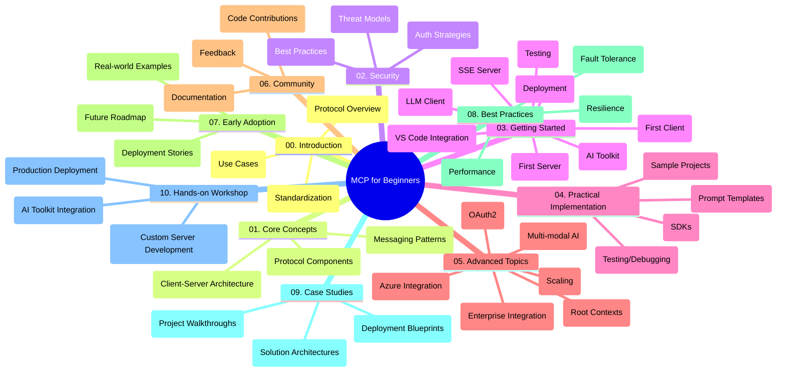

<!--
CO_OP_TRANSLATOR_METADATA:
{
  "original_hash": "a607d4febc94caee9a12b77795f7fc9a",
  "translation_date": "2025-06-11T16:44:11+00:00",
  "source_file": "study_guide.md",
  "language_code": "el"
}
-->
# Πρωτόκολλο Πλαισίου Μοντέλου (MCP) για Αρχάριους - Οδηγός Μελέτης

Αυτός ο οδηγός μελέτης παρέχει μια επισκόπηση της δομής και του περιεχομένου του αποθετηρίου για το πρόγραμμα "Πρωτόκολλο Πλαισίου Μοντέλου (MCP) για Αρχάριους". Χρησιμοποιήστε αυτόν τον οδηγό για να πλοηγηθείτε αποτελεσματικά στο αποθετήριο και να αξιοποιήσετε στο έπακρο τους διαθέσιμους πόρους.

## Επισκόπηση Αποθετηρίου

Το Πρωτόκολλο Πλαισίου Μοντέλου (MCP) είναι ένα τυποποιημένο πλαίσιο για τις αλληλεπιδράσεις μεταξύ μοντέλων AI και πελατειακών εφαρμογών. Αυτό το αποθετήριο παρέχει ένα ολοκληρωμένο πρόγραμμα σπουδών με πρακτικά παραδείγματα κώδικα σε C#, Java, JavaScript, Python και TypeScript, σχεδιασμένο για προγραμματιστές AI, αρχιτέκτονες συστημάτων και μηχανικούς λογισμικού.

## Οπτικός Χάρτης Προγράμματος Σπουδών

## Δομή Αποθετηρίου

Το αποθετήριο είναι οργανωμένο σε δέκα βασικές ενότητες, καθεμία εστιάζοντας σε διαφορετικές πτυχές του MCP:

1. **Εισαγωγή (00-Introduction/)**
   - Επισκόπηση του Πρωτοκόλλου Πλαισίου Μοντέλου
   - Γιατί η τυποποίηση είναι σημαντική στις ροές εργασίας AI
   - Πρακτικές περιπτώσεις χρήσης και οφέλη

2. **Βασικές Έννοιες (01-CoreConcepts/)**
   - Αρχιτεκτονική πελάτη-εξυπηρετητή
   - Κύρια στοιχεία του πρωτοκόλλου
   - Πρότυπα μηνυμάτων στο MCP

3. **Ασφάλεια (02-Security/)**
   - Απειλές ασφαλείας σε συστήματα βασισμένα σε MCP
   - Καλές πρακτικές για ασφαλείς υλοποιήσεις
   - Στρατηγικές αυθεντικοποίησης και εξουσιοδότησης

4. **Ξεκινώντας (03-GettingStarted/)**
   - Ρύθμιση περιβάλλοντος και παραμετροποίηση
   - Δημιουργία βασικών MCP εξυπηρετητών και πελατών
   - Ενσωμάτωση με υπάρχουσες εφαρμογές
   - Υποενότητες για πρώτο εξυπηρετητή, πρώτο πελάτη, LLM client, ενσωμάτωση VS Code, SSE server, AI Toolkit, δοκιμές και ανάπτυξη

5. **Πρακτική Υλοποίηση (04-PracticalImplementation/)**
   - Χρήση SDK σε διάφορες γλώσσες προγραμματισμού
   - Τεχνικές αποσφαλμάτωσης, δοκιμών και επικύρωσης
   - Δημιουργία επαναχρησιμοποιήσιμων προτύπων prompt και ροών εργασίας
   - Δείγματα έργων με παραδείγματα υλοποίησης

6. **Προχωρημένα Θέματα (05-AdvancedTopics/)**
   - Πολυμορφικές ροές εργασίας AI και επεκτασιμότητα
   - Στρατηγικές ασφαλούς κλιμάκωσης
   - MCP σε επιχειρησιακά οικοσυστήματα
   - Εξειδικευμένα θέματα όπως ενσωμάτωση Azure, πολυμορφικότητα, OAuth2, root contexts, δρομολόγηση, δειγματοληψία, κλιμάκωση, ασφάλεια, ενσωμάτωση web search και streaming.

7. **Συνεισφορές Κοινότητας (06-CommunityContributions/)**
   - Πώς να συνεισφέρετε κώδικα και τεκμηρίωση
   - Συνεργασία μέσω GitHub
   - Βελτιώσεις και ανατροφοδότηση που καθοδηγούνται από την κοινότητα

8. **Μαθήματα από Πρώιμη Υιοθέτηση (07-LessonsfromEarlyAdoption/)**
   - Υλοποιήσεις στον πραγματικό κόσμο και ιστορίες επιτυχίας
   - Δημιουργία και ανάπτυξη λύσεων βασισμένων σε MCP
   - Τάσεις και μελλοντικός οδικός χάρτης

9. **Καλές Πρακτικές (08-BestPractices/)**
   - Βελτιστοποίηση απόδοσης και ρύθμιση
   - Σχεδιασμός ανθεκτικών συστημάτων MCP
   - Στρατηγικές δοκιμών και ανθεκτικότητας

10. **Μελέτες Περίπτωσης (09-CaseStudy/)**
    - Αναλυτική παρουσίαση αρχιτεκτονικών λύσεων MCP
    - Σχεδιαγράμματα ανάπτυξης και συμβουλές ενσωμάτωσης
    - Επεξηγηματικά διαγράμματα και αναλυτικές περιηγήσεις έργων

11. **Πρακτικό Εργαστήριο (10-StreamliningAIWorkflowsBuildingAnMCPServerWithAIToolkit/)**
    - Ολοκληρωμένο πρακτικό εργαστήριο που συνδυάζει MCP με το AI Toolkit της Microsoft για VS Code
    - Δημιουργία έξυπνων εφαρμογών που γεφυρώνουν μοντέλα AI με πραγματικά εργαλεία
    - Πρακτικές ενότητες που καλύπτουν τα βασικά, ανάπτυξη προσαρμοσμένου εξυπηρετητή και στρατηγικές παραγωγικής ανάπτυξης

## Παραδείγματα Έργων

Το αποθετήριο περιλαμβάνει πολλαπλά δείγματα έργων που παρουσιάζουν υλοποιήσεις MCP σε διάφορες γλώσσες προγραμματισμού:

### Βασικά Παραδείγματα Υπολογιστή MCP
- Παράδειγμα MCP Server σε C#
- Υπολογιστής MCP σε Java
- Demo MCP σε JavaScript
- MCP Server σε Python
- Παράδειγμα MCP σε TypeScript

### Προχωρημένα Έργα Υπολογιστή MCP
- Προχωρημένο δείγμα σε C#
- Παράδειγμα εφαρμογής Container σε Java
- Προχωρημένο δείγμα σε JavaScript
- Πολύπλοκη υλοποίηση σε Python
- Δείγμα Container σε TypeScript

## Πρόσθετοι Πόροι

Το αποθετήριο περιλαμβάνει υποστηρικτικούς πόρους:

- **Φάκελος εικόνων**: Περιέχει διαγράμματα και εικονογραφήσεις που χρησιμοποιούνται σε όλο το πρόγραμμα σπουδών
- **Μεταφράσεις**: Υποστήριξη πολλαπλών γλωσσών με αυτοματοποιημένες μεταφράσεις της τεκμηρίωσης
- **Επίσημοι Πόροι MCP**:
  - [MCP Documentation](https://modelcontextprotocol.io/)
  - [MCP Specification](https://spec.modelcontextprotocol.io/)
  - [MCP GitHub Repository](https://github.com/modelcontextprotocol)

## Πώς να Χρησιμοποιήσετε Αυτό το Αποθετήριο

1. **Αλληλουχία Μάθησης**: Ακολουθήστε τα κεφάλαια με τη σειρά (00 έως 10) για μια δομημένη μαθησιακή εμπειρία.
2. **Εστίαση σε Συγκεκριμένη Γλώσσα**: Αν σας ενδιαφέρει μια συγκεκριμένη γλώσσα προγραμματισμού, εξερευνήστε τους φακέλους δειγμάτων για υλοποιήσεις στη γλώσσα της επιλογής σας.
3. **Πρακτική Υλοποίηση**: Ξεκινήστε με την ενότητα "Ξεκινώντας" για να ρυθμίσετε το περιβάλλον σας και να δημιουργήσετε τον πρώτο MCP εξυπηρετητή και πελάτη.
4. **Προχωρημένη Εξερεύνηση**: Μόλις εξοικειωθείτε με τα βασικά, εμβαθύνετε στα προχωρημένα θέματα για να διευρύνετε τις γνώσεις σας.
5. **Συμμετοχή στην Κοινότητα**: Ενταχθείτε στο [Azure AI Foundry Discord](https://discord.com/invite/ByRwuEEgH4) για να συνδεθείτε με ειδικούς και άλλους προγραμματιστές.

## Συνεισφορά

Αυτό το αποθετήριο καλωσορίζει τις συνεισφορές από την κοινότητα. Δείτε την ενότητα Συνεισφορές Κοινότητας για οδηγίες σχετικά με το πώς να συνεισφέρετε.

---

*Αυτός ο οδηγός μελέτης δημιουργήθηκε στις 11 Ιουνίου 2025 και παρέχει μια επισκόπηση του αποθετηρίου έως εκείνη την ημερομηνία. Το περιεχόμενο του αποθετηρίου μπορεί να έχει ενημερωθεί από τότε.*

**Αποποίηση Ευθύνης**:  
Αυτό το έγγραφο έχει μεταφραστεί χρησιμοποιώντας την υπηρεσία μετάφρασης AI [Co-op Translator](https://github.com/Azure/co-op-translator). Παρόλο που προσπαθούμε για ακρίβεια, παρακαλούμε να έχετε υπόψη ότι οι αυτοματοποιημένες μεταφράσεις μπορεί να περιέχουν λάθη ή ανακρίβειες. Το πρωτότυπο έγγραφο στη γλώσσα του πρέπει να θεωρείται η αυθεντική πηγή. Για κρίσιμες πληροφορίες, συνιστάται επαγγελματική μετάφραση από ανθρώπους. Δεν φέρουμε ευθύνη για τυχόν παρεξηγήσεις ή λανθασμένες ερμηνείες που προκύπτουν από τη χρήση αυτής της μετάφρασης.