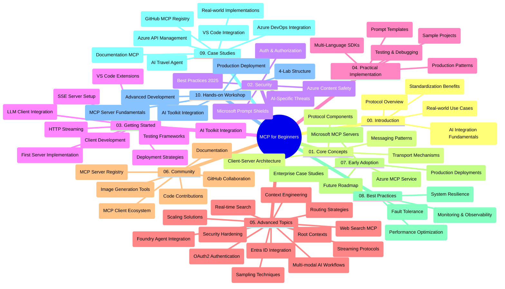

<!--
CO_OP_TRANSLATOR_METADATA:
{
  "original_hash": "719117a0a5f34ade7b5dfb61ee06fb13",
  "translation_date": "2025-09-26T18:26:17+00:00",
  "source_file": "study_guide.md",
  "language_code": "el"
}
-->
# Πρωτόκολλο Πλαισίου Μοντέλου (MCP) για Αρχάριους - Οδηγός Μελέτης

Αυτός ο οδηγός μελέτης παρέχει μια επισκόπηση της δομής και του περιεχομένου του αποθετηρίου για το πρόγραμμα σπουδών "Πρωτόκολλο Πλαισίου Μοντέλου (MCP) για Αρχάριους". Χρησιμοποιήστε τον για να περιηγηθείτε αποτελεσματικά στο αποθετήριο και να αξιοποιήσετε στο έπακρο τους διαθέσιμους πόρους.

## Επισκόπηση Αποθετηρίου

Το Πρωτόκολλο Πλαισίου Μοντέλου (MCP) είναι ένα τυποποιημένο πλαίσιο για αλληλεπιδράσεις μεταξύ μοντέλων AI και εφαρμογών πελατών. Αρχικά δημιουργήθηκε από την Anthropic και πλέον συντηρείται από την ευρύτερη κοινότητα MCP μέσω της επίσημης οργάνωσης στο GitHub. Αυτό το αποθετήριο παρέχει ένα ολοκληρωμένο πρόγραμμα σπουδών με παραδείγματα κώδικα σε C#, Java, JavaScript, Python και TypeScript, σχεδιασμένο για προγραμματιστές AI, αρχιτέκτονες συστημάτων και μηχανικούς λογισμικού.

## Οπτικός Χάρτης Προγράμματος Σπουδών

## Δομή Αποθετηρίου

Το αποθετήριο είναι οργανωμένο σε δέκα κύριες ενότητες, καθεμία από τις οποίες επικεντρώνεται σε διαφορετικές πτυχές του MCP:

1. **Εισαγωγή (00-Introduction/)**
   - Επισκόπηση του Πρωτοκόλλου Πλαισίου Μοντέλου
   - Γιατί η τυποποίηση είναι σημαντική στις ροές εργασίας AI
   - Πρακτικές περιπτώσεις χρήσης και οφέλη

2. **Βασικές Έννοιες (01-CoreConcepts/)**
   - Αρχιτεκτονική πελάτη-διακομιστή
   - Βασικά στοιχεία του πρωτοκόλλου
   - Μοτίβα μηνυμάτων στο MCP

3. **Ασφάλεια (02-Security/)**
   - Απειλές ασφάλειας σε συστήματα βασισμένα στο MCP
   - Βέλτιστες πρακτικές για ασφαλείς υλοποιήσεις
   - Στρατηγικές αυθεντικοποίησης και εξουσιοδότησης
   - **Αναλυτική Τεκμηρίωση Ασφάλειας**:
     - Βέλτιστες Πρακτικές Ασφάλειας MCP 2025
     - Οδηγός Υλοποίησης Ασφάλειας Περιεχομένου Azure
     - Έλεγχοι και Τεχνικές Ασφάλειας MCP
     - Γρήγορη Αναφορά Βέλτιστων Πρακτικών MCP
   - **Κύρια Θέματα Ασφάλειας**:
     - Επιθέσεις εισαγωγής προτροπών και δηλητηρίασης εργαλείων
     - Απαγωγή συνεδρίας και προβλήματα "μπερδεμένου αντιπροσώπου"
     - Ευπάθειες διέλευσης διακριτικών
     - Υπερβολικά δικαιώματα και έλεγχος πρόσβασης
     - Ασφάλεια εφοδιαστικής αλυσίδας για στοιχεία AI
     - Ενσωμάτωση Microsoft Prompt Shields

4. **Ξεκινώντας (03-GettingStarted/)**
   - Ρύθμιση και διαμόρφωση περιβάλλοντος
   - Δημιουργία βασικών διακομιστών και πελατών MCP
   - Ενσωμάτωση με υπάρχουσες εφαρμογές
   - Περιλαμβάνει ενότητες για:
     - Πρώτη υλοποίηση διακομιστή
     - Ανάπτυξη πελάτη
     - Ενσωμάτωση πελάτη LLM
     - Ενσωμάτωση VS Code
     - Διακομιστή Server-Sent Events (SSE)
     - Ροή HTTP
     - Ενσωμάτωση AI Toolkit
     - Στρατηγικές δοκιμών
     - Οδηγίες ανάπτυξης

5. **Πρακτική Υλοποίηση (04-PracticalImplementation/)**
   - Χρήση SDKs σε διαφορετικές γλώσσες προγραμματισμού
   - Τεχνικές αποσφαλμάτωσης, δοκιμών και επικύρωσης
   - Δημιουργία επαναχρησιμοποιήσιμων προτύπων προτροπών και ροών εργασίας
   - Δείγματα έργων με παραδείγματα υλοποίησης

6. **Προχωρημένα Θέματα (05-AdvancedTopics/)**
   - Τεχνικές μηχανικής πλαισίου
   - Ενσωμάτωση πρακτόρων Foundry
   - Ροές εργασίας AI πολλαπλών τρόπων
   - Επιδείξεις αυθεντικοποίησης OAuth2
   - Δυνατότητες αναζήτησης σε πραγματικό χρόνο
   - Ροή δεδομένων σε πραγματικό χρόνο
   - Υλοποίηση βασικών πλαισίων
   - Στρατηγικές δρομολόγησης
   - Τεχνικές δειγματοληψίας
   - Προσεγγίσεις κλιμάκωσης
   - Ζητήματα ασφάλειας
   - Ενσωμάτωση ασφάλειας Entra ID
   - Ενσωμάτωση αναζήτησης ιστού

7. **Συνεισφορές Κοινότητας (06-CommunityContributions/)**
   - Πώς να συνεισφέρετε κώδικα και τεκμηρίωση
   - Συνεργασία μέσω GitHub
   - Βελτιώσεις και σχόλια από την κοινότητα
   - Χρήση διάφορων πελατών MCP (Claude Desktop, Cline, VSCode)
   - Εργασία με δημοφιλείς διακομιστές MCP, συμπεριλαμβανομένης της δημιουργίας εικόνων

8. **Μαθήματα από Πρώιμη Υιοθέτηση (07-LessonsfromEarlyAdoption/)**
   - Υλοποιήσεις πραγματικού κόσμου και ιστορίες επιτυχίας
   - Δημιουργία και ανάπτυξη λύσεων βασισμένων στο MCP
   - Τάσεις και μελλοντικός οδικός χάρτης
   - **Οδηγός Διακομιστών MCP της Microsoft**: Ολοκληρωμένος οδηγός για 10 έτοιμους για παραγωγή διακομιστές MCP της Microsoft, συμπεριλαμβανομένων:
     - Microsoft Learn Docs MCP Server
     - Azure MCP Server (15+ εξειδικευμένοι συνδέσμοι)
     - GitHub MCP Server
     - Azure DevOps MCP Server
     - MarkItDown MCP Server
     - SQL Server MCP Server
     - Playwright MCP Server
     - Dev Box MCP Server
     - Azure AI Foundry MCP Server
     - Microsoft 365 Agents Toolkit MCP Server

9. **Βέλτιστες Πρακτικές (08-BestPractices/)**
   - Βελτιστοποίηση απόδοσης
   - Σχεδιασμός ανθεκτικών συστημάτων MCP
   - Στρατηγικές δοκιμών και ανθεκτικότητας

10. **Μελέτες Περίπτωσης (09-CaseStudy/)**
    - **Επτά ολοκληρωμένες μελέτες περίπτωσης** που δείχνουν την ευελιξία του MCP σε διάφορα σενάρια:
    - **Azure AI Travel Agents**: Ορχήστρωση πολλαπλών πρακτόρων με Azure OpenAI και AI Search
    - **Ενσωμάτωση Azure DevOps**: Αυτοματοποίηση διαδικασιών ροής εργασίας με ενημερώσεις δεδομένων YouTube
    - **Ανάκτηση Τεκμηρίωσης σε Πραγματικό Χρόνο**: Πελάτης κονσόλας Python με ροή HTTP
    - **Διαδραστικός Δημιουργός Σχεδίου Μελέτης**: Εφαρμογή ιστού Chainlit με συνομιλητικό AI
    - **Τεκμηρίωση Εντός Επεξεργαστή**: Ενσωμάτωση VS Code με ροές εργασίας GitHub Copilot
    - **Διαχείριση API Azure**: Ενσωμάτωση επιχειρησιακών API με δημιουργία διακομιστή MCP
    - **GitHub MCP Registry**: Ανάπτυξη οικοσυστήματος και πλατφόρμα ενσωμάτωσης πρακτόρων
    - Παραδείγματα υλοποίησης που καλύπτουν επιχειρησιακή ενσωμάτωση, παραγωγικότητα προγραμματιστών και ανάπτυξη οικοσυστήματος

11. **Εργαστήριο Πρακτικής Εξάσκησης (10-StreamliningAIWorkflowsBuildingAnMCPServerWithAIToolkit/)**
    - Ολοκληρωμένο εργαστήριο πρακτικής εξάσκησης που συνδυάζει MCP με AI Toolkit
    - Δημιουργία έξυπνων εφαρμογών που γεφυρώνουν μοντέλα AI με εργαλεία πραγματικού κόσμου
    - Πρακτικές ενότητες που καλύπτουν βασικά στοιχεία, ανάπτυξη προσαρμοσμένων διακομιστών και στρατηγικές ανάπτυξης παραγωγής
    - **Δομή Εργαστηρίου**:
      - Εργαστήριο 1: Βασικά Στοιχεία Διακομιστή MCP
      - Εργαστήριο 2: Προχωρημένη Ανάπτυξη Διακομιστή MCP
      - Εργαστήριο 3: Ενσωμάτωση AI Toolkit
      - Εργαστήριο 4: Ανάπτυξη και Κλιμάκωση Παραγωγής
    - Προσέγγιση μάθησης μέσω εργαστηρίων με οδηγίες βήμα προς βήμα

## Πρόσθετοι Πόροι

Το αποθετήριο περιλαμβάνει υποστηρικτικούς πόρους:

- **Φάκελος Εικόνων**: Περιέχει διαγράμματα και εικονογραφήσεις που χρησιμοποιούνται σε όλο το πρόγραμμα σπουδών
- **Μεταφράσεις**: Υποστήριξη πολλών γλωσσών με αυτοματοποιημένες μεταφράσεις τεκμηρίωσης
- **Επίσημοι Πόροι MCP**:
  - [Τεκμηρίωση MCP](https://modelcontextprotocol.io/)
  - [Προδιαγραφή MCP](https://spec.modelcontextprotocol.io/)
  - [Αποθετήριο MCP στο GitHub](https://github.com/modelcontextprotocol)

## Πώς να Χρησιμοποιήσετε Αυτό το Αποθετήριο

1. **Μάθηση με Σειρά**: Ακολουθήστε τα κεφάλαια με τη σειρά (00 έως 10) για μια δομημένη εμπειρία μάθησης.
2. **Εστίαση σε Συγκεκριμένη Γλώσσα**: Εάν ενδιαφέρεστε για μια συγκεκριμένη γλώσσα προγραμματισμού, εξερευνήστε τους φακέλους δειγμάτων για υλοποιήσεις στη γλώσσα της προτίμησής σας.
3. **Πρακτική Υλοποίηση**: Ξεκινήστε με την ενότητα "Ξεκινώντας" για να ρυθμίσετε το περιβάλλον σας και να δημιουργήσετε τον πρώτο σας διακομιστή και πελάτη MCP.
4. **Προχωρημένη Εξερεύνηση**: Μόλις εξοικειωθείτε με τα βασικά, εμβαθύνετε στα προχωρημένα θέματα για να διευρύνετε τις γνώσεις σας.
5. **Εμπλοκή με την Κοινότητα**: Εγγραφείτε στην κοινότητα MCP μέσω συζητήσεων στο GitHub και καναλιών Discord για να συνδεθείτε με ειδικούς και άλλους προγραμματιστές.

## Πελάτες και Εργαλεία MCP

Το πρόγραμμα σπουδών καλύπτει διάφορους πελάτες και εργαλεία MCP:

1. **Επίσημοι Πελάτες**:
   - Visual Studio Code 
   - MCP στο Visual Studio Code
   - Claude Desktop
   - Claude στο VSCode 
   - Claude API

2. **Πελάτες Κοινότητας**:
   - Cline (βασισμένος σε τερματικό)
   - Cursor (επεξεργαστής κώδικα)
   - ChatMCP
   - Windsurf

3. **Εργαλεία Διαχείρισης MCP**:
   - MCP CLI
   - MCP Manager
   - MCP Linker
   - MCP Router

## Δημοφιλείς Διακομιστές MCP

Το αποθετήριο παρουσιάζει διάφορους διακομιστές MCP, συμπεριλαμβανομένων:

1. **Επίσημοι Διακομιστές MCP της Microsoft**:
   - Microsoft Learn Docs MCP Server
   - Azure MCP Server (15+ εξειδικευμένοι συνδέσμοι)
   - GitHub MCP Server
   - Azure DevOps MCP Server
   - MarkItDown MCP Server
   - SQL Server MCP Server
   - Playwright MCP Server
   - Dev Box MCP Server
   - Azure AI Foundry MCP Server
   - Microsoft 365 Agents Toolkit MCP Server

2. **Επίσημοι Διακομιστές Αναφοράς**:
   - Filesystem
   - Fetch
   - Memory
   - Sequential Thinking

3. **Δημιουργία Εικόνων**:
   - Azure OpenAI DALL-E 3
   - Stable Diffusion WebUI
   - Replicate

4. **Εργαλεία Ανάπτυξης**:
   - Git MCP
   - Terminal Control
   - Code Assistant

5. **Εξειδικευμένοι Διακομιστές**:
   - Salesforce
   - Microsoft Teams
   - Jira & Confluence

## Συνεισφορά

Αυτό το αποθετήριο καλωσορίζει συνεισφορές από την κοινότητα. Δείτε την ενότητα Συνεισφορές Κοινότητας για οδηγίες σχετικά με το πώς να συνεισφέρετε αποτελεσματικά στο οικοσύστημα MCP.

## Αρχείο Αλλαγών

| Ημερομηνία | Αλλαγές |
|------------|---------|
| 26 Σεπτεμβρίου 2025 | - Προστέθηκε η μελέτη περίπτωσης GitHub MCP Registry στην ενότητα 09-CaseStudy - Ενημερώθηκαν οι Μελέτες Περίπτωσης για να αντικατοπτρίζουν επτά ολοκληρωμένες μελέτες - Ενισχύθηκαν οι περιγραφές μελετών περίπτωσης με συγκεκριμένες λεπτομέρειες υλοποίησης - Ενημερώθηκε ο Οπτικός Χάρτης Προγράμματος Σπουδών για να περιλαμβάνει το GitHub MCP Registry - Αναθεωρήθηκε η δομή του οδηγού μελέτης για να αντικατοπτρίζει την εστίαση στην ανάπτυξη οικοσυστήματος |
| 18 Ιουλίου 2025 | - Ενημερώθηκε η δομή του αποθετηρίου για να περιλαμβάνει τον Οδηγό Διακομιστών MCP της Microsoft - Προστέθηκε ολοκληρωμένη λίστα με 10 έτοιμους για παραγωγή διακομιστές MCP της Microsoft - Ενισχύθηκε η ενότητα Δημοφιλείς Διακομιστές MCP με Επίσημους Διακομιστές MCP της Microsoft - Ενημερώθηκε η ενότητα Μελέτες Περίπτωσης με πραγματικά παραδείγματα αρχείων - Προστέθηκαν λεπτομέρειες Δομής Εργαστηρίου για το Εργαστήριο Πρακτικής Εξάσκησης |
| 16 Ιουλίου 2025 | - Ενημερώθηκε η δομή του αποθετηρίου για να αντικατοπτρίζει το τρέχον περιεχόμενο - Προστέθηκε η ενότητα Πελάτες και Εργαλεία MCP - Προστέθηκε η ενότητα Δημοφιλείς Διακομιστές MCP - Ενημερώθηκε ο Οπτικός Χάρτης Προγράμματος Σπουδών με όλα τα τρέχοντα θέματα - Ενισχύθηκε η ενότητα Προχωρημένα Θέματα με όλες τις εξειδικευμένες περιοχές - Ενημερώθηκαν οι Μελέτες Περίπτωσης για να αντικατοπτρίζουν πραγματικά παραδείγματα - Διευκρινίστηκε η προέλευση του MCP ως δημιουργία της Anthropic |
| 11 Ιουνίου 2025 | - Αρχική δημιουργία του οδηγού μελέτης - Προστέθηκε Οπτικός Χάρτης Προγράμματος Σπουδών - Περιγράφηκε η δομή του αποθετηρίου - Περιλήφθηκαν δείγματα έργων και πρόσθετοι πόροι |

---

*Αυτός ο οδηγός μελέτης ενημερώθηκε στις 26 Σεπτεμβρίου 2025 και παρέχει μια επισκόπηση του αποθετηρίου μέχρι αυτή την ημερομηνία. Το περιεχόμενο του αποθετηρίου μπορεί να ενημερωθεί μετά από αυτή την ημερομηνία.*

---

