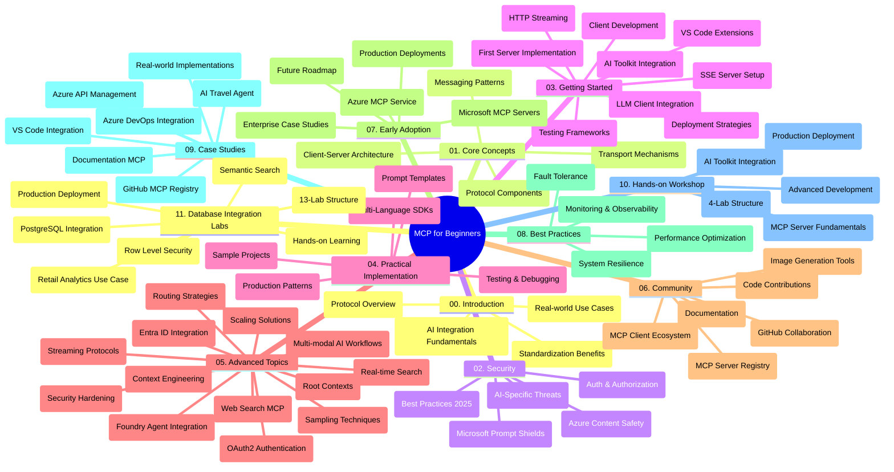

<!--
CO_OP_TRANSLATOR_METADATA:
{
  "original_hash": "aa1ce97bc694b08faf3018bab6d275b9",
  "translation_date": "2025-09-30T17:38:29+00:00",
  "source_file": "study_guide.md",
  "language_code": "el"
}
-->
# Πρωτόκολλο Πλαισίου Μοντέλου (MCP) για Αρχάριους - Οδηγός Μελέτης

Αυτός ο οδηγός μελέτης παρέχει μια επισκόπηση της δομής και του περιεχομένου του αποθετηρίου για το πρόγραμμα σπουδών "Πρωτόκολλο Πλαισίου Μοντέλου (MCP) για Αρχάριους". Χρησιμοποιήστε αυτόν τον οδηγό για να περιηγηθείτε αποτελεσματικά στο αποθετήριο και να αξιοποιήσετε στο έπακρο τους διαθέσιμους πόρους.

## Επισκόπηση Αποθετηρίου

Το Πρωτόκολλο Πλαισίου Μοντέλου (MCP) είναι ένα τυποποιημένο πλαίσιο για αλληλεπιδράσεις μεταξύ μοντέλων AI και εφαρμογών πελατών. Αρχικά δημιουργήθηκε από την Anthropic και πλέον συντηρείται από την ευρύτερη κοινότητα MCP μέσω της επίσημης οργάνωσης στο GitHub. Αυτό το αποθετήριο παρέχει ένα ολοκληρωμένο πρόγραμμα σπουδών με παραδείγματα κώδικα σε C#, Java, JavaScript, Python και TypeScript, σχεδιασμένο για προγραμματιστές AI, αρχιτέκτονες συστημάτων και μηχανικούς λογισμικού.

## Οπτικός Χάρτης Προγράμματος Σπουδών

## Δομή Αποθετηρίου

Το αποθετήριο είναι οργανωμένο σε έντεκα κύριες ενότητες, καθεμία από τις οποίες εστιάζει σε διαφορετικές πτυχές του MCP:

1. **Εισαγωγή (00-Introduction/)**
   - Επισκόπηση του Πρωτοκόλλου Πλαισίου Μοντέλου
   - Γιατί η τυποποίηση είναι σημαντική στις ροές εργασίας AI
   - Πρακτικές περιπτώσεις χρήσης και οφέλη

2. **Βασικές Έννοιες (01-CoreConcepts/)**
   - Αρχιτεκτονική πελάτη-διακομιστή
   - Βασικά στοιχεία του πρωτοκόλλου
   - Μοτίβα μηνυμάτων στο MCP

3. **Ασφάλεια (02-Security/)**
   - Απειλές ασφαλείας σε συστήματα βασισμένα στο MCP
   - Βέλτιστες πρακτικές για ασφαλείς υλοποιήσεις
   - Στρατηγικές αυθεντικοποίησης και εξουσιοδότησης
   - **Αναλυτική Τεκμηρίωση Ασφαλείας**:
     - Βέλτιστες Πρακτικές Ασφαλείας MCP 2025
     - Οδηγός Υλοποίησης Ασφαλείας Azure Content
     - Έλεγχοι και Τεχνικές Ασφαλείας MCP
     - Γρήγορη Αναφορά Βέλτιστων Πρακτικών MCP
   - **Κύρια Θέματα Ασφαλείας**:
     - Επιθέσεις εισαγωγής προτροπών και δηλητηρίασης εργαλείων
     - Απαγωγή συνεδρίας και προβλήματα "μπερδεμένου αντιπροσώπου"
     - Ευπάθειες διαβίβασης διακριτικών
     - Υπερβολικά δικαιώματα και έλεγχος πρόσβασης
     - Ασφάλεια εφοδιαστικής αλυσίδας για στοιχεία AI
     - Ενσωμάτωση Microsoft Prompt Shields

4. **Ξεκινώντας (03-GettingStarted/)**
   - Ρύθμιση και διαμόρφωση περιβάλλοντος
   - Δημιουργία βασικών διακομιστών και πελατών MCP
   - Ενσωμάτωση με υπάρχουσες εφαρμογές
   - Περιλαμβάνει ενότητες για:
     - Πρώτη υλοποίηση διακομιστή
     - Ανάπτυξη πελάτη
     - Ενσωμάτωση πελάτη LLM
     - Ενσωμάτωση VS Code
     - Διακομιστή Server-Sent Events (SSE)
     - Ροή HTTP
     - Ενσωμάτωση AI Toolkit
     - Στρατηγικές δοκιμών
     - Οδηγίες ανάπτυξης

5. **Πρακτική Υλοποίηση (04-PracticalImplementation/)**
   - Χρήση SDKs σε διαφορετικές γλώσσες προγραμματισμού
   - Τεχνικές αποσφαλμάτωσης, δοκιμών και επικύρωσης
   - Δημιουργία επαναχρησιμοποιήσιμων προτύπων προτροπών και ροών εργασίας
   - Δείγματα έργων με παραδείγματα υλοποίησης

6. **Προχωρημένα Θέματα (05-AdvancedTopics/)**
   - Τεχνικές μηχανικής πλαισίου
   - Ενσωμάτωση πράκτορα Foundry
   - Πολυτροπικές ροές εργασίας AI
   - Επιδείξεις αυθεντικοποίησης OAuth2
   - Δυνατότητες αναζήτησης σε πραγματικό χρόνο
   - Ροή δεδομένων σε πραγματικό χρόνο
   - Υλοποίηση βασικών πλαισίων
   - Στρατηγικές δρομολόγησης
   - Τεχνικές δειγματοληψίας
   - Προσεγγίσεις κλιμάκωσης
   - Θέματα ασφαλείας
   - Ενσωμάτωση ασφαλείας Entra ID
   - Ενσωμάτωση αναζήτησης ιστού

7. **Συνεισφορές Κοινότητας (06-CommunityContributions/)**
   - Πώς να συνεισφέρετε κώδικα και τεκμηρίωση
   - Συνεργασία μέσω GitHub
   - Βελτιώσεις και σχόλια που καθοδηγούνται από την κοινότητα
   - Χρήση διάφορων πελατών MCP (Claude Desktop, Cline, VSCode)
   - Εργασία με δημοφιλείς διακομιστές MCP, συμπεριλαμβανομένης της δημιουργίας εικόνων

8. **Μαθήματα από Πρώιμη Υιοθέτηση (07-LessonsfromEarlyAdoption/)**
   - Υλοποιήσεις πραγματικού κόσμου και ιστορίες επιτυχίας
   - Δημιουργία και ανάπτυξη λύσεων βασισμένων στο MCP
   - Τάσεις και μελλοντικός οδικός χάρτης
   - **Οδηγός Διακομιστών MCP της Microsoft**: Ολοκληρωμένος οδηγός για 10 έτοιμους για παραγωγή διακομιστές MCP της Microsoft, συμπεριλαμβανομένων:
     - Microsoft Learn Docs MCP Server
     - Azure MCP Server (15+ εξειδικευμένοι συνδετήρες)
     - GitHub MCP Server
     - Azure DevOps MCP Server
     - MarkItDown MCP Server
     - SQL Server MCP Server
     - Playwright MCP Server
     - Dev Box MCP Server
     - Azure AI Foundry MCP Server
     - Microsoft 365 Agents Toolkit MCP Server

9. **Βέλτιστες Πρακτικές (08-BestPractices/)**
   - Βελτιστοποίηση απόδοσης
   - Σχεδιασμός ανθεκτικών συστημάτων MCP
   - Στρατηγικές δοκιμών και ανθεκτικότητας

10. **Μελέτες Περίπτωσης (09-CaseStudy/)**
    - **Επτά ολοκληρωμένες μελέτες περίπτωσης** που δείχνουν την ευελιξία του MCP σε διάφορα σενάρια:
    - **Azure AI Travel Agents**: Ορχήστρωση πολλαπλών πρακτόρων με Azure OpenAI και AI Search
    - **Ενσωμάτωση Azure DevOps**: Αυτοματοποίηση διαδικασιών ροής εργασίας με ενημερώσεις δεδομένων YouTube
    - **Ανάκτηση Τεκμηρίωσης σε Πραγματικό Χρόνο**: Πελάτης κονσόλας Python με ροή HTTP
    - **Διαδραστικός Δημιουργός Σχεδίου Μελέτης**: Εφαρμογή ιστού Chainlit με συνομιλητική AI
    - **Τεκμηρίωση Εντός Επεξεργαστή**: Ενσωμάτωση VS Code με ροές εργασίας GitHub Copilot
    - **Διαχείριση API Azure**: Ενσωμάτωση επιχειρηματικών API με δημιουργία διακομιστή MCP
    - **GitHub MCP Registry**: Ανάπτυξη οικοσυστήματος και πλατφόρμα ενσωμάτωσης πρακτόρων
    - Παραδείγματα υλοποίησης που καλύπτουν επιχειρηματική ενσωμάτωση, παραγωγικότητα προγραμματιστών και ανάπτυξη οικοσυστήματος

11. **Εργαστήριο Πρακτικής Εξάσκησης (10-StreamliningAIWorkflowsBuildingAnMCPServerWithAIToolkit/)**
    - Ολοκληρωμένο εργαστήριο πρακτικής εξάσκησης που συνδυάζει MCP με AI Toolkit
    - Δημιουργία έξυπνων εφαρμογών που γεφυρώνουν μοντέλα AI με εργαλεία πραγματικού κόσμου
    - Πρακτικές ενότητες που καλύπτουν βασικά στοιχεία, ανάπτυξη προσαρμοσμένων διακομιστών και στρατηγικές ανάπτυξης παραγωγής
    - **Δομή Εργαστηρίου**:
      - Εργαστήριο 1: Βασικά Στοιχεία Διακομιστή MCP
      - Εργαστήριο 2: Προχωρημένη Ανάπτυξη Διακομιστή MCP
      - Εργαστήριο 3: Ενσωμάτωση AI Toolkit
      - Εργαστήριο 4: Ανάπτυξη και Κλιμάκωση Παραγωγής
    - Προσέγγιση μάθησης μέσω εργαστηρίων με οδηγίες βήμα προς βήμα

12. **Εργαστήρια Ενσωμάτωσης Βάσης Δεδομένων Διακομιστή MCP (11-MCPServerHandsOnLabs/)**
    - **Ολοκληρωμένο μονοπάτι μάθησης 13 εργαστηρίων** για δημιουργία διακομιστών MCP έτοιμων για παραγωγή με ενσωμάτωση PostgreSQL
    - **Υλοποίηση αναλυτικών στοιχείων λιανικής πραγματικού κόσμου** χρησιμοποιώντας την περίπτωση χρήσης Zava Retail
    - **Μοτίβα επιχειρηματικής κλάσης** που περιλαμβάνουν Ασφάλεια σε Επίπεδο Γραμμής (RLS), σημασιολογική αναζήτηση και πρόσβαση δεδομένων πολλαπλών ενοικιαστών
    - **Πλήρης Δομή Εργαστηρίου**:
      - **Εργαστήρια 00-03: Θεμέλια** - Εισαγωγή, Αρχιτεκτονική, Ασφάλεια, Ρύθμιση Περιβάλλοντος
      - **Εργαστήρια 04-06: Δημιουργία του Διακομιστή MCP** - Σχεδιασμός Βάσης Δεδομένων, Υλοποίηση Διακομιστή MCP, Ανάπτυξη Εργαλείων
      - **Εργαστήρια 07-09: Προχωρημένα Χαρακτηριστικά** - Σημασιολογική Αναζήτηση, Δοκιμές & Αποσφαλμάτωση, Ενσωμάτωση VS Code
      - **Εργαστήρια 10-12: Παραγωγή & Βέλτιστες Πρακτικές** - Ανάπτυξη, Παρακολούθηση, Βελτιστοποίηση
    - **Τεχνολογίες που Καλύπτονται**: Πλαίσιο FastMCP, PostgreSQL, Azure OpenAI, Azure Container Apps, Application Insights
    - **Αποτελέσματα Μάθησης**: Διακομιστές MCP έτοιμοι για παραγωγή, μοτίβα ενσωμάτωσης βάσης δεδομένων, αναλυτικά στοιχεία με AI, επιχειρηματική ασφάλεια

## Πρόσθετοι Πόροι

Το αποθετήριο περιλαμβάνει υποστηρικτικούς πόρους:

- **Φάκελος Εικόνων**: Περιέχει διαγράμματα και εικονογραφήσεις που χρησιμοποιούνται σε όλο το πρόγραμμα σπουδών
- **Μεταφράσεις**: Υποστήριξη πολλών γλωσσών με αυτοματοποιημένες μεταφράσεις τεκμηρίωσης
- **Επίσημοι Πόροι MCP**:
  - [Τεκμηρίωση MCP](https://modelcontextprotocol.io/)
  - [Προδιαγραφή MCP](https://spec.modelcontextprotocol.io/)
  - [Αποθετήριο MCP στο GitHub](https://github.com/modelcontextprotocol)

## Πώς να Χρησιμοποιήσετε Αυτό το Αποθετήριο

1. **Μάθηση με Σειρά**: Ακολουθήστε τα κεφάλαια με τη σειρά (00 έως 11) για μια δομημένη εμπειρία μάθησης.
2. **Εστίαση σε Συγκεκριμένη Γλώσσα**: Εάν ενδιαφέρεστε για μια συγκεκριμένη γλώσσα προγραμματισμού, εξερευνήστε τους φακέλους δειγμάτων για υλοποιήσεις στη γλώσσα της προτίμησής σας.
3. **Πρακτική Υλοποίηση**: Ξεκινήστε με την ενότητα "Ξεκινώντας" για να ρυθμίσετε το περιβάλλον σας και να δημιουργήσετε τον πρώτο σας διακομιστή και πελάτη MCP.
4. **Προχωρημένη Εξερεύνηση**: Μόλις εξοικειωθείτε με τα βασικά, εμβαθύνετε στα προχωρημένα θέματα για να επεκτείνετε τις γνώσεις σας.
5. **Συμμετοχή στην Κοινότητα**: Εγγραφείτε στην κοινότητα MCP μέσω συζητήσεων στο GitHub και καναλιών Discord για να συνδεθείτε με ειδικούς και άλλους προγραμματιστές.

## Πελάτες και Εργαλεία MCP

Το πρόγραμμα σπουδών καλύπτει διάφορους πελάτες και εργαλεία MCP:

1. **Επίσημοι Πελάτες**:
   - Visual Studio Code 
   - MCP στο Visual Studio Code
   - Claude Desktop
   - Claude στο VSCode 
   - Claude API

2. **Πελάτες Κοινότητας**:
   - Cline (βασισμένος σε τερματικό)
   - Cursor (επεξεργαστής κώδικα)
   - ChatMCP
   - Windsurf

3. **Εργαλεία Διαχείρισης MCP**:
   - MCP CLI
   - MCP Manager
   - MCP Linker
   - MCP Router

## Δημοφιλείς Διακομιστές MCP

Το αποθετήριο παρουσιάζει διάφορους διακομιστές MCP, συμπεριλαμβανομένων:

1. **Επίσημοι Διακομιστές MCP της Microsoft**:
   - Microsoft Learn Docs MCP Server
   - Azure MCP Server (15+ εξειδικευμένοι συνδετήρες)
   - GitHub MCP Server
   - Azure DevOps MCP Server
   - MarkItDown MCP Server
   - SQL Server MCP Server
   - Playwright MCP Server
   - Dev Box MCP Server
   - Azure AI Foundry MCP Server
   - Microsoft 365 Agents Toolkit MCP Server

2. **Επίσημοι Διακομιστές Αναφοράς**:
   - Filesystem
   - Fetch
   - Memory
   - Sequential Thinking

3. **Δημιουργία Εικόνων**:
   - Azure OpenAI DALL-E 3
   - Stable Diffusion WebUI
   - Replicate

4. **Εργαλεία Ανάπτυξης**:
   - Git MCP
   - Terminal Control
   - Code Assistant

5. **Εξειδικευμένοι Διακομιστές**:
   - Salesforce
   - Microsoft Teams
   - Jira & Confluence

## Συνεισφορά

Αυτό το αποθετήριο καλωσορίζει συνεισφορές από την κοινότητα. Δείτε την ενότητα Συνεισφορές Κοινότητας για οδηγίες σχετικά με το πώς να συνεισφέρετε αποτελεσματικά στο οικοσύστημα MCP.

## Αρχείο Αλλαγών

| Ημερομηνία | Αλλαγές |
|------|---------||
| 29 Σεπτεμβρίου 2025 | - Προστέθηκε η ενότητα 11-MCPServerHandsOnLabs με ολοκληρωμένο μονοπάτι μάθησης 13 εργαστηρίων για ενσωμάτωση βάσης δεδομένων - Ενημερώθηκε ο Οπτικός Χάρτης Προγράμματος Σπουδών για να περιλαμβάνει τα Εργαστήρια Ενσωμάτωσης Βάσης Δεδομένων - Ενισχύθηκε η δομή του αποθετηρίου ώστε να αντικατοπτρίζει τις έντεκα κύριες ενότητες - Προστέθηκε λεπτομερής περιγραφή της ενσωμάτωσης PostgreSQL, της περίπτωσης χρήσης αναλυτικών στοιχείων λιανικής και των επιχειρηματικών μοτίβων - Ενημερώθηκαν οι οδηγίες πλοήγησης για να περιλαμβάνουν τις ενότητες 00-11 |
| 26 Σεπτεμβρίου 2025 | - Προστέθηκε η μελέτη περίπτωσης GitHub MCP Registry στην ενότητα 09-CaseStudy - Ενημερώθηκαν οι Μελέτες Περίπτωσης ώστε να αντικατοπτρίζουν επτά ολοκληρωμένες μελέτες περίπτωσης - Ενισχύθηκαν οι περιγραφές μελετών περίπτωσης με συγκεκριμένες λεπτομέρειες υ

---

**Αποποίηση ευθύνης**:  
Αυτό το έγγραφο έχει μεταφραστεί χρησιμοποιώντας την υπηρεσία μετάφρασης AI [Co-op Translator](https://github.com/Azure/co-op-translator). Παρόλο που καταβάλλουμε προσπάθειες για ακρίβεια, παρακαλούμε να έχετε υπόψη ότι οι αυτοματοποιημένες μεταφράσεις ενδέχεται να περιέχουν λάθη ή ανακρίβειες. Το πρωτότυπο έγγραφο στη μητρική του γλώσσα θα πρέπει να θεωρείται η αυθεντική πηγή. Για κρίσιμες πληροφορίες, συνιστάται επαγγελματική ανθρώπινη μετάφραση. Δεν φέρουμε ευθύνη για τυχόν παρεξηγήσεις ή εσφαλμένες ερμηνείες που προκύπτουν από τη χρήση αυτής της μετάφρασης.