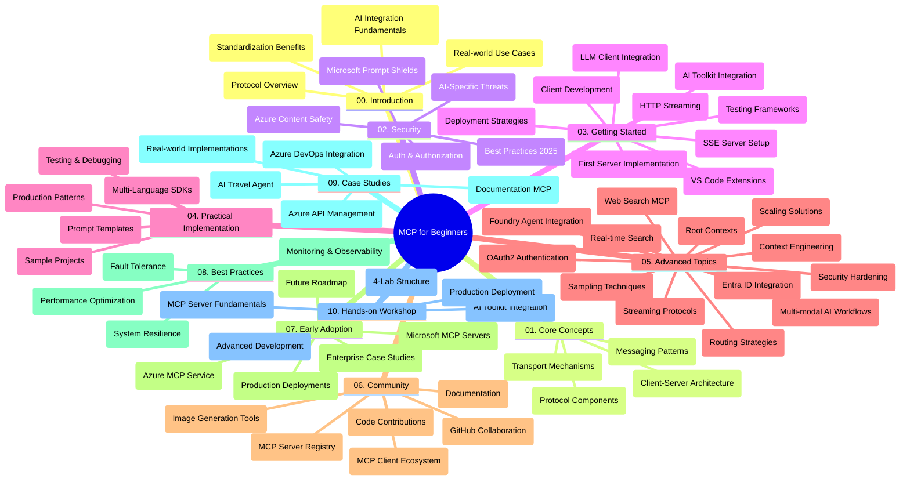

<!--
CO_OP_TRANSLATOR_METADATA:
{
  "original_hash": "e2c6ed897fa98fa08e0146101776c7ff",
  "translation_date": "2025-07-18T09:49:41+00:00",
  "source_file": "study_guide.md",
  "language_code": "el"
}
-->
# Πρωτόκολλο Πλαισίου Μοντέλου (MCP) για Αρχάριους - Οδηγός Μελέτης

Αυτός ο οδηγός μελέτης παρέχει μια επισκόπηση της δομής και του περιεχομένου του αποθετηρίου για το πρόγραμμα σπουδών "Πρωτόκολλο Πλαισίου Μοντέλου (MCP) για Αρχάριους". Χρησιμοποιήστε αυτόν τον οδηγό για να πλοηγηθείτε αποτελεσματικά στο αποθετήριο και να αξιοποιήσετε στο έπακρο τους διαθέσιμους πόρους.

## Επισκόπηση Αποθετηρίου

Το Πρωτόκολλο Πλαισίου Μοντέλου (MCP) είναι ένα τυποποιημένο πλαίσιο για τις αλληλεπιδράσεις μεταξύ μοντέλων AI και πελατειακών εφαρμογών. Αρχικά δημιουργήθηκε από την Anthropic, το MCP πλέον συντηρείται από την ευρύτερη κοινότητα MCP μέσω της επίσημης οργάνωσης στο GitHub. Αυτό το αποθετήριο παρέχει ένα ολοκληρωμένο πρόγραμμα σπουδών με πρακτικά παραδείγματα κώδικα σε C#, Java, JavaScript, Python και TypeScript, σχεδιασμένο για προγραμματιστές AI, αρχιτέκτονες συστημάτων και μηχανικούς λογισμικού.

## Οπτικός Χάρτης Προγράμματος Σπουδών

## Δομή Αποθετηρίου

Το αποθετήριο οργανώνεται σε δέκα βασικές ενότητες, καθεμία εστιάζοντας σε διαφορετικές πτυχές του MCP:

1. **Εισαγωγή (00-Introduction/)**
   - Επισκόπηση του Πρωτοκόλλου Πλαισίου Μοντέλου
   - Γιατί η τυποποίηση είναι σημαντική στις ροές εργασίας AI
   - Πρακτικές χρήσεις και οφέλη

2. **Βασικές Έννοιες (01-CoreConcepts/)**
   - Αρχιτεκτονική πελάτη-διακομιστή
   - Κύρια στοιχεία του πρωτοκόλλου
   - Πρότυπα μηνυμάτων στο MCP

3. **Ασφάλεια (02-Security/)**
   - Απειλές ασφάλειας σε συστήματα βασισμένα σε MCP
   - Καλές πρακτικές για ασφαλείς υλοποιήσεις
   - Στρατηγικές αυθεντικοποίησης και εξουσιοδότησης
   - **Ολοκληρωμένη Τεκμηρίωση Ασφάλειας**:
     - MCP Security Best Practices 2025
     - Οδηγός Υλοποίησης Azure Content Safety
     - MCP Security Controls and Techniques
     - MCP Best Practices Quick Reference
   - **Κύρια Θέματα Ασφάλειας**:
     - Επιθέσεις prompt injection και δηλητηρίασης εργαλείων
     - Απαγωγή συνεδρίας και προβλήματα confused deputy
     - Ευπάθειες token passthrough
     - Υπερβολικά δικαιώματα και έλεγχος πρόσβασης
     - Ασφάλεια αλυσίδας εφοδιασμού για συστατικά AI
     - Ενσωμάτωση Microsoft Prompt Shields

4. **Ξεκινώντας (03-GettingStarted/)**
   - Ρύθμιση και διαμόρφωση περιβάλλοντος
   - Δημιουργία βασικών MCP διακομιστών και πελατών
   - Ενσωμάτωση με υπάρχουσες εφαρμογές
   - Περιλαμβάνει ενότητες για:
     - Πρώτη υλοποίηση διακομιστή
     - Ανάπτυξη πελάτη
     - Ενσωμάτωση LLM πελάτη
     - Ενσωμάτωση VS Code
     - Server-Sent Events (SSE) διακομιστής
     - HTTP streaming
     - Ενσωμάτωση AI Toolkit
     - Στρατηγικές δοκιμών
     - Οδηγίες ανάπτυξης

5. **Πρακτική Υλοποίηση (04-PracticalImplementation/)**
   - Χρήση SDK σε διάφορες γλώσσες προγραμματισμού
   - Τεχνικές αποσφαλμάτωσης, δοκιμών και επικύρωσης
   - Δημιουργία επαναχρησιμοποιήσιμων προτύπων prompt και ροών εργασίας
   - Παραδείγματα έργων με υλοποιήσεις

6. **Προχωρημένα Θέματα (05-AdvancedTopics/)**
   - Τεχνικές μηχανικής πλαισίου (context engineering)
   - Ενσωμάτωση Foundry agent
   - Πολυτροπικές ροές εργασίας AI
   - Επιδείξεις αυθεντικοποίησης OAuth2
   - Δυνατότητες αναζήτησης σε πραγματικό χρόνο
   - Ροή δεδομένων σε πραγματικό χρόνο
   - Υλοποίηση root contexts
   - Στρατηγικές δρομολόγησης
   - Τεχνικές δειγματοληψίας
   - Προσεγγίσεις κλιμάκωσης
   - Θέματα ασφάλειας
   - Ενσωμάτωση ασφάλειας Entra ID
   - Ενσωμάτωση αναζήτησης στο web

7. **Συνεισφορές Κοινότητας (06-CommunityContributions/)**
   - Πώς να συνεισφέρετε κώδικα και τεκμηρίωση
   - Συνεργασία μέσω GitHub
   - Βελτιώσεις και ανατροφοδότηση από την κοινότητα
   - Χρήση διαφόρων MCP πελατών (Claude Desktop, Cline, VSCode)
   - Εργασία με δημοφιλείς MCP διακομιστές, συμπεριλαμβανομένης της δημιουργίας εικόνων

8. **Μαθήματα από Πρώιμη Υιοθέτηση (07-LessonsfromEarlyAdoption/)**
   - Πραγματικές υλοποιήσεις και ιστορίες επιτυχίας
   - Δημιουργία και ανάπτυξη λύσεων βασισμένων σε MCP
   - Τάσεις και μελλοντικός οδικός χάρτης
   - **Οδηγός Microsoft MCP Servers**: Ολοκληρωμένος οδηγός για 10 παραγωγικούς Microsoft MCP διακομιστές, όπως:
     - Microsoft Learn Docs MCP Server
     - Azure MCP Server (15+ εξειδικευμένοι connectors)
     - GitHub MCP Server
     - Azure DevOps MCP Server
     - MarkItDown MCP Server
     - SQL Server MCP Server
     - Playwright MCP Server
     - Dev Box MCP Server
     - Azure AI Foundry MCP Server
     - Microsoft 365 Agents Toolkit MCP Server

9. **Καλές Πρακτικές (08-BestPractices/)**
   - Βελτιστοποίηση απόδοσης και ρύθμιση
   - Σχεδιασμός ανθεκτικών συστημάτων MCP
   - Στρατηγικές δοκιμών και ανθεκτικότητας

10. **Μελέτες Περίπτωσης (09-CaseStudy/)**
    - Παράδειγμα ενσωμάτωσης Azure API Management
    - Παράδειγμα υλοποίησης ταξιδιωτικού πράκτορα
    - Ενσωμάτωση Azure DevOps με ενημερώσεις YouTube
    - Παραδείγματα υλοποίησης MCP με τεκμηρίωση
    - Παραδείγματα υλοποίησης με λεπτομερή τεκμηρίωση

11. **Εργαστήριο Πρακτικής Εφαρμογής (10-StreamliningAIWorkflowsBuildingAnMCPServerWithAIToolkit/)**
    - Ολοκληρωμένο εργαστήριο που συνδυάζει MCP με AI Toolkit
    - Δημιουργία έξυπνων εφαρμογών που γεφυρώνουν μοντέλα AI με πραγματικά εργαλεία
    - Πρακτικές ενότητες που καλύπτουν βασικά, ανάπτυξη προσαρμοσμένων διακομιστών και στρατηγικές παραγωγικής ανάπτυξης
    - **Δομή Εργαστηρίου**:
      - Εργαστήριο 1: Βασικά MCP Server
      - Εργαστήριο 2: Προχωρημένη Ανάπτυξη MCP Server
      - Εργαστήριο 3: Ενσωμάτωση AI Toolkit
      - Εργαστήριο 4: Παραγωγική Ανάπτυξη και Κλιμάκωση
    - Μαθησιακή προσέγγιση βασισμένη σε εργαστήρια με βήμα-βήμα οδηγίες

## Πρόσθετοι Πόροι

Το αποθετήριο περιλαμβάνει υποστηρικτικούς πόρους:

- **Φάκελος Εικόνων**: Περιέχει διαγράμματα και εικονογραφήσεις που χρησιμοποιούνται σε όλο το πρόγραμμα σπουδών
- **Μεταφράσεις**: Υποστήριξη πολλαπλών γλωσσών με αυτόματες μεταφράσεις της τεκμηρίωσης
- **Επίσημοι Πόροι MCP**:
  - [MCP Documentation](https://modelcontextprotocol.io/)
  - [MCP Specification](https://spec.modelcontextprotocol.io/)
  - [MCP GitHub Repository](https://github.com/modelcontextprotocol)

## Πώς να Χρησιμοποιήσετε Αυτό το Αποθετήριο

1. **Συστηματική Μάθηση**: Ακολουθήστε τα κεφάλαια με τη σειρά (00 έως 10) για μια δομημένη εμπειρία μάθησης.
2. **Εστίαση σε Συγκεκριμένη Γλώσσα**: Αν σας ενδιαφέρει μια συγκεκριμένη γλώσσα προγραμματισμού, εξερευνήστε τους φακέλους με παραδείγματα για υλοποιήσεις στη γλώσσα της επιλογής σας.
3. **Πρακτική Υλοποίηση**: Ξεκινήστε με την ενότητα "Ξεκινώντας" για να ρυθμίσετε το περιβάλλον σας και να δημιουργήσετε τον πρώτο MCP διακομιστή και πελάτη.
4. **Προχωρημένη Εξερεύνηση**: Μόλις εξοικειωθείτε με τα βασικά, προχωρήστε στα προχωρημένα θέματα για να διευρύνετε τις γνώσεις σας.
5. **Συμμετοχή στην Κοινότητα**: Ενταχθείτε στην κοινότητα MCP μέσω συζητήσεων στο GitHub και κανάλια Discord για να συνδεθείτε με ειδικούς και άλλους προγραμματιστές.

## MCP Πελάτες και Εργαλεία

Το πρόγραμμα σπουδών καλύπτει διάφορους MCP πελάτες και εργαλεία:

1. **Επίσημοι Πελάτες**:
   - Visual Studio Code
   - MCP στο Visual Studio Code
   - Claude Desktop
   - Claude στο VSCode
   - Claude API

2. **Πελάτες Κοινότητας**:
   - Cline (τερματικό)
   - Cursor (επεξεργαστής κώδικα)
   - ChatMCP
   - Windsurf

3. **Εργαλεία Διαχείρισης MCP**:
   - MCP CLI
   - MCP Manager
   - MCP Linker
   - MCP Router

## Δημοφιλείς MCP Διακομιστές

Το αποθετήριο παρουσιάζει διάφορους MCP διακομιστές, μεταξύ των οποίων:

1. **Επίσημοι Microsoft MCP Διακομιστές**:
   - Microsoft Learn Docs MCP Server
   - Azure MCP Server (15+ εξειδικευμένοι connectors)
   - GitHub MCP Server
   - Azure DevOps MCP Server
   - MarkItDown MCP Server
   - SQL Server MCP Server
   - Playwright MCP Server
   - Dev Box MCP Server
   - Azure AI Foundry MCP Server
   - Microsoft 365 Agents Toolkit MCP Server

2. **Επίσημοι Αναφορικοί Διακομιστές**:
   - Filesystem
   - Fetch
   - Memory
   - Sequential Thinking

3. **Δημιουργία Εικόνων**:
   - Azure OpenAI DALL-E 3
   - Stable Diffusion WebUI
   - Replicate

4. **Εργαλεία Ανάπτυξης**:
   - Git MCP
   - Terminal Control
   - Code Assistant

5. **Εξειδικευμένοι Διακομιστές**:
   - Salesforce
   - Microsoft Teams
   - Jira & Confluence

## Συνεισφορά

Αυτό το αποθετήριο καλωσορίζει τις συνεισφορές από την κοινότητα. Δείτε την ενότητα Συνεισφορές Κοινότητας για οδηγίες σχετικά με το πώς να συνεισφέρετε αποτελεσματικά στο οικοσύστημα MCP.

## Αρχείο Αλλαγών

| Ημερομηνία | Αλλαγές |
|------------|---------|
| 18 Ιουλίου 2025 | - Ενημερώθηκε η δομή αποθετηρίου για να συμπεριλάβει τον Οδηγό Microsoft MCP Servers - Προστέθηκε ολοκληρωμένη λίστα με 10 παραγωγικούς Microsoft MCP διακομιστές - Ενισχύθηκε η ενότητα Δημοφιλείς MCP Διακομιστές με Επίσημους Microsoft MCP Διακομιστές - Ενημερώθηκε η ενότητα Μελέτες Περίπτωσης με πραγματικά παραδείγματα αρχείων - Προστέθηκαν λεπτομέρειες δομής εργαστηρίου για το Εργαστήριο Πρακτικής Εφαρμογής |
| 16 Ιουλίου 2025 | - Ενημερώθηκε η δομή αποθετηρίου για να αντικατοπτρίζει το τρέχον περιεχόμενο - Προστέθηκε ενότητα MCP Πελάτες και Εργαλεία - Προστέθηκε ενότητα Δημοφιλείς MCP Διακομιστές - Ενημερώθηκε ο Οπτικός Χάρτης Προγράμματος Σπουδών με όλα τα τρέχοντα θέματα - Ενισχύθηκε η ενότητα Προχωρημένα Θέματα με όλες τις εξειδικευμένες περιοχές - Ενημερώθηκαν οι Μελέτες Περίπτωσης με πραγματικά παραδείγματα - Διευκρινίστηκε η προέλευση του MCP ως δημιούργημα της Anthropic |
| 11 Ιουνίου 2025 | - Αρχική δημιουργία του οδηγού μελέτης - Προστέθηκε Οπτικός Χάρτης Προγράμματος Σπουδών - Περιγράφηκε η δομή αποθετηρίου - Συμπεριλήφθηκαν παραδείγματα έργων και επιπλέον πόροι |

---

*Αυτός ο οδηγός μελέτης ενημερώθηκε στις 18 Ιουλίου 2025 και παρέχει μια επισκόπηση του αποθετηρίου μέχρι εκείνη την ημερομηνία. Το περιεχόμενο του αποθετηρίου μπορεί να ενημερωθεί μετά από αυτή την ημερομηνία.*

**Αποποίηση ευθυνών**:  
Αυτό το έγγραφο έχει μεταφραστεί χρησιμοποιώντας την υπηρεσία αυτόματης μετάφρασης AI [Co-op Translator](https://github.com/Azure/co-op-translator). Παρόλο που επιδιώκουμε την ακρίβεια, παρακαλούμε να γνωρίζετε ότι οι αυτόματες μεταφράσεις ενδέχεται να περιέχουν λάθη ή ανακρίβειες. Το πρωτότυπο έγγραφο στη γλώσσα του θεωρείται η αυθεντική πηγή. Για κρίσιμες πληροφορίες, συνιστάται επαγγελματική ανθρώπινη μετάφραση. Δεν φέρουμε ευθύνη για τυχόν παρεξηγήσεις ή λανθασμένες ερμηνείες που προκύπτουν από τη χρήση αυτής της μετάφρασης.