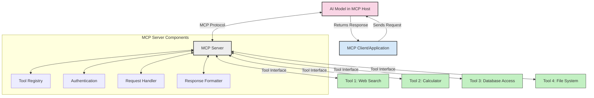
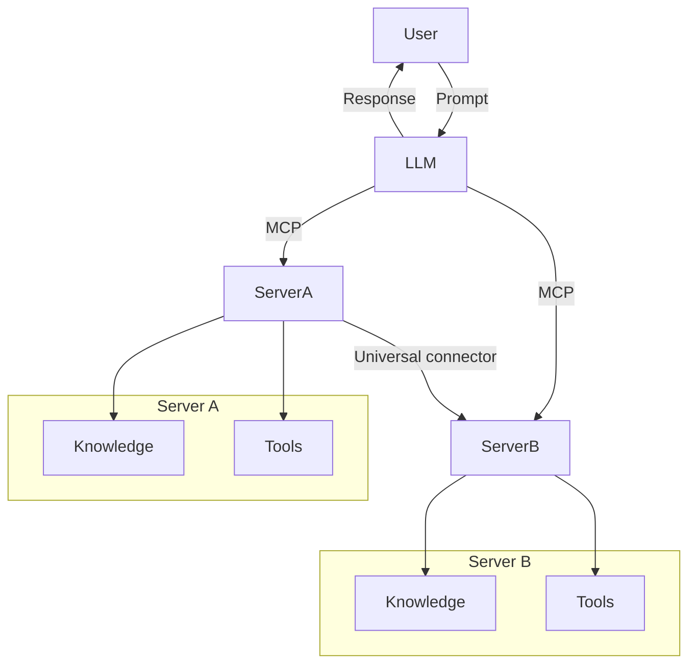
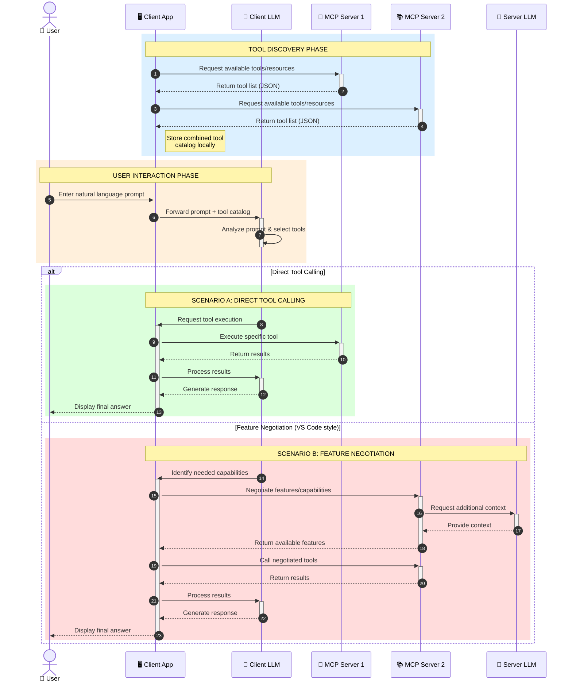

<!--
CO_OP_TRANSLATOR_METADATA:
{
  "original_hash": "25a94c681cf43612ff394d8cf78a74de",
  "translation_date": "2025-05-27T15:53:11+00:00",
  "source_file": "00-Introduction/README.md",
  "language_code": "en"
}
-->
# Introduction to Model Context Protocol (MCP): Why It Matters for Scalable AI Applications

Generative AI applications represent a significant advancement by allowing users to interact through natural language prompts. However, as these apps grow in complexity and resource investment, it becomes crucial to integrate functionalities and resources in a way that’s easy to extend, supports multiple models, and handles various model-specific details. Simply put, building Gen AI apps is straightforward at first, but as they scale, defining a clear architecture and relying on a standard becomes necessary to ensure consistent development. This is where MCP helps by organizing and providing that standard.

---

## **🔍 What Is the Model Context Protocol (MCP)?**

The **Model Context Protocol (MCP)** is an **open, standardized interface** designed to enable Large Language Models (LLMs) to seamlessly connect with external tools, APIs, and data sources. It offers a consistent framework that extends AI model capabilities beyond their training data, allowing for smarter, scalable, and more responsive AI systems.

---

## **🎯 Why Standardization in AI Matters**

As generative AI applications become more sophisticated, adopting standards that guarantee **scalability, extensibility**, and **maintainability** is essential. MCP meets these needs by:

- Unifying how models integrate with tools  
- Eliminating fragile, one-off custom solutions  
- Enabling multiple models to coexist within the same ecosystem  

---

## **📚 Learning Objectives**

By the end of this article, you will be able to:

- Define **Model Context Protocol (MCP)** and its practical applications  
- Understand how MCP standardizes communication between models and tools  
- Identify the main components of MCP’s architecture  
- Explore real-world examples of MCP in enterprise and development settings  

---

## **💡 Why the Model Context Protocol (MCP) Is a Game-Changer**

### **🔗 MCP Solves Fragmentation in AI Interactions**

Before MCP, integrating models with tools required:

- Custom code for each tool-model combination  
- Vendor-specific, non-standard APIs  
- Frequent breakages due to updates  
- Poor scalability as the number of tools increased  

### **✅ Benefits of MCP Standardization**

| **Benefit**              | **Description**                                                                |
|--------------------------|--------------------------------------------------------------------------------|
| Interoperability         | LLMs seamlessly work with tools from various vendors                          |
| Consistency              | Uniform behavior across platforms and tools                                   |
| Reusability              | Tools developed once can be reused across projects and systems                |
| Accelerated Development  | Reduced development time using standardized, plug-and-play interfaces        |

---

## **🧱 High-Level MCP Architecture Overview**

MCP uses a **client-server model**, where:

- **MCP Hosts** run the AI models  
- **MCP Clients** initiate requests  
- **MCP Servers** provide context, tools, and capabilities  

### **Key Components:**

- **Resources** – Static or dynamic data available to models  
- **Prompts** – Predefined workflows guiding generation  
- **Tools** – Executable functions such as search or calculations  
- **Sampling** – Agent-like behavior through recursive interactions  

---

## How MCP Servers Work

MCP servers operate as follows:

- **Request Flow**:  
    1. The MCP Client sends a request to the AI Model hosted on an MCP Host.  
    2. The AI Model determines when it needs external tools or data.  
    3. The model communicates with the MCP Server via the standardized protocol.  

- **MCP Server Functionality**:  
    - Tool Registry: Keeps a catalog of available tools and their features.  
    - Authentication: Checks permissions for tool access.  
    - Request Handler: Processes incoming tool requests from the model.  
    - Response Formatter: Formats tool outputs in a way the model can interpret.  

- **Tool Execution**:  
    - The server forwards requests to the appropriate external tools.  
    - Tools perform their specialized functions (search, calculations, database queries, etc.).  
    - Results are returned to the model in a consistent format.  

- **Response Completion**:  
    - The AI model integrates tool outputs into its response.  
    - The final response is sent back to the client application.  

## 👨‍💻 How to Build an MCP Server (With Examples)

MCP servers let you extend LLM capabilities by providing additional data and functions.

Ready to get started? Here are examples of simple MCP server implementations in various languages:

- **Python Example**: https://github.com/modelcontextprotocol/python-sdk  
- **TypeScript Example**: https://github.com/modelcontextprotocol/typescript-sdk  
- **Java Example**: https://github.com/modelcontextprotocol/java-sdk  
- **C#/.NET Example**: https://github.com/modelcontextprotocol/csharp-sdk  

## 🌍 Real-World Use Cases for MCP

MCP supports a wide variety of applications by enhancing AI capabilities:

| **Application**              | **Description**                                                                |
|------------------------------|--------------------------------------------------------------------------------|
| Enterprise Data Integration  | Connect LLMs to databases, CRMs, or internal tools                             |
| Agentic AI Systems           | Enable autonomous agents with tool access and decision-making workflows        |
| Multi-modal Applications     | Combine text, image, and audio tools within a single unified AI application    |
| Real-time Data Integration   | Incorporate live data into AI interactions for more accurate, up-to-date results|

### 🧠 MCP = Universal Standard for AI Interactions

The Model Context Protocol (MCP) serves as a universal standard for AI interactions, similar to how USB-C standardized physical device connections. In AI, MCP provides a consistent interface that allows models (clients) to integrate smoothly with external tools and data providers (servers). This removes the need for multiple, custom protocols for each API or data source.

With MCP, an MCP-compatible tool (an MCP server) follows a unified standard. These servers list the tools or actions they provide and execute them when requested by an AI agent. AI agent platforms supporting MCP can discover available tools from servers and invoke them through this standard protocol.

### 💡 Facilitates access to knowledge

Beyond providing tools, MCP also enables access to knowledge. It allows applications to supply context to large language models (LLMs) by linking them to various data sources. For example, an MCP server could represent a company’s document repository, enabling agents to retrieve relevant information on demand. Another server might handle specific actions like sending emails or updating records. From the agent’s perspective, these are simply tools it can use—some return data (knowledge context), while others perform actions. MCP manages both efficiently.

When an agent connects to an MCP server, it automatically learns about the server’s available capabilities and accessible data through a standard format. This standardization allows tools to be dynamically available. For instance, adding a new MCP server to an agent’s system immediately makes its functions usable without needing to customize the agent’s instructions further.

This streamlined integration aligns with the flow shown in the mermaid diagram, where servers provide both tools and knowledge, ensuring seamless collaboration across systems.

### 👉 Example: Scalable Agent Solution

### 🔄 Advanced MCP Scenarios with Client-Side LLM Integration

Beyond the basic MCP architecture, advanced scenarios exist where both client and server include LLMs, enabling more sophisticated interactions:

## 🔐 Practical Benefits of MCP

Here are the practical advantages of using MCP:

- **Freshness**: Models gain access to up-to-date information beyond their training data  
- **Capability Extension**: Models can use specialized tools for tasks outside their training  
- **Reduced Hallucinations**: External data sources provide factual grounding  
- **Privacy**: Sensitive data stays secure within protected environments instead of being embedded in prompts  

## 📌 Key Takeaways

Key points to remember about MCP:

- **MCP** standardizes how AI models interact with tools and data  
- Encourages **extensibility, consistency, and interoperability**  
- Helps **reduce development time, improve reliability, and expand model capabilities**  
- The client-server design **supports flexible, extensible AI applications**  

## 🧠 Exercise

Consider an AI application you want to build.

- Which **external tools or data** could improve its functionality?  
- How could MCP make integration **simpler and more dependable?**  

## Additional Resources

- [MCP GitHub Repository](https://github.com/modelcontextprotocol)

## What's next

Next: [Chapter 1: Core Concepts](/01-CoreConcepts/README.md)

**Disclaimer**:  
This document has been translated using the AI translation service [Co-op Translator](https://github.com/Azure/co-op-translator). While we strive for accuracy, please be aware that automated translations may contain errors or inaccuracies. The original document in its native language should be considered the authoritative source. For critical information, professional human translation is recommended. We are not liable for any misunderstandings or misinterpretations arising from the use of this translation.