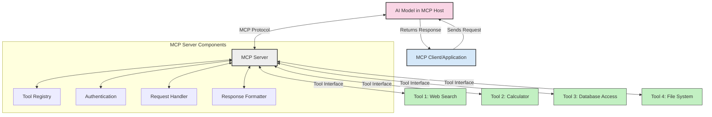
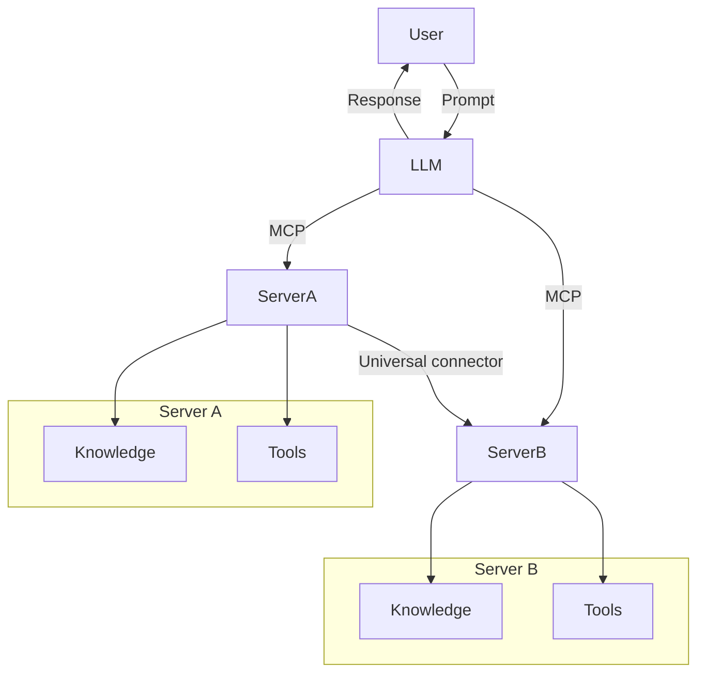

<!--
CO_OP_TRANSLATOR_METADATA:
{
  "original_hash": "cf84f987e1b771d2201408e110dfd2db",
  "translation_date": "2025-05-20T15:30:51+00:00",
  "source_file": "00-Introduction/README.md",
  "language_code": "en"
}
-->
# Introduction to Model Context Protocol (MCP): Why It Matters for Scalable AI Applications

Generative AI applications represent a significant advancement, often allowing users to interact with apps through natural language prompts. However, as you invest more time and resources into these apps, you want to ensure that functionalities and resources can be integrated easily, extended smoothly, and that your app can support multiple models and their complexities. In short, building Gen AI apps is straightforward initially, but as they grow and become more complex, you need to define an architecture and likely rely on a standard to ensure your apps are consistently built. This is where MCP steps in to organize and provide that standard.

---

## **🔍 What Is the Model Context Protocol (MCP)?**

The **Model Context Protocol (MCP)** is an **open, standardized interface** that enables Large Language Models (LLMs) to interact effortlessly with external tools, APIs, and data sources. It offers a consistent architecture to extend AI model capabilities beyond their training data, enabling smarter, scalable, and more responsive AI systems.

---

## **🎯 Why Standardization in AI Matters**

As generative AI applications become more complex, adopting standards that ensure **scalability, extensibility**, and **maintainability** is crucial. MCP addresses these needs by:

- Unifying model-to-tool integrations  
- Reducing fragile, one-off custom solutions  
- Allowing multiple models to coexist within a single ecosystem  

---

## **📚 Learning Objectives**

By the end of this article, you will be able to:

- Define **Model Context Protocol (MCP)** and its use cases  
- Understand how MCP standardizes communication between models and tools  
- Identify the core components of MCP architecture  
- Explore real-world applications of MCP in enterprise and development settings  

---

## **💡 Why the Model Context Protocol (MCP) Is a Game-Changer**

### **🔗 MCP Solves Fragmentation in AI Interactions**

Before MCP, integrating models with tools involved:

- Custom code for each tool-model combination  
- Non-standard APIs from different vendors  
- Frequent disruptions due to updates  
- Poor scalability as more tools were added  

### **✅ Benefits of MCP Standardization**

| **Benefit**              | **Description**                                                                |
|--------------------------|--------------------------------------------------------------------------------|
| Interoperability         | LLMs seamlessly work with tools from various vendors                          |
| Consistency              | Uniform behavior across platforms and tools                                   |
| Reusability              | Tools built once can be reused across projects and systems                    |
| Accelerated Development  | Reduced development time through standardized, plug-and-play interfaces      |

---

## **🧱 High-Level MCP Architecture Overview**

MCP follows a **client-server model**, where:

- **MCP Hosts** run the AI models  
- **MCP Clients** initiate requests  
- **MCP Servers** provide context, tools, and capabilities  

### **Key Components:**

- **Resources** – Static or dynamic data available to models  
- **Prompts** – Predefined workflows to guide generation  
- **Tools** – Executable functions such as search or calculations  
- **Sampling** – Agent-like behavior through recursive interactions  

---

## How MCP Servers Work

MCP servers operate as follows:

- **Request Flow**:  
    1. The MCP Client sends a request to the AI Model running on an MCP Host.  
    2. The AI Model determines when it needs external tools or data.  
    3. The model communicates with the MCP Server using the standardized protocol.  

- **MCP Server Functionality**:  
    - Tool Registry: Maintains a catalog of available tools and their capabilities.  
    - Authentication: Verifies permissions for accessing tools.  
    - Request Handler: Processes incoming tool requests from the model.  
    - Response Formatter: Structures tool outputs in a format the model can understand.  

- **Tool Execution**:  
    - The server routes requests to the appropriate external tools.  
    - Tools perform their specialized functions (search, calculation, database queries, etc.).  
    - Results are returned to the model in a consistent format.  

- **Response Completion**:  
    - The AI model incorporates tool outputs into its response.  
    - The final response is sent back to the client application.  

## 👨‍💻 How to Build an MCP Server (With Examples)

MCP servers let you extend LLM capabilities by providing data and functions.

Ready to try? Here are examples of creating a simple MCP server in various languages:

- **Python Example**: https://github.com/modelcontextprotocol/python-sdk  
- **TypeScript Example**: https://github.com/modelcontextprotocol/typescript-sdk  
- **Java Example**: https://github.com/modelcontextprotocol/java-sdk  
- **C#/.NET Example**: https://github.com/modelcontextprotocol/csharp-sdk  

## 🌍 Real-World Use Cases for MCP

MCP enables a variety of applications by extending AI capabilities:

| **Application**              | **Description**                                                                |
|------------------------------|--------------------------------------------------------------------------------|
| Enterprise Data Integration  | Connect LLMs to databases, CRMs, or internal tools                             |
| Agentic AI Systems           | Enable autonomous agents with access to tools and decision-making workflows    |
| Multi-modal Applications     | Combine text, image, and audio tools within a single unified AI app            |
| Real-time Data Integration   | Integrate live data into AI interactions for more accurate, up-to-date results |

### 🧠 MCP = Universal Standard for AI Interactions

The Model Context Protocol (MCP) serves as a universal standard for AI interactions, similar to how USB-C standardized physical device connections. In AI, MCP provides a consistent interface that allows models (clients) to integrate seamlessly with external tools and data providers (servers). This removes the need for multiple custom protocols for each API or data source.

An MCP-compatible tool (known as an MCP server) follows a unified standard. These servers can list the tools or actions they offer and execute those actions when requested by an AI agent. AI agent platforms supporting MCP can discover available tools from servers and invoke them via this standard protocol.

### 💡 Facilitates Access to Knowledge

Beyond offering tools, MCP also enables access to knowledge. It allows applications to provide context to large language models (LLMs) by linking them to diverse data sources. For example, an MCP server might represent a company’s document repository, allowing agents to retrieve relevant information on demand. Another server might handle specific actions like sending emails or updating records. From the agent’s point of view, these are just tools it can use—some return data (knowledge context), others perform actions. MCP manages both efficiently.

When an agent connects to an MCP server, it automatically learns the server's available capabilities and accessible data through a standard format. This standardization enables dynamic tool availability. For instance, adding a new MCP server to an agent’s system immediately makes its functions usable without needing to customize the agent's instructions further.

This streamlined integration matches the flow shown in the mermaid diagram, where servers provide both tools and knowledge, ensuring smooth collaboration across systems.

### 👉 Example: Scalable Agent Solution

## 🔐 Practical Benefits of MCP

Here are the practical benefits of using MCP:

- **Freshness**: Models can access up-to-date information beyond their training data  
- **Capability Extension**: Models can use specialized tools for tasks they weren’t trained on  
- **Reduced Hallucinations**: External data sources provide factual grounding  
- **Privacy**: Sensitive data stays secure instead of being embedded in prompts  

## 📌 Key Takeaways

Key points to remember about MCP:

- **MCP** standardizes how AI models interact with tools and data  
- Promotes **extensibility, consistency, and interoperability**  
- Helps **reduce development time, improve reliability, and expand model capabilities**  
- The client-server architecture **enables flexible, extensible AI applications**  

## 🧠 Exercise

Think about an AI application you want to build.

- What **external tools or data** could enhance its capabilities?  
- How might MCP make integration **simpler and more reliable?**  

## Additional Resources

- [MCP GitHub Repository](https://github.com/modelcontextprotocol)

## What's next

Next: [Chapter 1: Core Concepts](/01-CoreConcepts/README.md)

**Disclaimer**:  
This document has been translated using the AI translation service [Co-op Translator](https://github.com/Azure/co-op-translator). While we strive for accuracy, please be aware that automated translations may contain errors or inaccuracies. The original document in its native language should be considered the authoritative source. For critical information, professional human translation is recommended. We are not liable for any misunderstandings or misinterpretations arising from the use of this translation.