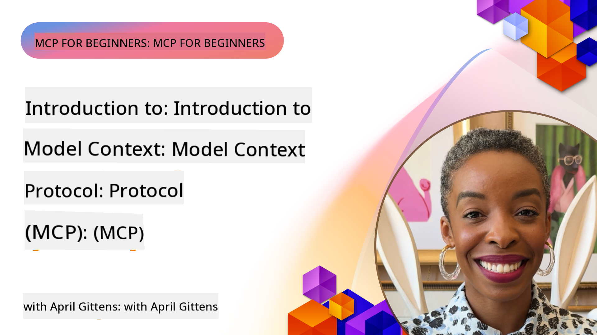
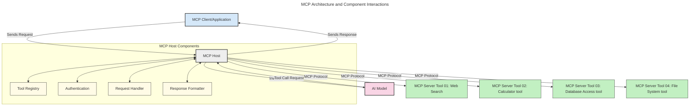
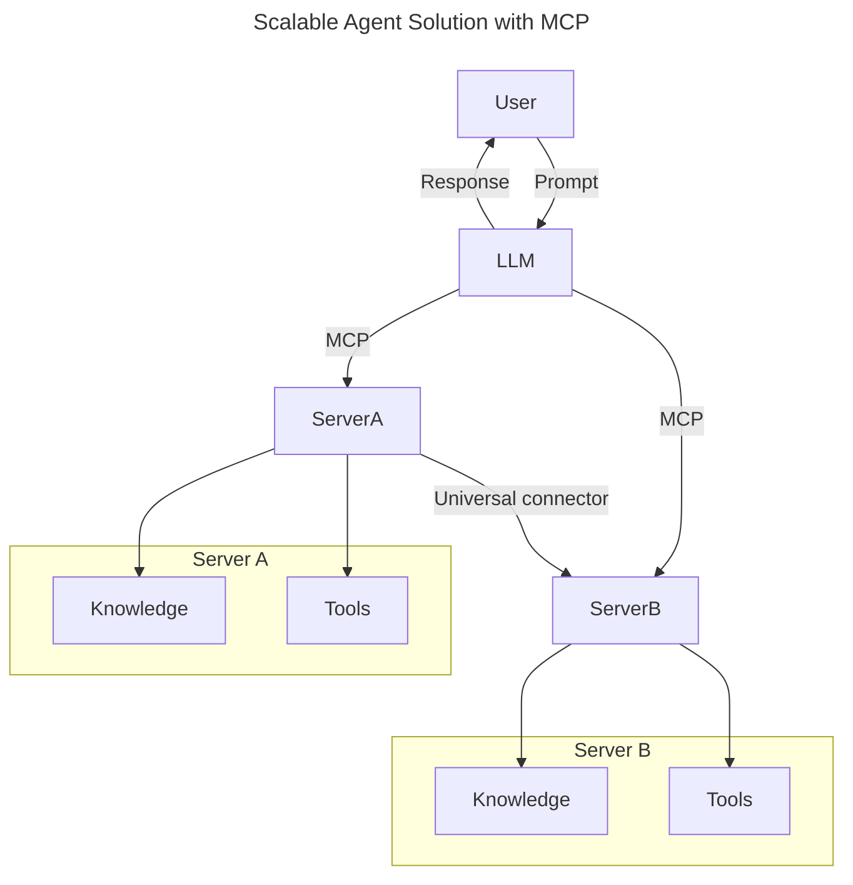
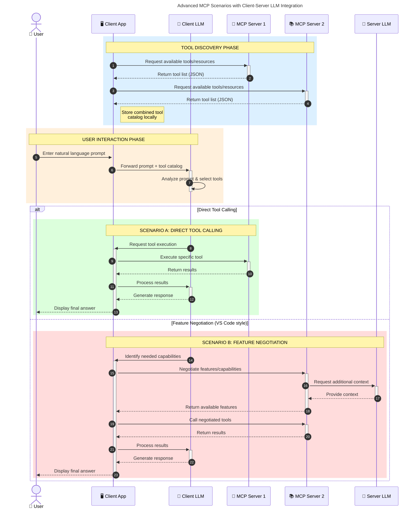

<!--
CO_OP_TRANSLATOR_METADATA:
{
  "original_hash": "0df1ee78a6dd8300f3a040ca5b411c2e",
  "translation_date": "2025-08-19T14:19:41+00:00",
  "source_file": "00-Introduction/README.md",
  "language_code": "en"
}
-->
# Introduction to Model Context Protocol (MCP): Why It Matters for Scalable AI Applications

_(Click the image above to watch the video for this lesson)_

Generative AI applications are a significant advancement, as they often allow users to interact with the app using natural language prompts. However, as you invest more time and resources into these apps, you’ll want to ensure that functionalities and resources can be integrated in a way that’s easy to extend, supports multiple models, and handles various model-specific nuances. In short, while building generative AI apps is straightforward at first, their growth and increasing complexity require a defined architecture—and likely a standard—to ensure consistency. This is where MCP comes in, providing structure and a standard to organize everything.

---

## **🔍 What Is the Model Context Protocol (MCP)?**

The **Model Context Protocol (MCP)** is an **open, standardized interface** that enables Large Language Models (LLMs) to interact seamlessly with external tools, APIs, and data sources. It offers a consistent architecture to enhance AI model functionality beyond their training data, making AI systems smarter, scalable, and more responsive.

---

## **🎯 Why Standardization in AI Matters**

As generative AI applications grow more complex, adopting standards becomes essential to ensure **scalability, extensibility, maintainability,** and to **avoid vendor lock-in**. MCP addresses these needs by:

- Unifying model-tool integrations
- Reducing fragile, one-off custom solutions
- Allowing multiple models from different vendors to coexist within a single ecosystem

**Note:** While MCP positions itself as an open standard, there are no plans to formalize MCP through existing standards organizations such as IEEE, IETF, W3C, ISO, or others.

---

## **📚 Learning Objectives**

By the end of this article, you’ll be able to:

- Define **Model Context Protocol (MCP)** and its use cases
- Understand how MCP standardizes communication between models and tools
- Identify the core components of MCP architecture
- Explore real-world applications of MCP in enterprise and development contexts

---

## **💡 Why the Model Context Protocol (MCP) Is a Game-Changer**

### **🔗 MCP Solves Fragmentation in AI Interactions**

Before MCP, integrating models with tools required:

- Custom code for each tool-model pair
- Non-standard APIs for every vendor
- Frequent disruptions due to updates
- Poor scalability as more tools were added

### **✅ Benefits of MCP Standardization**

| **Benefit**              | **Description**                                                                |
|--------------------------|--------------------------------------------------------------------------------|
| Interoperability         | LLMs work seamlessly with tools from different vendors                         |
| Consistency              | Uniform behavior across platforms and tools                                    |
| Reusability              | Tools built once can be reused across projects and systems                     |
| Accelerated Development  | Development time is reduced with standardized, plug-and-play interfaces        |

---

## **🧱 High-Level MCP Architecture Overview**

MCP follows a **client-server model**, where:

- **MCP Hosts** run the AI models
- **MCP Clients** initiate requests
- **MCP Servers** provide context, tools, and capabilities

### **Key Components:**

- **Resources** – Static or dynamic data for models  
- **Prompts** – Predefined workflows for guided generation  
- **Tools** – Executable functions like search or calculations  
- **Sampling** – Agentic behavior through recursive interactions

---

## How MCP Servers Work

MCP servers operate as follows:

- **Request Flow**:
    1. A request is initiated by an end user or software acting on their behalf.
    2. The **MCP Client** sends the request to an **MCP Host**, which manages the AI Model runtime.
    3. The **AI Model** processes the user prompt and may request access to external tools or data via one or more tool calls.
    4. The **MCP Host**, rather than the model itself, communicates with the appropriate **MCP Server(s)** using the standardized protocol.
- **MCP Host Functionality**:
    - **Tool Registry**: Maintains a catalog of available tools and their capabilities.
    - **Authentication**: Verifies permissions for tool access.
    - **Request Handler**: Processes incoming tool requests from the model.
    - **Response Formatter**: Structures tool outputs in a format the model can understand.
- **MCP Server Execution**:
    - The **MCP Host** routes tool calls to one or more **MCP Servers**, each exposing specialized functions (e.g., search, calculations, database queries).
    - The **MCP Servers** perform their respective operations and return results to the **MCP Host** in a consistent format.
    - The **MCP Host** formats and relays these results to the **AI Model**.
- **Response Completion**:
    - The **AI Model** incorporates the tool outputs into a final response.
    - The **MCP Host** sends this response back to the **MCP Client**, which delivers it to the end user or calling software.

## 👨‍💻 How to Build an MCP Server (With Examples)

MCP servers allow you to extend LLM capabilities by providing data and functionality.

Ready to try it out? Here are SDKs and examples for creating simple MCP servers in different languages/stacks:

- **Python SDK**: https://github.com/modelcontextprotocol/python-sdk

- **TypeScript SDK**: https://github.com/modelcontextprotocol/typescript-sdk

- **Java SDK**: https://github.com/modelcontextprotocol/java-sdk

- **C#/.NET SDK**: https://github.com/modelcontextprotocol/csharp-sdk

---

## 🌍 Real-World Use Cases for MCP

MCP enables a variety of applications by extending AI capabilities:

| **Application**              | **Description**                                                                |
|------------------------------|--------------------------------------------------------------------------------|
| Enterprise Data Integration  | Connect LLMs to databases, CRMs, or internal tools                             |
| Agentic AI Systems           | Enable autonomous agents with tool access and decision-making workflows        |
| Multi-modal Applications     | Combine text, image, and audio tools within a single unified AI app            |
| Real-time Data Integration   | Incorporate live data into AI interactions for more accurate, current outputs  |

---

### 🧠 MCP = Universal Standard for AI Interactions

The Model Context Protocol (MCP) acts as a universal standard for AI interactions, much like how USB-C standardized physical connections for devices. In the AI world, MCP provides a consistent interface, allowing models (clients) to integrate seamlessly with external tools and data providers (servers). This eliminates the need for diverse, custom protocols for each API or data source.

Under MCP, an MCP-compatible tool (referred to as an MCP server) adheres to a unified standard. These servers can list the tools or actions they offer and execute those actions when requested by an AI agent. AI agent platforms that support MCP can discover available tools from the servers and invoke them through this standard protocol.

### 💡 Facilitates Access to Knowledge

Beyond offering tools, MCP also facilitates access to knowledge. It enables applications to provide context to large language models (LLMs) by linking them to various data sources. For example, an MCP server might represent a company’s document repository, allowing agents to retrieve relevant information on demand. Another server could handle specific actions like sending emails or updating records. From the agent’s perspective, these are simply tools it can use—some tools return data (knowledge context), while others perform actions. MCP efficiently manages both.

An agent connecting to an MCP server automatically learns the server's available capabilities and accessible data through a standard format. This standardization enables dynamic tool availability. For instance, adding a new MCP server to an agent’s system makes its functions immediately usable without requiring further customization of the agent's instructions.

This streamlined integration aligns with the flow depicted in the following diagram, where servers provide both tools and knowledge, ensuring seamless collaboration across systems.

### 👉 Example: Scalable Agent Solution

### 🔄 Advanced MCP Scenarios with Client-Side LLM Integration

Beyond the basic MCP architecture, there are advanced scenarios where both client and server contain LLMs, enabling more sophisticated interactions. In the following diagram, **Client App** could be an IDE with a number of MCP tools available for use by the LLM:

---

## 🔐 Practical Benefits of MCP

Here are the practical benefits of using MCP:

- **Freshness**: Models can access up-to-date information beyond their training data
- **Capability Extension**: Models can leverage specialized tools for tasks they weren’t trained for
- **Reduced Hallucinations**: External data sources provide factual grounding
- **Privacy**: Sensitive data can remain within secure environments instead of being embedded in prompts

---

## 📌 Key Takeaways

The following are key takeaways for using MCP:

- **MCP** standardizes how AI models interact with tools and data
- Promotes **extensibility, consistency, and interoperability**
- MCP helps **reduce development time, improve reliability, and extend model capabilities**
- The client-server architecture **enables flexible, extensible AI applications**

---

## 🧠 Exercise

Think about an AI application you’re interested in building.

- Which **external tools or data** could enhance its capabilities?
- How might MCP make integration **simpler and more reliable?**

---

## Additional Resources

- [MCP GitHub Repository](https://github.com/modelcontextprotocol)

---

## What’s Next

Next: [Chapter 1: Core Concepts](../01-CoreConcepts/README.md)

**Disclaimer**:  
This document has been translated using the AI translation service [Co-op Translator](https://github.com/Azure/co-op-translator). While we aim for accuracy, please note that automated translations may include errors or inaccuracies. The original document in its native language should be regarded as the authoritative source. For critical information, professional human translation is advised. We are not responsible for any misunderstandings or misinterpretations resulting from the use of this translation.