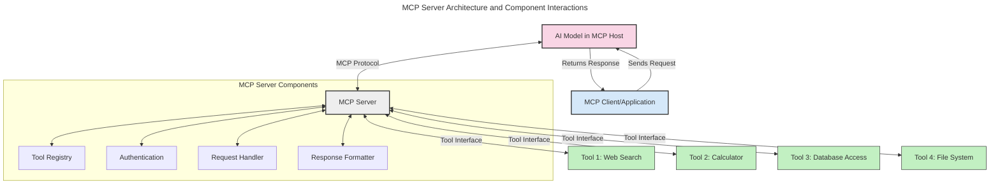

<!--
CO_OP_TRANSLATOR_METADATA:
{
  "original_hash": "1446979020432f512c883848d7eca144",
  "translation_date": "2025-05-29T21:39:37+00:00",
  "source_file": "00-Introduction/README.md",
  "language_code": "en"
}
-->
# Introduction to Model Context Protocol (MCP): Why It Matters for Scalable AI Applications

Generative AI applications represent a significant advancement, often allowing users to interact with the app through natural language prompts. However, as more time and resources are invested in these apps, it becomes important to ensure functionalities and resources can be integrated easily, making the app extensible, capable of supporting multiple models, and able to handle various model complexities. In short, building Gen AI apps is straightforward initially, but as they grow more complex, defining an architecture and relying on a standard becomes necessary to build apps consistently. This is where MCP steps in to organize and provide that standard.

---

## **🔍 What Is the Model Context Protocol (MCP)?**

The **Model Context Protocol (MCP)** is an **open, standardized interface** that enables Large Language Models (LLMs) to interact smoothly with external tools, APIs, and data sources. It offers a consistent architecture to extend AI model functionality beyond their training data, supporting smarter, scalable, and more responsive AI systems.

---

## **🎯 Why Standardization in AI Matters**

As generative AI applications become more sophisticated, adopting standards that guarantee **scalability, extensibility**, and **maintainability** is crucial. MCP addresses these needs by:

- Unifying model-to-tool integrations
- Minimizing fragile, one-off custom solutions
- Allowing multiple models to coexist within a single ecosystem

---

## **📚 Learning Objectives**

By the end of this article, you will be able to:

- Define **Model Context Protocol (MCP)** and its practical applications
- Understand how MCP standardizes communication between models and tools
- Identify the main components of MCP architecture
- Explore real-world examples of MCP in enterprise and development settings

---

## **💡 Why the Model Context Protocol (MCP) Is a Game-Changer**

### **🔗 MCP Addresses Fragmentation in AI Interactions**

Before MCP, integrating models with tools required:

- Custom code for each tool-model combination
- Vendor-specific, non-standard APIs
- Frequent breaks due to updates
- Poor scalability as more tools were added

### **✅ Benefits of MCP Standardization**

| **Benefit**              | **Description**                                                                |
|--------------------------|--------------------------------------------------------------------------------|
| Interoperability         | LLMs can seamlessly work with tools from different vendors                     |
| Consistency              | Uniform behavior across platforms and tools                                    |
| Reusability              | Tools built once can be reused across projects and systems                      |
| Accelerated Development  | Development time is reduced by using standardized, plug-and-play interfaces    |

---

## **🧱 High-Level MCP Architecture Overview**

MCP follows a **client-server model**, where:

- **MCP Hosts** run the AI models
- **MCP Clients** initiate requests
- **MCP Servers** provide context, tools, and capabilities

### **Key Components:**

- **Resources** – Static or dynamic data for models  
- **Prompts** – Predefined workflows for guided generation  
- **Tools** – Executable functions like search, calculations  
- **Sampling** – Agent-like behavior through recursive interactions

---

## How MCP Servers Work

MCP servers operate as follows:

- **Request Flow**: 
    1. The MCP Client sends a request to the AI Model running on an MCP Host.
    2. The AI Model determines when it needs external tools or data.
    3. The model communicates with the MCP Server using the standardized protocol.

- **MCP Server Functionality**:
    - Tool Registry: Maintains a catalog of available tools and their capabilities.
    - Authentication: Confirms permissions for tool access.
    - Request Handler: Processes incoming tool requests from the model.
    - Response Formatter: Organizes tool outputs into a format the model can interpret.

- **Tool Execution**: 
    - The server routes requests to the appropriate external tools.
    - Tools perform their specialized tasks (search, calculations, database queries, etc.).
    - Results are returned to the model in a consistent format.

- **Response Completion**: 
    - The AI model integrates tool outputs into its response.
    - The final response is sent back to the client application.

## 👨‍💻 How to Build an MCP Server (With Examples)

MCP servers let you extend LLM capabilities by providing data and functionality.

Ready to get started? Here are examples of building a simple MCP server in various languages:

- **Python Example**: https://github.com/modelcontextprotocol/python-sdk

- **TypeScript Example**: https://github.com/modelcontextprotocol/typescript-sdk

- **Java Example**: https://github.com/modelcontextprotocol/java-sdk

- **C#/.NET Example**: https://github.com/modelcontextprotocol/csharp-sdk

## 🌍 Real-World Use Cases for MCP

MCP enables a wide range of applications by expanding AI capabilities:

| **Application**              | **Description**                                                                |
|------------------------------|--------------------------------------------------------------------------------|
| Enterprise Data Integration  | Connect LLMs to databases, CRMs, or internal tools                             |
| Agentic AI Systems           | Empower autonomous agents with tool access and decision-making workflows       |
| Multi-modal Applications     | Combine text, image, and audio tools within a single unified AI app            |
| Real-time Data Integration   | Incorporate live data into AI interactions for more accurate, up-to-date results|

### 🧠 MCP = Universal Standard for AI Interactions

The Model Context Protocol (MCP) serves as a universal standard for AI interactions, similar to how USB-C standardized physical device connections. In AI, MCP provides a consistent interface, allowing models (clients) to integrate effortlessly with external tools and data providers (servers). This removes the need for numerous custom protocols for each API or data source.

Under MCP, an MCP-compatible tool (known as an MCP server) adheres to a unified standard. These servers can list the tools or actions they offer and execute those actions when requested by an AI agent. AI agent platforms that support MCP can discover available tools from servers and invoke them through this standard protocol.

### 💡 Facilitates Access to Knowledge

Beyond offering tools, MCP also enables access to knowledge. It allows applications to provide context to large language models (LLMs) by connecting them to various data sources. For example, an MCP server might represent a company’s document repository, enabling agents to retrieve relevant information on demand. Another server could handle specific actions like sending emails or updating records. From the agent’s perspective, these are simply tools it can use—some return data (knowledge context), while others perform actions. MCP manages both efficiently.

An agent connecting to an MCP server automatically learns the server's available capabilities and accessible data through a standard format. This standardization enables dynamic tool availability. For instance, adding a new MCP server to an agent’s system immediately makes its functions usable without additional customization of the agent's instructions.

This streamlined integration aligns with the flow shown in the mermaid diagram, where servers provide both tools and knowledge, ensuring seamless collaboration across systems.

### 👉 Example: Scalable Agent Solution

### 🔄 Advanced MCP Scenarios with Client-Side LLM Integration

Beyond the basic MCP architecture, advanced scenarios exist where both client and server include LLMs, enabling more sophisticated interactions:

```mermaid
---
title: Advanced MCP Scenarios with Client-Server LLM Integration
description: A sequence diagram showing the detailed interaction flow between user, client application, client LLM, multiple MCP servers, and server LLM, illustrating tool discovery, user interaction, direct tool calling, and feature negotiation phases
---
sequenceDiagram
    autonumber
    actor User as 👤 User
    participant ClientApp as 🖥️ Client App
    participant ClientLLM as 🧠 Client LLM
    participant Server1 as 🔧 MCP Server 1
    participant Server2 as 📚 MCP Server 2
    participant ServerLLM as 🤖 Server LLM
    
    %% Discovery Phase
    rect rgb(220, 240, 255)
        Note over ClientApp, Server2: TOOL DISCOVERY PHASE
        ClientApp->>+Server1: Request available tools/resources
        Server1-->>-ClientApp: Return tool list (JSON)
        ClientApp->>+Server2: Request available tools/resources
        Server2-->>-ClientApp: Return tool list (JSON)
        Note right of ClientApp: Store combined tool<br/>catalog locally
    end
    
    %% User Interaction
    rect rgb(255, 240, 220)
        Note over User, ClientLLM: USER INTERACTION PHASE
        User->>+ClientApp: Enter natural language prompt
        ClientApp->>+ClientLLM: Forward prompt + tool catalog
        ClientLLM->>-ClientLLM: Analyze prompt & select tools
    end
    
    %% Scenario A: Direct Tool Calling
    alt Direct Tool Calling
        rect rgb(220, 255, 220)
            Note over ClientApp, Server1: SCENARIO A: DIRECT TOOL CALLING
            ClientLLM->>+ClientApp: Request tool execution
            ClientApp->>+Server1: Execute specific tool
            Server1-->>-ClientApp: Return results
            ClientApp->>+ClientLLM: Process results
            ClientLLM-->>-ClientApp: Generate response
            ClientApp-->>-User: Display final answer
        end
    
    %% Scenario B: Feature Negotiation (VS Code style)
    else Feature Negotiation (VS Code style)
        rect rgb(255, 220, 220)
            Note over ClientApp, ServerLLM: SCENARIO B: FEATURE NEGOTIATION
            ClientLLM->>+ClientApp: Identify needed capabilities
            ClientApp->>+Server2: Negotiate features/capabilities
            Server2->>+ServerLLM: Request additional context
            ServerLLM-->>-Server2: Provide context
            Server2-->>-ClientApp: Return available features
            ClientApp->>+Server2: Call negotiated tools
            Server2-->>-ClientApp: Return results
            ClientApp->>+ClientLLM: Process results
            ClientLLM-->>-ClientApp: Generate response
            ClientApp-->>-User: Display final answer
        end
    end
```

## 🔐 Practical Benefits of MCP

Here are the practical advantages of using MCP:

- **Freshness**: Models can access up-to-date information beyond their training data
- **Capability Extension**: Models can use specialized tools for tasks outside their training
- **Reduced Hallucinations**: External data sources provide factual grounding
- **Privacy**: Sensitive data remains within secure environments instead of being embedded in prompts

## 📌 Key Takeaways

Key points to remember about MCP:

- **MCP** standardizes how AI models interact with tools and data
- Encourages **extensibility, consistency, and interoperability**
- MCP helps **reduce development time, improve reliability, and expand model capabilities**
- The client-server architecture supports flexible, extensible AI applications

## 🧠 Exercise

Consider an AI application you want to build.

- What **external tools or data** could enhance its capabilities?
- How could MCP make integration **simpler and more reliable?**

## Additional Resources

- [MCP GitHub Repository](https://github.com/modelcontextprotocol)

## What's next

Next: [Chapter 1: Core Concepts](/01-CoreConcepts/README.md)

**Disclaimer**:  
This document has been translated using the AI translation service [Co-op Translator](https://github.com/Azure/co-op-translator). While we strive for accuracy, please be aware that automated translations may contain errors or inaccuracies. The original document in its native language should be considered the authoritative source. For critical information, professional human translation is recommended. We are not liable for any misunderstandings or misinterpretations arising from the use of this translation.