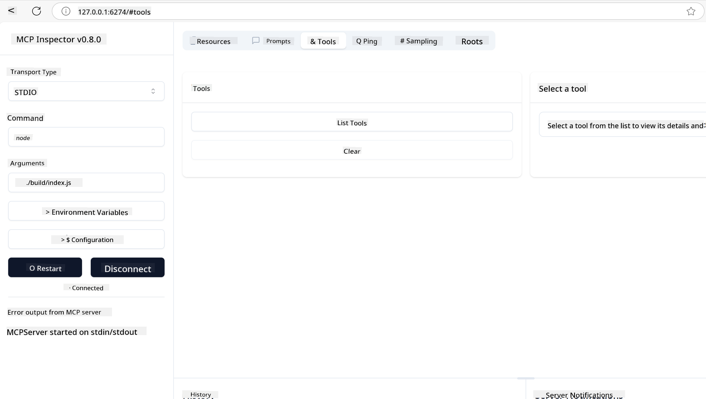
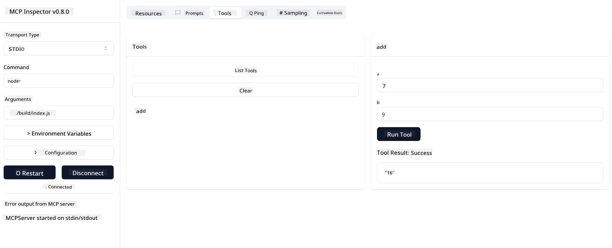

<!--
CO_OP_TRANSLATOR_METADATA:
{
  "original_hash": "5331ffd328a54b90f76706c52b673e27",
  "translation_date": "2025-05-17T08:17:12+00:00",
  "source_file": "03-GettingStarted/01-first-server/README.md",
  "language_code": "en"
}
-->
# Getting Started with MCP 

Welcome to your first steps with the Model Context Protocol (MCP)! Whether you're new to MCP or looking to deepen your understanding, this guide will walk you through the essential setup and development process. You'll discover how MCP enables seamless integration between AI models and applications, and learn how to quickly get your environment ready for building and testing MCP-powered solutions.

> TLDR; If you build AI apps, you know that you can add tools and other resources to your LLM (large language model), to make the LLM more knowledgeable. However, if you place those tools and resources on a server, the app and the server capabilities can be used by any client with/without an LLM.

## Overview

This lesson provides practical guidance on setting up MCP environments and building your first MCP applications. You'll learn how to set up the necessary tools and frameworks, build basic MCP servers, create host applications, and test your implementations.

The Model Context Protocol (MCP) is an open protocol that standardizes how applications provide context to LLMs. Think of MCP like a USB-C port for AI applications - it provides a standardized way to connect AI models to different data sources and tools.

## Learning Objectives

By the end of this lesson, you will be able to:

- Set up development environments for MCP in C#, Java, Python, TypeScript, and JavaScript
- Build and deploy basic MCP servers with custom features (resources, prompts, and tools)
- Create host applications that connect to MCP servers
- Test and debug MCP implementations

## Setting Up Your MCP Environment

Before you begin working with MCP, it's important to prepare your development environment and understand the basic workflow. This section will guide you through the initial setup steps to ensure a smooth start with MCP.

### Prerequisites

Before diving into MCP development, ensure you have:

- **Development Environment**: For your chosen language (C#, Java, Python, TypeScript, or JavaScript)
- **IDE/Editor**: Visual Studio, Visual Studio Code, IntelliJ, Eclipse, PyCharm, or any modern code editor
- **Package Managers**: NuGet, Maven/Gradle, pip, or npm/yarn
- **API Keys**: For any AI services you plan to use in your host applications

## Basic MCP Server Structure

An MCP server typically includes:

- **Server Configuration**: Setup port, authentication, and other settings
- **Resources**: Data and context made available to LLMs
- **Tools**: Functionality that models can invoke
- **Prompts**: Templates for generating or structuring text

Here's a simplified example in TypeScript:

```typescript
import { Server, Tool, Resource } from "@modelcontextprotocol/typescript-server-sdk";

// Create a new MCP server
const server = new Server({
  port: 3000,
  name: "Example MCP Server",
  version: "1.0.0"
});

// Register a tool
server.registerTool({
  name: "calculator",
  description: "Performs basic calculations",
  parameters: {
    expression: {
      type: "string",
      description: "The math expression to evaluate"
    }
  },
  handler: async (params) => {
    const result = eval(params.expression);
    return { result };
  }
});

// Start the server
server.start();
```

In the preceding code we:

- Import the necessary classes from the MCP TypeScript SDK.
- Create and configure a new MCP server instance.
- Register a custom tool (`calculator`) with a handler function.
- Start the server to listen for incoming MCP requests.

## Testing and Debugging

Before you begin testing your MCP server, it's important to understand the available tools and best practices for debugging. Effective testing ensures your server behaves as expected and helps you quickly identify and resolve issues. The following section outlines recommended approaches for validating your MCP implementation.

MCP provides tools to help you test and debug your servers:

- **Inspector tool**, this graphical interface allows you to connect to your server and test your tools, prompts, and resources.
- **curl**, you can also connect to your server using a command line tool like curl or other clients that can create and run HTTP commands.

### Using MCP Inspector

The [MCP Inspector](https://github.com/modelcontextprotocol/inspector) is a visual testing tool that helps you:

1. **Discover Server Capabilities**: Automatically detect available resources, tools, and prompts
2. **Test Tool Execution**: Try different parameters and see responses in real-time
3. **View Server Metadata**: Examine server info, schemas, and configurations

```bash
# ex TypeScript, installing and running MCP Inspector
npx @modelcontextprotocol/inspector node build/index.js
```

When you run the above commands, the MCP Inspector will launch a local web interface in your browser. You can expect to see a dashboard displaying your registered MCP servers, their available tools, resources, and prompts. The interface allows you to interactively test tool execution, inspect server metadata, and view real-time responses, making it easier to validate and debug your MCP server implementations.

Here's a screenshot of what it can look like:



## Common Setup Issues and Solutions

| Issue | Possible Solution |
|-------|-------------------|
| Connection refused | Check if server is running and port is correct |
| Tool execution errors | Review parameter validation and error handling |
| Authentication failures | Verify API keys and permissions |
| Schema validation errors | Ensure parameters match the defined schema |
| Server not starting | Check for port conflicts or missing dependencies |
| CORS errors | Configure proper CORS headers for cross-origin requests |
| Authentication issues | Verify token validity and permissions |

## Local Development

For local development and testing, you can run MCP servers directly on your machine:

1. **Start the server process**: Run your MCP server application 
2. **Configure networking**: Ensure the server is accessible on the expected port 
3. **Connect clients**: Use local connection URLs like `http://localhost:3000`

```bash
# Example: Running a TypeScript MCP server locally
npm run start
# Server running at http://localhost:3000
```

## Building your first MCP Server

We've covered [Core concepts](/01-CoreConcepts/README.md) in a previous lesson, now it's time to put that knowledge to work. 

### What a server can do

Before we start writing code, let's just remind ourselves what a server can do:

An MCP server can for example:

- Access local files and databases
- Connect to remote APIs
- Perform computations
- Integrate with other tools and services
- Provide a user interface for interaction

Great, now that we know what we can do for it, let's start coding.

## Exercise: Creating a server

To create a server, you need to follow these steps:

- Install the MCP SDK.
- Create a project and set up the project structure.
- Write the server code.
- Test the server.

### -1- Install the SDK

This differs a little bit depending on your chosen runtime, so choose one of the runtimes below:

### -2- Create project

Now that you have your SDK installed, let's create a project next:

### -3- Create project files

### -4- Create server code

### -5- Adding a tool and a resource

Add a tool and a resource by adding the following code:

### -6 Final code

Let's add the last code we need so the server can start:

### -7- Test the server

Start the server with the following command:

### -8- Run using the inspector

The inspector is a great tool that can start up your server and lets you interact with it so you can test that it works. Let's start it up:

> [!NOTE]
> it might look different in the "command" field as it contains the command for running a server with your specific runtime/

You should see the following user interface:


1. Connect to the server by selecting the Connect button 
   Once you connect to the server, you should now see the following:

   

1. Select "Tools" and "listTools", you should see "Add" show up, select "Add" and fill in the parameter values.

   You should see the following response, i.e a result from "add" tool:

   

Congrats, you've managed to create and run your first server!

### Official SDKs

MCP provides official SDKs for multiple languages:
- [C# SDK](https://github.com/modelcontextprotocol/csharp-sdk) - Maintained in collaboration with Microsoft
- [Java SDK](https://github.com/modelcontextprotocol/java-sdk) - Maintained in collaboration with Spring AI
- [TypeScript SDK](https://github.com/modelcontextprotocol/typescript-sdk) - The official TypeScript implementation
- [Python SDK](https://github.com/modelcontextprotocol/python-sdk) - The official Python implementation
- [Kotlin SDK](https://github.com/modelcontextprotocol/kotlin-sdk) - The official Kotlin implementation
- [Swift SDK](https://github.com/modelcontextprotocol/swift-sdk) - Maintained in collaboration with Loopwork AI
- [Rust SDK](https://github.com/modelcontextprotocol/rust-sdk) - The official Rust implementation

## Key Takeaways

- Setting up an MCP development environment is straightforward with language-specific SDKs
- Building MCP servers involves creating and registering tools with clear schemas
- Testing and debugging are essential for reliable MCP implementations

## Samples 

- [Java Calculator](../samples/java/calculator/README.md)
- [.Net Calculator](../../../../03-GettingStarted/samples/csharp)
- [JavaScript Calculator](../samples/javascript/README.md)
- [TypeScript Calculator](../samples/typescript/README.md)
- [Python Calculator](../../../../03-GettingStarted/samples/python)

## Assignment

Create a simple MCP server with a tool of your choice:
1. Implement the tool in your preferred language (.NET, Java, Python, or JavaScript).
2. Define input parameters and return values.
3. Run the inspector tool to ensure the server works as intended.
4. Test the implementation with various inputs.

## Solution

[Solution](./solution/README.md)

## Additional Resources

- [MCP GitHub Repository](https://github.com/microsoft/mcp-for-beginners)

## What's next

Next: [Getting Started with MCP Clients](/03-GettingStarted/02-client/README.md)

Certainly! Here is the translation of the text you provided into English:

**Disclaimer**:  
This document has been translated using AI translation service [Co-op Translator](https://github.com/Azure/co-op-translator). While we strive for accuracy, please be aware that automated translations may contain errors or inaccuracies. The original document in its native language should be considered the authoritative source. For critical information, professional human translation is recommended. We are not liable for any misunderstandings or misinterpretations arising from the use of this translation.