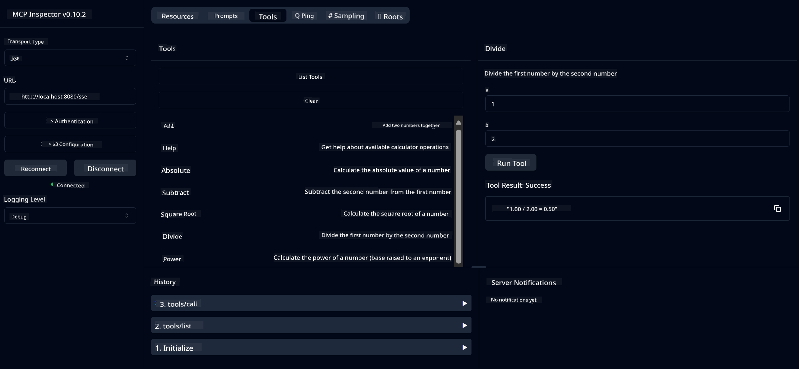

<!--
CO_OP_TRANSLATOR_METADATA:
{
  "original_hash": "ed9cab32cc67c12d8969b407aa47100a",
  "translation_date": "2025-07-13T17:51:28+00:00",
  "source_file": "03-GettingStarted/01-first-server/solution/java/README.md",
  "language_code": "en"
}
-->
# Basic Calculator MCP Service

This service offers basic calculator functions through the Model Context Protocol (MCP) using Spring Boot with WebFlux transport. It’s designed as a simple example for beginners learning about MCP implementations.

For more details, see the [MCP Server Boot Starter](https://docs.spring.io/spring-ai/reference/api/mcp/mcp-server-boot-starter-docs.html) reference documentation.


## Using the Service

The service provides the following API endpoints via the MCP protocol:

- `add(a, b)`: Add two numbers
- `subtract(a, b)`: Subtract the second number from the first
- `multiply(a, b)`: Multiply two numbers
- `divide(a, b)`: Divide the first number by the second (with zero check)
- `power(base, exponent)`: Calculate the power of a number
- `squareRoot(number)`: Calculate the square root (with negative number check)
- `modulus(a, b)`: Calculate the remainder of division
- `absolute(number)`: Calculate the absolute value

## Dependencies

The project requires the following main dependencies:

```xml
<dependency>
    <groupId>org.springframework.ai</groupId>
    <artifactId>spring-ai-starter-mcp-server-webflux</artifactId>
</dependency>
```

## Building the Project

Build the project using Maven:
```bash
./mvnw clean install -DskipTests
```

## Running the Server

### Using Java

```bash
java -jar target/calculator-server-0.0.1-SNAPSHOT.jar
```

### Using MCP Inspector

The MCP Inspector is a useful tool for interacting with MCP services. To use it with this calculator service:

1. **Install and run MCP Inspector** in a new terminal window:
   ```bash
   npx @modelcontextprotocol/inspector
   ```

2. **Open the web UI** by clicking the URL shown by the app (usually http://localhost:6274)

3. **Set up the connection**:
   - Choose the transport type "SSE"
   - Enter the URL for your running server’s SSE endpoint: `http://localhost:8080/sse`
   - Click "Connect"

4. **Use the tools**:
   - Click "List Tools" to view available calculator operations
   - Select a tool and click "Run Tool" to perform an operation



**Disclaimer**:  
This document has been translated using the AI translation service [Co-op Translator](https://github.com/Azure/co-op-translator). While we strive for accuracy, please be aware that automated translations may contain errors or inaccuracies. The original document in its native language should be considered the authoritative source. For critical information, professional human translation is recommended. We are not liable for any misunderstandings or misinterpretations arising from the use of this translation.