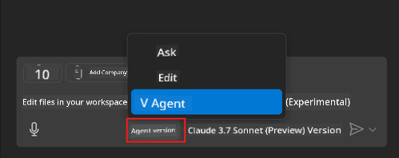
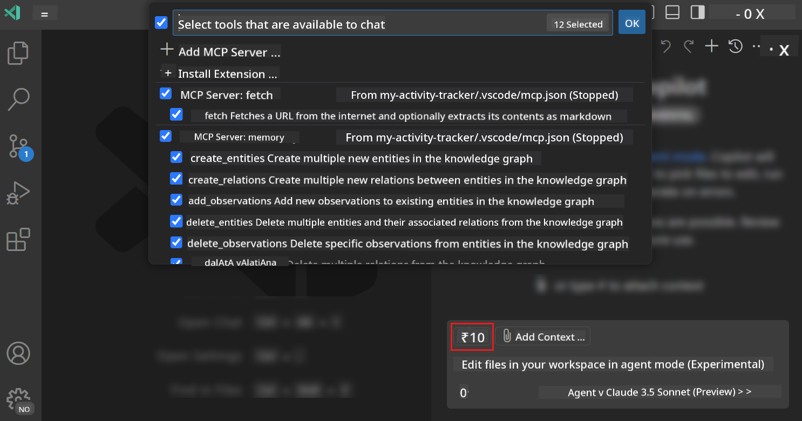
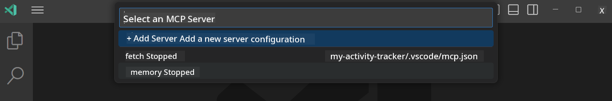

<!--
CO_OP_TRANSLATOR_METADATA:
{
  "original_hash": "8ea28e5e566edd5969337fd0b191ba3f",
  "translation_date": "2025-07-17T09:28:21+00:00",
  "source_file": "03-GettingStarted/04-vscode/README.md",
  "language_code": "en"
}
-->
# Consuming a server from GitHub Copilot Agent mode

Visual Studio Code and GitHub Copilot can act as a client and connect to an MCP Server. You might wonder why you'd want to do that. Well, it means you can use all the features of the MCP Server directly within your IDE. For example, adding GitHub's MCP server would let you control GitHub through prompts instead of typing specific commands in the terminal. Or imagine anything that could enhance your developer experience, all controlled by natural language. Now you see the advantage, right?

## Overview

This lesson explains how to use Visual Studio Code and GitHub Copilot's Agent mode as a client for your MCP Server.

## Learning Objectives

By the end of this lesson, you will be able to:

- Connect to an MCP Server through Visual Studio Code.
- Run capabilities like tools via GitHub Copilot.
- Configure Visual Studio Code to locate and manage your MCP Server.

## Usage

You can control your MCP server in two ways:

- User interface, which you will see later in this chapter.
- Terminal, where you can control the server using the `code` executable:

  To add an MCP server to your user profile, use the --add-mcp command line option and provide the JSON server configuration in the form {\"name\":\"server-name\",\"command\":...}.

  ```
  code --add-mcp "{\"name\":\"my-server\",\"command\": \"uvx\",\"args\": [\"mcp-server-fetch\"]}"
  ```

### Screenshots

  
  


We’ll discuss how to use the visual interface in the next sections.

## Approach

Here’s the high-level approach:

- Configure a file to locate your MCP Server.
- Start or connect to the server to list its capabilities.
- Use those capabilities through the GitHub Copilot Chat interface.

Great, now that we understand the flow, let’s try using an MCP Server through Visual Studio Code with an exercise.

## Exercise: Consuming a server

In this exercise, you will configure Visual Studio Code to find your MCP server so it can be used from the GitHub Copilot Chat interface.

### -0- Prestep, enable MCP Server discovery

You may need to enable MCP Server discovery.

1. Go to `File -> Preferences -> Settings` in Visual Studio Code.

1. Search for "MCP" and enable `chat.mcp.discovery.enabled` in the settings.json file.

### -1- Create config file

Start by creating a config file in your project root. You need a file called MCP.json inside a folder named .vscode. It should look like this:

```text
.vscode
|-- mcp.json
```

Next, let’s see how to add a server entry.

### -2- Configure a server

Add the following content to *mcp.json*:

```json
{
    "inputs": [],
    "servers": {
       "hello-mcp": {
           "command": "node",
           "args": [
               "build/index.js"
           ]
       }
    }
}
```

The example above shows how to start a server written in Node.js. For other runtimes, specify the correct command to start the server using `command` and `args`.

### -3- Start the server

Now that you’ve added an entry, let’s start the server:

1. Find your entry in *mcp.json* and look for the "play" icon:

    

1. Click the "play" icon. You should see the tools icon in GitHub Copilot Chat update with more available tools. Clicking the tools icon will show a list of registered tools. You can check or uncheck each tool depending on whether you want GitHub Copilot to use them as context:

  

1. To run a tool, type a prompt that matches one of your tool descriptions, for example: "add 22 to 1":

  

  You should see a response saying 23.

## Assignment

Try adding a server entry to your *mcp.json* file and make sure you can start and stop the server. Also, verify you can interact with the tools on your server via the GitHub Copilot Chat interface.

## Solution

[Solution](./solution/README.md)

## Key Takeaways

The key points from this chapter are:

- Visual Studio Code is a great client that lets you connect to multiple MCP Servers and their tools.
- The GitHub Copilot Chat interface is how you interact with the servers.
- You can prompt users for inputs like API keys, which can be passed to the MCP Server when configuring the server entry in *mcp.json*.

## Samples

- [Java Calculator](../samples/java/calculator/README.md)  
- [.Net Calculator](../../../../03-GettingStarted/samples/csharp)  
- [JavaScript Calculator](../samples/javascript/README.md)  
- [TypeScript Calculator](../samples/typescript/README.md)  
- [Python Calculator](../../../../03-GettingStarted/samples/python)

## Additional Resources

- [Visual Studio docs](https://code.visualstudio.com/docs/copilot/chat/mcp-servers)

## What's Next

- Next: [Creating an SSE Server](../05-sse-server/README.md)

**Disclaimer**:  
This document has been translated using AI translation service [Co-op Translator](https://github.com/Azure/co-op-translator). While we strive for accuracy, please be aware that automated translations may contain errors or inaccuracies. The original document in its native language should be considered the authoritative source. For critical information, professional human translation is recommended. We are not liable for any misunderstandings or misinterpretations arising from the use of this translation.