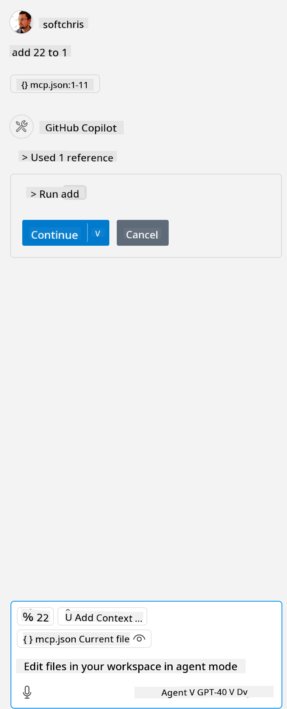

<!--
CO_OP_TRANSLATOR_METADATA:
{
  "original_hash": "c37fabfbc0dcbc9a4afb6d17e7d3be9f",
  "translation_date": "2025-05-17T10:59:54+00:00",
  "source_file": "03-GettingStarted/04-vscode/README.md",
  "language_code": "en"
}
-->
Let's talk more about how we use the visual interface in the next sections.

## Approach

Here's how we need to approach this at a high level:

- Configure a file to find our MCP Server.
- Start up/Connect to the server to have it list its capabilities.
- Use these capabilities through GitHub Copilot's chat interface.

Great, now that we understand the flow, let's try using an MCP Server through Visual Studio Code with an exercise.

## Exercise: Consuming a server

In this exercise, we will configure Visual Studio Code to find your MCP server so that it can be used from GitHub Copilot's chat interface.

### -0- Prestep, enable MCP Server discovery

You may need to enable the discovery of MCP Servers.

1. Go to `File -> Preferences -> Settings` in Visual Studio Code.

1. Search for "MCP" and enable `chat.mcp.discovery.enabled` in the settings.json file.

### -1- Create config file

Start by creating a config file in your project root. You will need a file called MCP.json and place it in a folder called .vscode. It should look like this:

```text
.vscode
|-- mcp.json
```

Next, let's see how we can add a server entry.

### -2- Configure a server

Add the following content to *mcp.json*:

```json
{
    "inputs": [],
    "servers": {
       "hello-mcp": {
           "command": "cmd",
           "args": [
               "/c", "node", "<absolute path>\\build\\index.js"
           ]
       }
    }
}
```

Here's a simple example of how to start a server written in Node.js. For other runtimes, point out the proper command for starting the server using `command` and `args`.

### -3- Start the server

Now that you've added an entry, let's start the server:

1. Locate your entry in *mcp.json* and make sure you find the "play" icon:

    

1. Click the "play" icon, and you should see the tools icon in the GitHub Copilot chat increase the number of available tools. If you click the tools icon, you will see a list of registered tools. You can check/uncheck each tool depending on whether you want GitHub Copilot to use them as context:

  

1. To run a tool, type a prompt that you know will match the description of one of your tools, for example, a prompt like "add 22 to 1":

  

  You should see a response saying 23.

## Assignment

Try adding a server entry to your *mcp.json* file and make sure you can start/stop the server. Make sure you can also communicate with the tools on your server via GitHub Copilot's chat interface.

## Solution

[Solution](./solution/README.md)

## Key Takeaways

The takeaways from this chapter are the following:

- Visual Studio Code is a great client that lets you consume several MCP Servers and their tools.
- GitHub Copilot's chat interface is how you interact with the servers.
- You can prompt the user for inputs like API keys that can be passed to the MCP Server when configuring the server entry in the *mcp.json* file.

## Samples

- [Java Calculator](../samples/java/calculator/README.md)
- [.Net Calculator](../../../../03-GettingStarted/samples/csharp)
- [JavaScript Calculator](../samples/javascript/README.md)
- [TypeScript Calculator](../samples/typescript/README.md)
- [Python Calculator](../../../../03-GettingStarted/samples/python) 

## Additional Resources

- [Visual Studio docs](https://code.visualstudio.com/docs/copilot/chat/mcp-servers)

## What's Next

- Next: [Creating an SSE Server](/03-GettingStarted/05-sse-server/README.md)

Sure, please provide the text you would like to have translated to English.