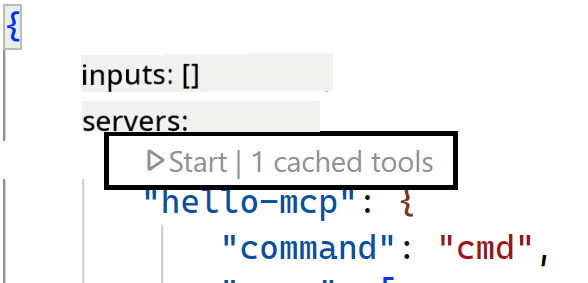
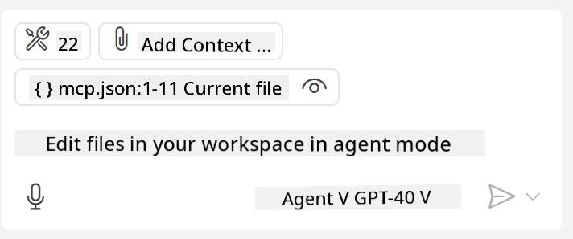

<!--
CO_OP_TRANSLATOR_METADATA:
{
  "original_hash": "222e01c3002a33355806d60d558d9429",
  "translation_date": "2025-07-14T09:26:07+00:00",
  "source_file": "03-GettingStarted/04-vscode/README.md",
  "language_code": "en"
}
-->
Let's talk more about how we use the visual interface in the next sections.

## Approach

Here's the high-level approach we need to take:

- Configure a file to locate our MCP Server.
- Start or connect to the server to have it list its capabilities.
- Use those capabilities through the GitHub Copilot Chat interface.

Great, now that we understand the flow, let's try using an MCP Server through Visual Studio Code with an exercise.

## Exercise: Consuming a server

In this exercise, we will configure Visual Studio Code to find your MCP server so that it can be used from the GitHub Copilot Chat interface.

### -0- Prestep, enable MCP Server discovery

You may need to enable discovery of MCP Servers.

1. Go to `File -> Preferences -> Settings` in Visual Studio Code.

2. Search for "MCP" and enable `chat.mcp.discovery.enabled` in the settings.json file.

### -1- Create config file

Start by creating a config file in your project root. You will need a file called MCP.json placed inside a folder named .vscode. It should look like this:

```text
.vscode
|-- mcp.json
```

Next, let's see how we can add a server entry.

### -2- Configure a server

Add the following content to *mcp.json*:

```json
{
    "inputs": [],
    "servers": {
       "hello-mcp": {
           "command": "node",
           "args": [
               "build/index.js"
           ]
       }
    }
}
```

The example above shows how to start a server written in Node.js. For other runtimes, specify the appropriate command for starting the server using `command` and `args`.

### -3- Start the server

Now that you've added an entry, let's start the server:

1. Locate your entry in *mcp.json* and look for the "play" icon:

    

2. Click the "play" icon. You should see the tools icon in the GitHub Copilot Chat increase the number of available tools. If you click the tools icon, you will see a list of registered tools. You can check or uncheck each tool depending on whether you want GitHub Copilot to use them as context:

  

3. To run a tool, type a prompt that matches the description of one of your tools, for example, a prompt like "add 22 to 1":

  

  You should see a response saying 23.

## Assignment

Try adding a server entry to your *mcp.json* file and make sure you can start and stop the server. Also, ensure you can communicate with the tools on your server via the GitHub Copilot Chat interface.

## Solution

[Solution](./solution/README.md)

## Key Takeaways

The key takeaways from this chapter are:

- Visual Studio Code is a great client that lets you consume multiple MCP Servers and their tools.
- The GitHub Copilot Chat interface is how you interact with the servers.
- You can prompt the user for inputs like API keys that can be passed to the MCP Server when configuring the server entry in the *mcp.json* file.

## Samples

- [Java Calculator](../samples/java/calculator/README.md)
- [.Net Calculator](../../../../03-GettingStarted/samples/csharp)
- [JavaScript Calculator](../samples/javascript/README.md)
- [TypeScript Calculator](../samples/typescript/README.md)
- [Python Calculator](../../../../03-GettingStarted/samples/python)

## Additional Resources

- [Visual Studio docs](https://code.visualstudio.com/docs/copilot/chat/mcp-servers)

## What's Next

- Next: [Creating an SSE Server](../05-sse-server/README.md)

**Disclaimer**:  
This document has been translated using the AI translation service [Co-op Translator](https://github.com/Azure/co-op-translator). While we strive for accuracy, please be aware that automated translations may contain errors or inaccuracies. The original document in its native language should be considered the authoritative source. For critical information, professional human translation is recommended. We are not liable for any misunderstandings or misinterpretations arising from the use of this translation.