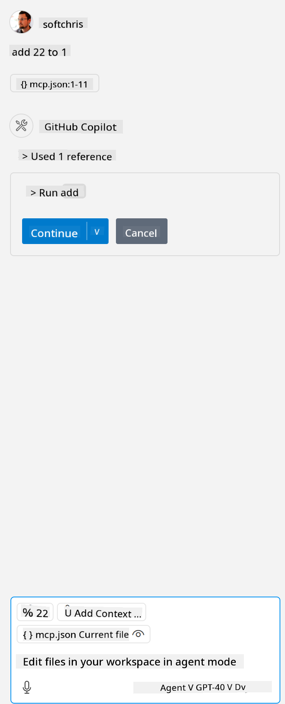

<!--
CO_OP_TRANSLATOR_METADATA:
{
  "original_hash": "5ef8f5821c1a04f7b1fc4f15098ecab8",
  "translation_date": "2025-07-13T19:38:05+00:00",
  "source_file": "03-GettingStarted/04-vscode/solution/README.md",
  "language_code": "en"
}
-->
This corresponds to running a command like this: `node build/index.js`.

- Modify this server entry to match the location of your server file or to what is required to start your server depending on your chosen runtime and server location.

## Use the features in the server

- Click the `play` icon once you've added *mcp.json* to the *./vscode* folder,

    Notice the tooling icon changes to show more available tools. The tooling icon is located just above the chat field in GitHub Copilot.

## Run a tool

- Type a prompt in your chat window that matches the description of your tool. For example, to trigger the tool `add`, type something like "add 3 to 20".

    You should see a tool appear above the chat text box prompting you to select it to run the tool, as shown in this image:

    

    Selecting the tool should produce a numeric result saying "23" if your prompt was like the example above.

**Disclaimer**:  
This document has been translated using the AI translation service [Co-op Translator](https://github.com/Azure/co-op-translator). While we strive for accuracy, please be aware that automated translations may contain errors or inaccuracies. The original document in its native language should be considered the authoritative source. For critical information, professional human translation is recommended. We are not liable for any misunderstandings or misinterpretations arising from the use of this translation.